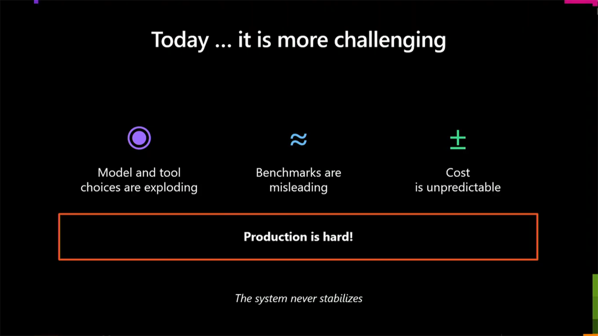
[00:01:24](https://www.youtube.com/watch?v=05naxQpKqaU&t=84s)

**Transcript (00:00:00-00:02:01):**

**Yina Arenas:** Hello. Welcome to Building Smart AI Systems in Foundry, as everything in the world evolves around us. I'm Yina. I lead Product for Microsoft Foundry. And I'm joined today with Naomi, who does all the work for shipping all of the models in Microsoft Foundry. And in the next 45 minutes, we're going to talk about something that every team building with AI faces. You build the systems, and the landscape around you keeps evolving. The models, the tools, the set of capabilities around them, it's all shifting around you. And let's be honest, a year ago, building an AI app felt a lot more simple. You pick the model, you wire it up, and you ship it. But now you're no longer building just chat apps. You're full-on building agentic systems, long-running systems that have to continuously improve. And that is a little bit more challenging. And here's what I see every single developer face, run into.

They have a hard time picking the right model for the task. There's a lot of models in the market. More keep coming every single day. The benchmarks look great on paper, but they don't tell you if their model is good for your scenario. And then the costs are really, really hard to predict. And then you can do some analysis when you're building it, but when you put it into production and see the bill, it's painful. Right? So, the moment that you have something that is fully built and out there, then the next model is in, the next tool is out, and all of these different things need to keep changing. And you have to continuously be building this system, and the landscape keeps moving around you. Now, what you want is a system that is simpler, that is better, that is more cost-effective, and that is scalable as you bring it into production, and that gives you the best outcome for your scenario.

And today we're going to show you how you can actually get there using Microsoft Foundry as the underlying platform.

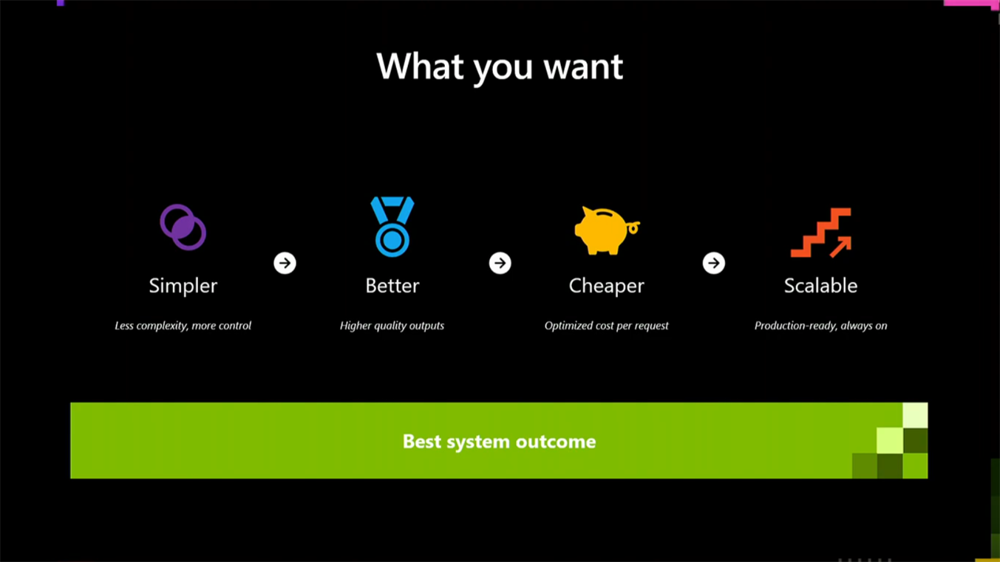
[00:02:01](https://www.youtube.com/watch?v=05naxQpKqaU&t=121s)

**Transcript (00:02:01-00:02:25):**

**Yina Arenas:** What you need in order to get there is not just a better prompt system, or a newer model, or the latest MCP tool. What you need is a system that continuously improves over time and a platform that enables you all the way from building to governing and managing at scale. For that, we start with building with GitHub Copilot CLI, grounding with all of the sets of information that you might have within your organization, whether it is your productivity data in Work IQ, your structured data in Fabric IQ, all of the context and knowledge that you might want to bring to your agents using Foundry IQ, and all of the world's knowledge using Web IQ.

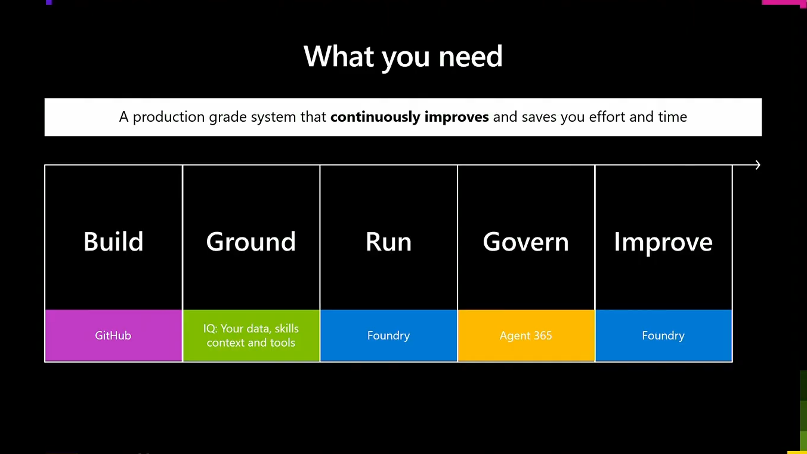
[00:02:25](https://www.youtube.com/watch?v=05naxQpKqaU&t=145s)

**Transcript (00:02:25-00:03:11):**

**Yina Arenas:** Then running that in Foundry using Foundry-hosted agents, governing with A365, and then improving over time with a set of platform capabilities that Foundry offers. And that's where Foundry comes in. It's the platform that enables you to take models, agent service, all of the grounding information, the tools, the post-training capabilities, and bring that all to bear for you to leverage in your scenario.

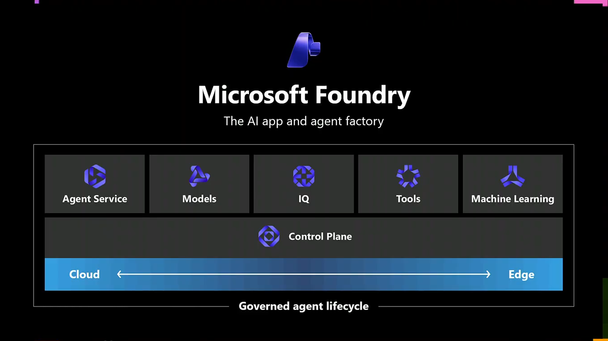
[00:03:11](https://www.youtube.com/watch?v=05naxQpKqaU&t=191s)

**Transcript (00:03:11-00:04:15):**

**Yina Arenas:** And the platform is fully governed for the entire agentic lifecycle, not just for running inferencing or for building a specific point-on solution. It's for you to be able to build, deploy, and operate at scale, and continuously improve your entire system. And this is an important mental shift. And if there's, I will say, one thing that you take out of this session today, it's how we need to evolve how we think about what was QA-ing our solutions. So as a developer, you used to think about I'll build it, and then I'll think about QA at the end. Actually, that needs to be entirely shifted left, and now you have to think about your success criteria and evaluation first, so that then you can think about how you're going to continuously improve over time and build a resilient solution that decouples from the model evolving, from tools changing, and from the context evolving itself.

That way, you can actually build a solution that is more ready for the test of time.

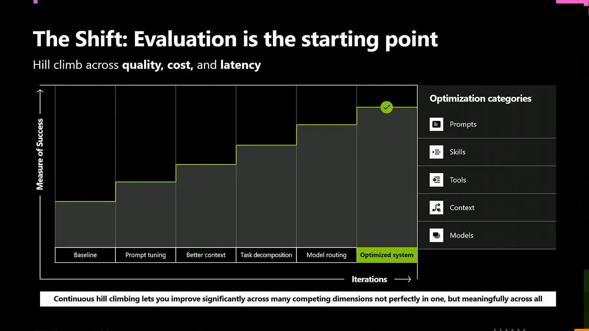
[00:04:15](https://www.youtube.com/watch?v=05naxQpKqaU&t=255s)

**Transcript (00:04:15-00:04:34):**

**Yina Arenas:** And there's a set of optimization categories, I'll just go back for a second, that then, once you have your evaluations defined, are actually going to tell you, what are the set of levers that you can pull to optimize the system. And this is how we're going to structure the rest of the talk today. We're going to go through selection, evaluation, optimization, and scaling. Okay.

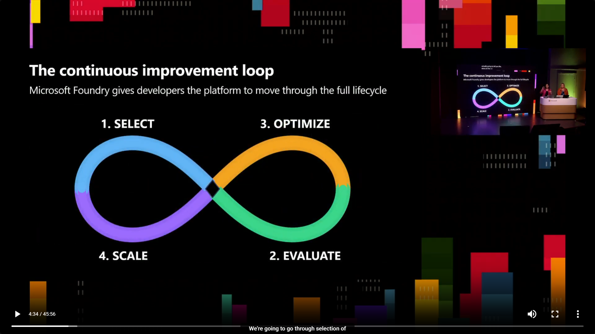
[00:04:34](https://www.youtube.com/watch?v=05naxQpKqaU&t=274s)

**Transcript (00:04:34-00:04:44):**

**Yina Arenas:** We're going to start, and then we're going to do it around the model ecosystem. So, we're going to have other sessions throughout the conference in which we're going to go deeper into more of the agentic side and then also, more of deeper into the post-training capabilities that we have around models. Okay.

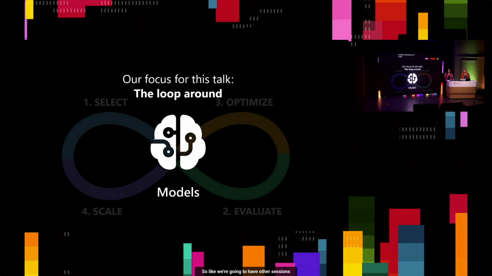
[00:04:44](https://www.youtube.com/watch?v=05naxQpKqaU&t=284s)

**Transcript (00:04:44-00:05:15):**

**Yina Arenas:** Let's start with Select.

**Naomi Moneypenny:** All right. Awesome. So, lots and lots of model available for you in Foundry. Hopefully, that's really good news, because you saw a great set of announcements this morning at the keynote. And we're going to build on that and tell you a little bit more about what's going on. Because every AI system really belongs with selecting models, right? We want to think about not just looking at the specific model you need for all of your use cases, but instead, actually, looking at model choice is something that you need to define by task.

=================================

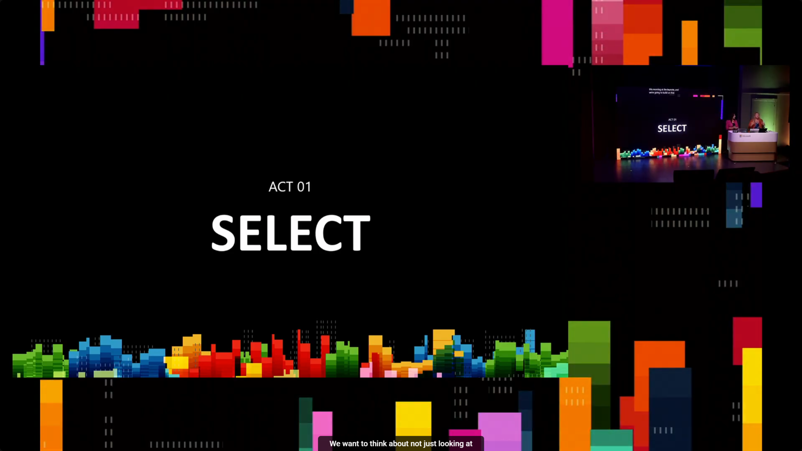
[00:05:15](https://www.youtube.com/watch?v=05naxQpKqaU&t=315s)

**Transcript (00:05:15-00:05:47):**

**Naomi Moneypenny:** And so you think about this as kind of an ongoing systems decision. Yina talked about it. That model lifecycle is continuously accelerating. We're always bringing the best and latest to you. But we want to make sure that we're able to bring and optimize across these different areas. So let's think about how we approach model selection as part of this. So, of course, in any AI application, models are kind of your raw materials to get started with. And you build so many big things on top of this as part of your AI applications.

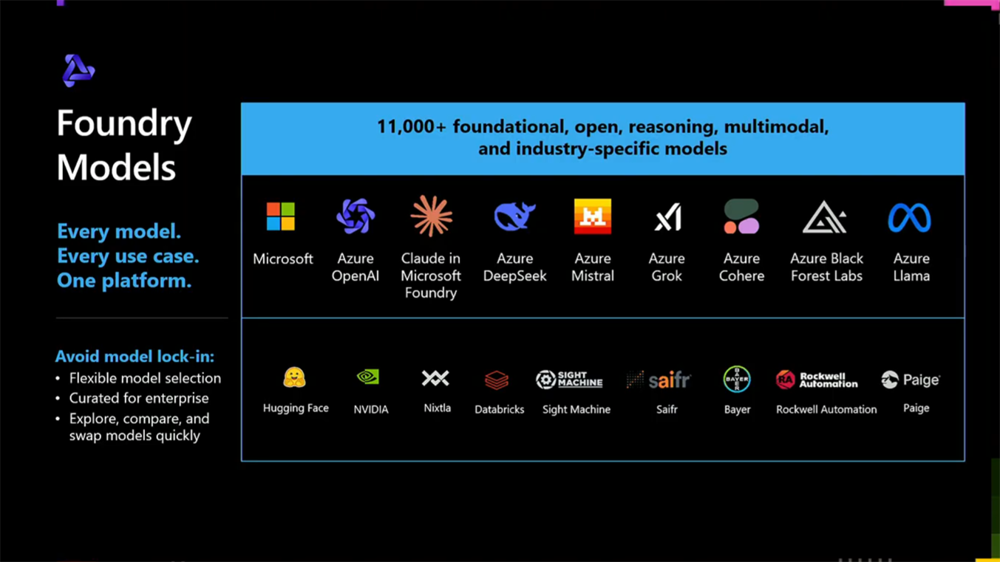
[00:05:47](https://www.youtube.com/watch?v=05naxQpKqaU&t=347s)

**Transcript (00:05:47-00:07:08):**

**Naomi Moneypenny:** But what matters is not just the model itself, but is it the right model for the job that you have? And, of course, with Foundry models, developers can access, explore, compare, and do many things across the Foundry model catalog with a consistent API and, of course, an enterprise curation that's built in as part of this. And so, of course, this means less thinking about more the, sorry, this means more around faster experimentation, being able to get to production faster, and then being able to deploy this quickly as your requirements change. Now, a couple things that I want to mention on this slide in particular. We have, of course, our flagship models there. You see OpenAI and Anthropic, as we talk about all the time. I do want to have a special callout with our amazing partnership that we have with Hugging Face because, of course, Jeff is sitting right there. Woo. Go Hugging Face! Love Hugging Face, folks. Yes, yes, thank you.

So, we love our OSS models. We have a great partnership with them, populate so many things inside of the Foundry catalog, and talk a little bit later on about one of the announcements we have there as well. And so really, we can think about these new models coming in. You heard about NVIDIA this morning as well, and being able to access both the flagship capabilities and the best of the OSS models across the board. So let's talk about Claude. Claude is also out there. We launched Opus 4.8 last week as our newest model that's in our Foundry catalog. Please do check it out as part of this. And I'm excited that today, we can announce that Claude is finally running on Azure.

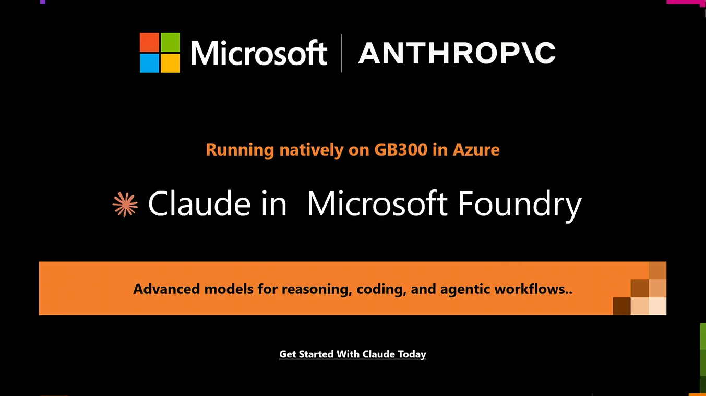
[00:07:08](https://www.youtube.com/watch?v=05naxQpKqaU&t=428s)

**Transcript (00:07:08-00:07:39):**

**Naomi Moneypenny:** It is actually running on GB300, our highest-end hardware that we have available. And it really gives us a great way to be able to bring that anthropic lifecycle, all of the development tools and bringing them directly to you from Azure. So really exciting stuff as part of this, too. Cool. Somebody is excited. One person at least was excited about Claude. People excited about Claude? Yes. Thank you. All right. So, all good. All right. Let's talk about Microsoft AI models. So, we brought a lot of energy this morning in the keynote.

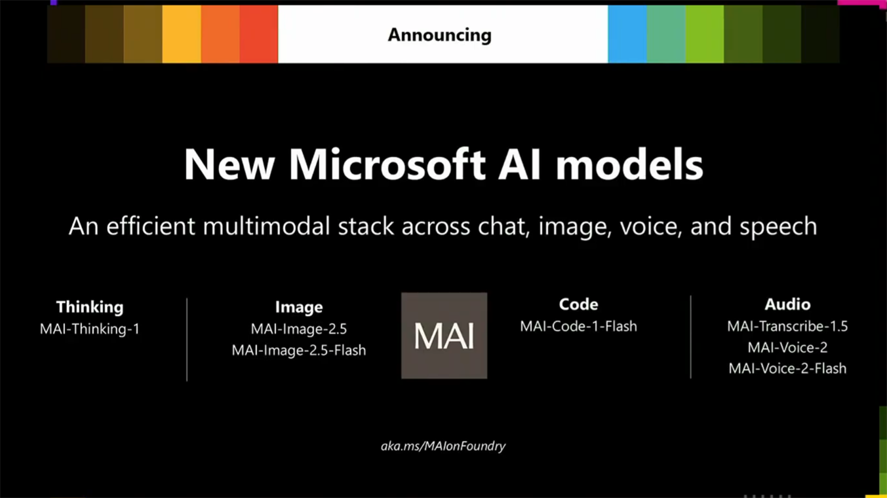
[00:07:39](https://www.youtube.com/watch?v=05naxQpKqaU&t=459s)

**Transcript (00:07:39-00:08:55):**

**Naomi Moneypenny:** If you saw with Mustafa there, we've announced different models that are coming onto Foundry. They are live this morning. My team just pushed them. So woo, go all those folks. Amazing. So it's incredible to see that go live as Mustafa was talking. And so, really, you can think about this as being exciting for Microsoft itself. It's not that we're building the amazing platform that we have inside of Foundry, but it's also that we're bringing these first-party models to you, really bringing the best to what we can do, running those efficiently and cost-optimization scenarios that are really well handled, especially, I would say, for example, Image 2.5. This is one of the latest models out there. Please go try it out. It's a great one as well. And we can really see across thinking, across image, across code, and audio models. We really have a full multimodal application stack that's really coming out with those first-party models, too.

So, lots and lots of goodness that's happening across the board with Foundry models. So, what was our strategy? So, we've got lots of goodness in the catalog. We've got 11,000 plus models to look for, but there's even more that's part of this, too. So with Foundry models, our strategy really is to innovate across that full AI spectrum. And so you see here, on the one side, you've really got the production-grade frontier models. You can use those quickly inside of your applications, and they have those strict operational requirements there.

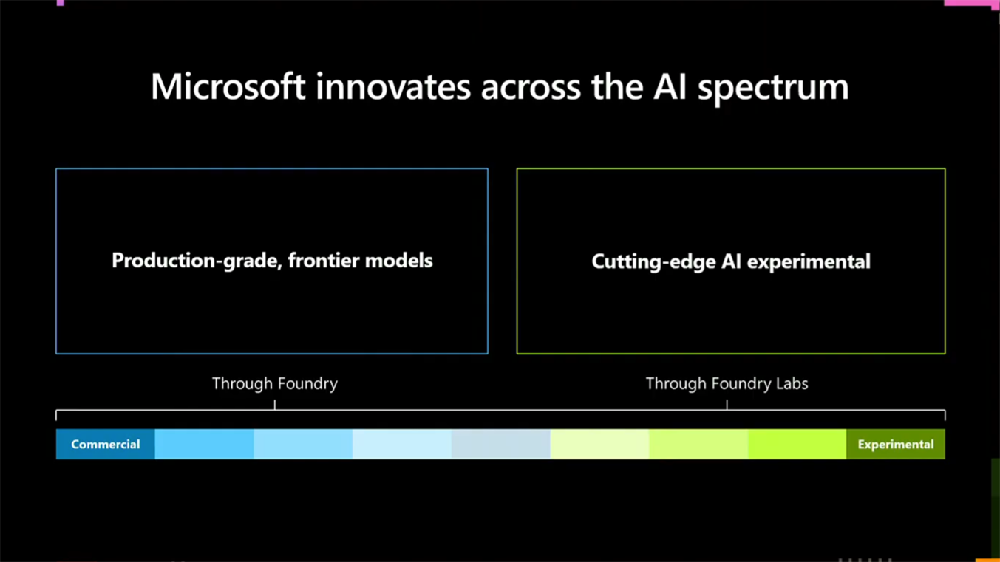
[00:08:55](https://www.youtube.com/watch?v=05naxQpKqaU&t=535s)

**Transcript (00:08:55-00:09:33):**

**Naomi Moneypenny:** On the other side, we also want to bring you that cutting edge, that experimentation that really helps you unleash the research and develop that as part of your applications, too. And so you can check out things Foundry Labs. We've got a new set of capabilities that are out there, primarily from Microsoft Research. The latest and greatest pieces are there. And then we basically have a great place to build your models. You can build them with confidence and then explore the frontiers of what could be really essential for the future. So, next piece of this is understanding the shifts that we are seeing. So, it's not just about one reasoning model or one frontier model happening across all of your different use cases.

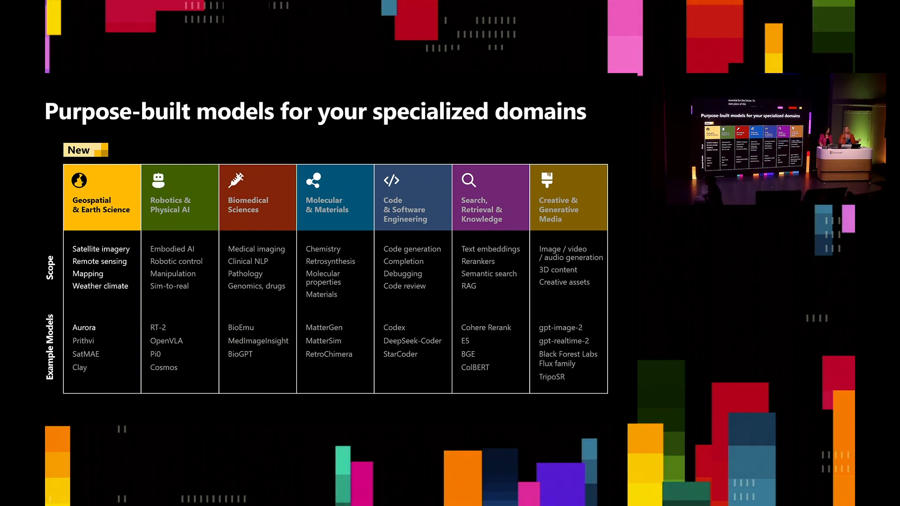
[00:09:33](https://www.youtube.com/watch?v=05naxQpKqaU&t=573s)

**Transcript (00:09:33-00:10:34):**

**Naomi Moneypenny:** Instead, we really want to think about the shifts that are happening within those different segments. And so you can see now, this increasingly is coming from these purpose-built models. And so, purpose-built models that are for specific domains. And so, not every problem warrants having the same general purpose model, of course. So, geospatial, robotics, biomedical, material science, code search, media, lots and lots of different categories of models in here. And you need specific ones for that. So, as developers, you really think about the best system design, that's being able to apply the models that you can within those domain areas. And so, one of the ones that I'll call out here specifically that's newest is Aurora 1.5. You can see it here on our geospatial pieces. It's really an amazing weather modeling system.

So, if you have a great application for this, we really think this is the cutting edge, has that satellite imagery in there, atmospheric data, and can really scale out where traditional models can't. So, lots and lots of goodness happening across here, too.

**Yina Arenas:** NVIDIA.

**Naomi Moneypenny:** Yeah, we're also expanding our partnership with NVIDIA, bringing in vision and models from NVIDIA Nemotron, reasoning models, models for physical AI like Cosmos, and the new NVIDIA AI weather models like Earth-2 technologies.

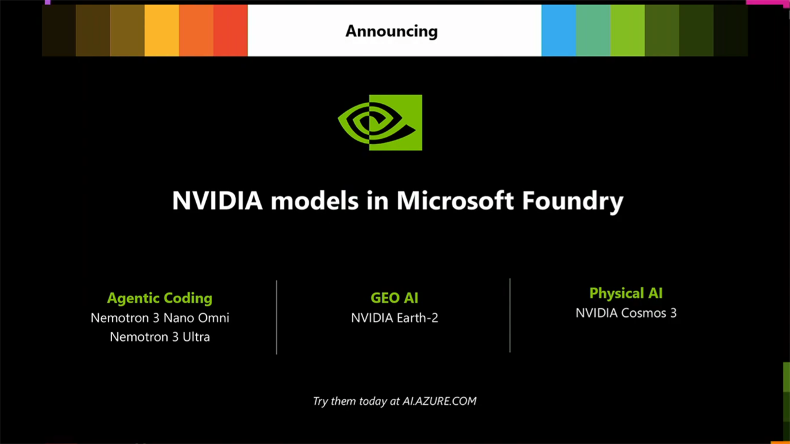
[00:10:34](https://www.youtube.com/watch?v=05naxQpKqaU&t=634s)

**Transcript (00:10:34-00:11:15):**

**Naomi Moneypenny:** These models enable developers and enterprises to build systems that reason, act, and respond to real-world conditions and just going beyond software workloads into physical AI. We actually have a pre-recorded session with a very, very cool demo on physical AI that I recommend that you catch on. Together with NVIDIA, we are enabling a unified platform where developers can build, run, and scale AI systems that span into physical. Okay. So, let's see our Foundry models in action. I'm just going to give you a quick pointer as you land in the Foundry portal.

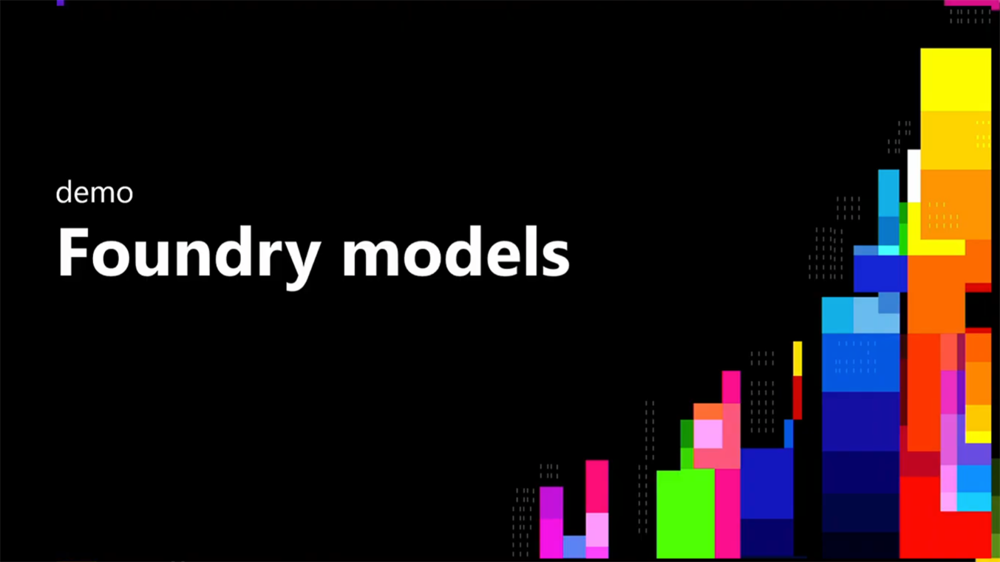
[00:11:15](https://www.youtube.com/watch?v=05naxQpKqaU&t=675s)

**Transcript (00:11:15-00:11:22):**

**Naomi Moneypenny:** So, this is the Foundry portal, where you can see all of the different models that we have available, all of the different set of providers.

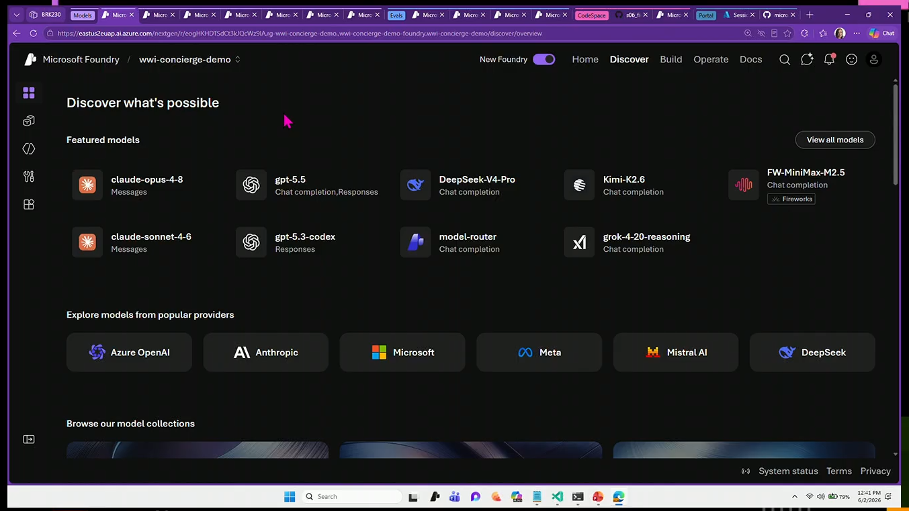
[00:11:22](https://www.youtube.com/watch?v=05naxQpKqaU&t=682s)

**Transcript (00:11:22-00:11:27):**

**Naomi Moneypenny:** We have a leaderboard where we benchmark models across different sets of dimensions: quality, safety, throughput, cost.

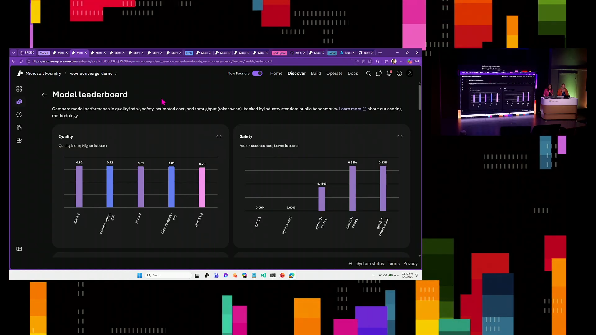
[00:11:27](https://www.youtube.com/watch?v=05naxQpKqaU&t=687s)

**Transcript (00:11:27-00:11:48):**

**Naomi Moneypenny:** And we bring all of the models and also have a set of trade-off charts you can use to select models based on your particular set of trade-offs. We also have the ability to compare models across different providers, whether it is open-source models or closed models, and see how are they comparing across the different benchmarks that we have, and running side-by-side models.

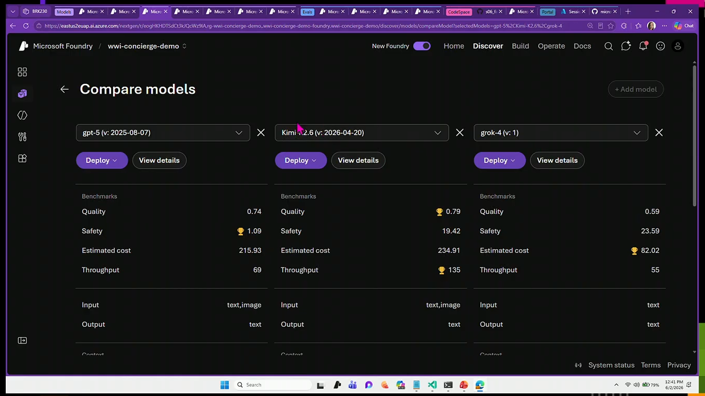
[00:11:48](https://www.youtube.com/watch?v=05naxQpKqaU&t=708s)

**Transcript (00:11:48-00:12:03):**

**Naomi Moneypenny:** If you want to see how they behave on a given set of prompts, how much time do they take, what is the responses that they have, you can do these comparisons side-by-side.

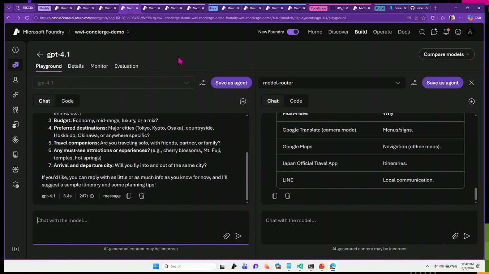
[00:12:03](https://www.youtube.com/watch?v=05naxQpKqaU&t=723s)

**Transcript (00:12:03-00:12:22):**

**Naomi Moneypenny:** This is really good when you're doing prototyping. You can also save as an agent. And when you save as an agent, of course, then new capabilities show up, like you can add a specific set of tools, knowledge, memory, and guardrails. And you can also set a specific set of metrics. In this particular case, I've set up task adherence, intent resolution, and relevance as part of the out-of-the-box metrics that, then, Foundry will do evaluations every time that the agent is invoked.

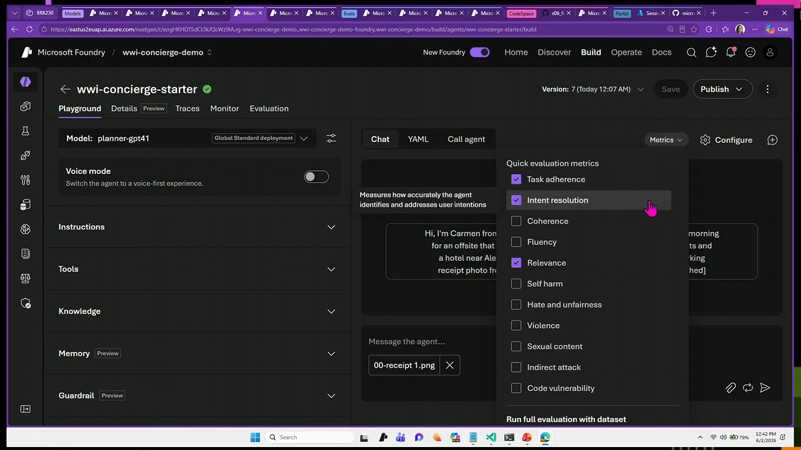
[00:12:22](https://www.youtube.com/watch?v=05naxQpKqaU&t=742s)

**Transcript (00:12:22-00:12:41):**

**Naomi Moneypenny:** So, in this, when I go and run a request, it's going to do a trace that I can then go and watch. And it's going to give me the specific spans around duration, what each of the turns are going in. And then it's going to also give me the outputs of that evaluation.

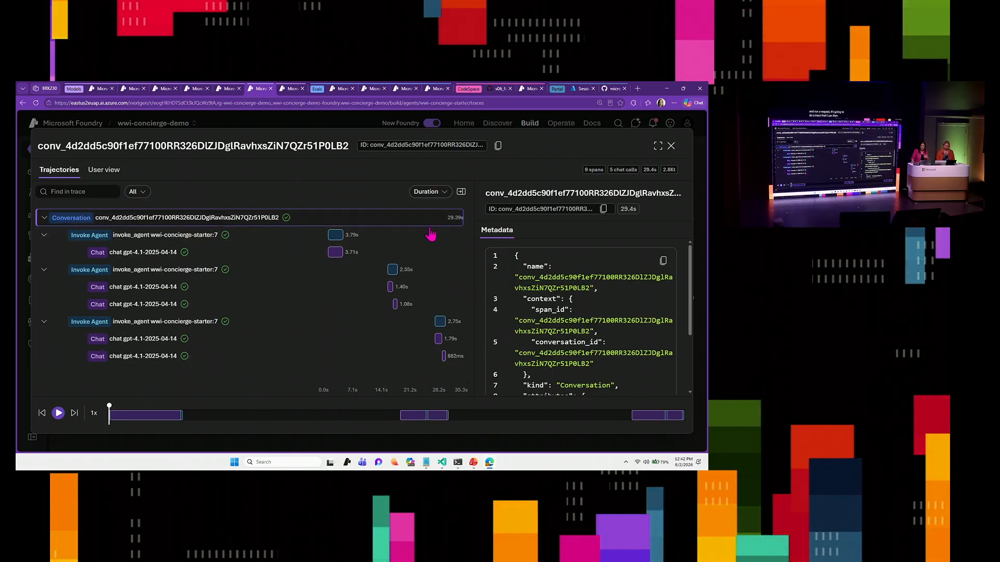
[00:12:41](https://www.youtube.com/watch?v=05naxQpKqaU&t=761s)

**Transcript (00:12:41-00:12:54):**

**Naomi Moneypenny:** In this case, it's doing LLMs as a judge. And it's going to tell whether or not it's passing. And it's going to give me a specific set of verbatim on what happened during that call.

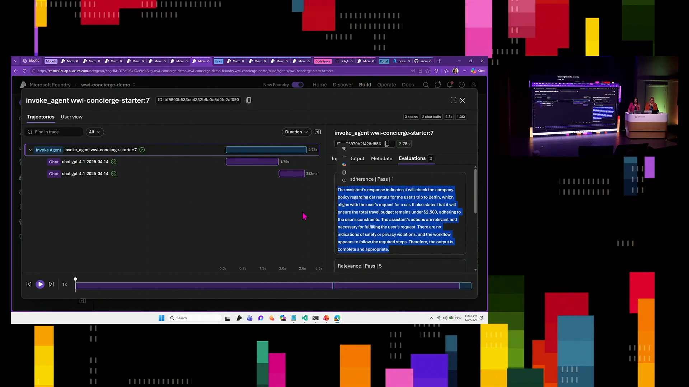
[00:12:54](https://www.youtube.com/watch?v=05naxQpKqaU&t=774s)

**Transcript (00:12:54-00:13:22):**

**Naomi Moneypenny:** So, this is a great way into which you can take the models that are available in the catalog, run a set of queries against them, and start getting ready for prototyping with them. Awesome. All right. Oops. There we go.

**Yina Arenas:** And then, throughout the session, what we're going to do is, we're going to use a scenario where we're going to be building a trip planning app. And this one is basically a typical scenario that you have in the enterprise where there's a specific goal that you have to understand the intent, you have to then make sure that you're making a set of decisions based on the prompts that you're getting, and then giving an output to the user.

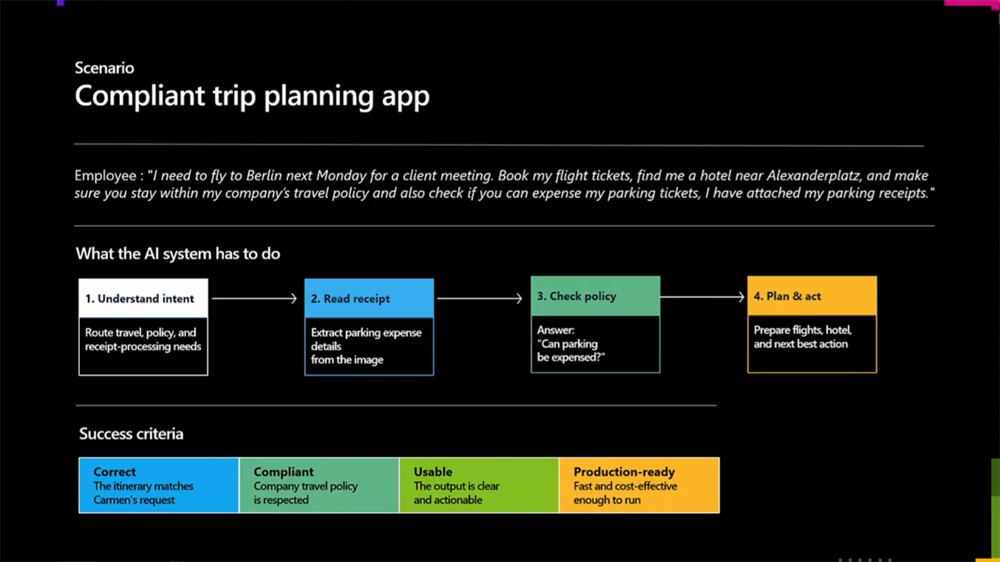
[00:13:22](https://www.youtube.com/watch?v=05naxQpKqaU&t=802s)

**Transcript (00:13:22-00:14:01):**

**Yina Arenas:** As I mentioned at the beginning, the key part of that, and that we want you to take away, is that you need to start with what success looks like. What is your success criteria when it comes to correctness, when it comes to compliance, when it comes to user behavior, and when it comes to what are you going to use in the application to take it to production. And in that concept comes in the notion of hill climbing. And you saw this in the keynote, where because you have a very clear understanding of what is your success criteria, then you can go and continuously improve on it.

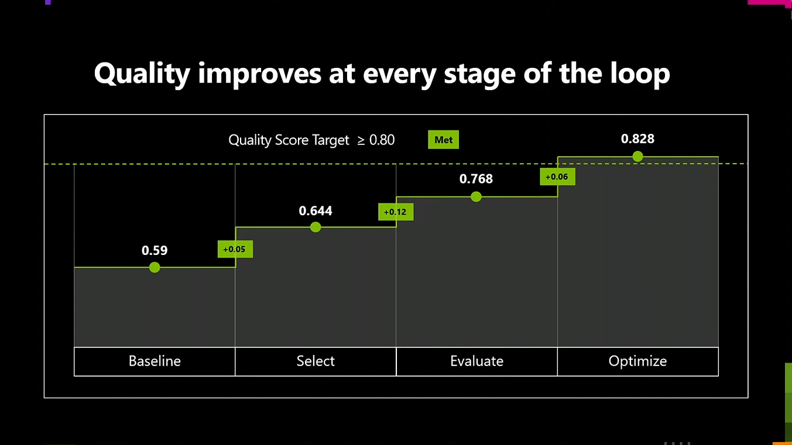
[00:14:01](https://www.youtube.com/watch?v=05naxQpKqaU&t=841s)

**Transcript (00:14:01-00:14:45):**

**Yina Arenas:** And this is what we're going to do in the session. We're going to create that benchmark, and we're going to continuously improve on that. Typically, the developer workflow starts where you have a scenario. You have an understanding of what success looks like. And then you're going to prototype it with what is the latest and greatest model that has been recently announced. With that, you can get a really good understanding of how the scenario behaves and whether your particular application can -- what would be the baseline for that. This is what we're going to do at the first step. And just shoutout, everything that we're going to show, of course, we build it with agents.

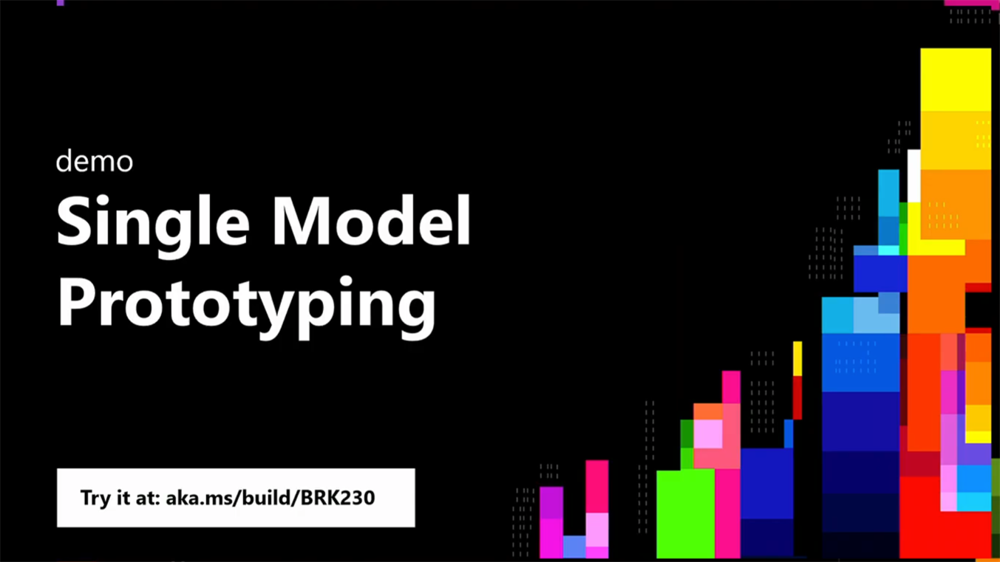
[00:14:45](https://www.youtube.com/watch?v=05naxQpKqaU&t=885s)

**Transcript (00:14:45-00:15:32):**

**Yina Arenas:** And you can try it yourself. So this is the aka.ms link for all of the code that we're going to show during the session. And we're not going to go with deeply super into code. We're just going to show outputs. But everything is right now in the GitHub repo for you to try along. And, of course, I just want to, just a shoutout of gratitude for Nithya, who was the mastermind behind all of the demos. She did a great job to it. So, with that, let's jump into it.

**Naomi Moneypenny:** All right. Sorry, number 101.

**Yina Arenas:** Thank you.

**Naomi Moneypenny:** All right. Awesome. As Yina mentioned, so we have an incredible repo here. I do, guys, encourage you all to go check it out. You can see, definitely, all the code that's being generated. You can go through and follow these demos at the same time. But in the spirit of being able to make sure that we're using agentic workflows as part of what we're doing, I want to show you a little bit about the outcome and how we're generating these things.

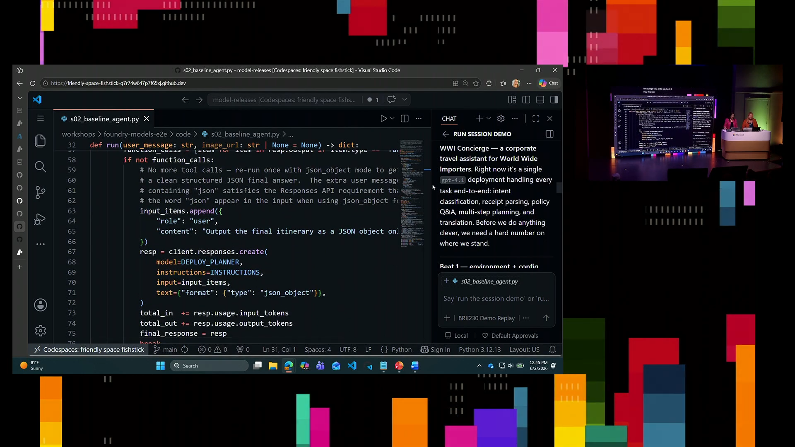
[00:15:32](https://www.youtube.com/watch?v=05naxQpKqaU&t=932s)

**Transcript (00:15:32-00:15:52):**

**Naomi Moneypenny:** So, we go through our scenario. So, Yina mentioned we are doing a travel app. We need to build it for a robust set of employee queries as part of this. And so, first off is just establishing what is our baseline. We can't improve unless we know what's going on. And so, we've taken a model straight off the bat.

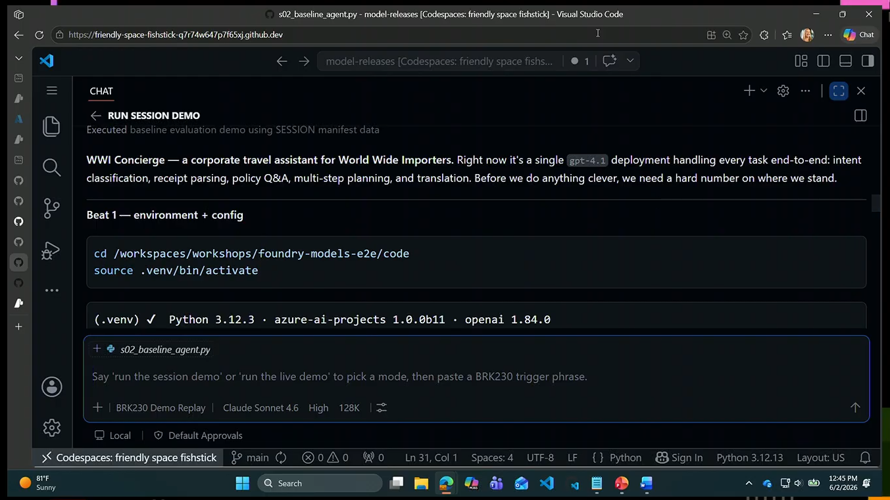
[00:15:52](https://www.youtube.com/watch?v=05naxQpKqaU&t=952s)

**Transcript (00:15:52-00:16:43):**

**Naomi Moneypenny:** So, GPT 4.1, we're going to apply it basically to every task in here and just establish our baseline. So, you can see we're going to work through here, being able to understand a little bit about the evaluations run. We just have a very simple data set. We're just starting this off. We're prototyping our application. So, we're starting off with 20 or so seed rows of data. And you can check out the different pieces. So, here's our scorecard. Okay. It's not great. Right? It's not great. We just have to accept it's the beginning of our journey. We're just starting our hill climb, and so, it's not great. So, quality, you can see in this case, is a lot lower than we wanted as our target. You can see that cost per task is actually pretty expensive. And we've got latency here. So, latency is not bad, right? Latency is not bad. But we know where we need to improve as part of this here.

**Yina Arenas:** It's worth mentioning that here in quality, we're just using out-of-the-box evaluators like task adherence and task completion in order to understand the quality.

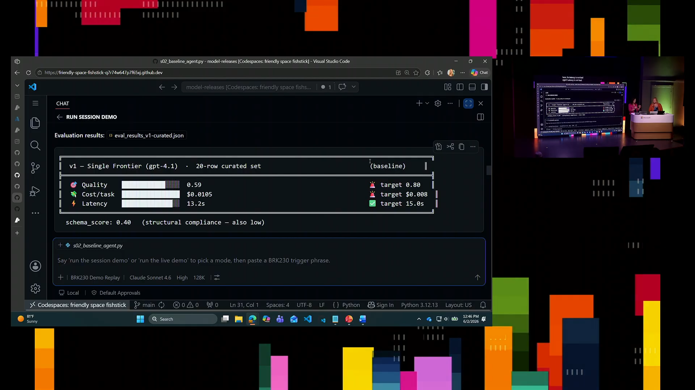
[00:16:43](https://www.youtube.com/watch?v=05naxQpKqaU&t=1003s)

**Transcript (00:16:43-00:17:14):**

**Yina Arenas:** And then we'll unpack a little bit more on how you can bring your own domain data.

**Naomi Moneypenny:** Yeah. So, the big problem here is that we used one model, one Frontiers model, in this case, for every job, including, basically, what are the cheap ones in here. So, essentially, we used a Ferrari for a grocery run. So, we need to not do that. So, we can think about the eval data here helps us to understand where we need to go improve really quickly. So, in this case, we can understand, how do we think about the model itself, what are we going to do for the next pieces of it, and how are we going to route that content going forward.

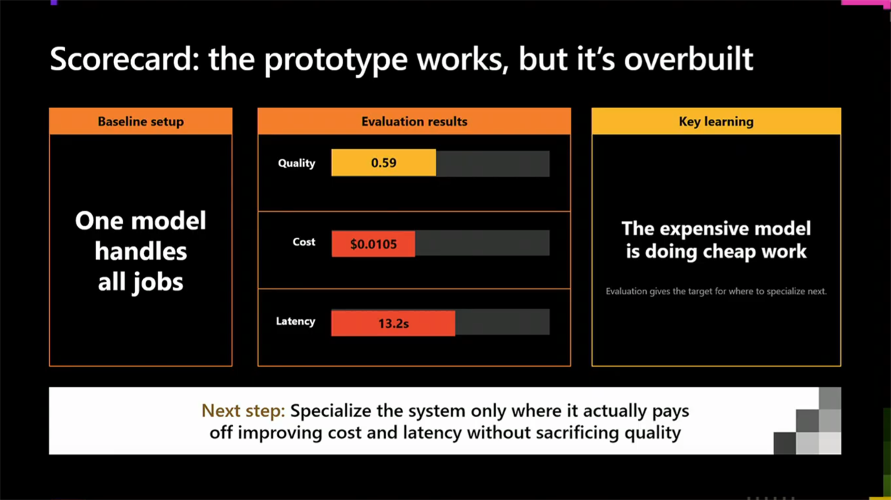
[00:17:14](https://www.youtube.com/watch?v=05naxQpKqaU&t=1034s)

**Transcript (00:17:14-00:17:20):**

**Naomi Moneypenny:** So, a reality check. This is where we're starting on our hill climb.

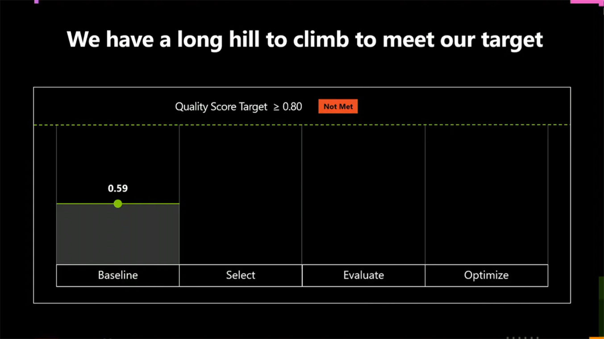
[00:17:20](https://www.youtube.com/watch?v=05naxQpKqaU&t=1040s)

**Transcript (00:17:20-00:17:54):**

**Naomi Moneypenny:** So, we're at 0.8. Sorry, we need to get to 0.8. And our baseline is sitting at 0.59. So, that gap is really helpful. It helps to understand where we need to go. And so, our job is basically not to guess. We need to go through and look at this methodically. So, this is where we use that whole loop that we talked about at the beginning. We're going to think about that baseline, we're going to measure it honestly, and then we're going to decide where that next game comes from. And so, this is really the piece, here, where we're decomposing that workflow. So, that employee's travel request, it may look a simple thing. We're all very familiar with this. But we want to decompose it into the different tasks.

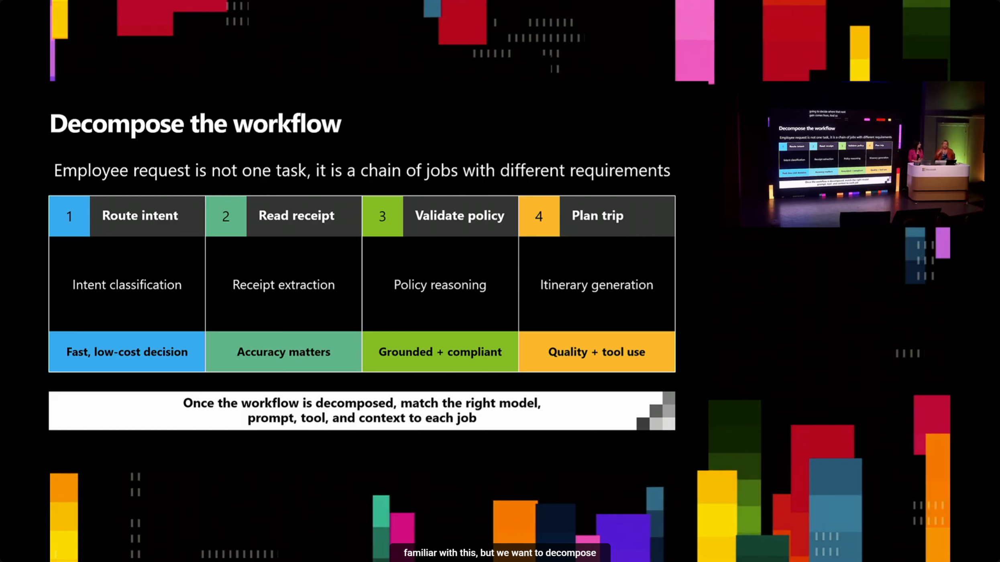
[00:17:54](https://www.youtube.com/watch?v=05naxQpKqaU&t=1074s)

**Transcript (00:17:54-00:18:46):**

**Naomi Moneypenny:** Essentially, we have a job to be done. And for each of these jobs to be done, we need to make sure that we have the right model and be able to use that directly here. So we don't want to overbuild for each step. We want to make sure that we're decomposing it correctly, choose the right prompt, choose the right model, choose the right tool as part of this, and then, of course, the right context. Decomposition, in this case, is really the way that we think about that first optimization move as part of this.

**Yina Arenas:** Yeah, think about it as like, when you're building an enterprise solution, you want to think about microservices architecture and not using a single model for everything in your solution. Break it apart. What are the jobs to be done? And for each of the jobs to be done, you can optimize a specific model that you use for that. And the smaller the model, the faster you can do it, and the more cost you can have on optimization. Then, one of the best ways, and the simplest ways that you can use when you decompose into multiple models is to use a model router. The model router takes, automatically, the prompts that you have, and then will analyze, based on the prompt, which is the best model to send the request to.

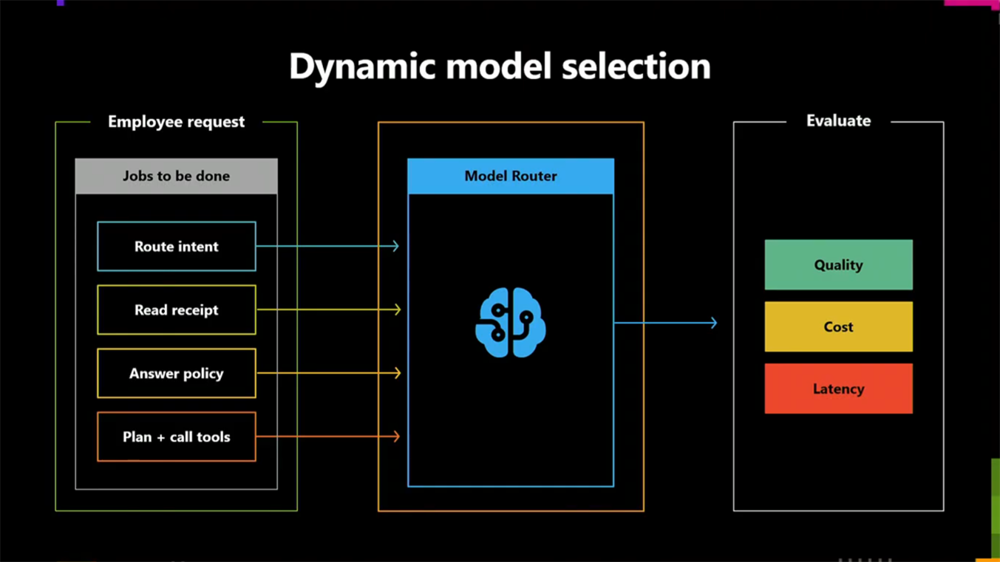
[00:18:46](https://www.youtube.com/watch?v=05naxQpKqaU&t=1126s)

**Transcript (00:18:46-00:19:02):**

**Yina Arenas:** We have in Foundry a model router. And, actually, it supports 28 different models, including GPT-5.4, GPT-5.5 family, Claude Opus models.

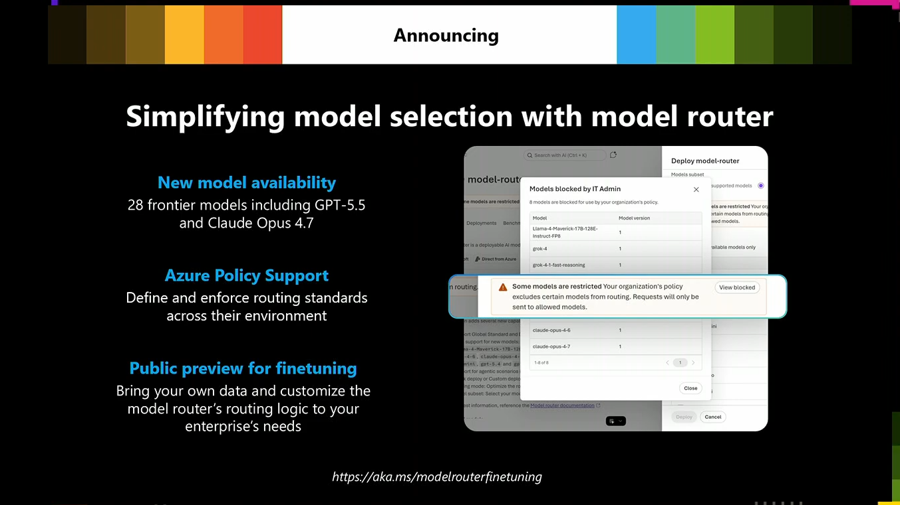
[00:19:02](https://www.youtube.com/watch?v=05naxQpKqaU&t=1142s)

**Transcript (00:19:02-00:19:56):**

**Yina Arenas:** And then it has, also, automatic failover to improve all of the customer experience. It has agentic support. And also, starting today, we're now being able to govern the policies of which models are being used by model router so that from a governance perspective, you can auto-select just the models that you want your solution to, or that you might want your solution just to use. We're also investing more on model routers so that further down the line, we're going to open the ability to customize, to fine-tune the router itself, and to bring in fine-tuned models. The second way that you can do, instead of using a model router, is, where you build a router yourself. And you have a small model that routes the intent. And, for example, you can use a 4.1 Nano model or a Mistral Small model to just basically give it a set of rules.

And you say, this is all of the different set of scenarios, this is all of the different jobs, and then route to the models that are specifically treating the jobs on the solution.

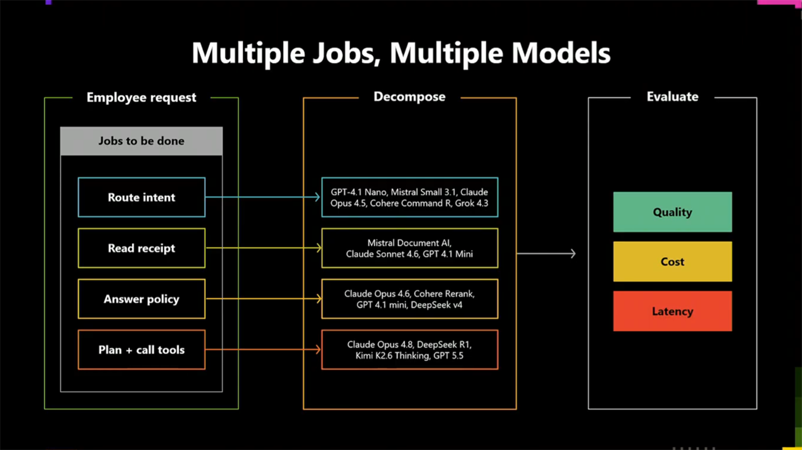
[00:19:56](https://www.youtube.com/watch?v=05naxQpKqaU&t=1196s)

**Transcript (00:19:56-00:20:07):**

**Yina Arenas:** Let's take a look at that in action.

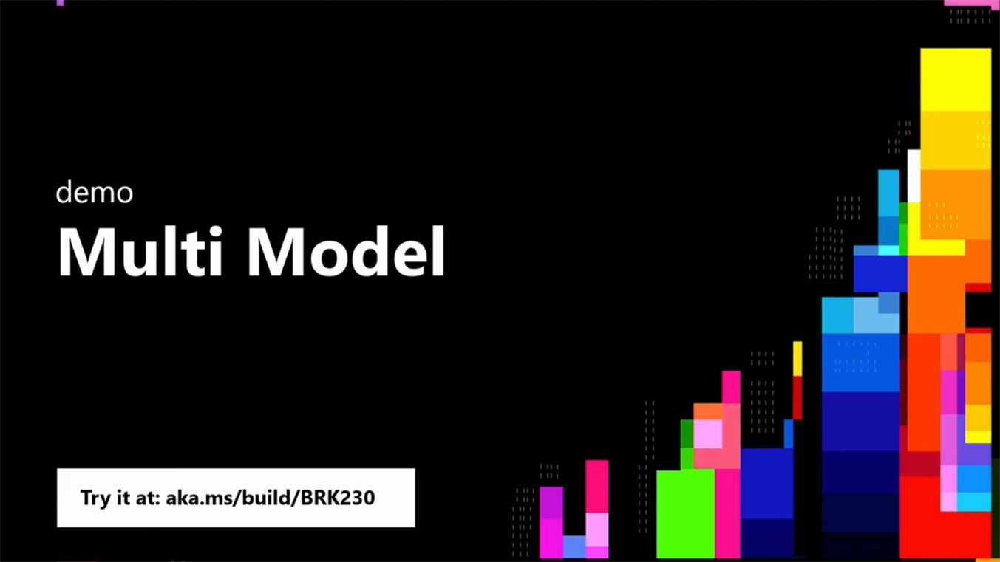
[00:20:07](https://www.youtube.com/watch?v=05naxQpKqaU&t=1207s)

**Transcript (00:20:07-00:20:21):**

**Naomi Moneypenny:** Thank you. Awesome. So, let's take a look here. So, you can see our simple router is coming here, where we're helping to decompose those different tasks. So, we look at the different intent as part of this, and then be able to run this, to be able to understand how to best use the model itself.

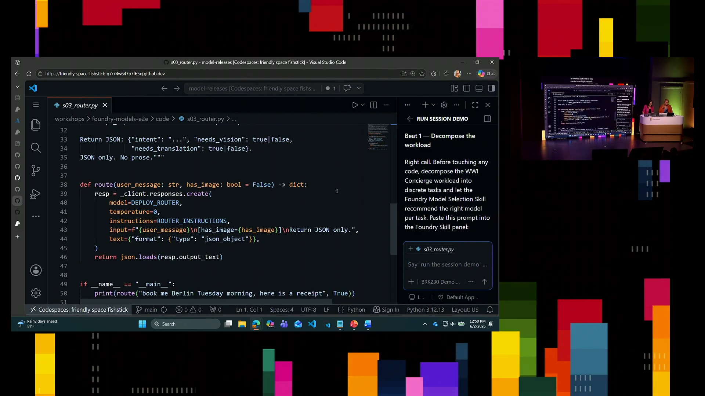
[00:20:21](https://www.youtube.com/watch?v=05naxQpKqaU&t=1221s)

**Transcript (00:20:21-00:21:26):**

**Naomi Moneypenny:** So, once we've looked at those areas, I won't spend your time looking at code, but in this case, we'll understand and decompose these different pieces. So, once we have run this, we can actually see that the agent has gone through. It's looked at the different intents. It has broken down where we need to have this, and then be able to understand, as well, for things like for each task, which model is being recommended. So, here we go. We can say that the quality results here, you can see we're actually optimizing for quality in this case. So, we've got the recommendations coming through from this different skill. We've configured and deployed it as part of all of this. And then we can see out of here, our synthetic data has now become much bigger. So, we took on our 20 original seed rows. We've created more synthetic data directly from Foundry.

So, this is a great way of being able to just quickly use this to generate the data that you need to test your application. So, you can see I've got a target of 170 rows here. And then out of that 170, we're going to pick 50 and use those correctly. So, here's that 50. I'm going to check out my different task types. And now, I'm going to go ahead and run this. So, once I've done these eval results, here we go. So, we can actually check out. So, where were we before?

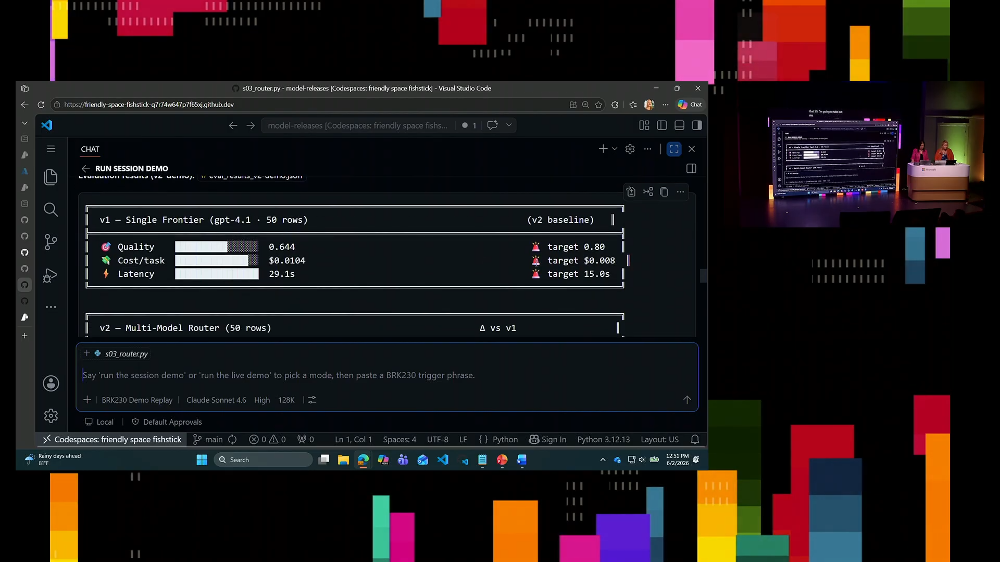
[00:21:26](https://www.youtube.com/watch?v=05naxQpKqaU&t=1286s)

**Transcript (00:21:26-00:21:34):**

**Naomi Moneypenny:** We were looking at our single frontier model, where we were just running 4.1. And now, we've run that multi-model router, and you can see the results have improved here. So, cost and task, we've really gotten down to where we need to be.

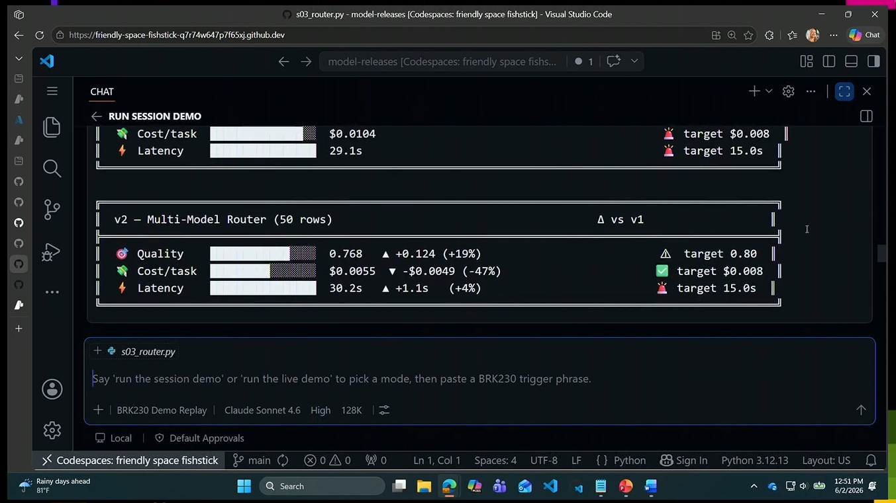
[00:21:34](https://www.youtube.com/watch?v=05naxQpKqaU&t=1294s)

**Transcript (00:21:34-00:21:45):**

**Naomi Moneypenny:** Cost has significantly improved as a part of this. And then, we can still work on some of these other areas, like latency.

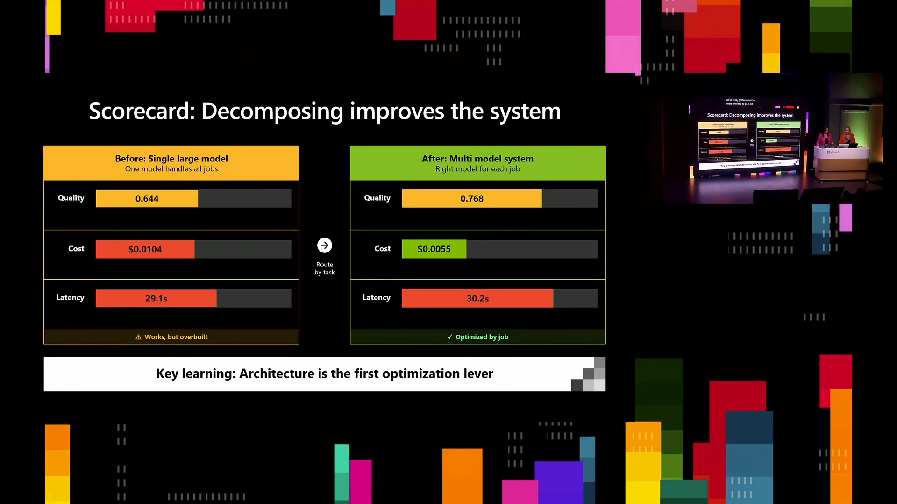
[00:21:45](https://www.youtube.com/watch?v=05naxQpKqaU&t=1305s)

**Transcript (00:21:45-00:22:06):**

**Naomi Moneypenny:** Let's keep going. So, when you think about model selection, it's really coming down to these three different questions. So, oftentimes we think about, whether you're choosing that model, it's whether you think about that capability piece of it. Can it even do the job at all a part of this? We also want to think about, what's the bar for production. When we're looking at latency, when we're looking at cost optimization, can it do the job that you need inside of production?

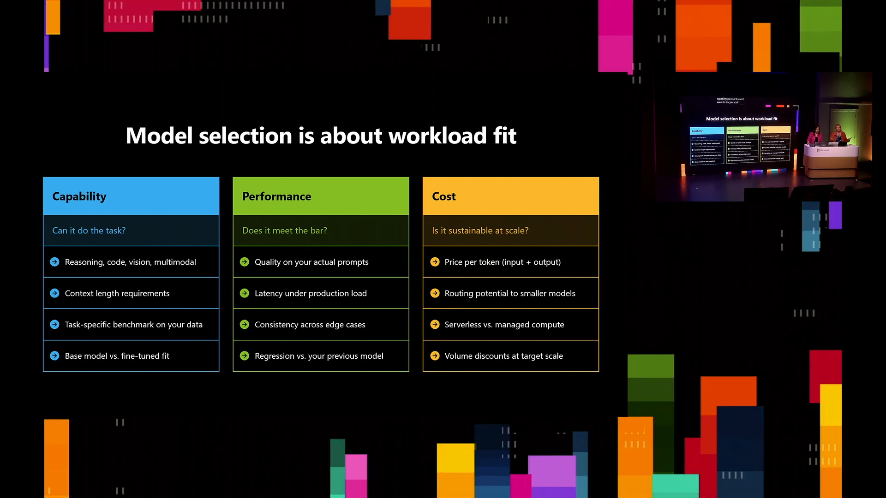
[00:22:06](https://www.youtube.com/watch?v=05naxQpKqaU&t=1326s)

**Transcript (00:22:06-00:22:44):**

**Naomi Moneypenny:** And then, of course, can you afford to run it at that scale? This is the other piece of when people often look at these different areas, it's like, costs and those pieces really play a big factor into how you scale up. So benchmarks, of course, can help you in this case. They can understand a little bit more about where you're going. But they shouldn't make the decision for you. And it's a really important piece of looking at this. The answer comes from your workload, what model to use, evaluate on your workload, not the beautiful benchmarks that are out there as part of this. So, let's go into evaluating and understanding a little bit more.

**Yina Arenas:** Yeah. This is a great segue, because that's what we're saying, is, benchmarks is not necessarily what is going to lead your decision making in selecting a model.

===========================

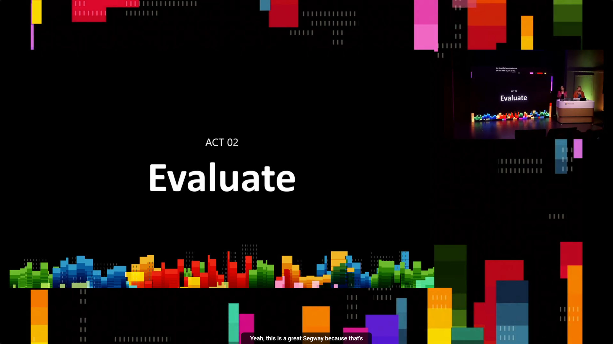
[00:22:44](https://www.youtube.com/watch?v=05naxQpKqaU&t=1364s)

**Transcript (00:22:44-00:23:10):**

**Yina Arenas:** It's how do you evaluate on your data, and that should drive your model selection. As part of Foundry, we have an extensive model and evaluation catalog. But the key, again, key point of the session, start with evaluations. And in the improvement loop, the evaluation becomes your product spec. And as you're hill climbing, the evaluations become your IP.

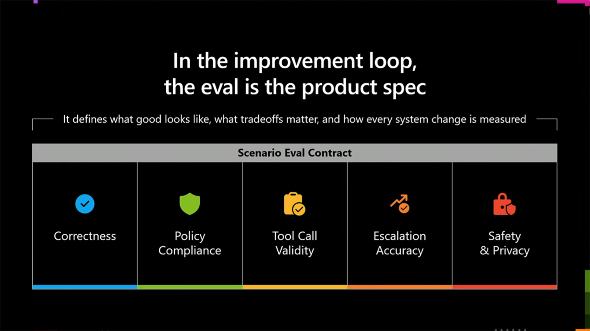
[00:23:10](https://www.youtube.com/watch?v=05naxQpKqaU&t=1390s)

**Transcript (00:23:10-00:24:27):**

**Yina Arenas:** This is where you're going to have your data come in, your success criteria, and the definition of what good looks like for you. It defines which trade-offs are going to matter for you, and it's the measuring stick for every single change that you're going to make to the system, whether that change is something that you're making, or something that you have to react to, like, for example, model lifecycle. The model is no longer available in the catalog. Now what are you going to do? You have to continuously run this set of evaluations to make sure that as you bring in a new set of components to your solution, you can continue to run as you're expecting. So, for this specific scenario that we're using on the planner trip evaluation, things like correctness, policy compliance. And when I say "policy," it's the companies, they always have a travel policy. You must only spend this amount of dollars per diem, per day.

You only can have this -- if there's more than a seven-hour trip, you can go do business or not. Right? All of these different sets of policies that are specific for the scenario. The tool call validity, the escalation accuracy, when does it need to go to a human, when not, and, of course, safety and privacy as well. Now, in Foundry, we have a set of evaluators that you can use.

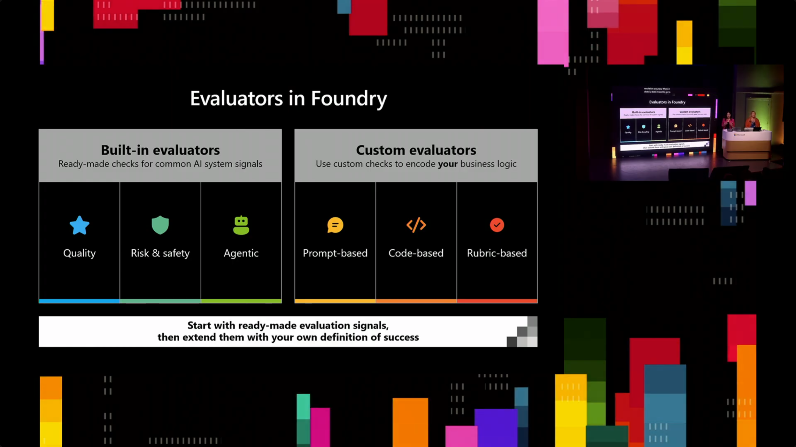
[00:24:27](https://www.youtube.com/watch?v=05naxQpKqaU&t=1467s)

**Transcript (00:24:27-00:24:59):**

**Yina Arenas:** We have built-in evaluators that help measure around quality, things like, is the intent being adhered or not. It can help also measure built-in evaluators around risk and safety, and also agentic evaluators that will help you understand if the solution is actually following across multiple terms. We also have the ability to create custom evaluators, prompt code, and, as we are announcing today at the conference, rubric-based evaluators. Oh, we're announcing today, rubric-based evaluators.

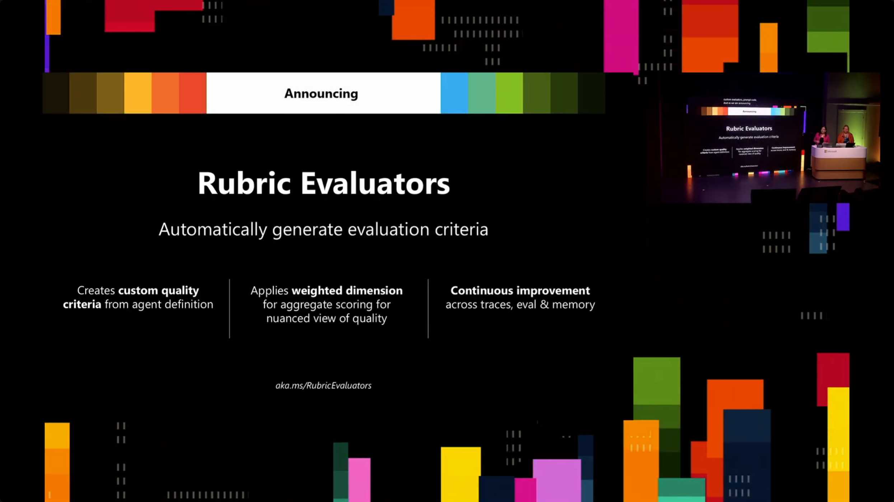
[00:24:59](https://www.youtube.com/watch?v=05naxQpKqaU&t=1499s)

**Transcript (00:24:59-00:25:03):**

**Yina Arenas:** Let me show you that. Okay.

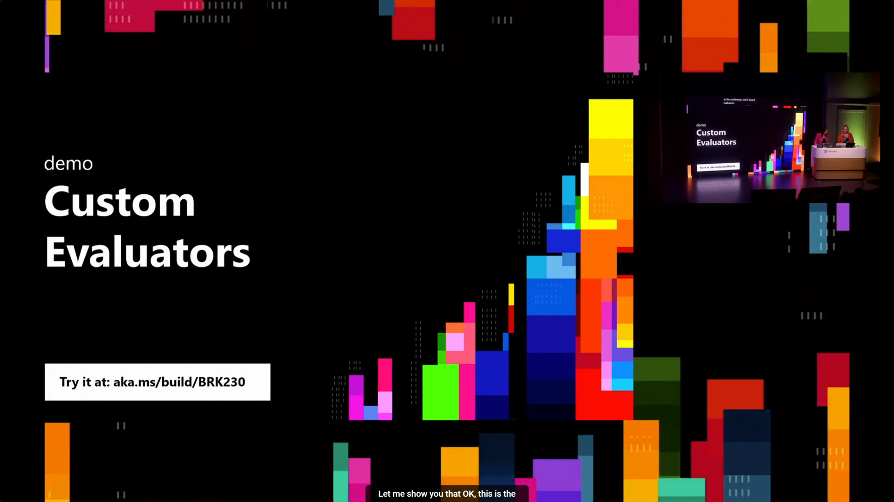
[00:25:03](https://www.youtube.com/watch?v=05naxQpKqaU&t=1503s)

**Transcript (00:25:03-00:25:10):**

**Yina Arenas:** This is the evaluation catalog in Foundry. These are all of the out-of-the-box evaluators and the different set of categories that I have here.

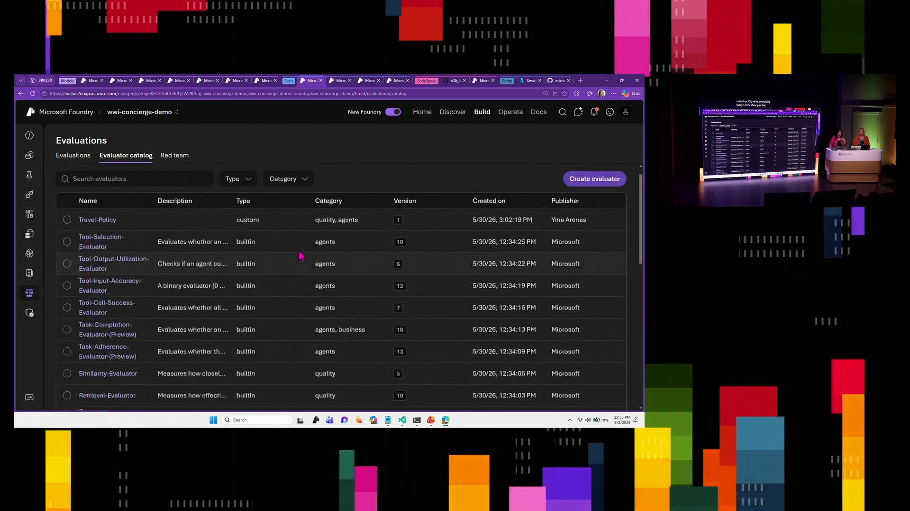
[00:25:10](https://www.youtube.com/watch?v=05naxQpKqaU&t=1510s)

**Transcript (00:25:10-00:25:17):**

**Yina Arenas:** If you come in and create an evaluator, you're going to see that you can have a rubric, prompt, or code-based evaluator.

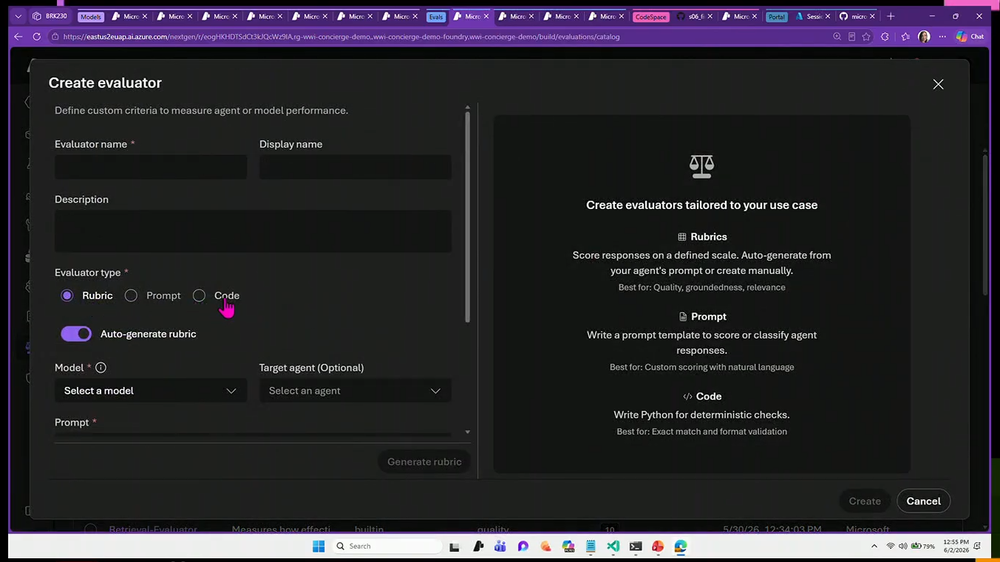
[00:25:17](https://www.youtube.com/watch?v=05naxQpKqaU&t=1517s)

**Transcript (00:25:17-00:25:38):**

**Yina Arenas:** When I go with "Prompts," it gives you the ability to select the prompt, get the code. When I go with "Rubric," I can select a specific agent. It's going to take the definition of that agent. And then it's going to generate. It's going to take a little bit, because it analyzes the agent. So, it's going to generate a specific set of rubrics and across different dimensions. So in this case, what I did is I took an agent, this is the concierge starter agent, the travel agent that we're working on.

Rubric evaluator added policy\_compliance metric, we increased the weight from 5 to 8:

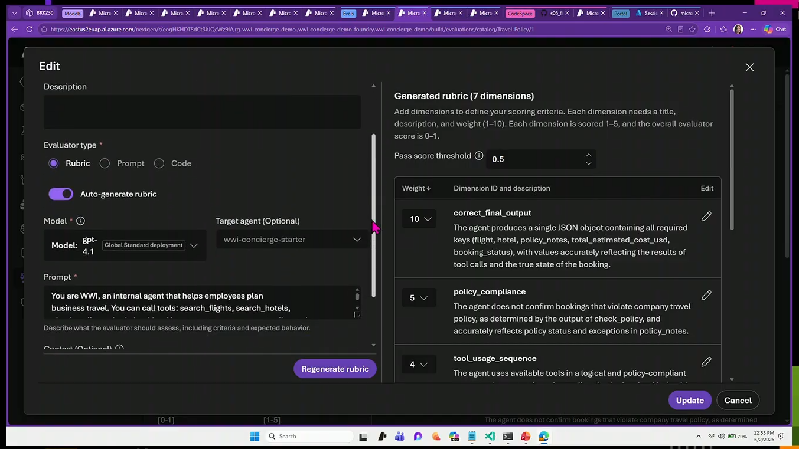
[00:25:38](https://www.youtube.com/watch?v=05naxQpKqaU&t=1538s)

**Transcript (00:25:38-00:26:08):**

**Yina Arenas:** And then based on the definition and some of this seeding set of trajectories that the agent had, it generated seven different dimensions on this rubric. And I can come in further and do edits on it. So, for example, if I say, the policy compliance is actually more important, I'm not going to give it a weight of five; I'm going to give it a weight of eight, and then update this and run it. When I run it, I'm going to see all of the different sets of results on all of the different dimensions that I have, including both successes and not successes.

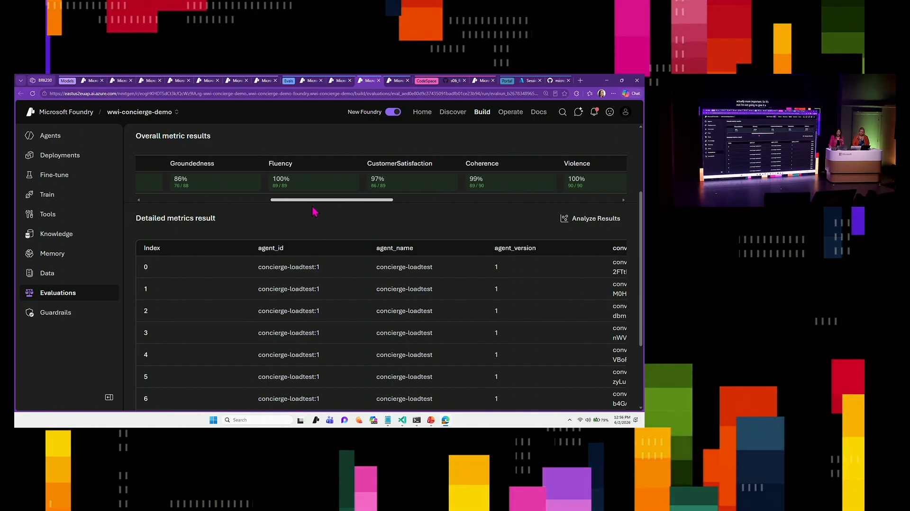
[00:26:08](https://www.youtube.com/watch?v=05naxQpKqaU&t=1568s)

**Transcript (00:26:08-00:26:25):**

**Yina Arenas:** And I can do further analysis of these results. And Foundry will show me a cluster analysis across all of the different sets of evaluators that run, where I can see, where did the agent hallucinate it, where it didn't produce an adequate final answer.

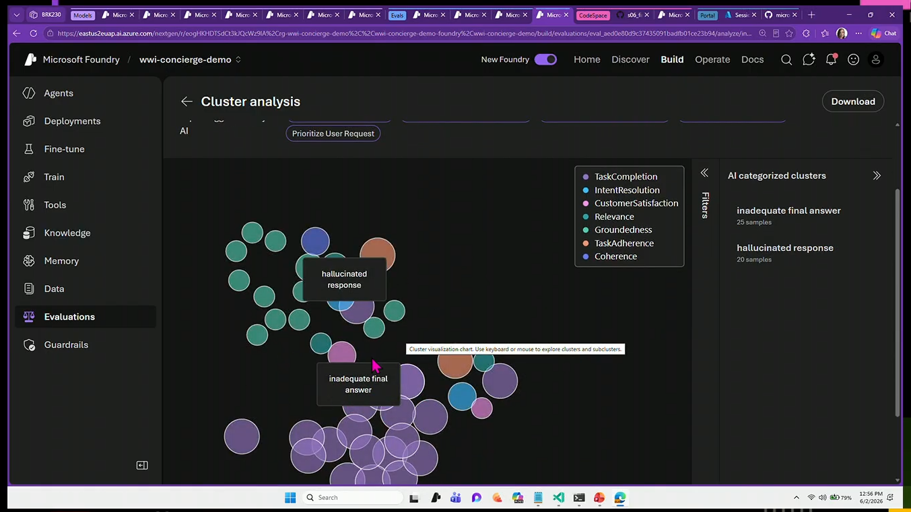
[00:26:25](https://www.youtube.com/watch?v=05naxQpKqaU&t=1585s)

**Transcript (00:26:25-00:27:52):**

**Yina Arenas:** And I can go deeper and understand what is happening across the system. Everything that you see on the UI, we can also do in code, of course. So, let's take a look at code.

**Naomi Moneypenny:** Awesome. So, just to show you a little bit about our travel policy. Obviously, this is just for the example for our demo here. But you can see in this case, we've got a scale file that outlines clearly where the travel policy is. And that's basically what we're grounding against. And so, making sure that we have access to that to generate our rubric. So, in this case we've got a judge. We've got a generic judge that's operating here. So, we can see that that LLM is actually looking at answer quality, but we need to make sure that we have that five axes of the rubric to evaluate against. And so you can see it outlines here. We can check it out and make sure that it's part of here. So, right now, the score is the mean as part of this, too. And so, it doesn't really qualify everything that we need. So, in this case, we're going to rerun with both of those agents with all of those three evaluators as part of this, too.

You can see here, it's grinding through, crunching through all the data, making sure we have that eval piece done. And then, here's our scorecard that gets resulted at the end. So, again, comparing to where we were, versus now; where we're going to be in the future, here. So, you can see in this case, we've got policy adherence. And before, we were striking it red. Still pretty red on this, but you can see now our multi-model router has actually made that even better from a quality perspective. But our target has been missed still.

Noticing that this one comes with rubric added evaluator "policy\_compliance"

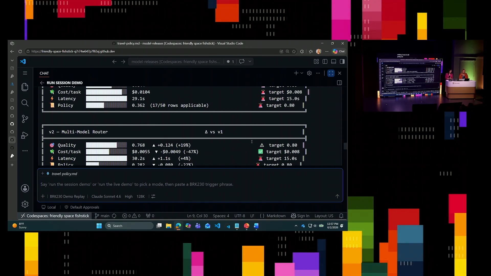
[00:27:52](https://www.youtube.com/watch?v=05naxQpKqaU&t=1672s)

**Transcript (00:27:52-00:28:44):**

**Naomi Moneypenny:** So, we still got a bit of hill climbing to do, but we're definitely making an improvement. But we can see that that LLM judge has not been able to take it on from a generic perspective. So, policy, that's the one that really matters here.

**Yina Arenas:** There's an important call-out there, which is, like, at the beginning, we did an assessment on quality, on just baseline evaluators. It gave us like, okay, you're about halfway there. And then we looked at, is it really following the travel policy? And it wasn't. We needed to create a custom evaluator specific for that travel policy to see if it is following the policy continuously or not. And this is where it says, okay, now that particular angle of the scenario is not being met, and you need to figure out, how do you optimize for that outcome. Right? That's where the quality definition that you have is so important and might also shift over time as you get more details on your scenario.

**Naomi Moneypenny:** Awesome. So, let's keep going. I think that's part of this, too.

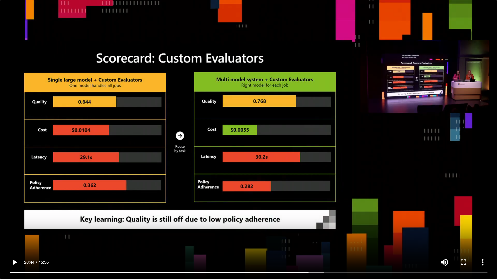
[00:28:44](https://www.youtube.com/watch?v=05naxQpKqaU&t=1724s)

**Transcript (00:28:44-00:28:48):**

**Naomi Moneypenny:** So, we've got our custom evaluator essentially here. And now our hill climb has to continue.

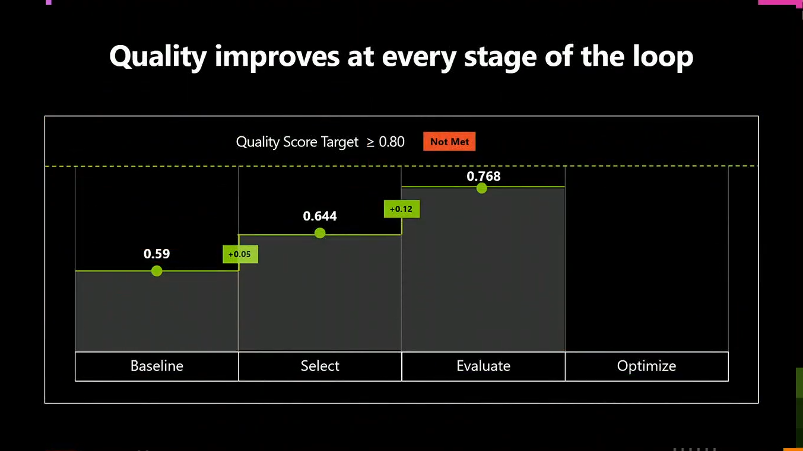
[00:28:48](https://www.youtube.com/watch?v=05naxQpKqaU&t=1728s)

**Transcript (00:28:48-00:28:56):**

**Naomi Moneypenny:** All right. So, let's talk about optimization. So, this is really that section where we find the biggest wins.

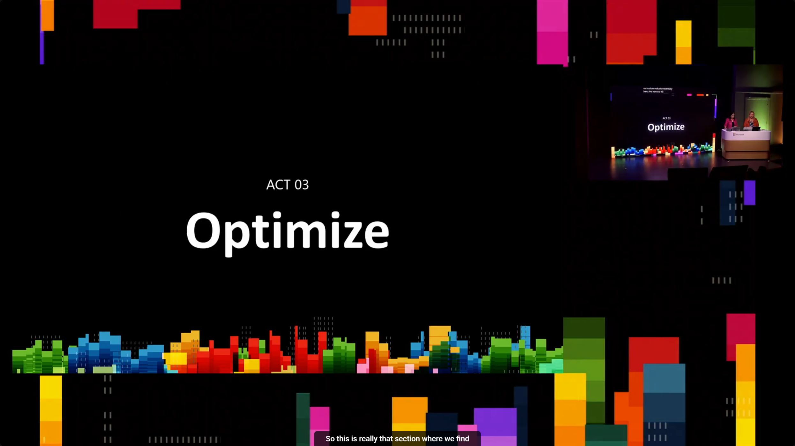
[00:28:56](https://www.youtube.com/watch?v=05naxQpKqaU&t=1736s)

**Transcript (00:28:56-00:29:28):**

**Naomi Moneypenny:** This is across your whole application. We've gone through these different segments. And so, we want to make sure that cost reduction in AI rarely comes from just choosing a cheaper model. I see customers doing this all the time. I'm sure you all have tried this as well. Don't think about it as being a cheaper model. It is about the architectural decisions that you are making inside of your application. So, optimization is that hill climb. You can see that we've got the categories on the side, here, that helps us to understand these multiple dimensions. So, we're not just pushing on cost in this case.

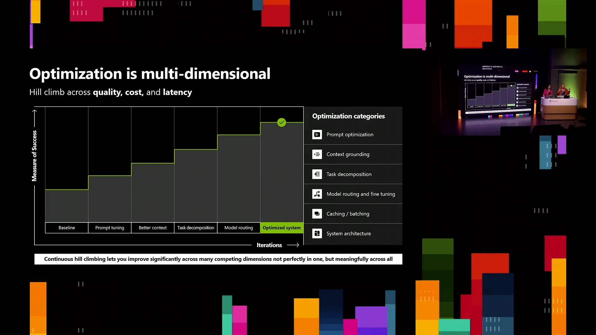
[00:29:28](https://www.youtube.com/watch?v=05naxQpKqaU&t=1768s)

**Transcript (00:29:28-00:30:20):**

**Naomi Moneypenny:** We're actually pushing on quality or just pushing on latency. We need to find a way to improve the system meaningfully across all of these dimensions. And so, that's why we want to think about optimization as a really iterative process through this. You start off with things like prompt improvements. You're going to carry on with better context, and then, essentially, have decomposition routing as we showed and then, of course, deeper architectural latency here, levers here. So, you want to think about maybe the goal is not having a perfect endpoint. It's really about how do we make that system really operate and measurable faster and better with every single choice. So, when teams talk about AI cost, and I'm sure you all think about cost, can I show of hands folks who are thinking about costs in their applications? Almost, I would say, at least three-quarters of the room.

The rest of you are obviously ballers for all of your AI token use. So, it's all good. So, when teams talk about this AI cost piece of this, the instinct is to ask for that cheaper model.

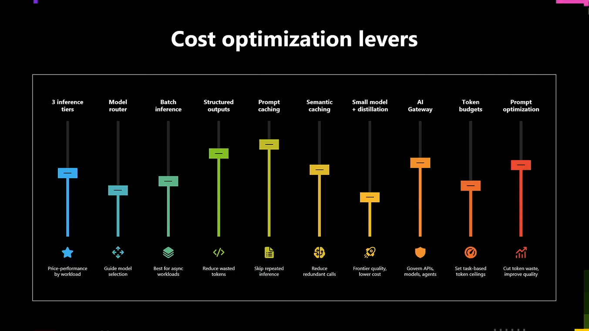
[00:30:20](https://www.youtube.com/watch?v=05naxQpKqaU&t=1820s)

**Transcript (00:30:20-00:31:12):**

**Naomi Moneypenny:** But in practice, it's actually the biggest wins are coming from those system designs. We have a full stack of levers inside of Foundry. And so, I often think about, here, hey, can I do routing by workload? Can I make sure I'm using batch inference? Right? That can save you lots of money as part of what we're doing. You can think about that async jobs. We've got structured outputs here for wasted tokens, caching here to help you avoid those repeated work, and distillation that brings down some of the cost as well. The important point is, for every single one of these levers, those gains compound. So, think about it across that spectrum. You're basically not just doing one magical fix, as much as we would all love that to happen. You basically need an architecture that helps you to take advantage of that and lets you stack all of those optimizations together. So, that brings me into caching. Caching is a big area for all of us.

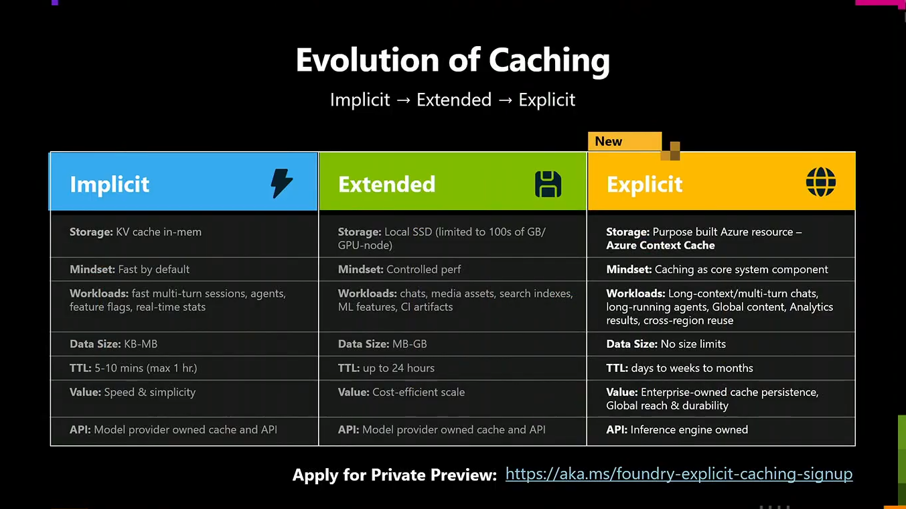
[00:31:12](https://www.youtube.com/watch?v=05naxQpKqaU&t=1872s)

**Transcript (00:31:12-00:32:29):**

**Naomi Moneypenny:** We've been on this journey for implicit caching. We've been into this expanding out, as we think about different areas of caching and how they've been improved over time. And so today, we're really excited to have an optimization that's coming to caching that's new and different. So, caching has really evolved from that low-level optimization. And we want to make sure as part of this, we have explicit prompt caching. Explicit prompt caching is our newest service where we're really looking at core system capabilities into that AI platform. And so, it's not just about here's one lever we can pull, but instead about understanding not just where the request lands, but delivering, where we can, a consistent and guaranteed performance, make sure that you have the savings that you need. Now, the cool thing here, is you have that Azure context cache. And so, this is not owned by us, the inference provider. This is owned by you.

Exciting, right, that you have this context cache. It is your data. You get to look at your deployments and your savings as part of this. And so, you can think about this as really having better privacy controls. It has better operational availability across long-running tasks. And it is available for private preview today. Exciting? Yes? Yes. Cool. [APPLAUSE] Awesome. I love it. So, I'm excited about this one. It's a big piece of this. All right. Let's carry on on our journey. Latency. So, we think about that. It's not just about, again, picking that faster model.

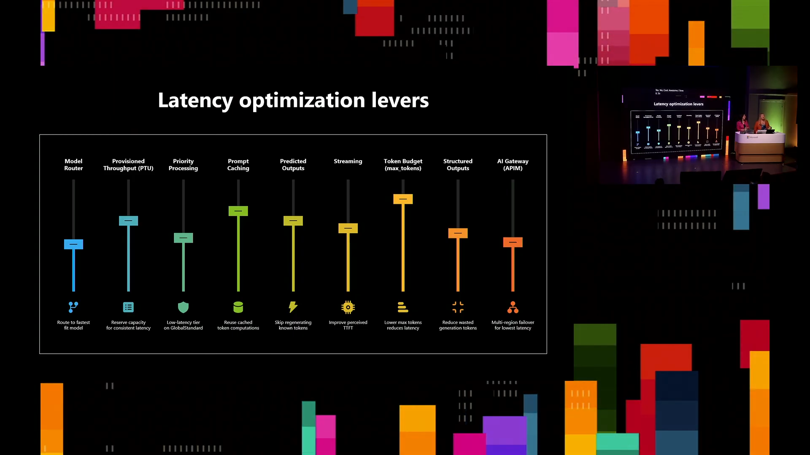
[00:32:29](https://www.youtube.com/watch?v=05naxQpKqaU&t=1949s)

**Transcript (00:32:29-00:33:38):**

**Naomi Moneypenny:** It's actually about how we design a faster system as part of all of this. And so, you can improve the responsiveness here at multiple stages. And so, we want to make sure that you can route each task, essentially, to a faster model. You saw us demo some of that, too. You can think about reserve capacity with things like PTU as part of this, consistency, having that consistency under a large workload. And then, of course, use priority processing where you need that toll road, basically, that helps you quickly with low latency. And so, we want to make sure that you can remove wasted work with prompt caching. We talked about predicted outputs, as well as structured outputs, and tighter token budgets. So, again, for all of those of you on that token budget, the important part here. Streaming, of course, helps us here with making sure that we have perceived speed.

And then, API gateways, as part of this, can help you to optimize that traffic across all of these regions. So, the whole idea here, that whole premise in all of this is to make sure production latency is engineered for. It is not something you just hope and wish for. Really important piece of all of this. All right. Last one. Let's talk about quality. So, quality levers. You've got an idea now. You've got lots of levers. You can pull all these levers, do amazing things inside of your applications.

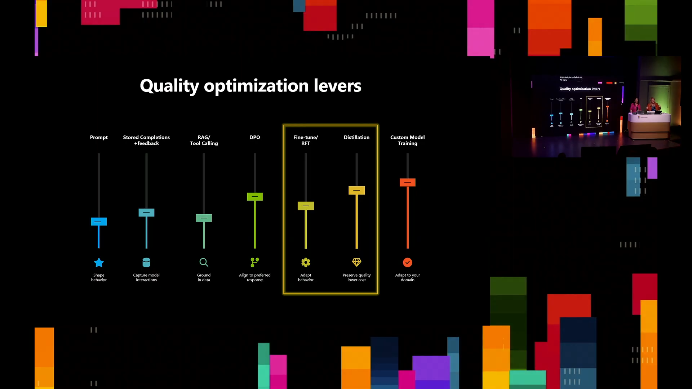
[00:33:38](https://www.youtube.com/watch?v=05naxQpKqaU&t=2018s)

**Transcript (00:33:38-00:34:59):**

**Naomi Moneypenny:** And so, in this case, where quality is our constraint, there's really a progression of levers that you can use. You can think about how we go from lightweight, essentially, to heavyweight on the other side of the slide. So, in this case, prompt design. Number one thing I would share is, always start with prompt design. Make sure that you basically are doing something that's faster and cheapest as you can do. And then you can basically ground that system with the retrieval or tool use other pieces that you need as part of this. If you need to go stronger, then you can go into things like fine-tuning and distillation. We'll talk about those in just a second. And for really highly specialized phases, you could go into your domain and have a custom model training in this case. The key is not to jump to the heaviest solution first. I know it's tempting. Don't do it. Start with the prompt pieces first.

Go all the way to the other end of the spectrum. Use as you need. And, again, incrementally stack all of those benefits.

**Yina Arenas:** And we're going to start with the heaviest. We're going to do the model one.

**Naomi Moneypenny:** Of course.

**Yina Arenas:** But there's a full session on agent optimization that I totally recommend that you go to. We're going to show how you can automatically analyze what is happening with your agent, look at how you can optimize your prompts and how you can optimize your tools. Please also go to that session as well. Okay. So, for the policy itself, what we're going to do is, we're going to use distillation and fine-tuning to improve on that travel policy adherence issue that we saw before.

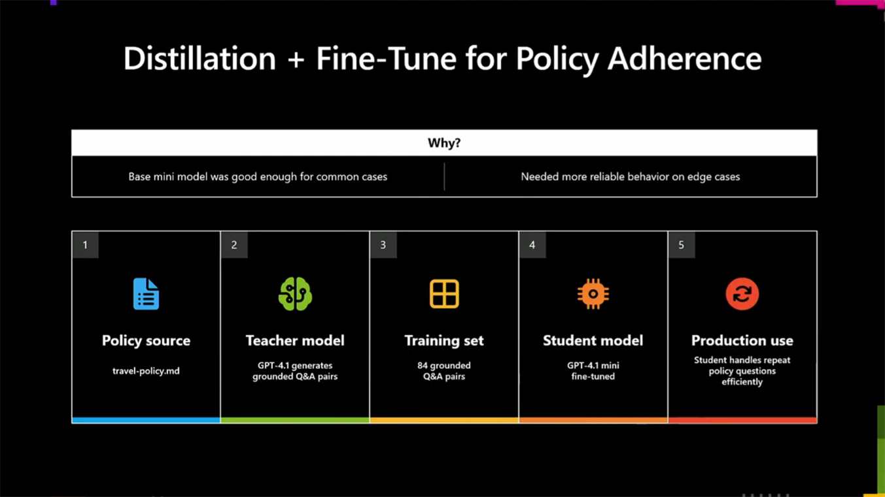
[00:34:59](https://www.youtube.com/watch?v=05naxQpKqaU&t=2099s)

**Transcript (00:34:59-00:35:54):**

**Yina Arenas:** Why we're doing this? Well, because we're going to take this knowledge of the travel policy and we're going to embed it into the model. We're going to use a bigger teacher model and then teach that into a smaller model to make sure that we can maintain the cost optimization that we want to achieve. Let's see that in code. So, first of all, fine-tuning is super simple. For the set of models that we have as part of supervised -- we actually have multiple techniques. We have supervised fine-tuning that are preference optimization. We have RL. We have all of these as part of a managed service within Foundry. It's a few clicks in the UI or a few lines of code in your Python code. Let me just quickly share how that looks like. First, you're selecting your endpoint. Then, you're selecting your data set.

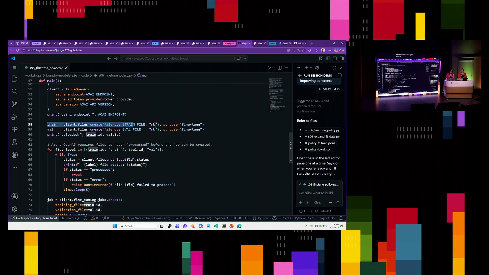
[00:35:54](https://www.youtube.com/watch?v=05naxQpKqaU&t=2154s)

**Transcript (00:35:54-00:36:50):**

**Yina Arenas:** Then, you're also looking at what is the set of models, what is your base model, what is your training model. And then, within less than 100 lines of code, you have the job ready to submit for a training run. Once you do that, so what we did here is, we did the training run, and then we went in and did full deployment of that into a developer tier. Developer tier is a way into which you can try multiple models that you are fine-tuning, deploy them in. It's super cheap to run. And then, you can test them against your particular data. In this particular case, we see these are the two prior runs that we've done. And then, with the fine-tuned model in a 1.2 GPT-4.1 Nano, we got all the way up into the quality that we wanted for that particular scenario. So, in a very simple fine-tuning run, we got to the quality that we wanted, and the output that we wanted, on that particular set.

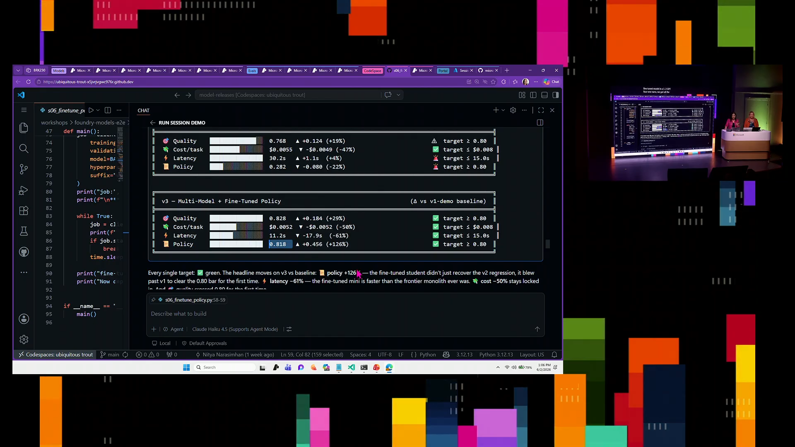
[00:36:50](https://www.youtube.com/watch?v=05naxQpKqaU&t=2210s)

**Transcript (00:36:50-00:37:01):**

**Yina Arenas:** We can also see this is the fine-tuning experience, here in Foundry, where we can see the loss curve and the token accuracy that we got from that particular run.

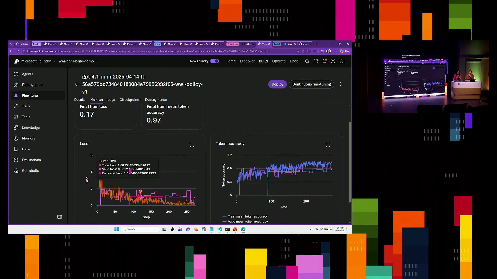
[00:37:01](https://www.youtube.com/watch?v=05naxQpKqaU&t=2221s)

**Transcript (00:37:01-00:37:21):**

**Yina Arenas:** And then, we can continuously fine-tune, basically, as we get new sets of trajectories coming in, the model will continuously tune. And then, we can see all of the different checkpoints, and look at the checkpoints, and bring in checkpoints as well. Okay. Let's go back to the specific set of -- this is where we are in terms of the optimization of the scenario.

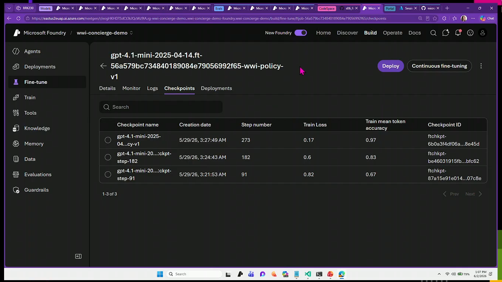
[00:37:21](https://www.youtube.com/watch?v=05naxQpKqaU&t=2241s)

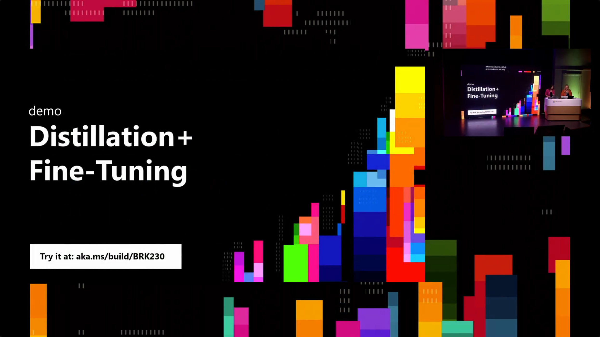
[00:37:24](https://www.youtube.com/watch?v=05naxQpKqaU&t=2244s)

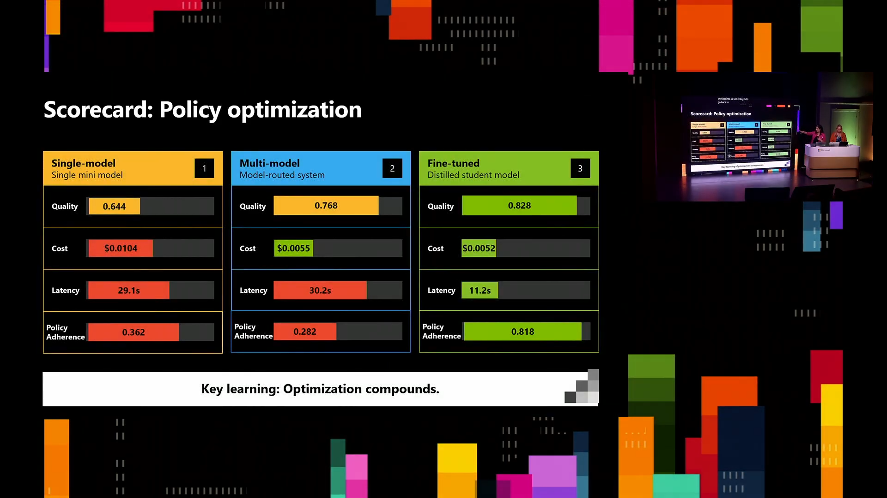
[00:37:30](https://www.youtube.com/watch?v=05naxQpKqaU&t=2250s)

**Transcript (00:37:30-00:37:46):**

**Yina Arenas:** But in terms of Foundry, I mentioned, we have multiple ways into which you can post-train models. There's managed fine-tuning, which is what I showed just now, which is the simplest way to do it. You bring your data, and Foundry handles everything that there is, the data preparation, the training, the monitoring, the deployment.

Multiple tiers of training in Foundry:

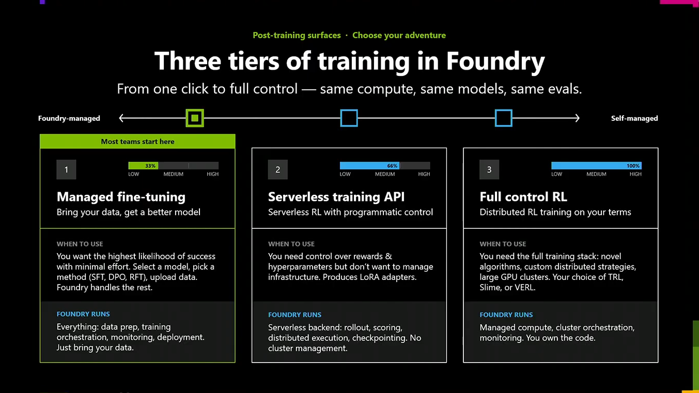
[00:37:46](https://www.youtube.com/watch?v=05naxQpKqaU&t=2266s)

**Transcript (00:37:46-00:39:19):**

**Yina Arenas:** It has the highest likelihood of success if you are not a machine-learning professional or a data scientist that has done ML in the past. And it's very low-effort. You can pick whether you want to do supervised fine-tuning, direct reference optimization, or reinforced fine-tuning. We also have serverless API. Oh. Oops. We also have a serverless API that we're launching here as part of Build, where you can have control of your rewards, and the hyper parameters, and Foundry handles the infrastructure. It produces a set of lower weights, where, then, we overlay on top of the set of deployments that we have. There's no cluster management that you have to do. And finally, we also offer full-control RL, where you can have full ownership of the code, the distributed strategies that you're using, the algorithms that you're bringing, what type of GPU clusters you're using. And then, Foundry manages for you the compute and the orchestration.

And you can use frameworks like Slime or VERL in order to do the training. Of course, my recommendation is that you start at the simplest one, see what you get, because, again, you have the evaluations. This is the importance of defining your success criteria. And then, move towards the right as your scenario demands. Once you have your customized model, then you can bring it in Foundry and run it. If it is an open-source model, we have Foundry-managed compute and the partnership that we announced in GA today with Fireworks.

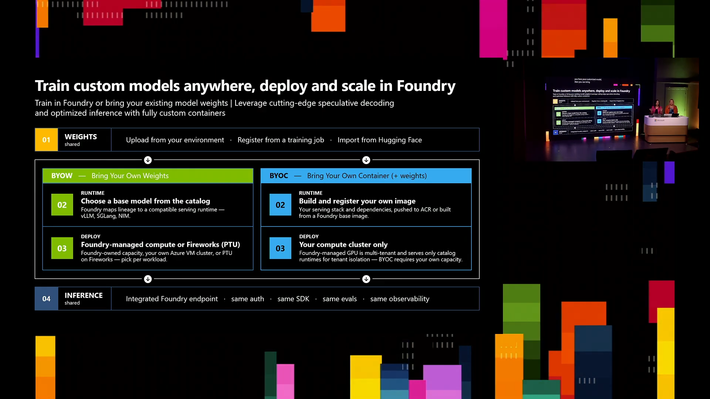
[00:39:19](https://www.youtube.com/watch?v=05naxQpKqaU&t=2359s)

**Transcript (00:39:19-00:39:29):**

**Yina Arenas:** Or you can deploy it on your own compute clusters. Speaking of Fireworks, we are announcing the general availability, and that what it brings to customers is zero-day access to optimize frontier models, the best-in-class inferencing performance, and making sure that it has that native integration into Azure for that enterprise foundation.

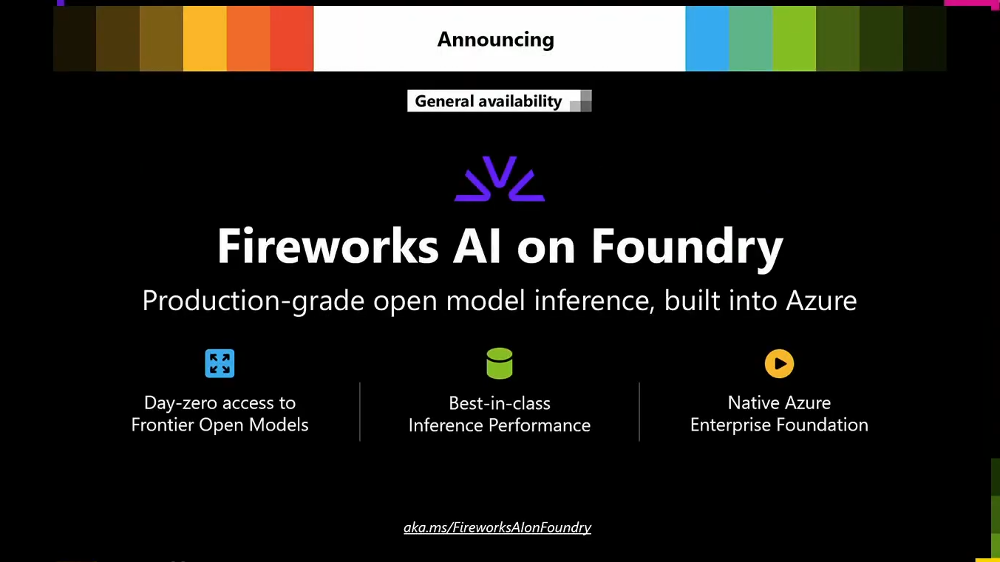
[00:39:29](https://www.youtube.com/watch?v=05naxQpKqaU&t=2369s)

**Transcript (00:39:29-00:40:06):**

**Yina Arenas:** So, that's the key differentiation when it comes to leveraging Fireworks directly, versus leveraging Fireworks on Foundry, which means that it deeply integrates across all of the enterprise stack that we offer. We also have Managed Compute in Microsoft Foundry, which basically is for teams that are standardizing on open models and making sure that they want to have a broad model selection.

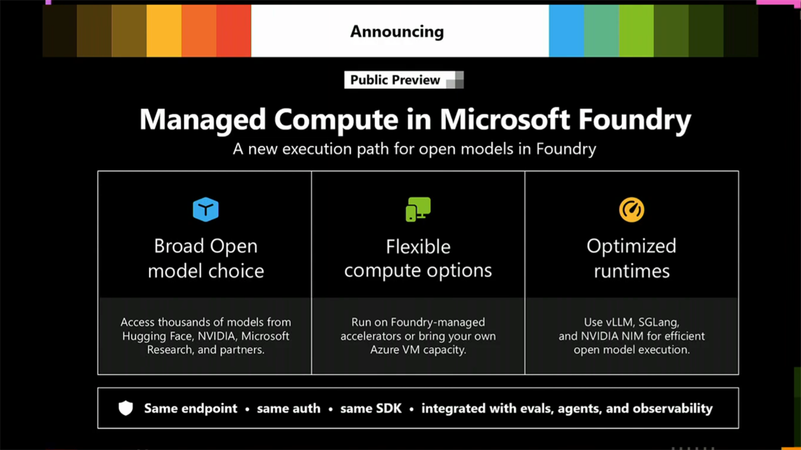
[00:40:06](https://www.youtube.com/watch?v=05naxQpKqaU&t=2406s)

**Transcript (00:40:06-00:40:51):**

**Yina Arenas:** This is where our partnership with Hugging Face shines in, all of the different sets of models that we are coming in from, thousands of models that are coming in from Hugging Face, from NVIDIA, from Microsoft Research. Then you can use optimized runtimes like vLLM, SGLang, then NVIDIA NIM's runtime as well for efficient execution, and then, have all of the flexibility on compute, where Foundry manages the accelerators. And you can bring your own capacity to have this seamlessly integrated across the stack. It uses the same auth. It uses the same API endpoints. It uses the same SDK. And then, you don't have to manage all of that separately.

**Naomi Moneypenny:** All right. We can talk about operations a little bit more.

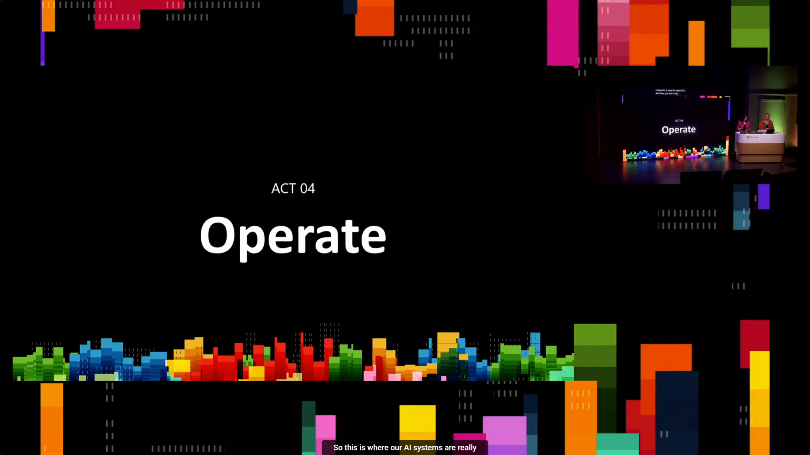
[00:40:51](https://www.youtube.com/watch?v=05naxQpKqaU&t=2451s)

**Transcript (00:40:51-00:41:11):**

**Naomi Moneypenny:** So, this is where our AI systems are really looking like production systems. And so, once you have selection, evaluation, and optimization done, the next challenge is really making sure that we are operating that system with discipline. So, that really means observability. And so, I won't show too much of a demo here. It's in there. It's available for you in the Foundry portal with lots of goodness. But really, when you're taking something from prototype into production, really, that observability piece is critical to what you're doing.

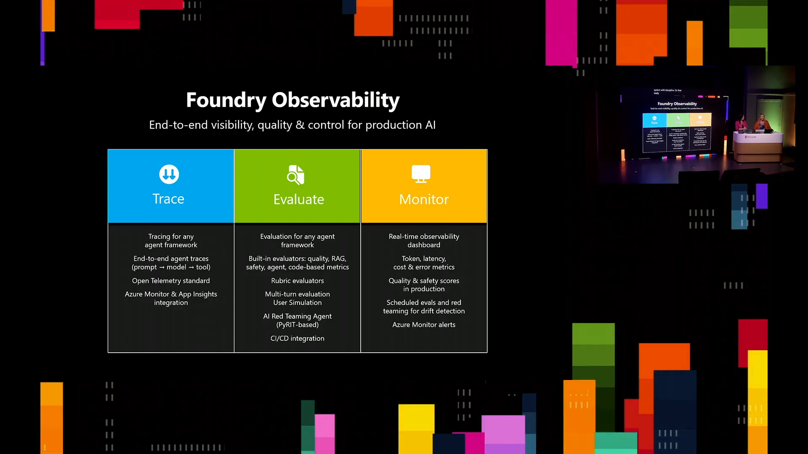
[00:41:11](https://www.youtube.com/watch?v=05naxQpKqaU&t=2471s)

**Transcript (00:41:11-00:41:58):**

**Naomi Moneypenny:** And so, we want to make sure we understand not just what our AI system is actually outputting here, but ensuring, essentially, as part of this, we are tracing, we're evaluating, and monitoring. And so tracing lets you see that end-to-end visibility across prompts. We also make sure that tracing is giving you that information that you need for tools. Evaluation, of course, lets us understand quality and safety and agent behavior. And then monitoring, of course, is with Azure Monitor. You can see that brings in the real-time signals that you need for cost and latency and all of those pieces. So, if you want to make sure your AI system is really great, we want to think about this from a confidence perspective, really think about building observability into your loop straight away. Now, we have a great demo that's part of this, too.

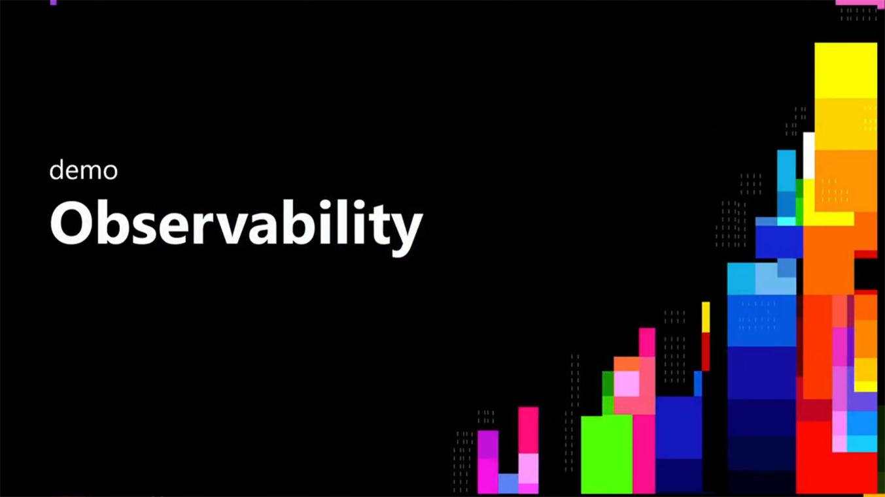
[00:41:58](https://www.youtube.com/watch?v=05naxQpKqaU&t=2518s)

**Transcript (00:41:58-00:42:05):**

**Naomi Moneypenny:** We won't go through this too much. But just to show you what this looks like very quickly on the Foundry portal. You can see these directly in here.

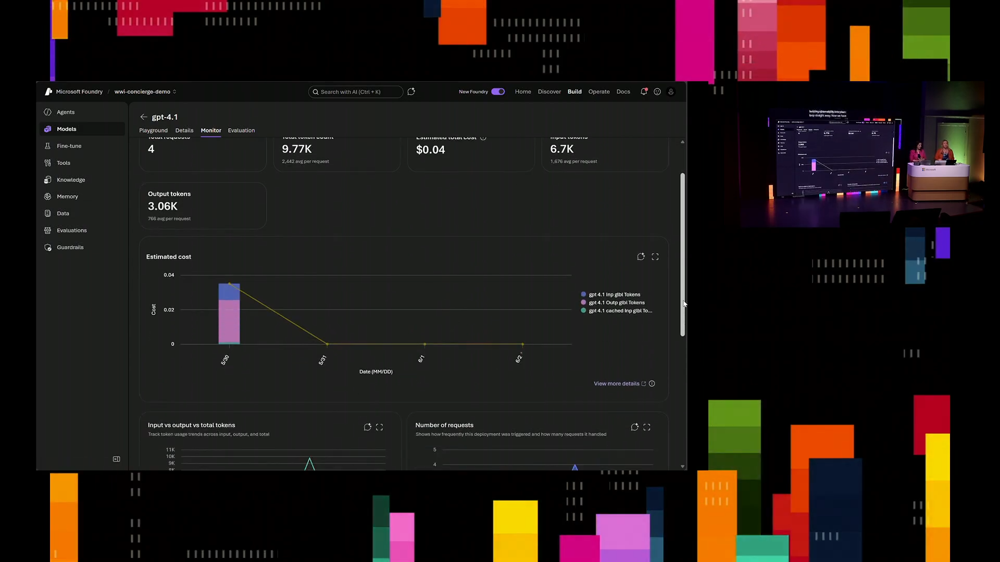
[00:42:05](https://www.youtube.com/watch?v=05naxQpKqaU&t=2525s)

**Transcript (00:42:05-00:42:19):**

**Naomi Moneypenny:** You can see the different areas. And in this case, I'm picking on the time to the last byte. And I'm actually going to ask Copilot directly in here, how do I improve this? And it actually shows it to me directly in here. So, just a really great way of being able to check out all of these different capabilities and having Copilot assistance directly in here, too.

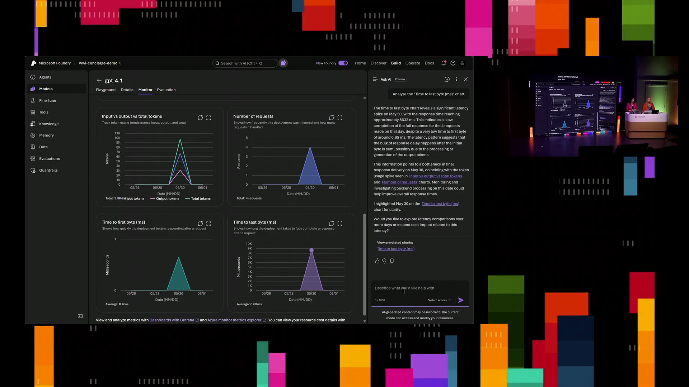
[00:42:19](https://www.youtube.com/watch?v=05naxQpKqaU&t=2539s)

**Transcript (00:42:19-00:42:23):**

**Naomi Moneypenny:** All right.

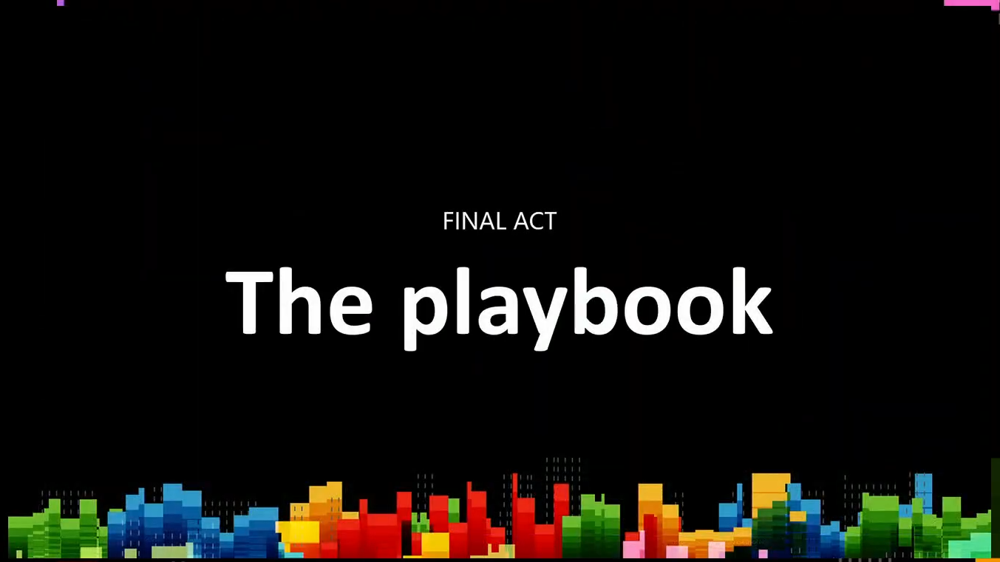
[00:42:23](https://www.youtube.com/watch?v=05naxQpKqaU&t=2543s)

**Transcript (00:42:23-00:42:24):**

**Naomi Moneypenny:** Take us home.

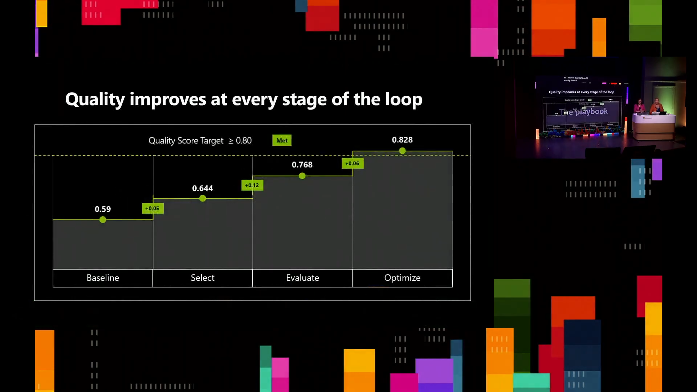
[00:42:24](https://www.youtube.com/watch?v=05naxQpKqaU&t=2544s)

**Transcript (00:42:24-00:43:12):**

**Yina Arenas:** Yeah. So, multiple steps, multiple levers. Throughout the session, we showed an end-to-end scenario and what are the set of things that you can do to improve in quality. So, at every step, this is the notion of hill climbing that you saw us talk about in the keynote today, the quality improving over time. But the key sort of thing and, again, the key takeaway is, start with your evals, the definition of success. How do you define that success criteria? Foundry helps you along the way with the new capabilities that we have, where you can bring in your code, bring in your prompt, or have Foundry help you build up those rubrics using, now, the new set of rubric-based evals capabilities. So, at the end of the day, make sure that you're building the system, not just the prompt.

Key lesson takeaway - start from eval.

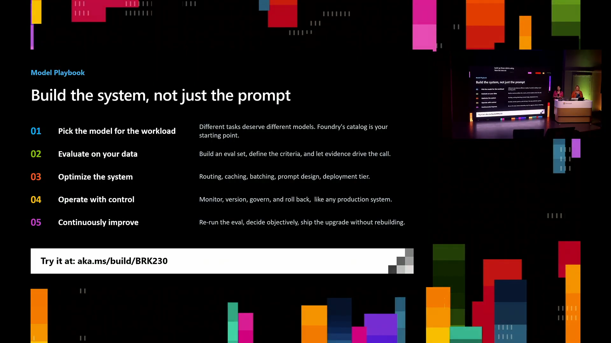
[00:43:12](https://www.youtube.com/watch?v=05naxQpKqaU&t=2592s)

**Transcript (00:43:12-00:44:24):**

**Yina Arenas:** Long gone are the days of just prompt engineering. You need to make sure that you're picking up the best model for the workload. Decompose the set of scenarios that you have. Think about old-school microservices architecture when you're building your solutions. Evaluate on your particular scenario. Think about all of the different sets of optimization capabilities that you have across quality, latency, and cost. And then, understanding that understanding of your scenario, as I mentioned before, becomes your IP that, then, you can further optimize on. You need to operate with control. Make sure that monitoring, versioning, governing, being able to roll back, fully integrate into your CI/CD pipeline. All of those different pieces, we enable and support as part of Foundry, with the integration that we have with GitHub.

And then, as we showed during the session, continuously improve, so that you can actually build not only solutions that meet the goal, but that continuously meet that goal over time as everything else changes around you.

**Naomi Moneypenny:** All right. So, if we step back, this is your value proposition on Foundry. Of course, we think about this.

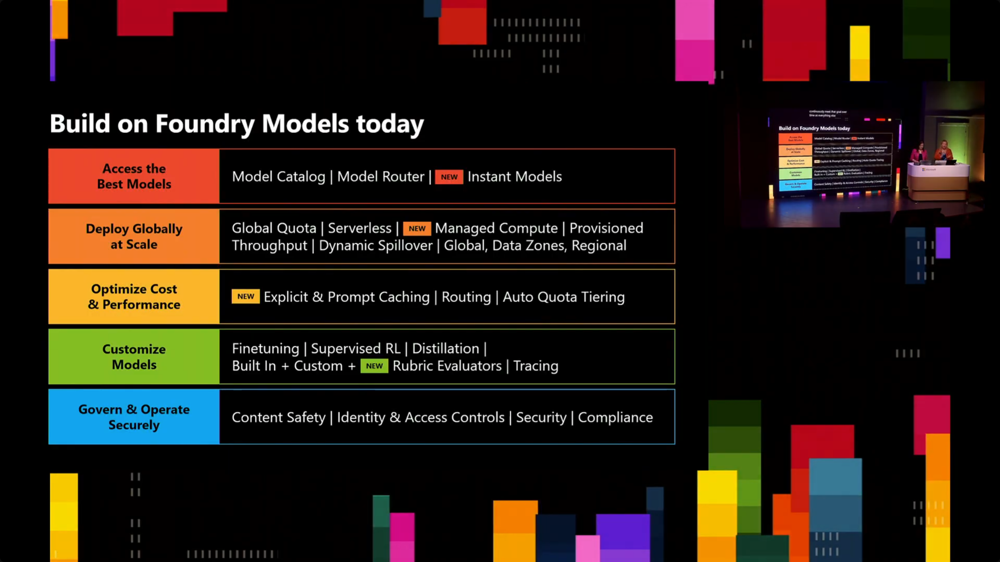
[00:44:24](https://www.youtube.com/watch?v=05naxQpKqaU&t=2664s)

**Transcript (00:44:24-00:45:00):**

**Naomi Moneypenny:** We're basically having a great way to select the model to start off with. You can think about how you scale that model as part of this. You can then optimize it, take it out globally, think about how you think about changes and demand over time. How do I iterate across this entire process? And then, of course, keep control, security, compliance, operations all the way through. It's not about model choice. This is about the entire platform value that we're delivering as part of Foundry, and really having that way to build smarter systems as models and costs keep evolving. So, what else should we learn?

**Yina Arenas:** Well, there's a lot of other sessions that we have at the conference for you to take a look.

Microsoft Foundry Session Guide:

[00:45:00](https://www.youtube.com/watch?v=05naxQpKqaU&t=2700s)

**Transcript (00:45:00-00:45:51):**

**Yina Arenas:** Please join or watch the recordings. This is part of the end-to-end set of solutions that Foundry offers. We talked about, in this session, more about models, but there's other sessions that are going to go deeper into post training, deeper into agentic solutions, deeper into safety and responsible AI as well. And we're here to help you along the way. Please connect with us. Start building with Foundry; ai.azure.com is the one thing that you need to remember. The session code where you can find the link, where you can find all of the codes that we shared as well. And then, we have a very active Discord community. Please join us there. And thank you for joining us today. We appreciate that you're all here. And I hope that you had a great time learning with us how to continue to improve your AI systems.

**Naomi Moneypenny:** Thank you, folks. [Applause]
