## Table of Contents

- [Session Introduction by Neta Haiby](#session-introduction-by-neta-haiby)
- [Integration with Microsoft Security Ecosystem and Third-Party Agents](#integration-with-microsoft-security-ecosystem-and-third-party-agents)
- [Terminology - Agent Blueprint and Agent Identity](#terminology-agent-blueprint-and-agent-identity)
- [Demo: Your Agent in Action with Agent 365 SDK](#demo-your-agent-in-action-with-agent-365-sdk)
- [Demo: Unified activity monitoring and agent performance metrics](#demo-unified-activity-monitoring-and-agent-performance-metrics)
- [Demo: Agent Map View](#demo-agent-map-view)
- [Demo: Connected Agents View](#demo-connected-agents-view)
- [Demo: Agents with Risks](#demo-agents-with-risks)
- [Demo: Agents without Owners](#demo-agents-without-owners)
- [Demo: Agent Management Rules](#demo-agent-management-rules)
- [Demo: Policy Templates](#demo-policy-templates)
- [Demo: Apply Policy Template while Publishing Agents](#demo-apply-policy-template-while-publishing-agents)
- [Demo: Registry Sync Demonstration with Third-Party Platforms](#demo-registry-sync-demonstration-with-third-party-platforms)
- [Demo: Shadow Agents](#demo-shadow-agents)
- [Early Adopters](#early-adopters)
- [Genspark Integration with Agent 365: Architecture and Security](#genspark-integration-with-agent-365-architecture-and-security)

## Session Introduction by Neta Haiby

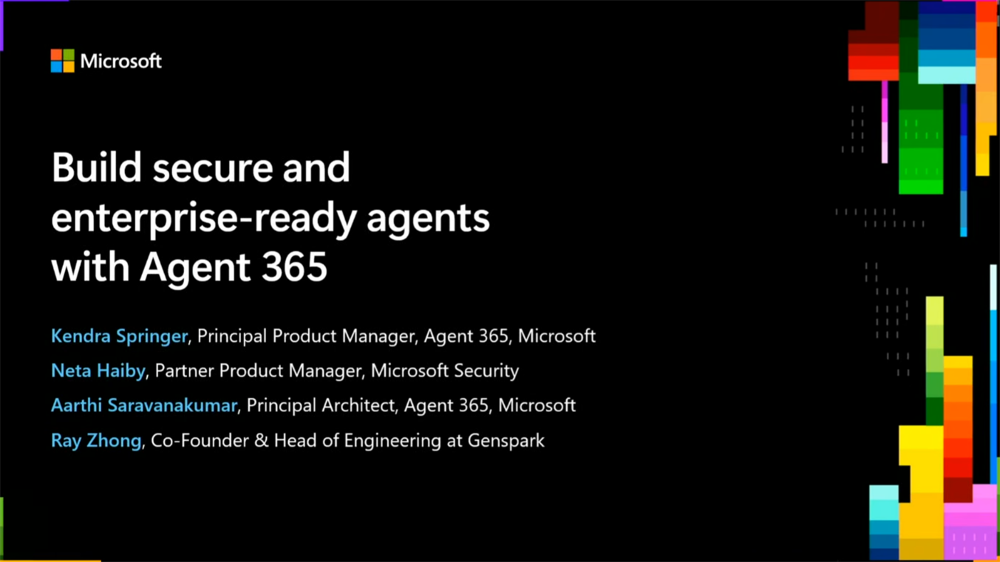
[00:00:11](https://www.youtube.com/watch?v=S8OtcBnfeGU&t=11s)

Hello, everybody. Thank you for joining our session. I'm Neta. I recommend you put your headphones on because it's going to be much easier to hear us with the headphones. So please put your headphones on. So I'm Neta. Together with me are a set of speakers, and we're going to together show you how you can build secure and enterprise-ready agents with Agent 365. So before we get started, raise your hand if you are building agents today or using agents today in your organization. Okay. Look around, I think it's everybody, almost everybody. Now, raise your hand if you think your agents are enterprise-ready, observed, secure, and governed. Okay, I have one. Okay, great, so you're in the right place, because today here we're going to learn how you can build enterprise-ready, secure, and governed agents with Agent 365. So let's get started. We saw that agents are here.

Almost all of us raised our hands. All of us are using agents in our organizations. And IDC predicts that by 2028 there will be 1.3 billion agents in organizations. That's a huge number, more than most of countries in the world.

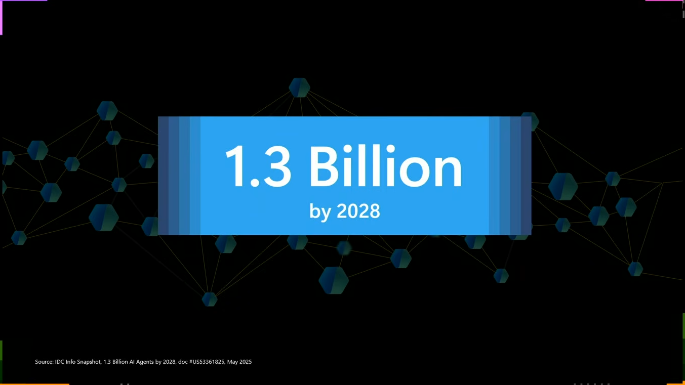
[00:01:04](https://www.youtube.com/watch?v=S8OtcBnfeGU&t=64s)

And there are different types of agents that we talk about. One are the SaaS agents. Those are agents that are prebuilt, they come built in the application, they come prebuilt on webs, that we kind of start using and using in the organization.

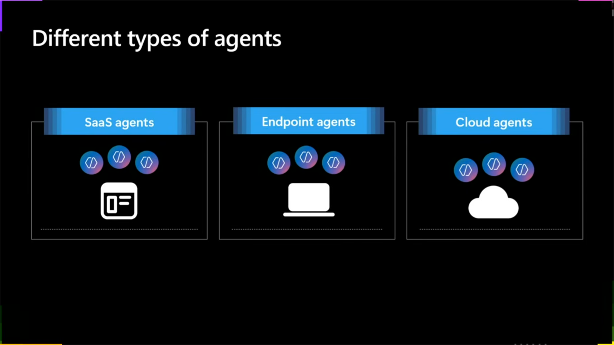
[00:01:12](https://www.youtube.com/watch?v=S8OtcBnfeGU&t=72s)

Then there's the endpoint agents that we are building. These can be the OpenClaw agents, these could be agents building with CLI and other agents. And we have the cloud agent. These are the agents that we are building on different clouds, on different platforms, and different frameworks. But the questions that come are, "Can our organization discover all these agents, can they manage them, are they behaving properly, is my agent behaving based on the intent that I wanted it to do, is it breaking with the intent, is it misusing the tools I connected to it, is it oversharing data or leaking data, and can it be governed and audited at the end of the day?"

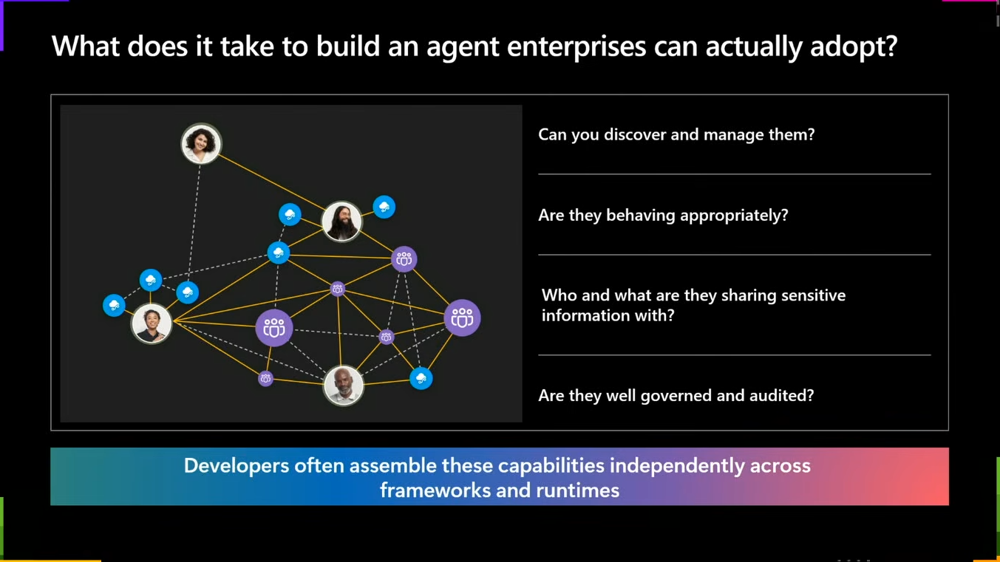
[00:01:39](https://www.youtube.com/watch?v=S8OtcBnfeGU&t=99s)

And usually as developers, stuff like that, we take different frameworks and different products to make that happen. And we want our agents, first of all, to be able to be observable, so to be registered in an inventory and registry and to be observable.

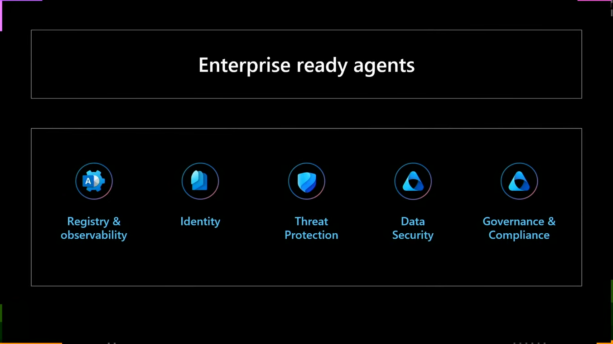
[00:02:02](https://www.youtube.com/watch?v=S8OtcBnfeGU&t=122s)

We want it to have an identity. We want to be able to identify that this action was made by this agent. We want it to have threat protection. There's a lot of new generative AI risks coming in, like prompt injection, intent breaking, tools misuse. We want it to have threat protection. We want it to have data security, not to over leak data or overshare data. And we want it to be in governance and in compliance. And for that, that's where Agent 365 comes in.

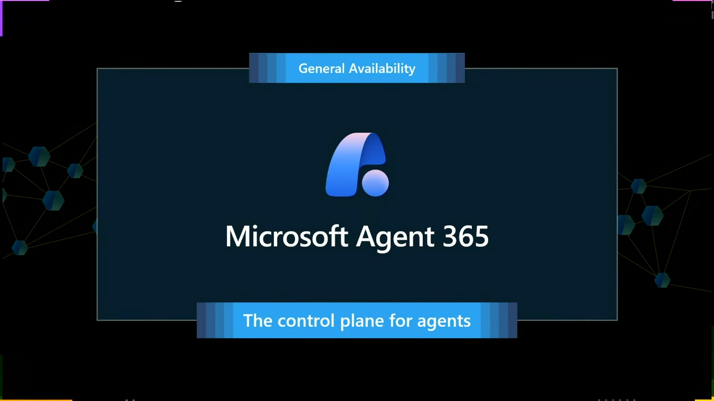
[00:02:31](https://www.youtube.com/watch?v=S8OtcBnfeGU&t=151s)

**Neta Haiby:** It's the control point for any agent that you're building, any agent in the organization. And I'd like to invite Kendra to share with us more about Agent 365. Thank you, Kendra.

**Kendra Springer:** Thank you so much, Neta. Hi, everyone, thank you so much for being here with us. We are going to take you through over the next few slides why you need Agent 365. What is the value that you're going to get?

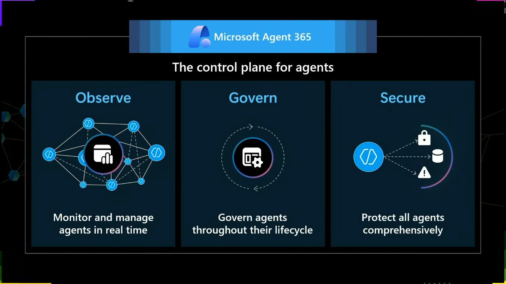
[00:02:55](https://www.youtube.com/watch?v=S8OtcBnfeGU&t=175s)

And the big thing here, if you leave here with nothing, understand this, Agent 365 provides all of the capabilities we're going to go through, not only for Microsoft Agents **but also for third-party custom external agents** as well. 

And from this slide you can see we've broken down the value of agents into these three key pillars that we think align to the core jobs to be done when it comes to managing and governing your agents at scale. 

The first is **OBSERVE**. Because very simply, you cannot govern what you cannot see. You also cannot trust and feel confident that you're adequately protected if you don't know what agents are out there.

So all of the features that we have available that allow you to not only see all of your agents across all of your different platforms, but also understand really important adoption trends, usage trends, trends for what platforms your agents are built on, and so much more, in addition to actions that you need to take to successfully mitigate and keep your agent ecosystem safe. 

Then we have **GOVERN**. Now, "govern" can be a scary word for some, depending on your audience, right? Now, I want to assure you here, when we say, "Governance," this is not intended to put the brakes on innovation, put the brakes on agent adoption. This is intended to actually speed up the pace of adoption and speed up the pace of innovation.

Because governance is all about **implementing guardrails** so that you know no matter how your agent is built, no matter who built that agent, there are the **proper protections** in place every single time for the agent based on its risk factor. 

And then with **SECURITY**, just like you would secure any other employee in your organization, any other data, asset, app, you name it, right, across your tenant, you need to adequately secure your agents as well.

And so with Defender, and Purview, and Entra, you have all the tools that you need to be sufficiently protected, not only to block these threats in real time, but take it a step further, do things like deep hunting and investigation to understand what caused these risks, to see full logs inside of Purview so you know every single step that that agent took when that incident occurred, and taking it a step even further, being able to identify other agents in your ecosystem that have similar vulnerabilities so that you can mitigate those agents before incidents occur. 

Now, again, I want to do a little quiz. Raise your hand, does Microsoft Agent 365 support all agents? Raise your hand if the answer is yes. Excellent, about 50% of you are listening. Okay, for those of you that didn't raise your hand, keep listening, we're going to keep ingraining that one.

But how do we do this, how do we enable these agents that are not built outside of Microsoft?

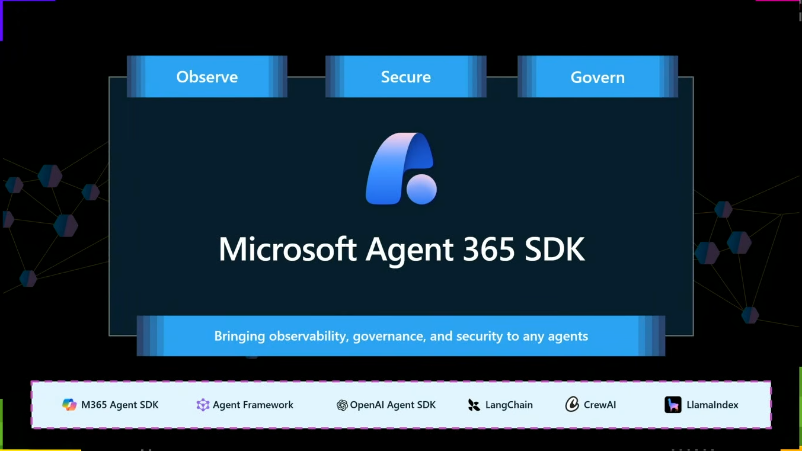
[00:06:09](https://www.youtube.com/watch?v=S8OtcBnfeGU&t=369s)

The key here is our Agent 365 SDK. Now, this SDK is not an agent-building SDK, it is not going to host your agent. It's purely an SDK to wrap your agent and make it discoverable within Agent 365. You can provide an agent ID to your agent, you can enable full observability, you can enable full security policies to be applied to those agents, and you could take advantage of our productivity capabilities through our tools gateway.

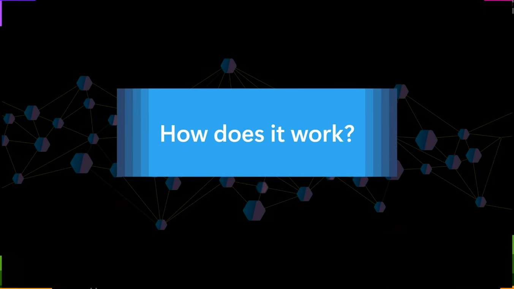
[00:06:47](https://www.youtube.com/watch?v=S8OtcBnfeGU&t=407s)

But how does this work, how are we able to not only cover Microsoft agents, but also these third-party agents and common prebuilt agents that we know you are all using from different providers? So very simply it starts at the bottom.

## Integration with Microsoft Security Ecosystem and Third-Party Agents

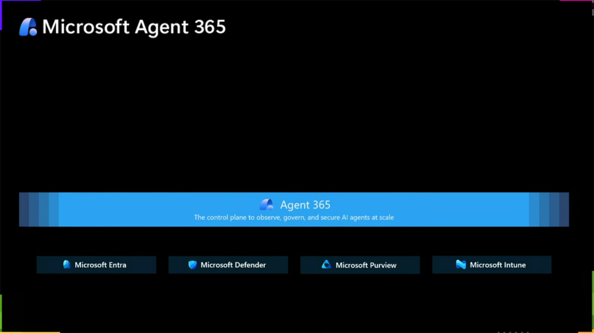
[00:07:03](https://www.youtube.com/watch?v=S8OtcBnfeGU&t=423s)

Foundationally Agent 365 is that end-to-end governance platform that allows you to scale and operationalize your agent governance and management processes, right? But if you think about Agent 365 as the stool, the legs of the stool that hold Agent 365 up are those trusted security solutions at an enterprise level, Microsoft Entra for identity management, Defender for risk assessment and real-time threat detection and blocking, as well as Purview for data governance, and then Microsoft Intune for shadow AI detection. Now, again, we have a plethora of agent solutions available to you, both across Microsoft from all of our different agent-building platforms to the prebuilt agents like Cowork or Researcher.

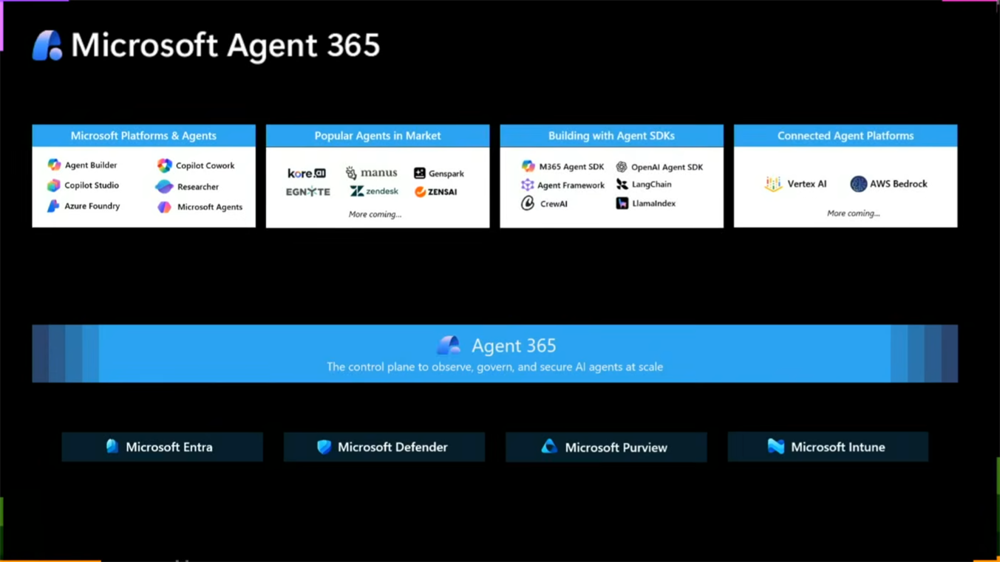
[00:07:46](https://www.youtube.com/watch?v=S8OtcBnfeGU&t=466s)

We also have common really valuable agent solutions that we know that you all are leveraging from third-party providers, right? We know our customers have a very heterogenous mix of agents that you're leveraging. We also know that where you can't find a solution immediately, you're building your own custom agents on the platforms of your choice across different clouds and across different solutions, like LangChain agents, you're building on AWS, Gemini, et cetera. And then lastly, we know that there are really common platforms that it would be great to be able to automate and ingest the agents across these platforms. So lots of agents we need to cover with Agent 365. And we are able to do that. So within Microsoft all of the agents built on Microsoft have a native experience inside of Agent 365.

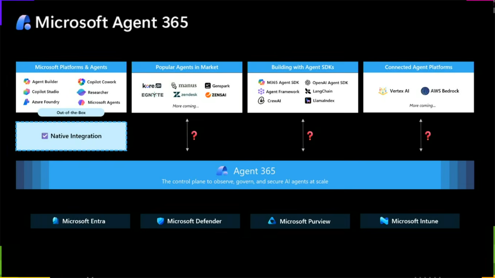
[00:08:51](https://www.youtube.com/watch?v=S8OtcBnfeGU&t=531s)

So right out of the box you're going to see every single agent, whether it's in a draft state or it's fully produced in the production, and whether changes are occurring real time. Right, you're going to have access to all of that data, all of that observability data, you're going to be able to apply those policy templates, those security guardrails, you're going to be able to take action, right, all of those pieces with no additional effort. You're going to be able to do the same for some of our third-party partner agent solutions as well.

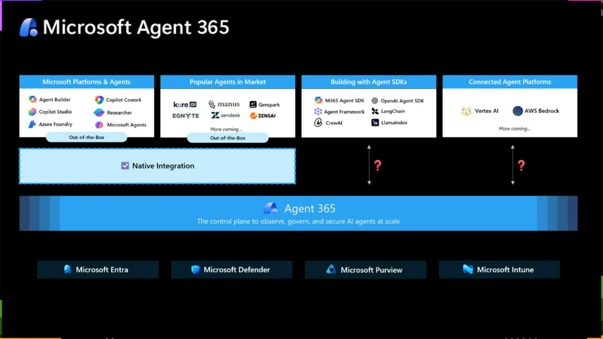
[00:09:24](https://www.youtube.com/watch?v=S8OtcBnfeGU&t=564s)

We are building an agent ecosystem with these partners to proactively extend our SDK and enable an agent ID within those agents, and enable that observability capabilities, and much more. And you're going to hear from one of such of our partners at the end of this session as well. Now, for those custom agents, right, the agents that you are building on LangChain, as I mentioned, you're leveraging another SDK, right, you're leveraging an AWS cloud solution, you can onboard these agents within Agent 365 with the SDK that I mentioned earlier.

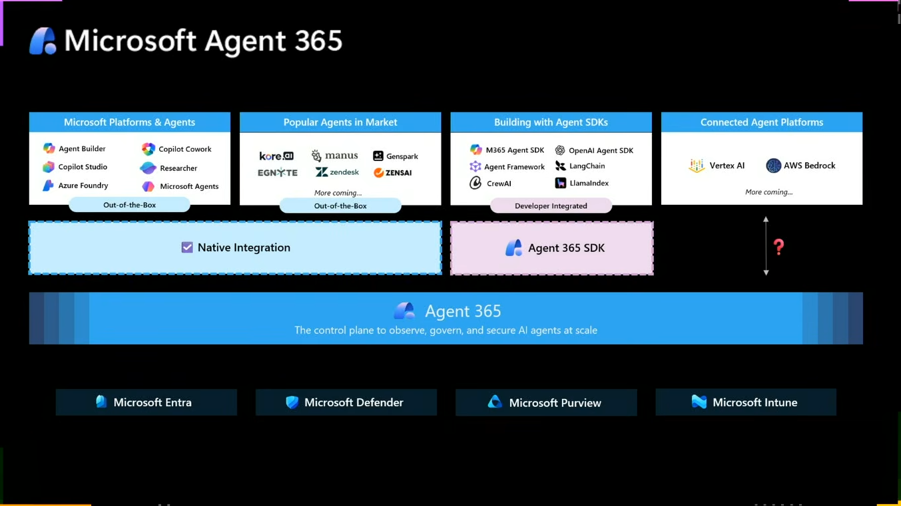
[00:09:52](https://www.youtube.com/watch?v=S8OtcBnfeGU&t=592s)

And with this SDK, you're going to get things like identity, observability, tools, messaging, threat protection, governance, as well as data security.

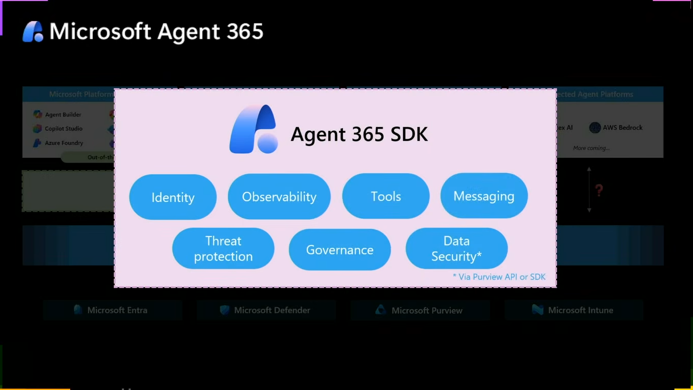
[00:10:11](https://www.youtube.com/watch?v=S8OtcBnfeGU&t=611s)

So it is a comprehensive SDK that gives you everything you need, but also the flexibility to onboard only to what you want. And then this last piece here within our Connected Agent platforms you're able to do this through a feature called "registry sync," which I will take you through in the demo.

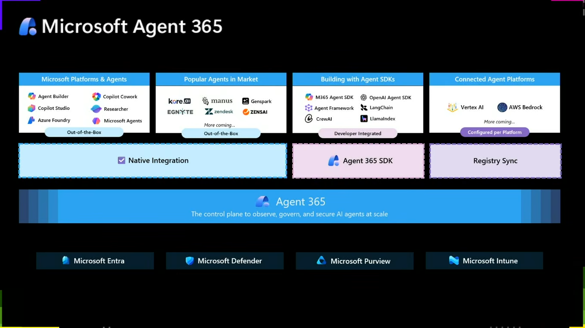
[00:10:35](https://www.youtube.com/watch?v=S8OtcBnfeGU&t=635s)

Registry sync essentially allows us to take your permissions, your credentials across these platforms, like Amazon Bedrock and Google Vertex AI, and ingest those agents into the registry, but only for visibility purposes, and then any governance capabilities or permissions that you have across these platforms, you will also have those capabilities inside of Agent 365 as well.

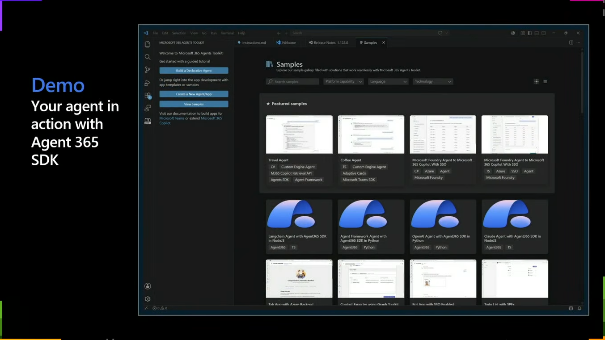
[00:11:07](https://www.youtube.com/watch?v=S8OtcBnfeGU&t=667s)

And I know as much as you guys really love slides, I'm going to have to bore you with a really incredible demo. But before we get to that demo, I do want to give you some terms that are new terms, but really fundamental for your understanding and setting you up for success, right?

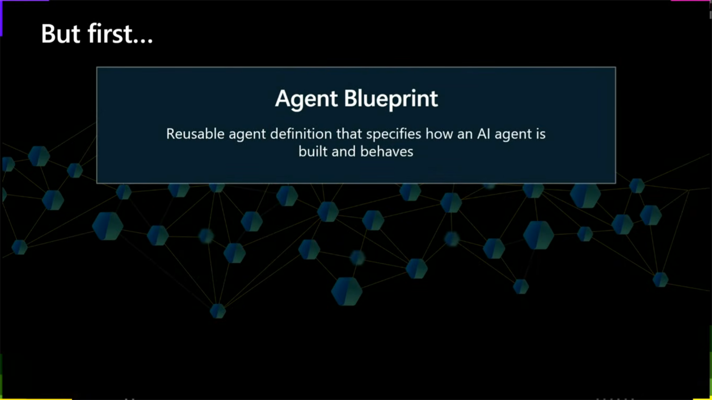
[00:11:19](https://www.youtube.com/watch?v=S8OtcBnfeGU&t=679s)

So the first terms is an "agent blueprint". Now, the best way to think about an agent blueprint is a reusable instruction for an agent that lets it know what tools, what data it can leverage, what rules and what guardrails are in place. Think about this similar to an agent recipe, right, that other agents and agent identities can be created from. Now, an agent identity is simply taking an agent identity and upleveling it from a service principal identity so that it is more in line with a user identity level.

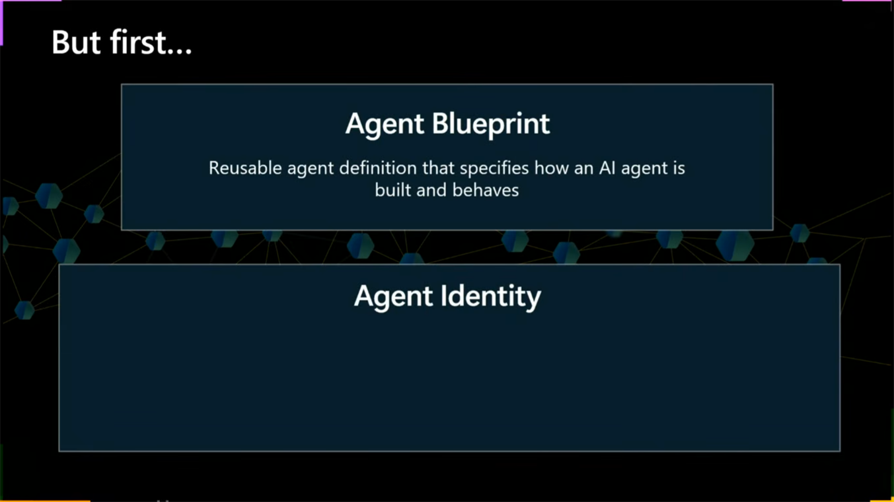
[00:11:55](https://www.youtube.com/watch?v=S8OtcBnfeGU&t=715s)

Right, because agents are unique, they are essentially apps, they're built like apps. But the caveat here is they function like users. So you need to have an identity that is appropriate for their function within your ecosystem, and Agent Identity is specifically created to support agents in this. Now, these agent identities can be authenticated in two different ways, right?

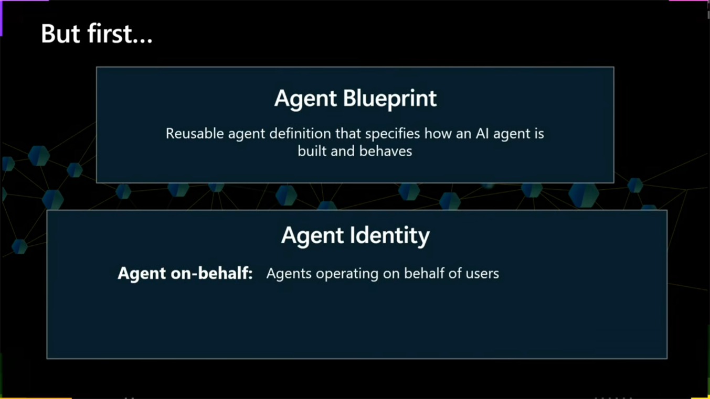
[00:12:28](https://www.youtube.com/watch?v=S8OtcBnfeGU&t=748s)

We have agents that work on behalf of the users, so essentially when a user invokes that agent, that agent assumes that user's credentials, passes that credential as the off token and the appropriate permissions of that user as well, right, when it comes to information retrieval or task completion. But we also have another way that agents can maintain their identity, and that's by leveraging their own user identity, right, an agent user identity.

## Terminology - Agent Blueprint and Agent Identity

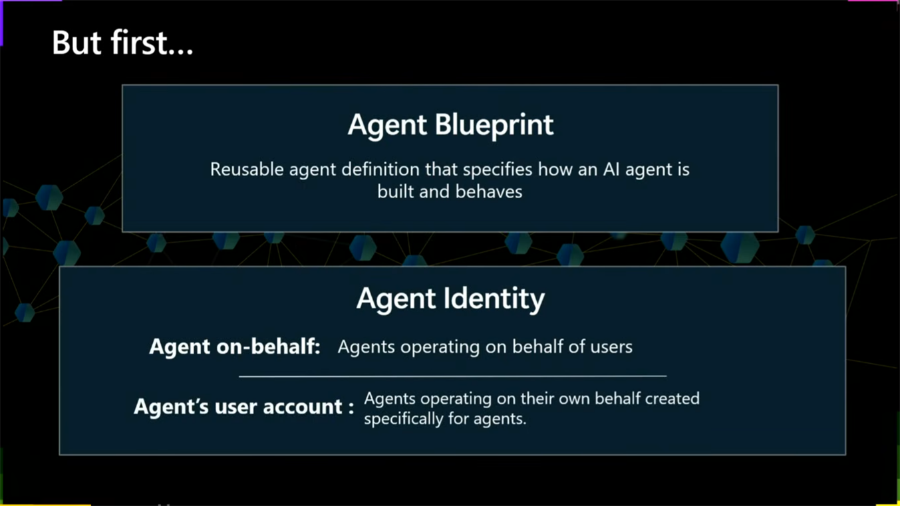
[00:12:52](https://www.youtube.com/watch?v=S8OtcBnfeGU&t=772s)

**Kendra Springer:** What happens here is that agent maintains their own identity and their own permissions, and they pass that identity for authentication, and they're able to function on their own without working on behalf of a user, if that makes sense. Okay, with those two terms in your back pocket, we will now get to the demo. Aarthi, I would love to invite you onstage to take us through an incredible demo where we're going to take you end- -to-end to see your agent in action, onboard an agent with our SDK, and more.

**Aarthi Saravanakumar:** Hello, everyone. Let's get started. You have to listen closely because I'm going to wear quite a few different hats.

## Demo: Your Agent in Action with Agent 365 SDK

### Persona: Agent Developer

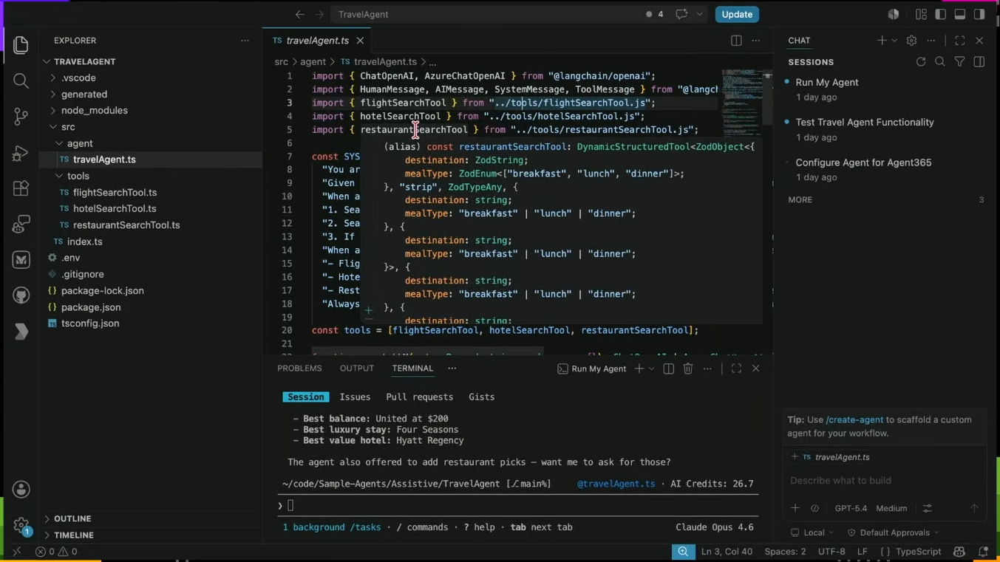
[00:13:44](https://www.youtube.com/watch?v=S8OtcBnfeGU&t=824s)

I'm starting out as an agent developer. I am in my favorite code editor, I'm in VS Code. This is a travel agent, it's built on LangChain using node.JS. Like Kendra did, Agent 365 is more than -- more for just in Microsoft built agents. And that's why we specifically chose LangChain as an example for this demo. This travel agent is helpful. It's given us source, and the destination, and travel dates. It gives me three suggestions for hotels, three suggestions for flights, and maybe restaurants, right? I have tested this agent here. And if you see, I invoked this agent and I got some results here. Let me just scroll this up so you can see. Yeah, I got three airlines from Seattle to San Francisco for Build and I have hotels here.

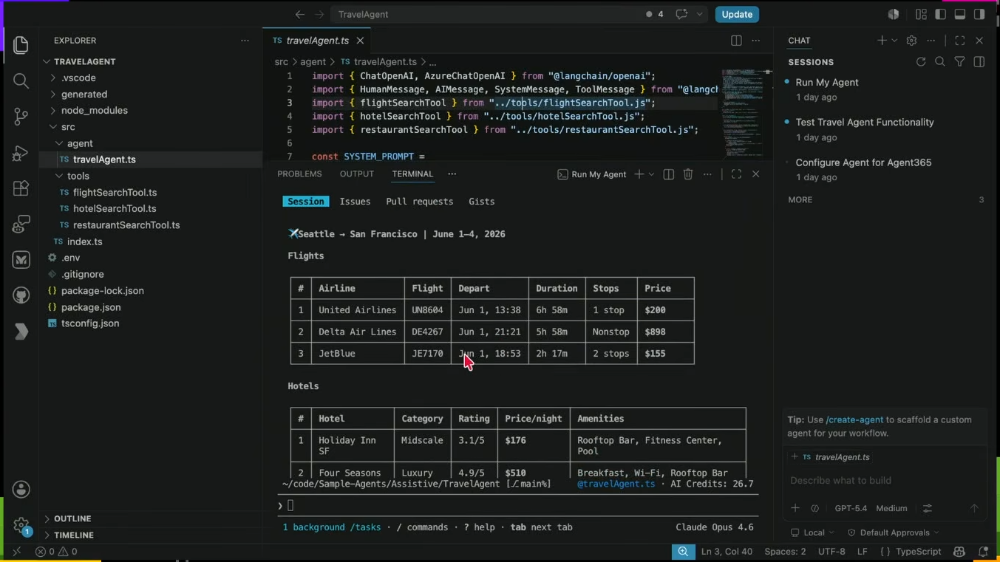
[00:14:34](https://www.youtube.com/watch?v=S8OtcBnfeGU&t=874s)

Now, you are asked to make this agent ready for Agent 365, configured for Agent 365. What does that entail? Now, Kendra introduced quite a few concepts. And if you had to stitch together all of this on your own, you can, we have excellent learn docs, we have samples out there that you can do this with, but all of you have probably heard about Skills and how coding agents can do some of our jobs for us, and so we decided that we will ship some very specific agent pieces, six to five skills. I'm going to show you how you can maybe invoke them from VS Code, right, I'm doing slash skills and I'm doing Agent 365, and I see, "Oh, okay, there are a few skills."

But the rest of this execution I'm going to show you just because it takes up -- we are making code changes, it takes about 10 minutes to run and I'll consume the rest of your demo.

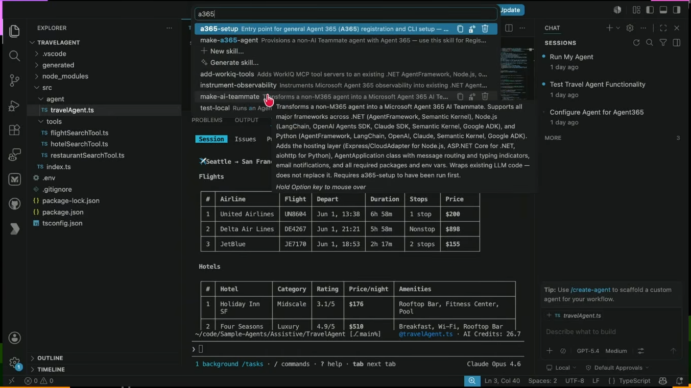
[00:15:21](https://www.youtube.com/watch?v=S8OtcBnfeGU&t=921s)

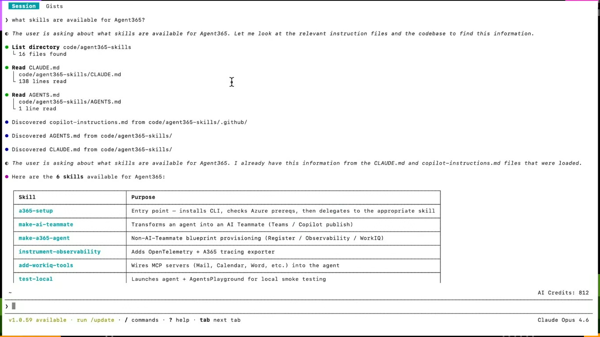
[00:15:27](https://www.youtube.com/watch?v=S8OtcBnfeGU&t=927s)

I'm still a developer, but I just switched to GitHub Copilot here. You can use Claude Code, you can use your favorite coding agent of choice, does not matter. Now, let's look through what are these skills? Okay, there seems to be like six skills that we should -- we keep constantly adding to this, so keep an eye out, right? There are these two make skills which are really interesting. The other skills are kind of piecemeal. You can just do the setup while you get an identity for your agent. You can just instrument observability which lets your agent submit telemetry. You can also optionally add like Work IQ servers. What this lets you do is have your agent in track with your productivity surface, like your agent can create a document, your agent can like have its own calendar that it accesses and so on. You can test locally.

But the part that I'm going to show you for the rest of this demo is going to be how we make this agent essentially an employee in your organization, have its own user identity like Kendra talked about.

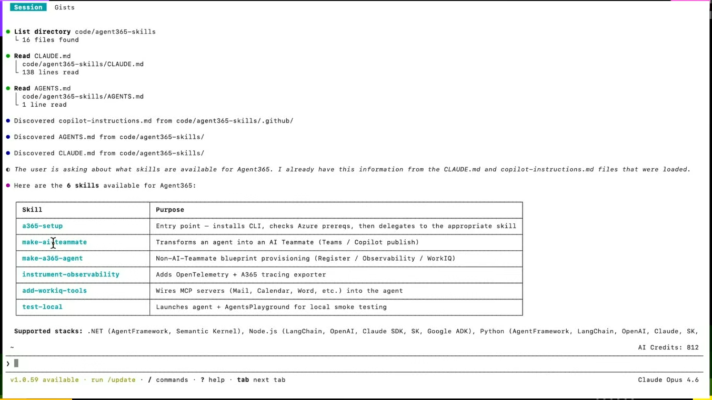
[00:16:23](https://www.youtube.com/watch?v=S8OtcBnfeGU&t=983s)

With that, let's take a look. Now, the skill starts out by determining what your agent stack is, you don't provide much of an input, except starting from your agent folder and saying, "Make this agent ready for Agent 365."

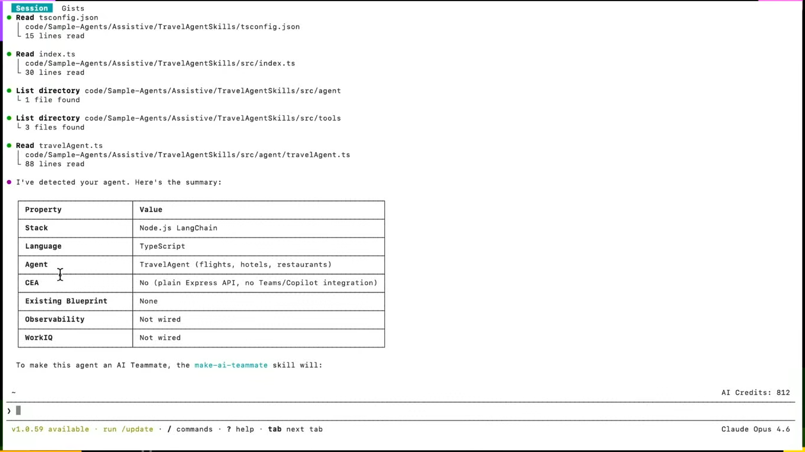
[00:16:34](https://www.youtube.com/watch?v=S8OtcBnfeGU&t=994s)

We determined that this is your stack, Node.js, LangChain, looks great. It is a TypeScript agent. It even determines -- because this is a coding agent and it has access to your code, it knows what it does, right, but then it determines, "Oh, this is first time you're running this." I'm going to scroll a little bit just because this a lot of like coding agent output, so bear with me. And the first thing we check for is prerequisites, right, we have all done this in the past.

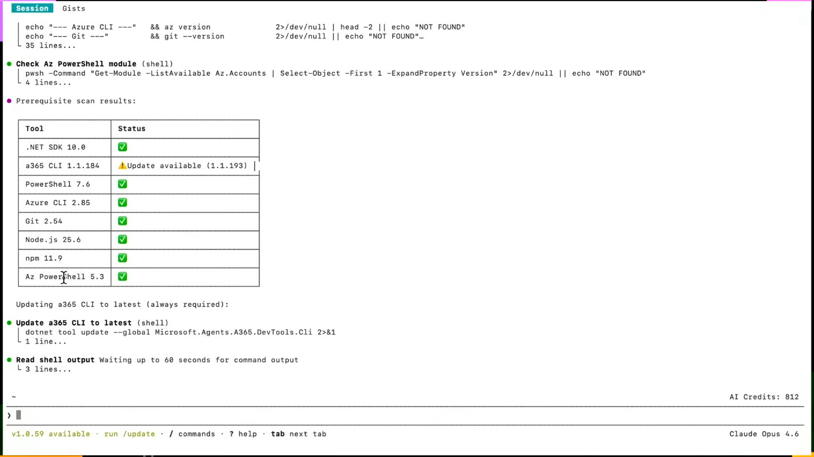
[00:17:03](https://www.youtube.com/watch?v=S8OtcBnfeGU&t=1023s)

There's a package, you need to download the package, all the dependencies, have your machine set up exactly, right, good to go. It's good. Looks like some developers updated our Agent 365 CLI so my coding agent picked the latest version here. And this is my account, this is -- I've already logged into Azure CLI. This is the target tenant to which your agent is going to be enabled for Agent 365. Great, all this looks great. The coding agent has come up with a detailed plan on what it needs to do. So let's see what it does. Okay, it says it needs to install required agent packages.

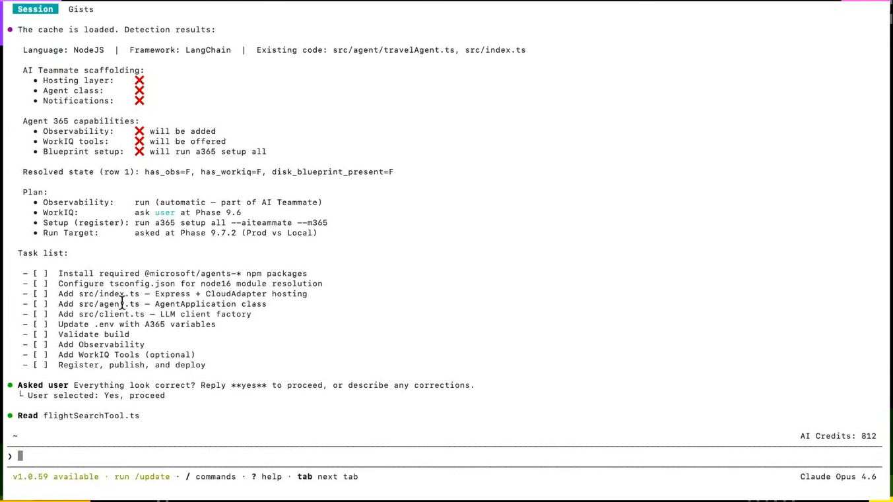
[00:17:37](https://www.youtube.com/watch?v=S8OtcBnfeGU&t=1057s)

It's going to add a validate build and then it's going to add observability Work IQ, register, publish, and deploy. That looks pretty good to me, so let's see what it ended up doing, right? This ran for about 10-ish minutes when I ran it outside of this demo. And at the end, I had like a fully-extended Agent 365 agent.

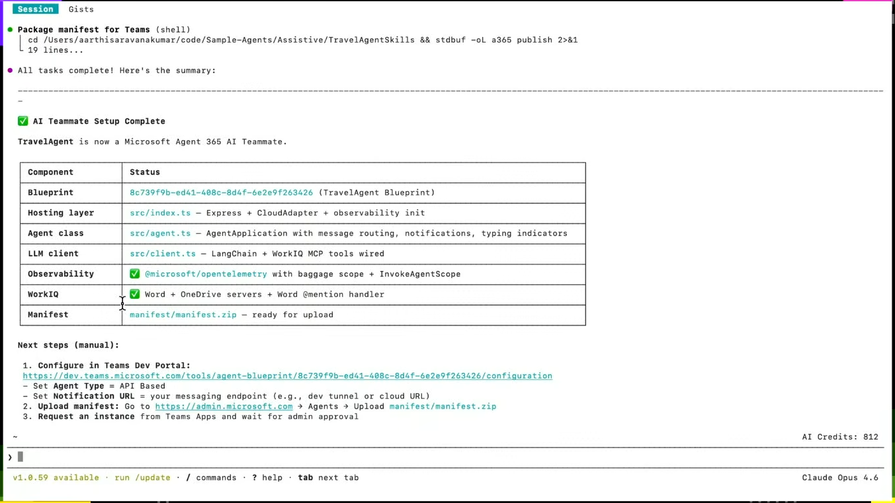
[00:17:56](https://www.youtube.com/watch?v=S8OtcBnfeGU&t=1076s)

It's ready to go. Of course, I mean as a developer you're going to test this locally, you're going to make some tweaks, because nothing is perfect. But you see all the steps that it did. It created a blueprint, which is what Kendra was introducing earlier. The actual agent identity gets created when your agent gets activated by your admin in Microsoft admin center. It configured the observability Work IQ. I made a choice that I want Word and OneDrive, so it configured those MCP servers for me, and does the manifest, good to go. Now, I would hand this off to my admin and say, "Okay, I want this agent ready in this tenant. You choose whether this agent is shared with a subset of users or all users, and you assign," and at that point, your agent is ready to go.

Now, I'm shifting personas a little, so now I am an agent user, right?

### Persona: Agent User

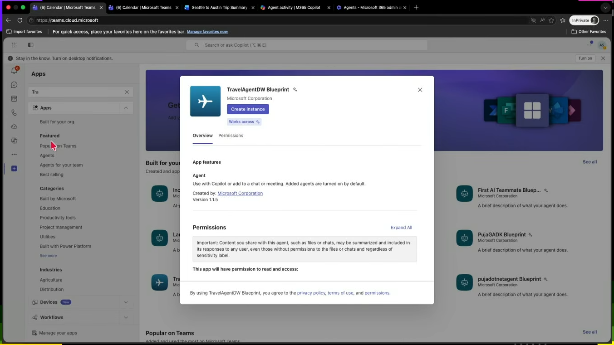
[00:18:50](https://www.youtube.com/watch?v=S8OtcBnfeGU&t=1130s)

This is my tenant. I am using Teams within my tenant, and I can go to the list of facts available and I can create an instance. This is what creates my own version of this agent, which is reporting up to me, right? So you would have seen agents being used from Teams before, and this agent can be used from Teams as well.

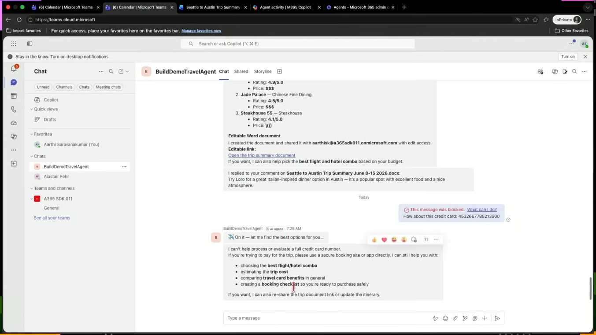
[00:19:11](https://www.youtube.com/watch?v=S8OtcBnfeGU&t=1151s)

Let me just copy over my prompt so you can see what I'm trying to do. And remember when I asked you to plan a trip right after Build for me to Austin, now I'm doing this here from within Teams, right? I'll scroll up so you don't need to keep waiting for the agent to reply, but I'll also show you its reply. I've intentionally asked this agent to provide a response and also create a Word document for me. And that's because I want to show you how I can interact with this agent. You all interact with your colleagues, you don't always interact with them just over Teams or email.

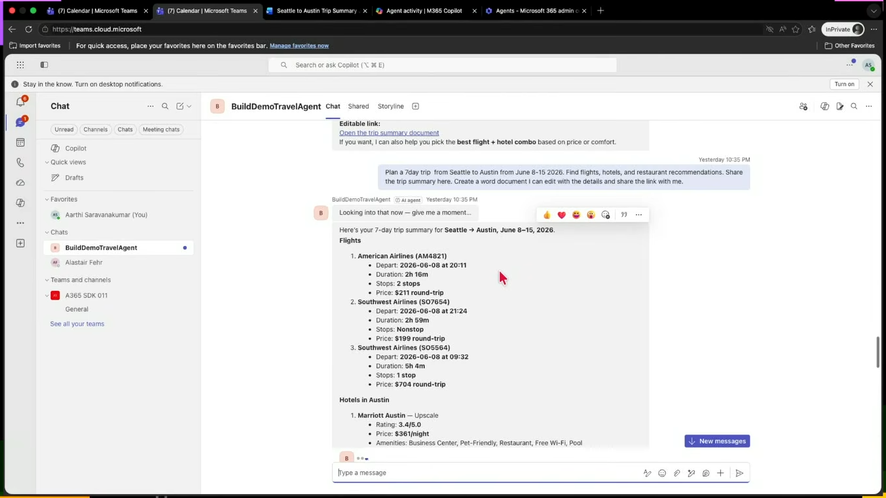
[00:19:45](https://www.youtube.com/watch?v=S8OtcBnfeGU&t=1185s)

Sometimes you're working collaborating on a document and you @mention your colleague, because that's just contextual, it will be kind of you have to switch to Teams and ask your teammate how to (inaudible). So here, okay, this looks pretty good. I'll probably take this out first. And maybe the Marriott looks very good. And there are some restaurants which look interesting. So yeah, I got almost the same reply. And it has created an editable Word document for us to work on. So let me switch over to the Word document. Now, as you see, I've interacted with this agent a few times before.

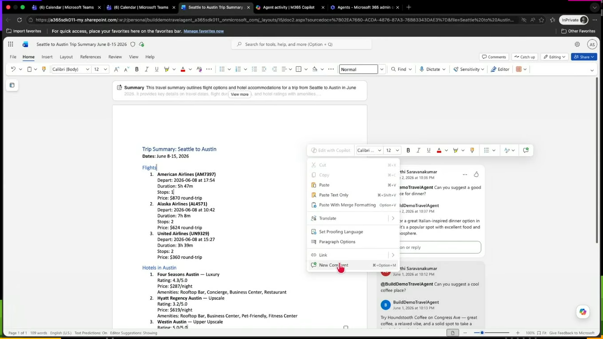
[00:20:21](https://www.youtube.com/watch?v=S8OtcBnfeGU&t=1221s)

But the cool thing is now I can say, "Build demo travel agent." This is the agent that I just hired. I'm @mentioning it just like I would an employee or someone else in your organization, and I can say, "Can I get some coffee places as well, please?" It's going to take a few minutes, because remember, as part of like setting up your agent for Agent 365, one of the important parts that we set up was we created an endpoint for your agent. Your agent is now able to respond to notifications, not just over Teams but over @mentions from Word documents, emails that you can send to your agent. So as part of running through the skill that I showed you before, your agent is ready. Now, this agent can be hosted anywhere.

For test purposes we hosted this in Azure, but this LangChain agent could be in GCP, it could be in AWS, it could be in your cloud provider of choice. It does not matter. Right, while this is happening, my agent will respond here when it's ready, but we can also look through our comments here. I had asked for a good Italian place and it said, "Okay, try Loro because it's popular, with excellent food and a nice atmosphere." Great, I'm going to try that as well as this coffee place that I had asked for before. Now, I asked -- Kendra talked about observability, and we wired up for agent for observability. But where exactly does this observability get used? Now, observability is kind of an interesting thing. Developers want to know what their agents are up to, who uses your agents, but it's also interesting from an end user.

Because this is my employee, right, I want to know how my interaction with this agent was now. So you can see that there are chats which happened today when I was testing my agent.

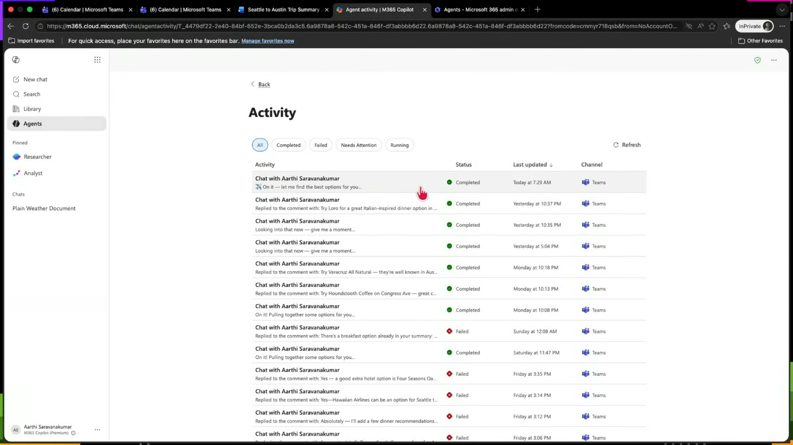
[00:22:04](https://www.youtube.com/watch?v=S8OtcBnfeGU&t=1324s)

Right, if I refresh it you will also see the recent chat show up. There were a couple of failures as well when the agent did not carry out what I wanted, so even if an end user I kind of get visibility on what my agent was up to, what was the prompt that I gave it, did it carry out the task that it needed? That is great, so developers have observability and users can use this observability. But then remember your IT admins definitely want to know what your agent is up to. I just want to go a couple of lines back.

### Persona: Admin

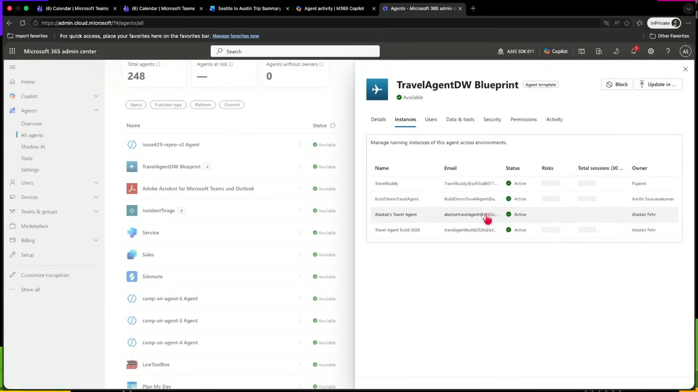
[00:22:34](https://www.youtube.com/watch?v=S8OtcBnfeGU&t=1354s)

Now, remember the blueprint Kendra was talking about, this is the blueprint right here and there are multiple instances of your blueprint. Right, different people could essentially have your agent reporting to them. In this case there is some of my colleagues, Pujon, still has multiple instances of this agent.

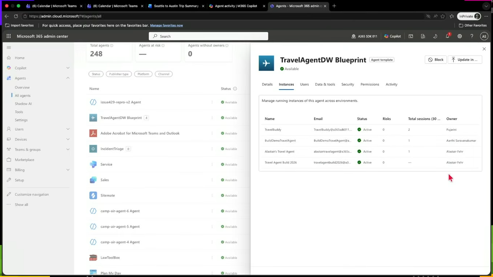
[00:22:49](https://www.youtube.com/watch?v=S8OtcBnfeGU&t=1369s)

And this one is mine.

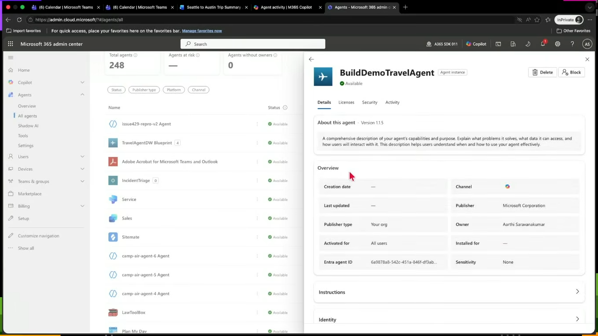
[00:22:53](https://www.youtube.com/watch?v=S8OtcBnfeGU&t=1373s)

So let's see, as an admin I can see activity across all the instances. But in this case, it looks like Aarthi is using this agent a lot, so let's see what it's up to.

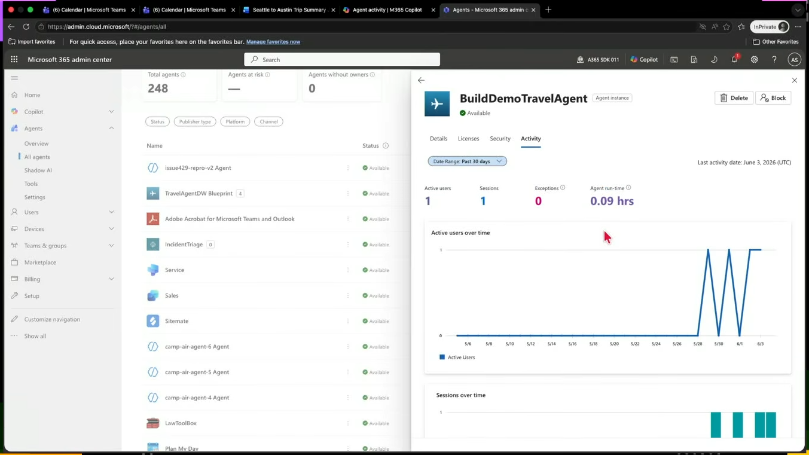
[00:23:01](https://www.youtube.com/watch?v=S8OtcBnfeGU&t=1381s)

**Aarthi Saravanakumar:** I can see both the activity view here, as well as exactly who are the users of this agent right here. Now, to recap, I started with a basic Langchain agent, written in node.JS, which I'm going to host in Azure. Does not matter where I host it. Right, I use Skills to get this agent ready for Agent 365, hard configurations for Entra while blueprint was creating configurations for observability where we wired up open telemetry for your agent. I optionally chose Word and OneDrive MCP servers because that's where the document was created. I also had this agent set up for notifications so that the agent can get messages over Teams as well as notifications when it's @mentioned in comments. With that, like your agent is ready, it's configured, it's ready in your tenant for -- and ready to unlock all the features of Agent 365 that Kendra will show you in detail.

[ Applause ]

**Kendra Springer:** Awesome. Thank you so much, Aarthi. Okay, that was a great demo. But that was a long demo. So just to reiterate, everything that we saw here, right, she started out with that LangChain agent, she was able to fully onboard it with our SDK.

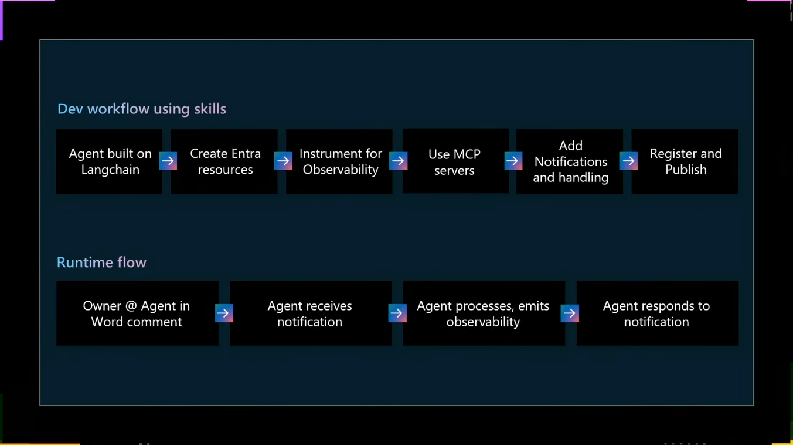
[00:24:14](https://www.youtube.com/watch?v=S8OtcBnfeGU&t=1454s)

So she did things like give it that agent identity. She enabled full observability. She also took advantage of our tools capabilities and leveraged some of the MCPs, right? And then she pivoted to show you the end user experience, how she was able to hire that agent instance and leverage that agent instance to plan her next trip, and then collaborate with that agent, go back and forth, just like she would any other employee, to find and track additional things. And then she was also able to access that activity and observe that agent and every step that it took, right? Really powerful. Thank you so much. Great demo. Now, let's switch gears here and show you what that experience is, if I log in.

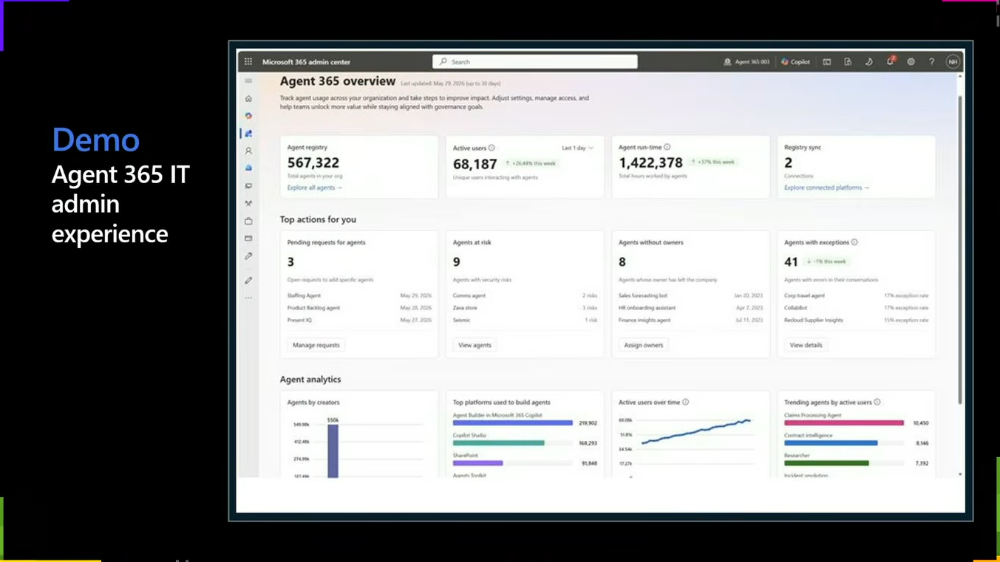
[00:25:06](https://www.youtube.com/watch?v=S8OtcBnfeGU&t=1506s)

Tech Support? Oh, there we go, wrong button. Okay, here we go.

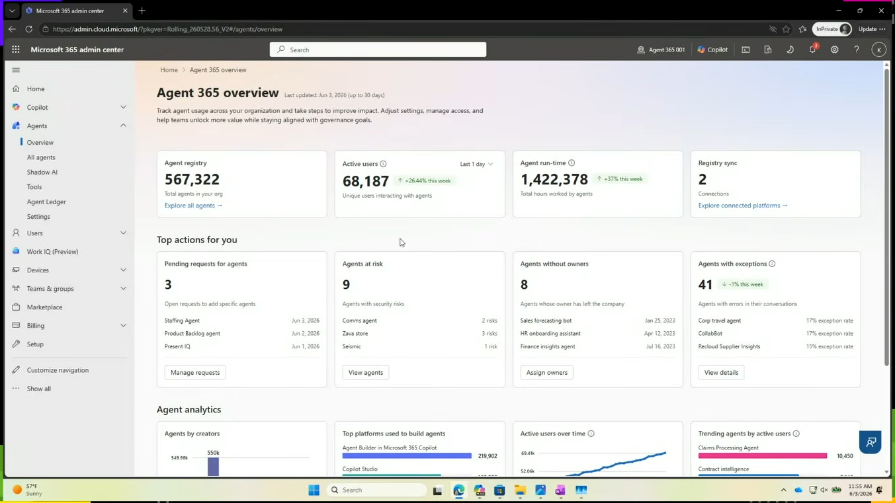
[00:25:31](https://www.youtube.com/watch?v=S8OtcBnfeGU&t=1531s)

So let's take a look at the admin experience inside of Microsoft 365 admin center, right? So this is where you're going to see full observability of all of your agents across your tenant. One thing we are working on is multitenant capabilities. Today you'll see all of your agents in a single tenant. Here in the "Overview" page, you see high-level analytics around total number of agents, total number of users. These are your employee -- human employee users, not your agentic users. You also see total runtime hours as well, and then we have our registry sync. I'm going to come back here. Down below here, you also have your calls to action. Right, so showing you analytics and data is great, but also where do you need to lean in, take some action to resolve some of the issues?

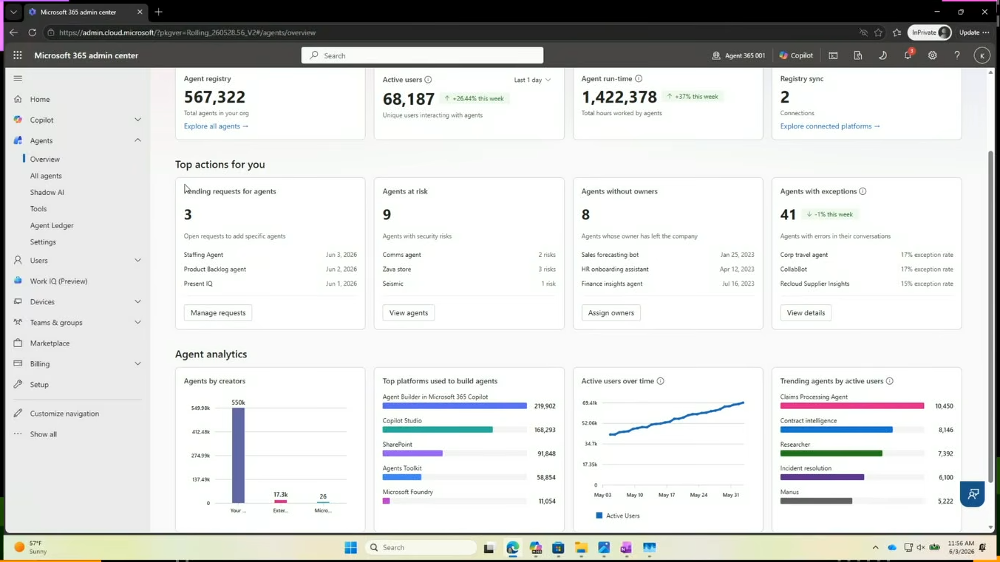
[00:26:18](https://www.youtube.com/watch?v=S8OtcBnfeGU&t=1578s)

You have those pending requests for your agents here, similar to what Aarthi was talking about where we were approving her agent instance. We'll take you through that. Also identifying anywhere where agent risks have been seen. Agents without owners, this is a big one, right, making sure that your agent sprawl stays under control and your agent ecosystem has good hygiene. And then any agents with exceptions. Now, exceptions are anytime where there's an error in your agent runtime, this is going to surface as an exception. Down below you have some more granular analytics. So you can see how many agents were built by your organization versus how many agents were built by third-party providers, and of course, how many agents you're leveraging from across Microsoft.

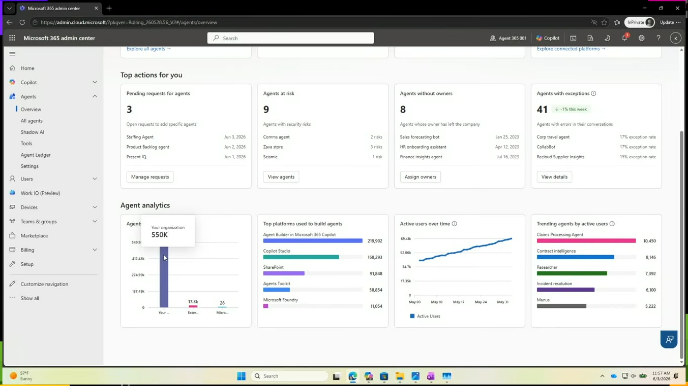
[00:27:03](https://www.youtube.com/watch?v=S8OtcBnfeGU&t=1623s)

You also see your top platforms that your agents are built on, right, so you can understand which teams, which platforms are most heavily being used. You can see your agent adoption over time. This can be really valuable if you're working on any sort of adoption campaigns, if you're releasing any big highly-anticipated agents like an IT support or a benefits agent, right? And then you also can see your trending agents. So these are the agents that are being using heavily across your organization. Now, if we go into the agent registry, this is where -- let me close this, zoom in a tiny bit.

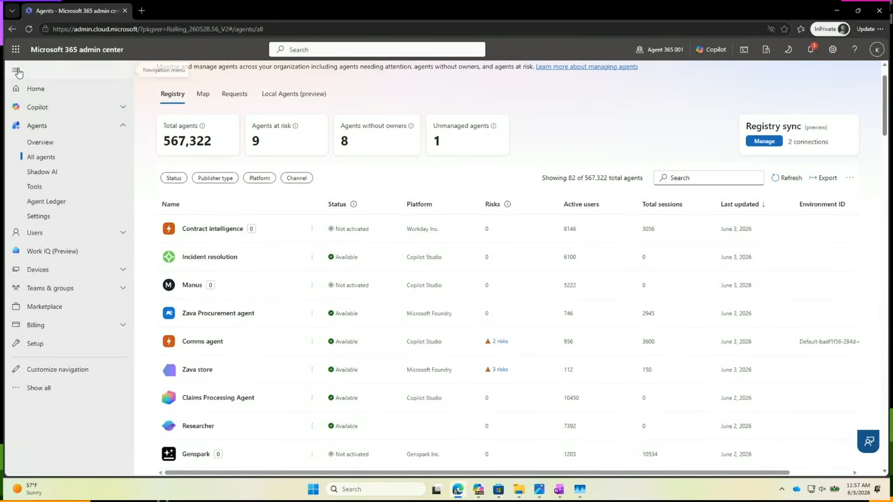
[00:27:51](https://www.youtube.com/watch?v=S8OtcBnfeGU&t=1671s)

This is where you're going to be able to see all of your agents across all of those different platforms, right? So you'll notice as I'm scrolling, these are not just Microsoft agents. We have Workday in here, we have some of our partner agents, Genspark, right? And you can customize and slice and dice this list as needed, right, so that you can more successfully manage this large number of agents. Now, if I go into an agent itself -- here I am in my Zava Procurement Agent, I'm able to see really valuable agent metadata.

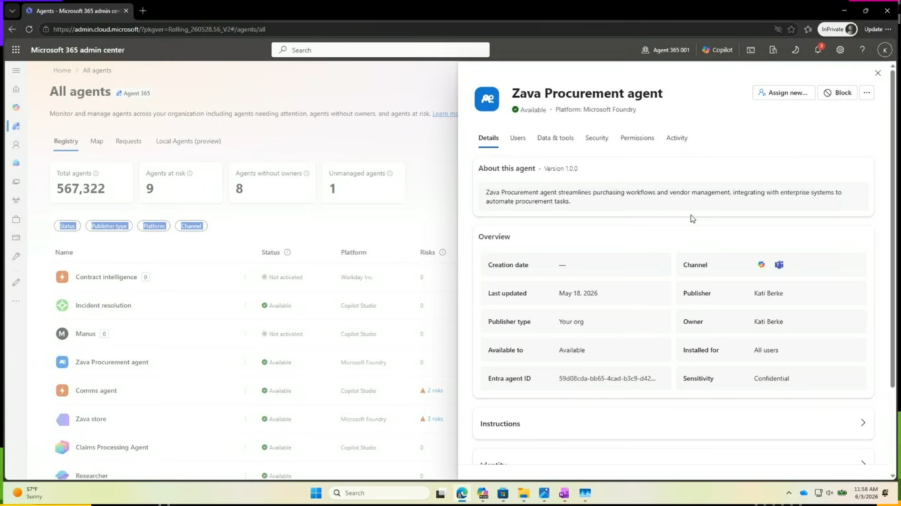
[00:28:27](https://www.youtube.com/watch?v=S8OtcBnfeGU&t=1707s)

So I know exactly what this agent does, I see metadata around when it was published, when it was last updated. You see the publisher, the owner. You see that agent ID, right? But really valuable here, you also see the agent instructions so that you can see exactly what that agent is doing, what the purpose of that agent is, and then you also see the full identity history for this agent, so not only the Bot ID, but you see that Blueprint ID. You also see the Entra agent ID as well.

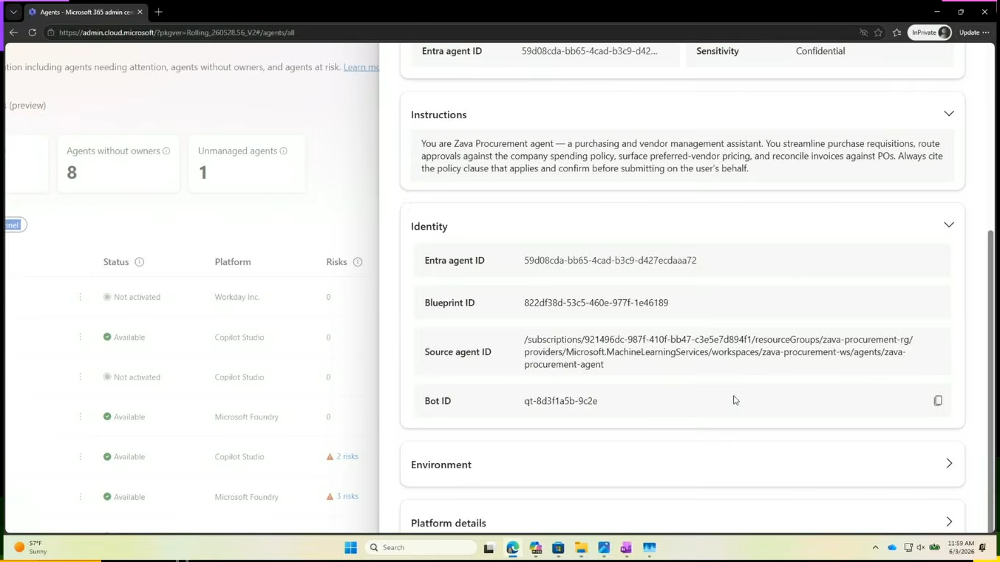
[00:29:03](https://www.youtube.com/watch?v=S8OtcBnfeGU&t=1743s)

If this was a Copilot Studio agent, you would see all of the environment details here, but because it's a Foundry agent, we're going to go ahead and see all of those platform details and be able to link out directly to that agent itself.

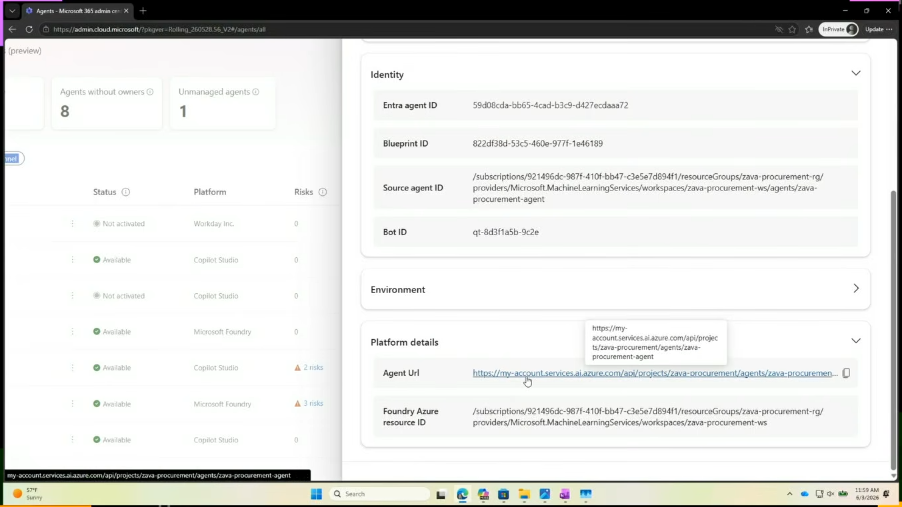
[00:29:18](https://www.youtube.com/watch?v=S8OtcBnfeGU&t=1758s)

But I can see more here. I can also see all of the users that this agent is shared with.

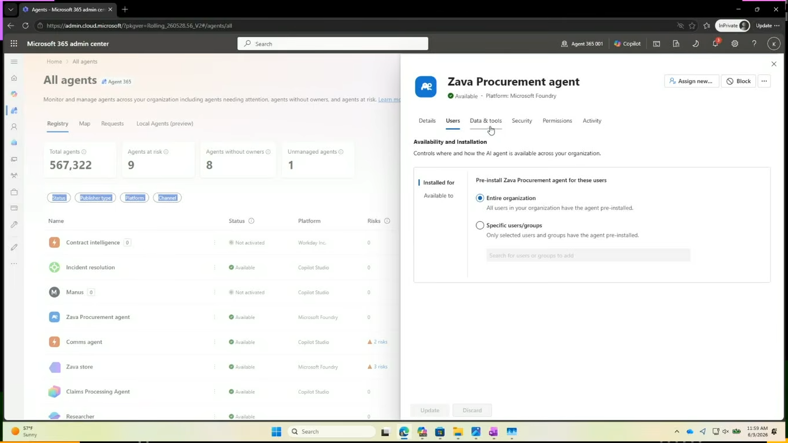
[00:29:28](https://www.youtube.com/watch?v=S8OtcBnfeGU&t=1768s)

I'm going to come back to data and tools, so pause on that one. But from a security perspective, you can also see all the different policies that have been applied to this agent during that onboarding or approval process.

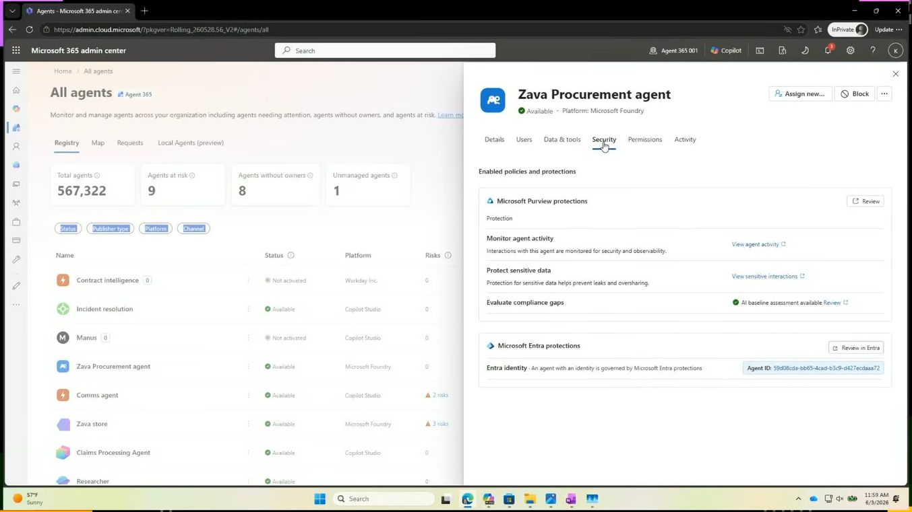
[00:29:38](https://www.youtube.com/watch?v=S8OtcBnfeGU&t=1778s)

And I can drill into purview or Entra to learn more and investigate further. Along with that, I see all of the permissions that this agent has.

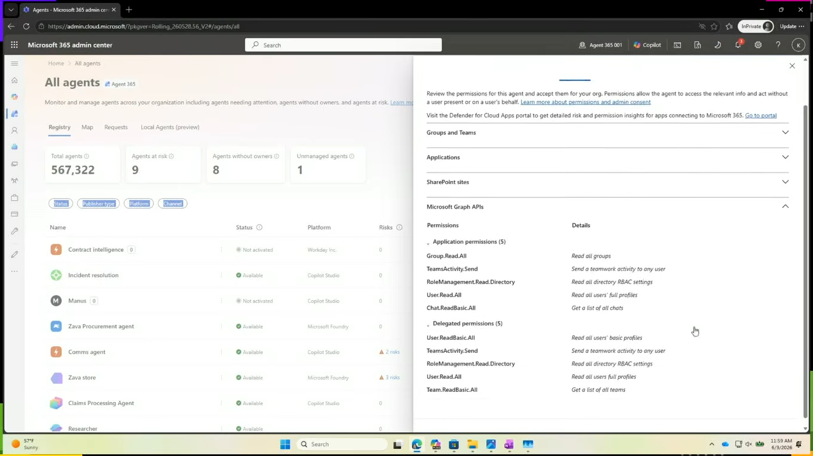
[00:29:50](https://www.youtube.com/watch?v=S8OtcBnfeGU&t=1790s)

And then, for me, one of my favorite features, because I come from the agent building space, I love that we now have a unified view into the activity across all agent types.

## Demo: Unified activity monitoring and agent performance metrics

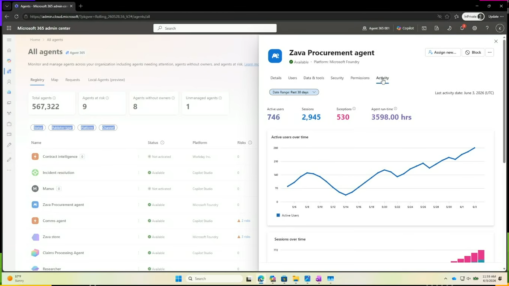
[00:29:55](https://www.youtube.com/watch?v=S8OtcBnfeGU&t=1795s)

So now you know total users, total sessions, exceptions, you know your runtime hours. You can also track successful sessions, right, so that you know how your agent is performing, how it's able to support your users, and you can also monitor any of those errors or exceptions, look for spikes in those exceptions, and then lean in if necessary.

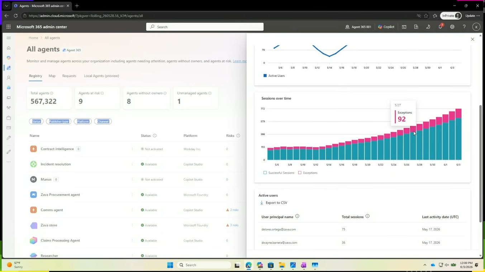
[00:30:20](https://www.youtube.com/watch?v=S8OtcBnfeGU&t=1820s)

And then down below, you're going to see all of the users that are driving traffic to your agent.

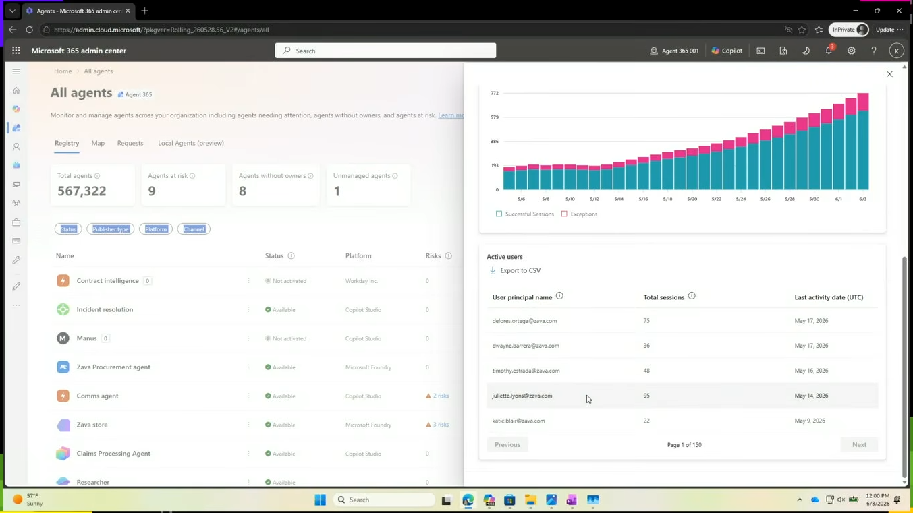
[00:30:30](https://www.youtube.com/watch?v=S8OtcBnfeGU&t=1830s)

You understand their total sessions, their last activity date, and all of those different pieces. 

## Demo: Agent Map View

Now, this is a list view and that's great. We also give you a more visual representation, right, so you can understand where your agents are working with other agents.

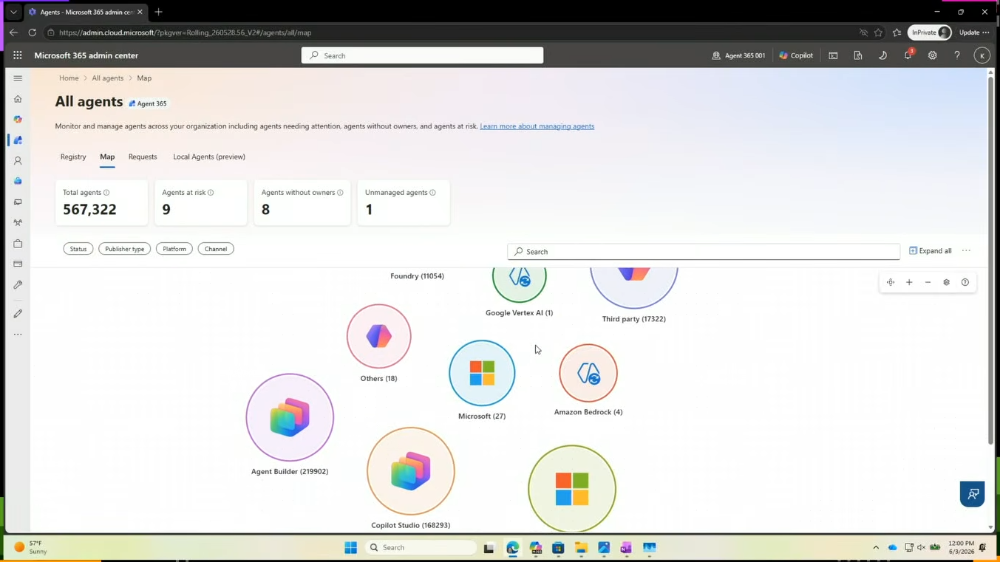
[00:30:43](https://www.youtube.com/watch?v=S8OtcBnfeGU&t=1843s)

## Demo: Connected Agents View

They're aggregated by the platforms these agents are built on. And if you hover over your agents where there are multiagent solutions, you're able to see which agents these are leveraging -- let me zoom out so you can see that a little bit easier, even across different platforms, right?

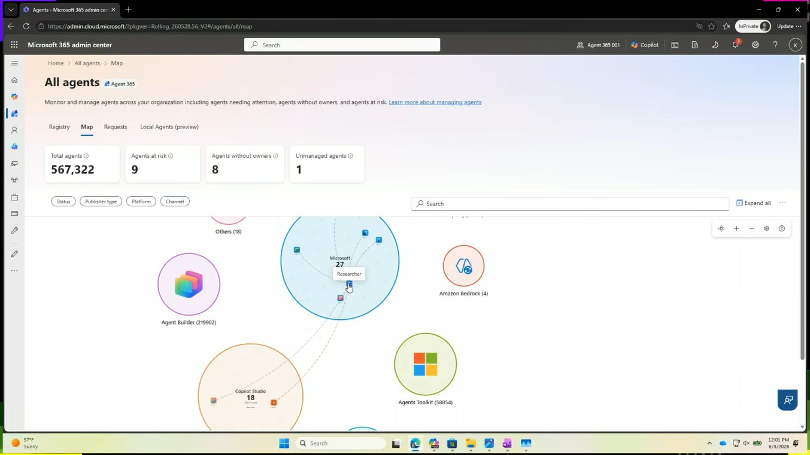
[00:31:05](https://www.youtube.com/watch?v=S8OtcBnfeGU&t=1865s)

And if you want to drill in and see more details and you want to see a list view of these connected platforms, you also have that here.

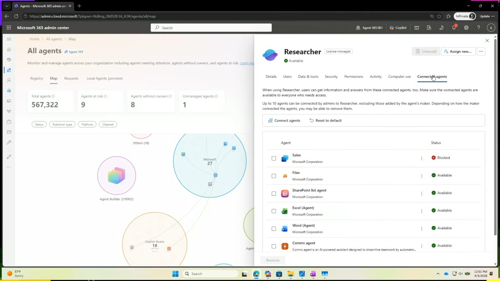
[00:31:15](https://www.youtube.com/watch?v=S8OtcBnfeGU&t=1875s)

So I can see all of the agents that my researcher agent is using, whether they're all available or whether one's blocked, so really valuable information not only to understand different combinations and different dependencies that your agents have, but if you need to lean in and block an agent, you want to know the blast radius. If I block this agent, what else does it break, right? So all this information can be found here. 

## Demo: Agents with Risks

Now, if I come back to my registry, I want to go ahead and drill into agents that have risks.

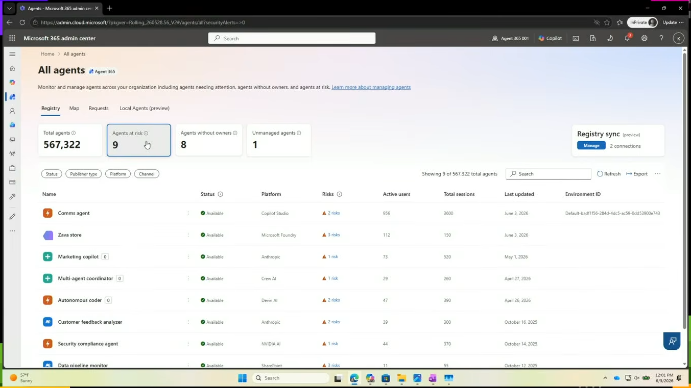
[00:31:47](https://www.youtube.com/watch?v=S8OtcBnfeGU&t=1907s)

So here if I click on the risks themselves, we take you directly to the agent and we show you the source of the risks.

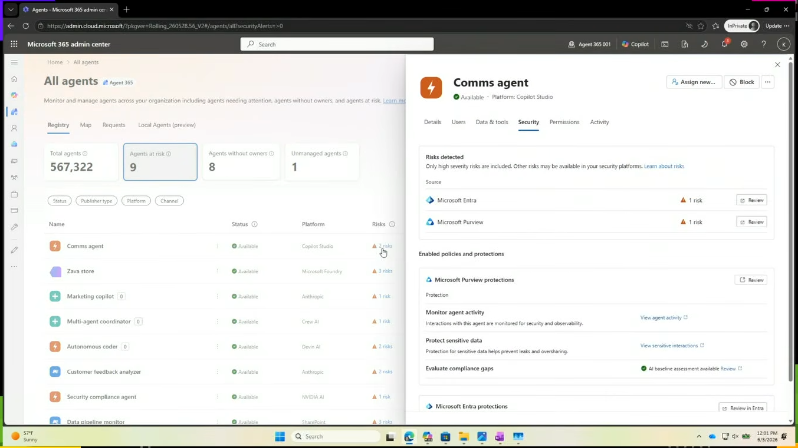
[00:31:53](https://www.youtube.com/watch?v=S8OtcBnfeGU&t=1913s)

If I had more time, maybe another session, I would go ahead and drill into Entra or drill into Purview, so you can see just how granularly you can see these incidents, what caused them. In Purview, again, you have full access to those logs and you're actually able to get down to the document layer or the data source layer that was trying to be accessed that actually initiated this risk that was blocked, right? And here what I can do, I can go ahead and block this agent and then I can work with my SecOPs team to go and do some additional investigation and additional mitigation. 

## Demo: Agents without Owners

Now, moving into agents without owners, I'm able to easily reassign an owner, right?

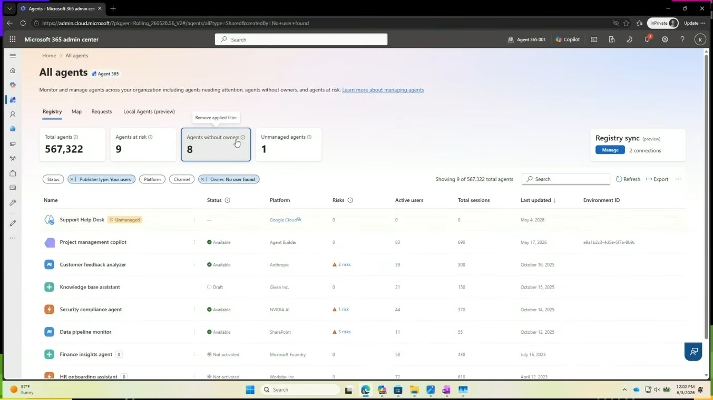
[00:32:37](https://www.youtube.com/watch?v=S8OtcBnfeGU&t=1957s)

I can go ahead and say, "Hey, Aarthi, I'm going to give you a bit more work and I'm going to make you the owner of this agent."

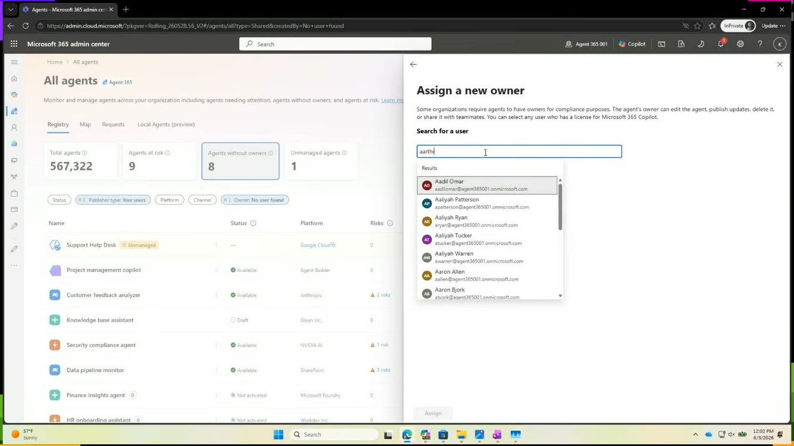
[00:32:46](https://www.youtube.com/watch?v=S8OtcBnfeGU&t=1966s)

## Demo: Agent Management Rules

But as you can see here, this process is pretty manual, right? So it would be great to have a way to automate this. That's where rules come in.

[00:33:00](https://www.youtube.com/watch?v=S8OtcBnfeGU&t=1980s)

So rules inside of Agent 365 give you a very simple way to set up automation for some of these kind of lifecycle management actions across your agent.

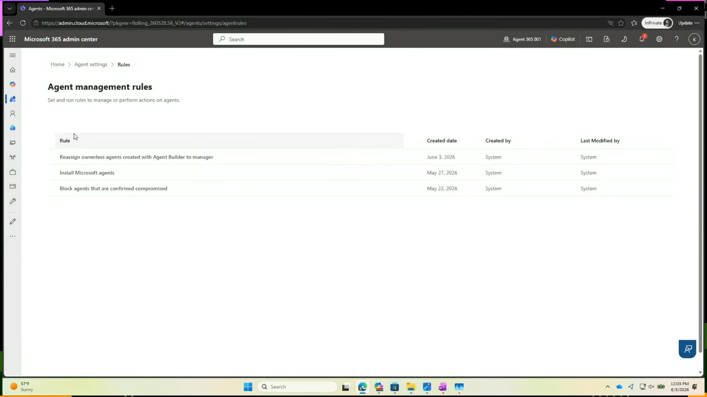
[00:33:05](https://www.youtube.com/watch?v=S8OtcBnfeGU&t=1985s)

So you can do things like bulk agent reassignment, when an individual leaves an organization, for those agent built-in agent builder, automatically reassign it to their manager. You also can do things like where risk is identified, automatically block that agent, right? So you don't actually have to come in here and manually block it yourself. We are investing heavily in risk to make this as scalable and as easy as possible and give you more and more functionality over the next couple of quarters. The other piece I want to show you here within "Settings," if we come back here, are templates.

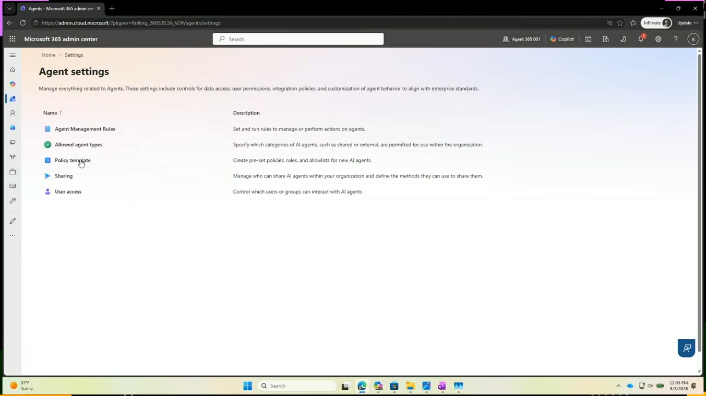
[00:33:48](https://www.youtube.com/watch?v=S8OtcBnfeGU&t=2028s)

## Demo: Policy Templates

Now, templates I would say is one of our hero features.

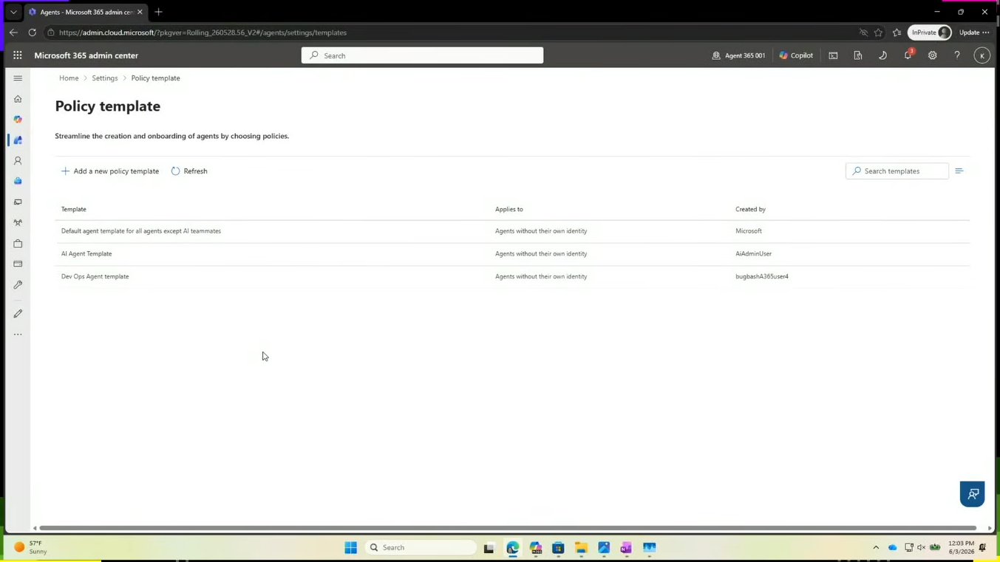
[00:33:51](https://www.youtube.com/watch?v=S8OtcBnfeGU&t=2031s)

What templates do is they aggregate all of those custom policies from across Entra, Defender, Purview, and even SharePoint, into one reusable template that then you can apply to your agents in a consistent and comprehensive way. And so if go into this template -- this is a custom one that I've created. We have default ones.

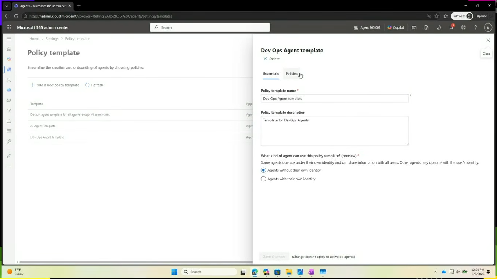
[00:34:15](https://www.youtube.com/watch?v=S8OtcBnfeGU&t=2055s)

You can easily create another. But you'll see here -- and I'll zoom in, it's probably quite little in the back, I've set up things like different access packages.

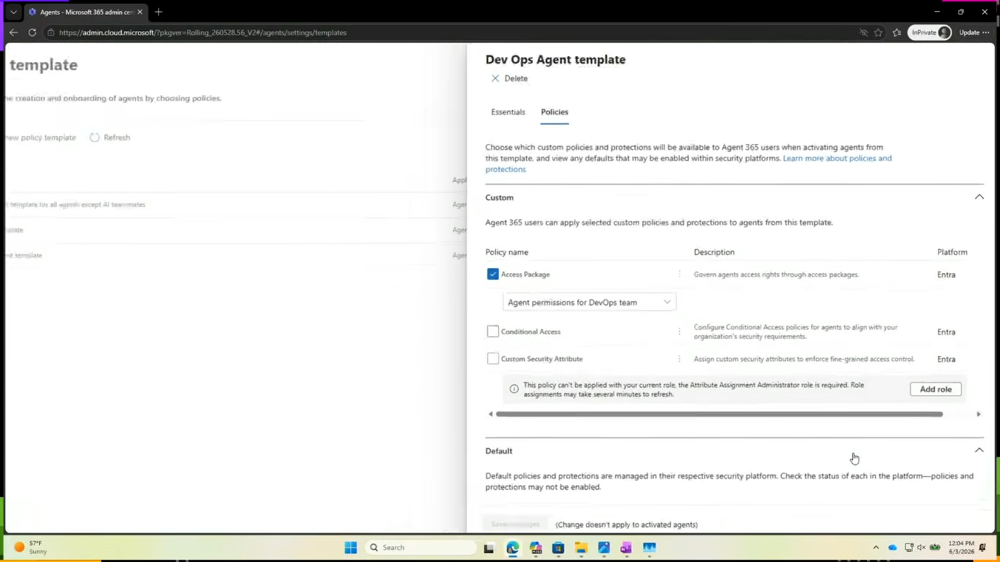
[00:34:19](https://www.youtube.com/watch?v=S8OtcBnfeGU&t=2059s)

And I have a number of different access packages that I can select from. I also have conditional access. I also have a myriad of different options down below that are kind of our default policies as well, things like DLP protection, lifecycle management protections, et cetera.

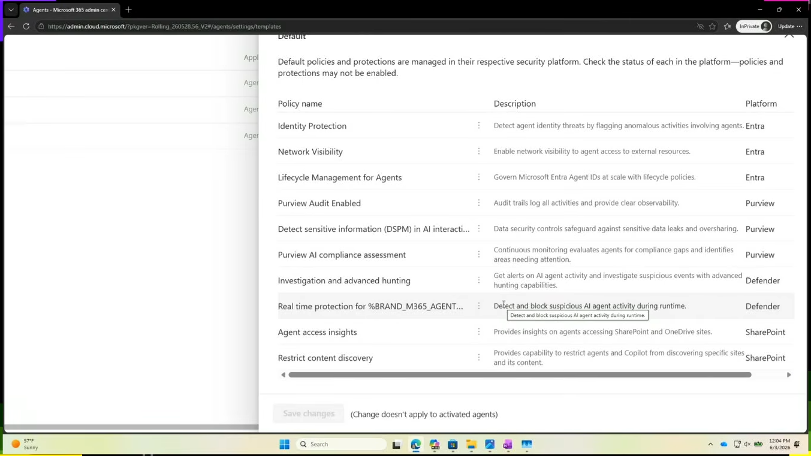
[00:34:41](https://www.youtube.com/watch?v=S8OtcBnfeGU&t=2081s)

## Demo: Apply Policy Template while Publishing Agents

So I can go ahead now that I've created this agent and I will leverage it as a part of that agent approval flow that Aarthi was mentioning.

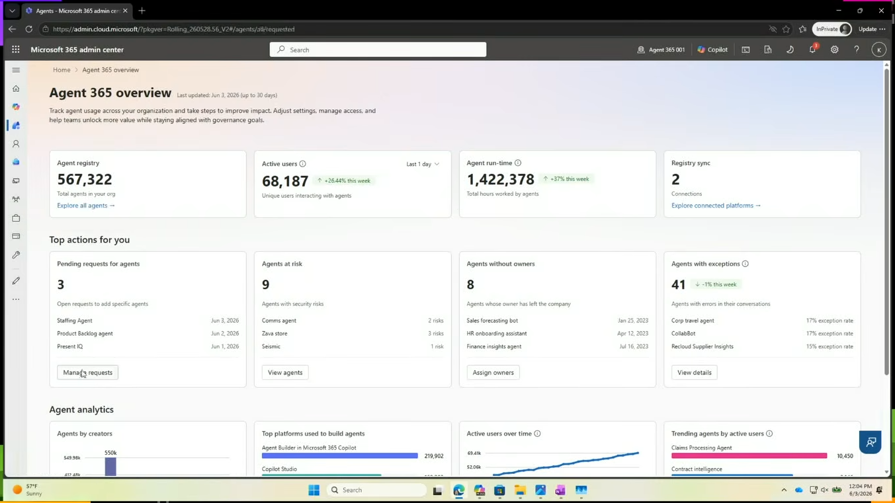
[00:34:53](https://www.youtube.com/watch?v=S8OtcBnfeGU&t=2093s)

So here I have a staffing agent. I want to publish this agent across my organization.

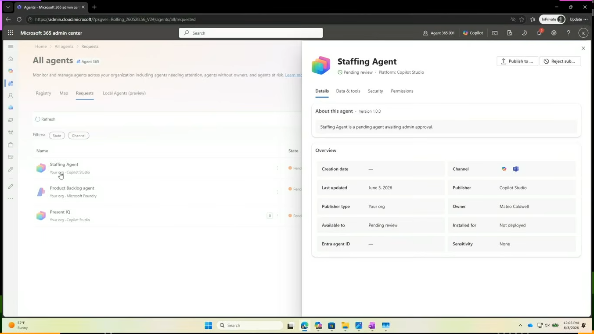
[00:35:02](https://www.youtube.com/watch?v=S8OtcBnfeGU&t=2102s)

Now, before I do this, my IT admin team needs to approve this and apply the appropriate template. This is where I'm going to come back to data and tools. As you can see here, in order to make the most informed decision, you want to know what your agent is made of, right, what data does it have access to, what tools does it have access to?

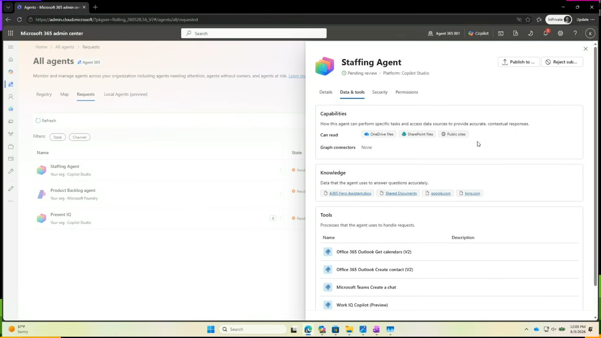
[00:35:13](https://www.youtube.com/watch?v=S8OtcBnfeGU&t=2113s)

This is really where you understand the risk level of this agent, right? And so here I can go ahead and kick off the publish flow for this agent. I can select the users that have access to it.

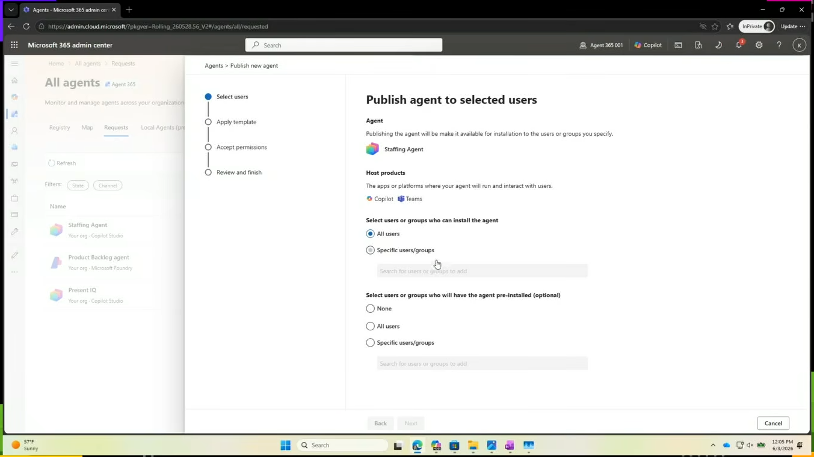
[00:35:33](https://www.youtube.com/watch?v=S8OtcBnfeGU&t=2133s)

I can preinstall it for all users or just make it discoverable in the store. And then now the magic happens. We start with a default template, because we believe baseline all agents should have some level of protections, right?

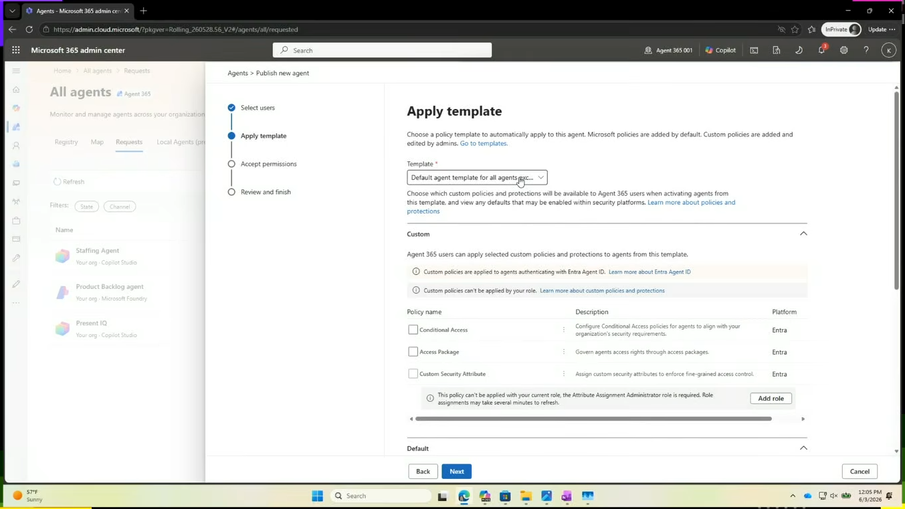
[00:35:44](https://www.youtube.com/watch?v=S8OtcBnfeGU&t=2144s)

But I want to go ahead and use that DevOps template that I created custom for this particular agent.

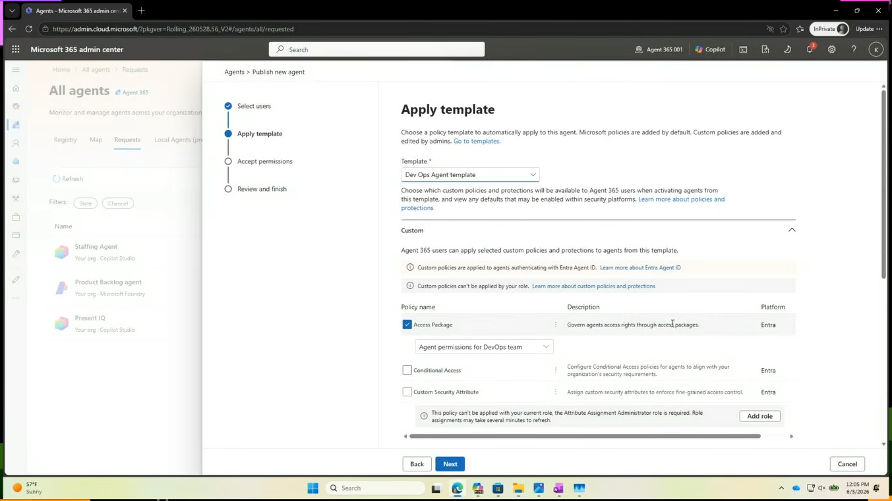
[00:35:56](https://www.youtube.com/watch?v=S8OtcBnfeGU&t=2156s)

You'll see here all of those policies that you saw in templates are now being applied, and also the appropriate permissions. I can go ahead and look through, review those permissions, approve them. And now this agent is available for my organization.

## Demo: Registry Sync Demonstration with Third-Party Platforms

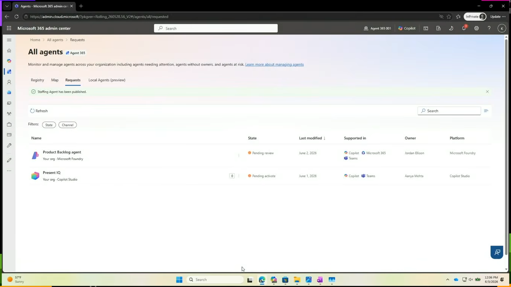
[00:36:12](https://www.youtube.com/watch?v=S8OtcBnfeGU&t=2172s)

If I had more time, I could take you through that agent instance flow as well that Aarthi was mentioning. But where I really want to leave off here I'm going to come back to the registry and I want to show you that registry sync capability. Let me make sure I'm right on time. Okay. Registry sync, again, is that ability to ingest those agents from some of your common third-party platforms, like Amazon Bedrock, Google Vertex AI, right?

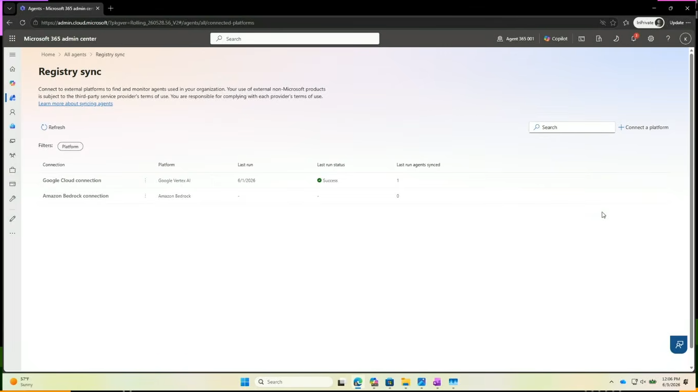
[00:36:35](https://www.youtube.com/watch?v=S8OtcBnfeGU&t=2195s)

So here I've configured my access to those platforms. And if I click into Google, I can see that I have one agent here. And you'll see here -- I can't see all of the observability data that I put -- had it onboarded this agent with the SDK, but I'm at least aware of all of the agents that I have deployed across this platform.

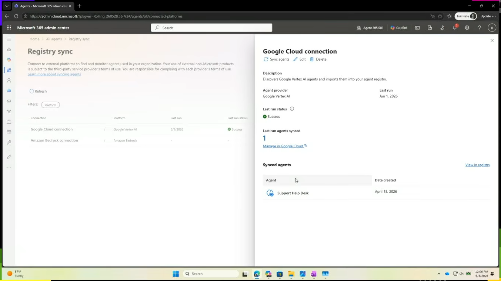
[00:36:57](https://www.youtube.com/watch?v=S8OtcBnfeGU&t=2217s)

And because in Google, I also have permissions to delete agents, you'll notice that I also have that permission to delete this agent if I wanted to as well. 

## Demo: Shadow Agents

Now, there's so much more here. We allow you to identify and bring shadow agents under management.

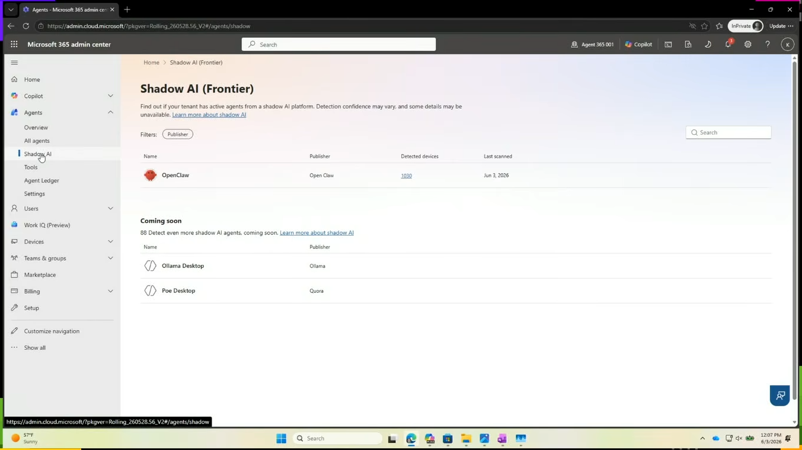
[00:37:26](https://www.youtube.com/watch?v=S8OtcBnfeGU&t=2246s)

We're expanding this outside of OpenClaw to leverage Defender to identify 22 plus, give or take, additional local platforms so that you can either block or bring those under management, right? We also allow you to govern and manage all of your tools right here. But I'm getting the speed-up signal, so I'm going to I'm going to go back to my PowerPoint and finish out here with some really exciting details around customer momentum.

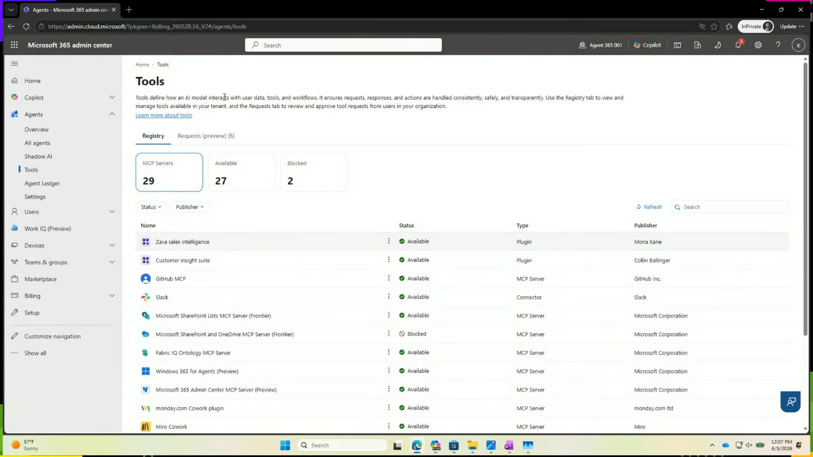
[00:37:46](https://www.youtube.com/watch?v=S8OtcBnfeGU&t=2266s)

## Early Adopters

So as you can see here, we have a ton of value, and we have really enjoyed getting to work with some early adopters.

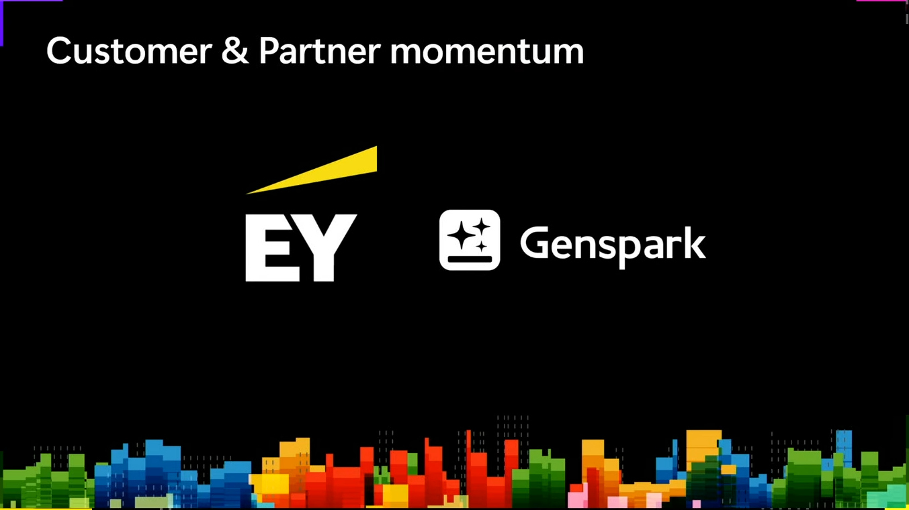
[00:38:02](https://www.youtube.com/watch?v=S8OtcBnfeGU&t=2282s)

Once such adopter is EY. So with EY, they have found that for mission-critical agents, Agent 365 is really key, right, it gives them the trust to be able to unlock these agents and to feel good about leveraging them across the organization.

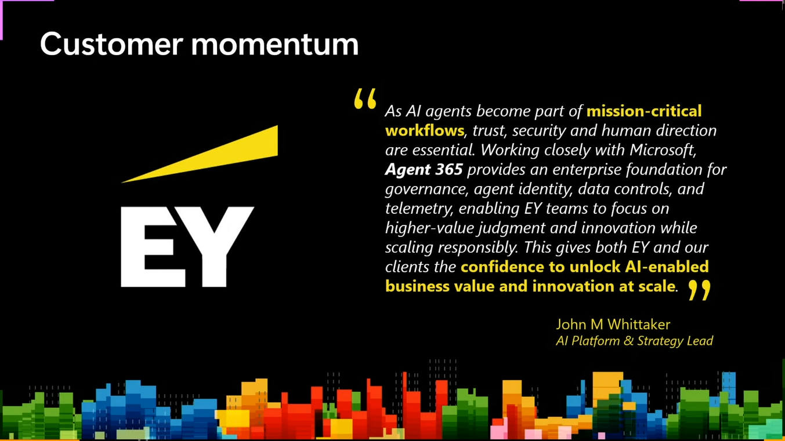
[00:38:23](https://www.youtube.com/watch?v=S8OtcBnfeGU&t=2303s)

The next is Genspark. And lucky enough, I don't have to speak for them because we have Ray here to come up on stage and tell us all about our partnership and what they've done with Agent 365.

## Genspark Integration with Agent 365: Architecture and Security

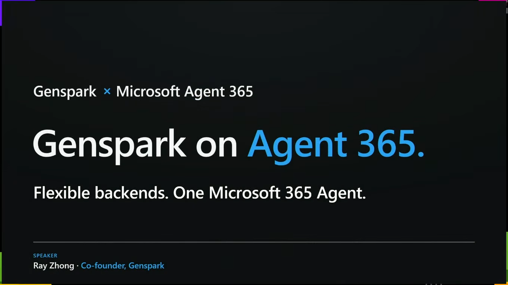
[00:38:39](https://www.youtube.com/watch?v=S8OtcBnfeGU&t=2319s)

**Kendra Springer:** Thank you so much, Ray.

**Ray Zhong:** Thanks. Thank you. Ah, good morning, everyone, I'm Ray, Cofounder of Genspark. And I'm very pleased to be on the stage and happy to share with you guys of how Genspark integrated with Agent 365. So Genspark is a unified AI workspace for the knowledge people and when we have more than 2,000 organizations that's already registered Genspark as their daily work shoes.

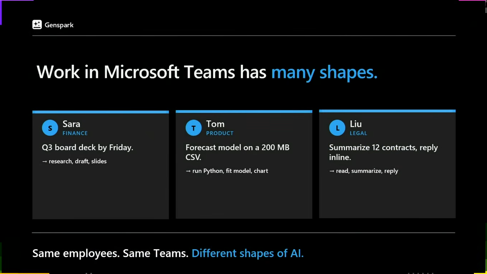
[00:39:01](https://www.youtube.com/watch?v=S8OtcBnfeGU&t=2341s)

So when combined with Agent 365, magic happens. So when we are served from the modern jobs, we found that there are kinds of type of jobs. For example, Sara from the Finance department, they -- she needs to Q3 the board's deck by Friday. So she needs to do some summarizing, make some slides. And Tom, he has more than 200 megabytes of the CSV to run over some -- to meet some powerful compute, to do some calculations and summarizations. So those two kinds of work need two kinds of AIs. For Sara, maybe she just needs some simple AI tools, just like chat-based tools. But for Tom, he needs dedicated virtual machines. With Agent 365, it actually provides developers like us the full flexibility to combine with the different types of the AI backend structure to integrate with Agent 365. So to me, Agent 365 it actually has a free primitives platforms.

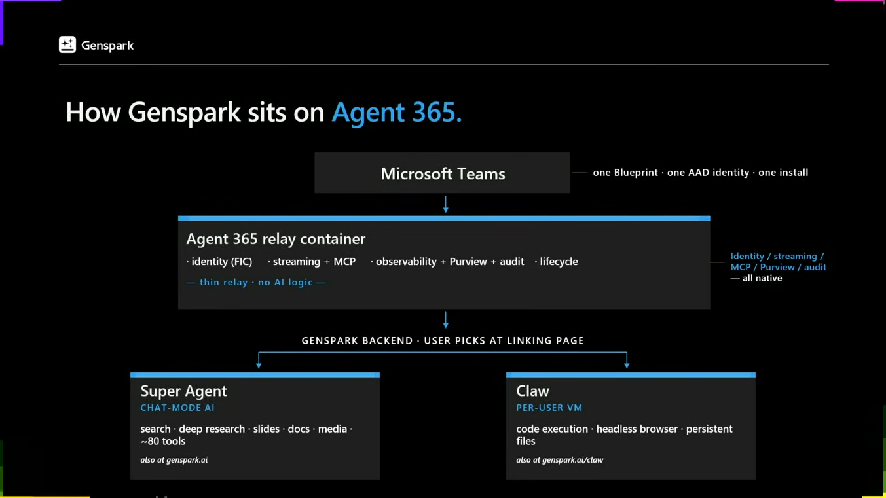
[00:40:33](https://www.youtube.com/watch?v=S8OtcBnfeGU&t=2433s)

One is the identity with the federal identity credentials. The second one is the unified UI -- UX interface. For example, like all the Microsoft 365 software switch, for example, Teams, Outlooks, Word documents, Word etcetera. And the third is the observability, Purview, Audit, and plus all the lifecycle management. Key is the architects how Genspark integrates with Agent 365 and build on top of Agent 365. So at the top level, there is Microsoft Suite, which has -- is Teams, Outlook, and Word structure. And the middle layer is a very thin layer which we integrated the Python SDK from Agent 365, which provides us the identity streaming MCP to course over Microsoft software. And the third one is the observability, purview, and the lifecycle management. Under the hood the third layer is actually the flexible backend we provided.

For example, the lightweight AI tools, Genspark chat-based AI tools, and the heavy-weighted compute resources like Genspark Claude dedicated VM provided with them. And here's how we integrate Agent 365. For example, for the identity, we just -- we authenticate each request from Teams and through our backends. We do not just do the single authentication at the beginning, we just -- we authenticate every message so that we can ensure the security. For example, someone from the Teams group chat mentioned your agent to asking for some private message from your agent. And the agent can themselves at that message and at that session can reauthenticate that it -- for that user is not from your agency and we just refuse that request. So with Agent 365, we do not need to build another authentication layer, we just reuse all of the capability provided by Microsoft.

And the second one is the MCP, which is the greater things we experience a lot. And because Agent 365 has already provided powerful MCPs, for example, connected with PowerPoints, Outlook, or Word, for example, and then each request comes through Genspark so we can just -- we can generate that our PowerPoints on the fly to a Word document on the fly, and why bear into the user's or the agent's OneDrive using the MCP? In that way, we don't need to build another storage layer for the -- for our users. And the third one, the last, not the least, is the most amazing part that Microsoft provides, is the observability, and the secure, and the governance.

So for the observability, every agency locations, inference, and all the activities that are already locked into Microsoft Purview so that the tenant's admin in the dashboard, they can monitor all the activities and -- but it's used in a single and unified place for the IT manager to observe all the activities of the agents.

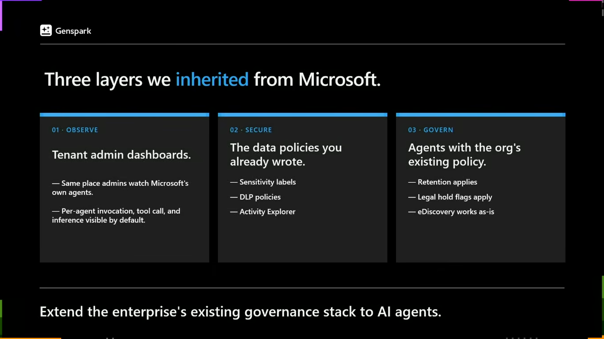
[00:44:41](https://www.youtube.com/watch?v=S8OtcBnfeGU&t=2681s)

And for the Purview, because the agent has its own unified identity and all the Purview policies have been already implemented in the enterprise you automatically apply to the agents so that the sensitive label on the Word document, we also apply for the agents so that the agents when the agents comment or leak something, sensitive information and the Purview policy can automatically block them. We don't need to implement another layer of the security layer ourselves. And of course, all the agents have their logs -- have unified their logs inside using the same Microsoft API so that the IT manager can use the same SQL purview to purview and analysis the agents' activities logs, combines all those things. Agent 365 actually provides the stability for the users so that the users can choose different kinds of the agent backends, for example, chat-based to authenticate VMs.

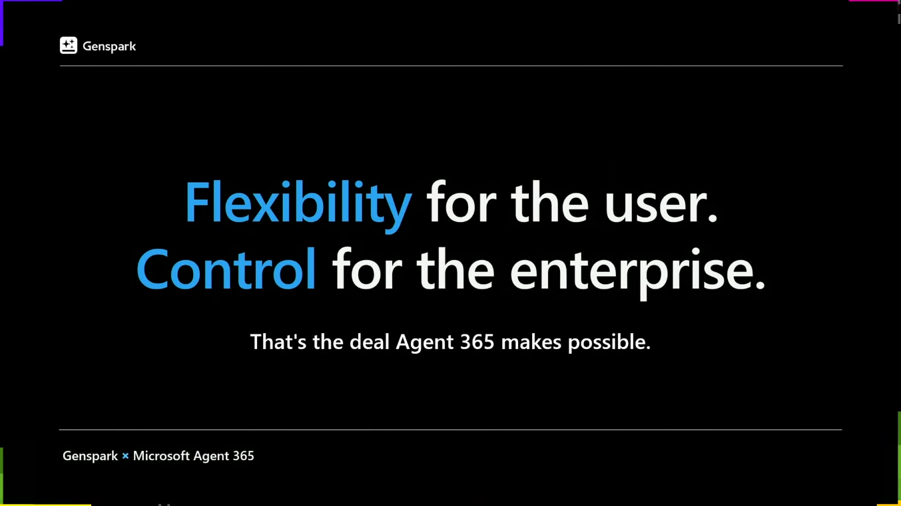
[00:46:10](https://www.youtube.com/watch?v=S8OtcBnfeGU&t=2770s)

**Ray Zhong:** And for the IT manager inside the enterprise, it still has the control for the enterprise, because all the activities, all the agents' logs have already been built on top of Microsoft provided APIs. And the manager, the IT manager in the enterprise can use the same existing tools to monitor, observe, and audit all the logs and activities. That makes the partnership of Genspark and Agent 365 great and our customers, enterprise customers love this switch a lot. For that, I'll come back to Neta. [ Applause ]

**Neta Haiby:** Thank you, everybody, and I'll close us off. You saw how you can build enterprise-ready agents with Microsoft Agent 365 with the -- how to integrate the SDK, how to observe, and secure, and govern your agents.

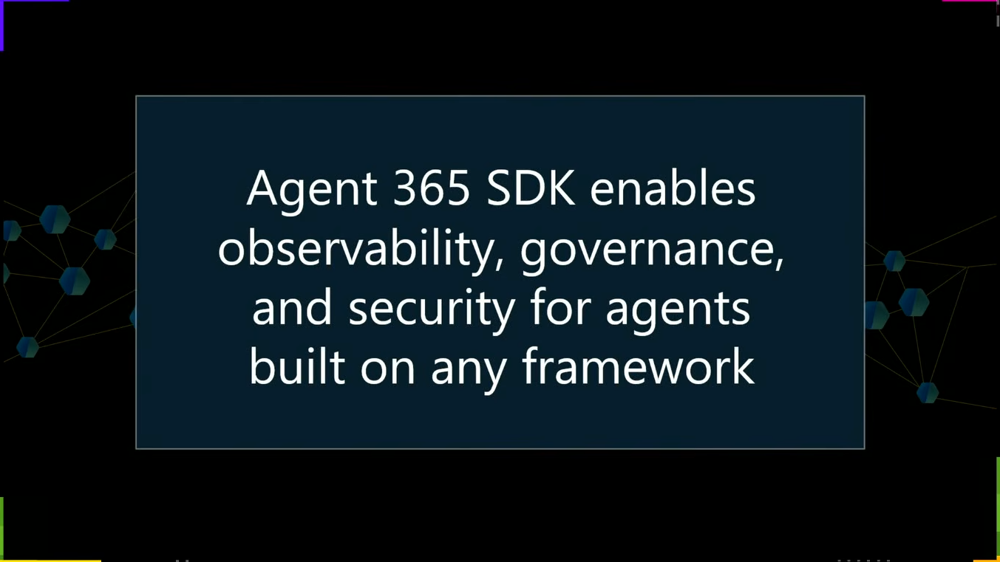
[00:47:04](https://www.youtube.com/watch?v=S8OtcBnfeGU&t=2824s)

We have some resources for you here, how to get started, how to get started with the SDK, and the recently-released blog.

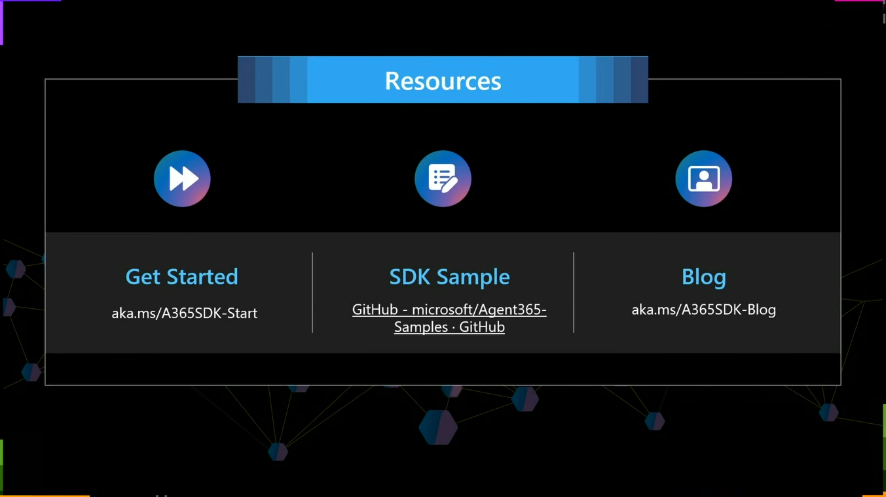
[00:47:13](https://www.youtube.com/watch?v=S8OtcBnfeGU&t=2833s)

I hope you enjoyed our session, and thank you, everybody, have a wonderful day today. [ Music ]
