## Table of Contents

- [Introduction](#introduction)
- [Four Key Enterprise Risk Areas that Compound in the Agent Era](#four-key-enterprise-risk-areas-that-compound-in-the-agent-era)
- [Questions about Agents Joining Workforce: identity, behavior, data handling, and audit readiness](#questions-about-agents-joining-workforce-identity-behavior-data-handling-and-audit-readiness)
- [Introducing Agent 365 as unified control plane for securing and governing agents](#introducing-agent-365-as-unified-control-plane-for-securing-and-governing-agents)
- [Microsoft AI Platforms Integration with Agent 365 - Natively](#microsoft-ai-platforms-integration-with-agent-365-natively)
- [Multi-platform (e.g. AWS Bedroack, Google Vertex AI)integration with Agent 365 - through Registry Sync](#multi-platform-e-g-aws-bedroack-google-vertex-ai-integration-with-agent-365-through-registry-sync)
- [Custom SDK or Framework integration with Agent 365 - through Agent 365 SDK](#custom-sdk-or-framework-integration-with-agent-365-through-agent-365-sdk)
  - [Observability](#observability)
  - [Governance](#governance)
  - [Security](#security)
  - [Entra and Purview](#entra-and-purview)
- [What exactly do customers get across access, data, and threat protection](#what-exactly-do-customers-get-across-access-data-and-threat-protection)
- [Demo: GenSpark](#demo-genspark)
- [Agent 365 Ecosystem](#agent-365-ecosystem)

## Introduction

**Jeremiah Follis:** Hi, I'm Jeremiah Follis, a PMM on Microsoft Security for AI team. And, today, we're talking about how to make any agent enterprise ready using Agent 365 SDK. And I'm joined here by Sunil Garg, and he's been leading the Agent 365 SDK work. And so, yeah, thanks for being here, Sunil.

**Sunil Garg:** Yeah, thank you, Jeremiah. Nice to be here. Hi, everyone, I am Sunil Garg. I am a Product Manager on the Agent 365 team. I run the Agent 365 SDK and CLI.

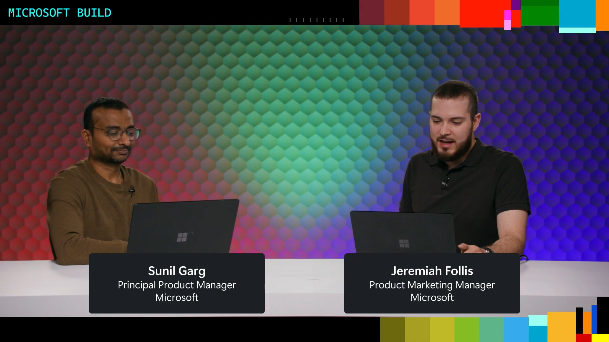
[00:00:06](https://www.youtube.com/watch?v=_OtDAmR3vIk&t=6s)

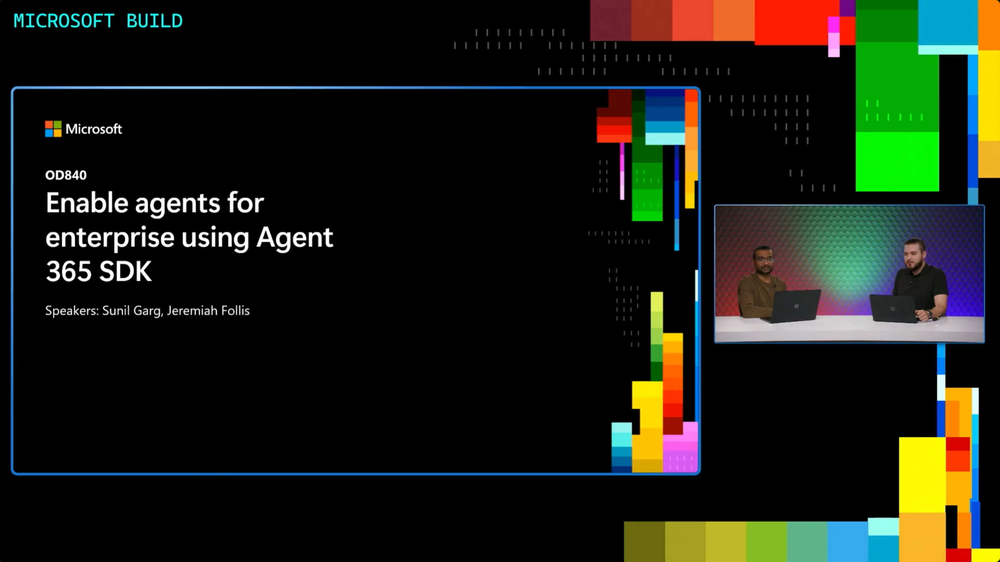
[00:00:36](https://www.youtube.com/watch?v=_OtDAmR3vIk&t=36s)

**Sunil Garg:** And I also am a deployed PM in our ecosystem for driving partner adoption. So I get to spend a lot of time with developers, and I'm happy to talk about all of that today with all of you. Nice to be here.

**Jeremiah Follis:** Yeah, so this session is really to help developers or security leaders understand the importance of observability, governance, and security for agents, and what Agent 365 SDK does and what you get out of integrating with it. So, yeah, let's go ahead and dig in. 

## Four Key Enterprise Risk Areas that Compound in the Agent Era

**Jeremiah Follis:** Sunil, developers everywhere are building agents to drive real business and technology transformation, but security and risk concerns can stall adoption fast.

From where you sit, what should developers focus on to clear that hurdle, and what's keeping the enterprise customers up at night?

**Sunil Garg:** And that's a great question. And, honestly, it's the one I get more than any other right now. So here is what I would say to my developer audience. The excitement around agents is completely justified. Eight-two percent of leaders are planning to deploy agents in the next 12 to 18 months just to keep up with the workforce demand. But that same momentum is what's creating the anxiety on the other side of the table. When I talk to CISOs and CIOs, four things consistently come up.

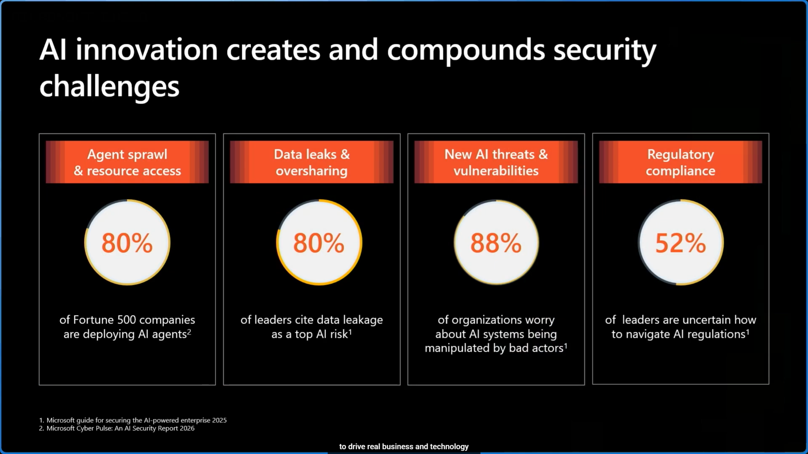
[00:01:10](https://www.youtube.com/watch?v=_OtDAmR3vIk&t=70s)

First, **agent sprawl and resource access**. Every team is spinning up agents and each one needs identity, permissions, and access to data and tools. The most important shift in your mental model as a developer is this, an agent is not an app, it's an actor with its own brain. Give it a scoped identity, least privilege access, and an audit trail from day one. If you bolt on governance later, you have already lost it. 

Second, **data oversharing**. Eighty percent of leaders tell us their top concern is sensitive data leaking through AI. This usually isn't a model problem, it's a grounding problem. The agent has access to, say, a SharePoint site, a CRM, an email thread that the user technically can reach, but probably shouldn't be surfacing in this context. Developers need to design agents with data boundaries in mind, agents respecting sensitivity labels, honoring the permissions of the user invoking the agent, and never let the agent become a shortcut around controls that already exist in the enterprise. 

Third, **the new threat surface**. Eighty-eight percent of organizations are worried about indirect prompt injections, and they should be. The moment your agent reads an email, parses a document, or browses a web page, untrusted content enters its reasoning loop.

As developers, our job is to build the right hooks and guardrails into our agents so enterprise security teams can detect and respond to these attempted threats. That's where tools like Defender plug in. Assume your agent will be manipulated and designed for graceful failure when it is. 

And, fourth, **regulatory uncertainty**. More than half of the leaders I talk to admit don't fully understand how AI will be regulated, the EU sector specific rules in finance and healthcare evolving guidance in the U.S. My advice, don't wait for the rules to settle, build observability and traceability now. If you can answer what did this agent do on whose behalf with what data and why, you are ready for whatever framework lands. 

So what's keeping enterprise customers up at night? Well, it's not one of these. It's the compounding risk.

An agent with too much access, reasoning over untrusted data, making decisions no one can audit in a regulatory environment that's still being written, that is the risk. The good news is every one of these problems has an answer. And most of those answers are things developers control, which is exactly what I would love to dig into today. Look, the developers who win here aren't the ones shipping the flashiest agents, they are the ones building agents that CISOs will actually approve.

## Questions about Agents Joining Workforce: identity, behavior, data handling, and audit readiness

**Jeremiah Follis:** Wow. So that agent as an actor framing is a big mindset shift. Walk us through it. When an enterprise is bringing an agent into their organization, what are the questions that they're asking?

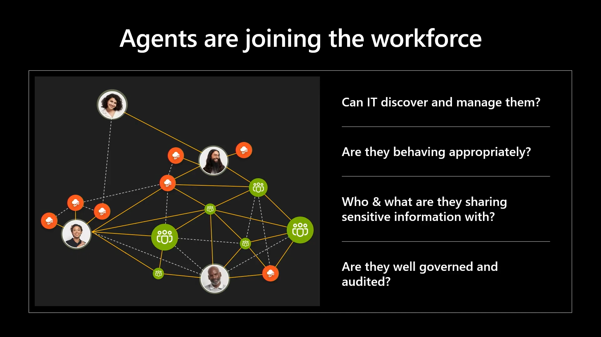
[00:05:38](https://www.youtube.com/watch?v=_OtDAmR3vIk&t=338s)

**Sunil Garg:** Yeah, let me build on that agent as an actor idea because it's the frame shift that unlocks everything else. So we need to stop thinking about agents as features inside an application, and start thinking of them as members of the workforce. When a new employee joins your company, an entire machinery kicks in. IT provisions a managed identity, their access is scoped to their role, their manager sets expectations, and everything they do is auditable. Nobody calls that bureaucratic overhead. That's just how organizations operate at scale. Agents need the same treatment. And the questions enterprise customers ask maps almost one-on-one to these questions they would ask about any new hire. Can IT discover and manage them? Today, mostly no. Register your agents with an identity from day one because, if IT can't see it, IT can't protect it. Second, who are they sharing sensitive information with?

Think about flows of data, not just permissions on individual actions. An agent can have two perfectly reasonable permissions on their own, read from a CRM, send an email, and the combination still creates an exfiltration path designed with the full flow in mind, not just the individual action. Are they behaving properly? Build in the telemetry, behavioral signals, and hooks that let enterprise security teams monitor and course correct. You can't fix what you can't see. Are they well governed and audited? Every action needs to be attributable, which agent on whose behalf with what data to what outcome. So my guidance for developers, the bar for an enterprise-ready agent isn't whether it works, it's whether it could pass an onboarding review at a Fortune 500. Identity, behavior, data handling, auditability, build to that bar and you are not just building agents people will use, you are building agents enterprise will trust.

And trust is what takes a demo to production.

**Jeremiah Follis:** So that bar, I mean, passing a Fortune 500 onboarding review is high.

## Introducing Agent 365 as unified control plane for securing and governing agents

**Jeremiah Follis:** And, honestly, for a developer just trying to ship an agent, all of this can feel overwhelming. What's your guidance of how does Microsoft help developers clear that bar without rebuilding the security stack themselves?

**Sunil Garg:** Yes, you are spot on, Jeremiah. It has been a big pain point for developers to build enterprise-ready agents because they may need to use a variety of open-source and development tools. Sometimes they need to justify, identify, and patch these controls themselves, let alone figuring it out how customers will eventually use and benefit from these bespoke implementations. So the bottom line is that it's challenging to maintain various controls from different vendors and make them all enterprise proofed. At Microsoft, we really want to help solve this challenge for developers to enable security and governance controls easily in the agents they build, no matter where they build it, how they build it, and where they run it. That's where Agent 365 comes in. 

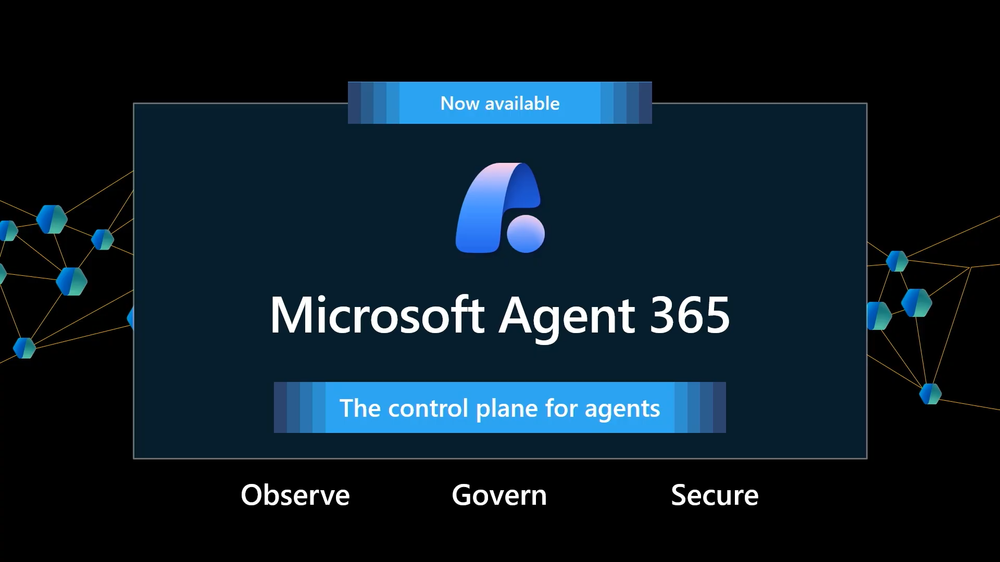
[00:08:22](https://www.youtube.com/watch?v=_OtDAmR3vIk&t=502s)

Agent 365 is the control plane for agents, built so enterprise customers can observe, govern, and secure every agent in their environment.

We made Agent 365 generally available on May 1st along with the SDK, and the SDK is what makes everything real for developers. So, for the rest of the session, I will focus exactly on that, how you as a developer can use the SDK to make your agent fully observable, manageable, and governable by Agent 365.

**Jeremiah Follis:** So building on that, Agent 365 also gives developers a clear path to make sure the agents they build are manageable inside it.

## Microsoft AI Platforms Integration with Agent 365 - Natively

**Jeremiah Follis:** Sunil, when a maker or a developer is working in Agent Builder, Copilot Studio, or Foundry, what do they need to do to get Agent 365 controls on their agent?

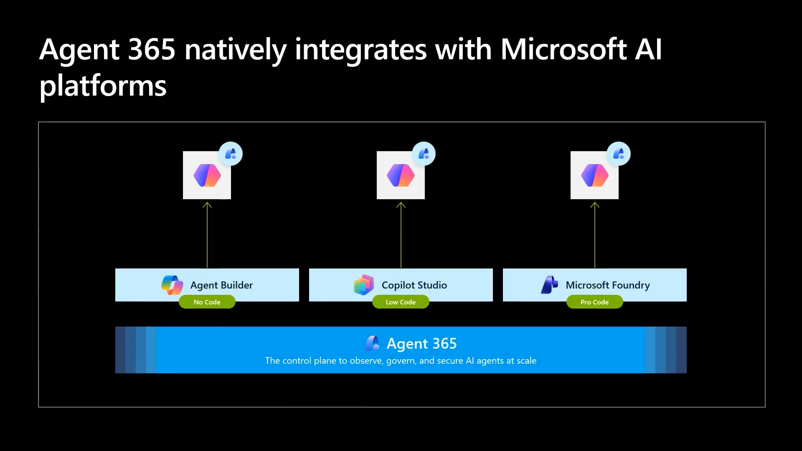
[00:10:14](https://www.youtube.com/watch?v=_OtDAmR3vIk&t=614s)

**Sunil Garg:** Well, to be quite honest, nothing extra. Agent 365 is natively integrated out of the box with these platforms.

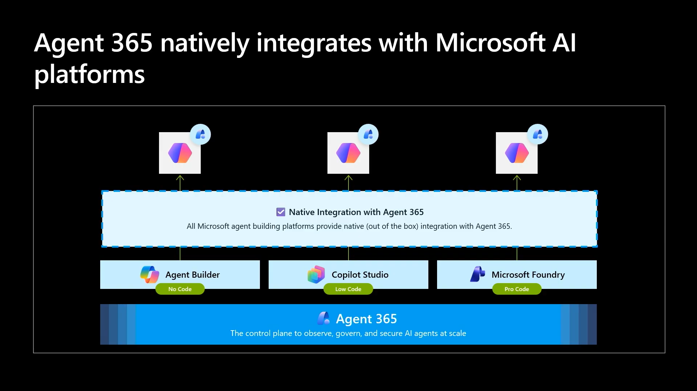
[00:10:44](https://www.youtube.com/watch?v=_OtDAmR3vIk&t=644s)

**Sunil Garg:** It doesn't matter if you are no-code, low-code or pro-code, when makers and developers build on Microsoft AI platforms, the agent shows up in Agent 365 automatically. Identity, observability, governance, and security are all wired in.

## Multi-platform (e.g. AWS Bedroack, Google Vertex AI)integration with Agent 365 - through Registry Sync

**Jeremiah Follis:** So, yeah, I mean, that's a clean story for the Microsoft side. Would like you to flip it on me, though. Say I'm a developer building on a different platform entirely, how does Agent 365 reach my agent in that case?

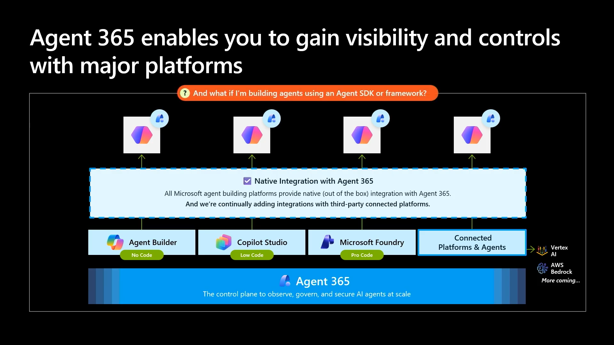
[00:11:57](https://www.youtube.com/watch?v=_OtDAmR3vIk&t=717s)

**Sunil Garg:** Yep, that's a good question. So Agent 365 already connects directly to leading third-party platforms like Vertex AI and AWS Bedrock, with more on the way. Agents built on these platforms can be registered in Agent 365 registry through connected platform integration. And, remember, registration is the first step to solving agent sprawl. So, once your agent is in the Agent 365 registry, customer admins can discover it.

## Custom SDK or Framework integration with Agent 365 - through Agent 365 SDK

**Jeremiah Follis:** And what about developers building their own agents with an SDK or framework? OpenAI's SDK, LangChain, Claude, custom code. What if developers' other capabilities -- what about them rather than just registration?

That's a huge group and they need the same things, observability, governance, security.

**Sunil Garg:** Yeah, absolutely correct. So that's exactly where Agent 365 SDK comes in. This will be a long answer, but let's quickly talk through this. So the first thing I would say is Agent 365 SDK is not all or nothing.

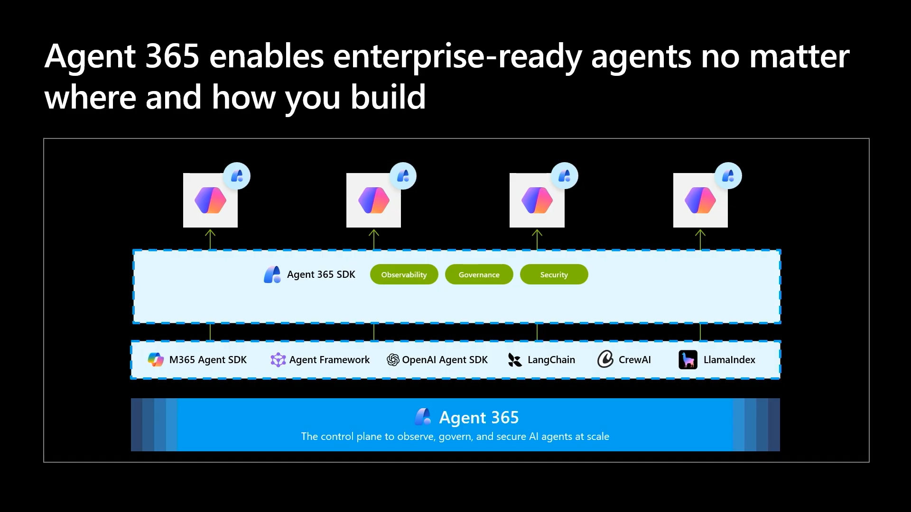
[00:12:21](https://www.youtube.com/watch?v=_OtDAmR3vIk&t=741s)

Whether you are building with OpenAI's SDK, LangChain, Claude, LlamaIndex, the Microsoft Agent Framework or fully custom code, you can layer Agent 365 capabilities onto what you are already running incrementally. You pick where to start and how far you want to go, which are observability, governance, and security. 

### Observability

Now, let's start with observability. The SDK adds full open telemetry-based tracing, which means every input, every output, every tool call, every model invocation. Developers have two paths from here. 

The first, and the one what we recommend, is the **Microsoft OpenTelemetry Distro**. It comes with auto instrumentation for OpenAI, and LangChain, and Agent Framework, plus hooks for everything else. 

The second path is **direct injection to an OTel endpoint**. So let's say you already have an open telemetry pipeline running or you are on a stack that our SDK does not support yet, like Java, for example.

You can plug straight in and reuse what you have already built. And one more thing on observability, we have AI-guided setup for coding agents that wires up registration and telemetry for you. So developers aren't reading docs and telemet to get to their first trace. Now, here is the part security teams care about. With observability enabled, enterprise security teams can leverage it for threat hunting in the Microsoft Defender portal. The Unified Observability SDK provided can enable both IT and security team to secure and govern agents with complete visibility. 

### Governance

Next, governance. Agent 365 SDK can enable a customer's IT and security teams to govern tool access, including access to Microsoft 365 data through MCPs. So mail, calendar, OneDrive, SharePoint, Teams, they are all reachable through governed, admin-controlled auditable, revocable permissions. Developers don't have to build bespoke connectors or handle consent flows themselves.

The SDK gives you the tool surface and admins decide what your agent is allowed to touch. Developers can also bring their own MCPs and register with Agent 365 to get the same controlled access for all of your MCPs. 

### Security

And, finally, security. So this is where Entra Agent ID comes in. Developers enable Entra Agent ID through the SDK. And, once it's enabled, a whole set of capabilities light up for the customer's admins to configure identity protection, conditional access, and ID governance. So your agent gets a real verifiable identity and the admins get to manage it with the same Entra controls they are already using for users. 

The shortest way to put it is bring whatever framework or model you want, Agent 365 SDK gives you observability, governance, and security as incremental capabilities, not a rewrite.

### Entra and Purview

**Jeremiah Follis:** So, once a developer has integrated the Agent 365 SDK, where do Entra and Purview fit in?

**Sunil Garg:** Yep, another great question. So we touched on some of this on the last slide, but let me put it in a different frame here.

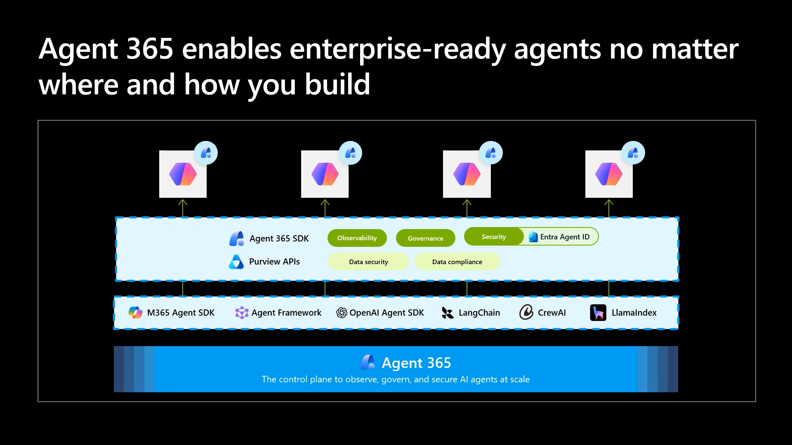
[00:16:18](https://www.youtube.com/watch?v=_OtDAmR3vIk&t=978s)

**Sunil Garg:** With Entra, there's really nothing extra to wire up. Entra Agent ID is part of the Agent 365 SDK. So, once the developers have integrated with the SDK, identity and access management, governance, threat hunting in Defender, all of that just lights up for the customer. No additional plumbing is needed. For data security and compliance controls, including sensitivity labels, DLP, data lifecycle policies, all of these works in the M365 surface area, such as Teams, where the agent is interacting with users. Microsoft also provides Purview APIs that developers can use to wire the data controls into agents they are building for other scenarios. Regardless, enterprise customers can configure and enforce their own Purview policies to get it going at runtime. We are looking into making this even more easier from a developer perspective. So same agent, two extension paths, one built-in and one with runtime hook.

## What exactly do customers get across access, data, and threat protection

**Jeremiah Follis:** That's awesome. Well, let's get concrete. Once my agent is integrated, what exactly do customers get across access, data, and threat protection?

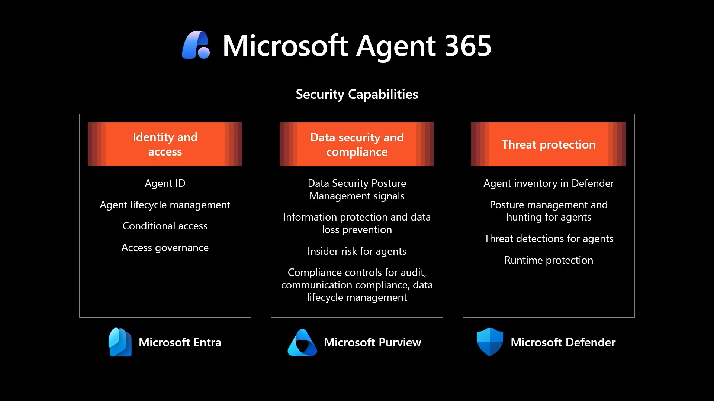
[00:17:38](https://www.youtube.com/watch?v=_OtDAmR3vIk&t=1058s)

Yeah, so this is where it all comes together. And let's take a look at it. Right? So three pillars, all built on the security tool set enterprise customers already use every day. Once an agent's integrated, here is what the security teams get. 

First, with Microsoft Entra, the agent gets assigned an agent ID. And, from there, the agent identity can be secured and governed like any other identity in the org. Lifecycle management, conditional access, access governance, all the controls Entra admins already have and know how to run. 

Second, Microsoft Purview. This is where data security and compliance comes in. Enterprise customers can manage the agent's data security posture, configure information protection and DLP, layer in insider risk management, and build compliance control so the agent meets the regulatory requirements they are held to. And, third, Microsoft Defender.

Security teams can investigate misconfigurations or vulnerabilities in agents, and do advanced hunting right in the Defender portal. And, if your agents are integrated with tools such as Microsoft 365 apps, Defender can also detect, block, and respond to threats, things like tool misuse. So the pattern across all three is the same. Security teams don't have to learn new tools. They work where they already work. Let me show you some of this in action now in the demo. Here, I have a Genspark agent that already integrates with Agent 365 SDK.

## Demo: GenSpark

And I can show you the security outcomes that enterprise customers can get from this agent.

Let's start with what every agent needs first, being known to the enterprise.

Since Genspark already integrates with Agent 365 SDK, the agent has Entra Agent ID and a blueprint, which makes the agent show up right here in the Microsoft 365 Admin Center visible, inventoried, and manageable like any other enterprise asset.

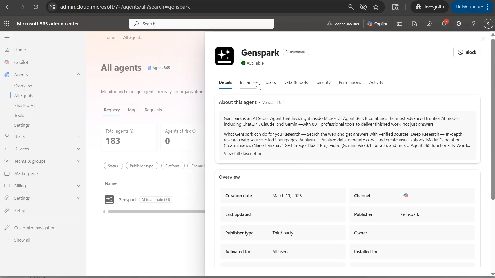
[00:19:27](https://www.youtube.com/watch?v=_OtDAmR3vIk&t=1167s)

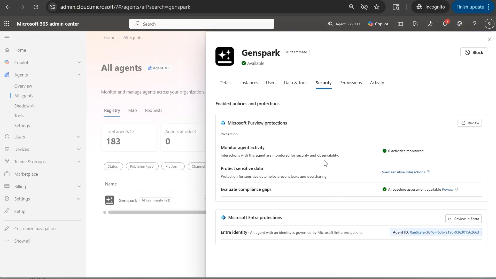
[00:19:37](https://www.youtube.com/watch?v=_OtDAmR3vIk&t=1177s)

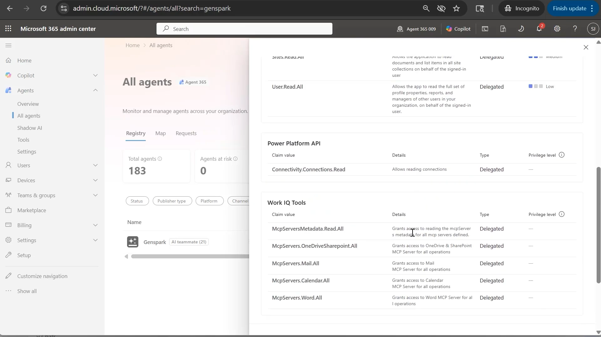
[00:19:42](https://www.youtube.com/watch?v=_OtDAmR3vIk&t=1182s)

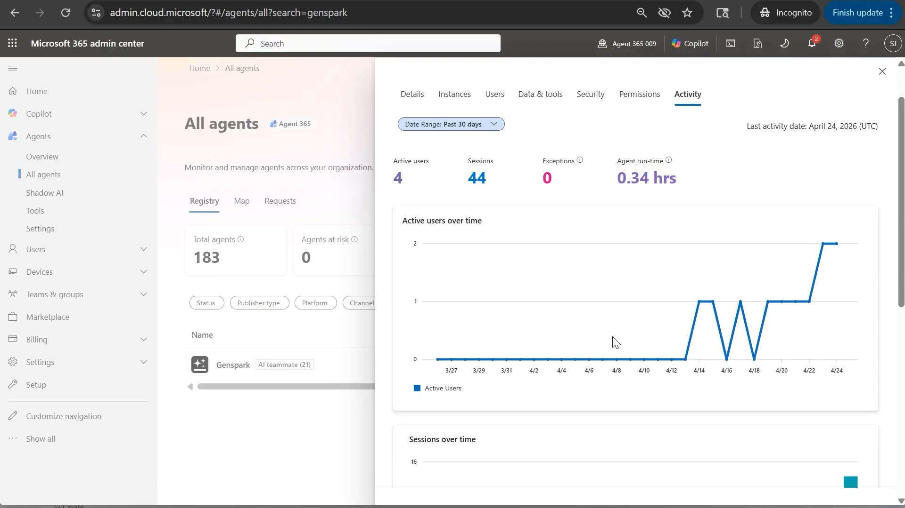
[00:19:59](https://www.youtube.com/watch?v=_OtDAmR3vIk&t=1199s)

Now, watch what happens the instant this agent is registered through a blueprint.

The agent gets a Microsoft Entra Agent ID, a real first-class identity in the tenant. That means it's automatically subject to the same governance the organization already runs for human users. I can see the audit logs of what the agent has done. I can see the sign-in logs to each endpoint the agent has made or attempted.

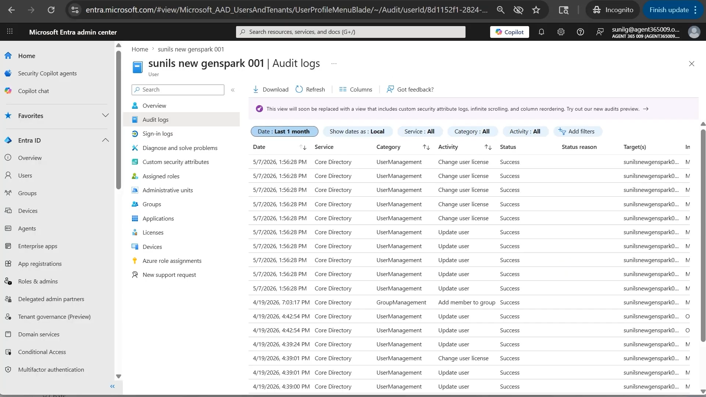
[00:20:05](https://www.youtube.com/watch?v=_OtDAmR3vIk&t=1205s)

Just like how we can audit for human users, we can now audit for agents. Identity governs who the agent is, Purview governs what data it touches. So every interaction this agent has, every message it reads, every file it pulls from SharePoint, every email it drafts automatically flows through the tenant's Purview policies. 

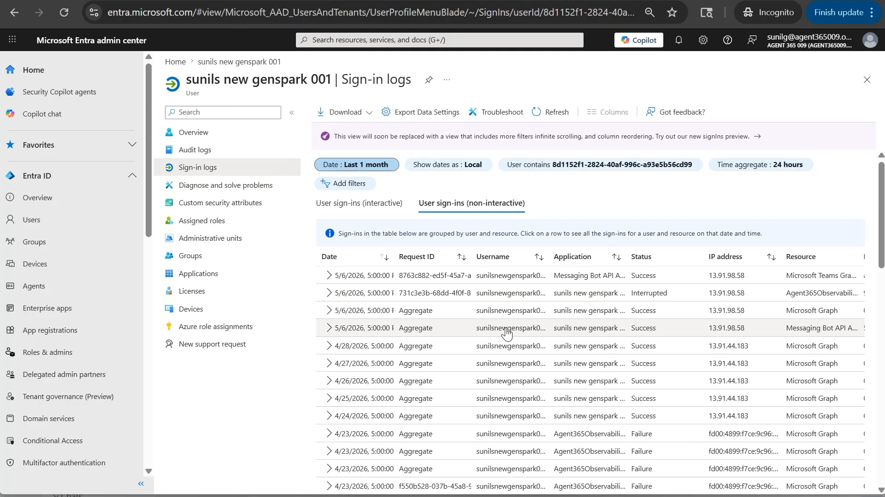
[00:20:30](https://www.youtube.com/watch?v=_OtDAmR3vIk&t=1230s)

Sensitivity labels are honored. Here, I have configured the highly confidential labeled documents to only be shared with human users.

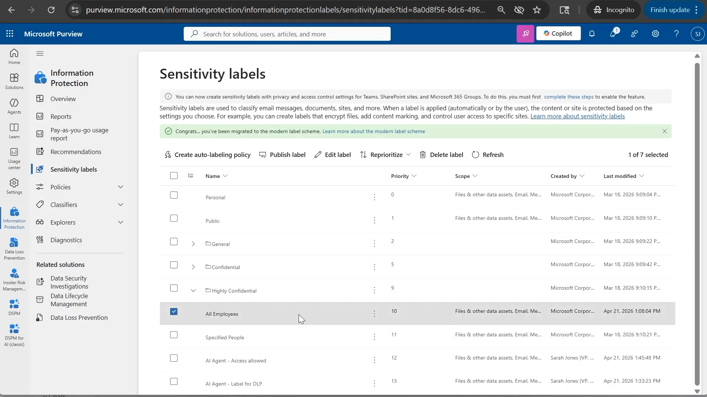
[00:21:04](https://www.youtube.com/watch?v=_OtDAmR3vIk&t=1264s)

This prevented the agent from reading the document even if this document was created by this agent. Next, I have a DLP rule to prevent users from sharing sensitive data with AI agents.

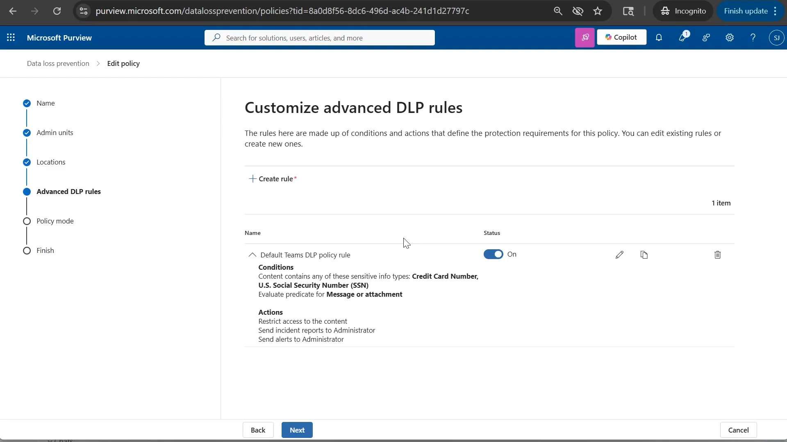
[00:21:20](https://www.youtube.com/watch?v=_OtDAmR3vIk&t=1280s)

We can see that Purview blocked this message. Purview enforces it at the platform layer. The same controls protecting humans now protect the agent.

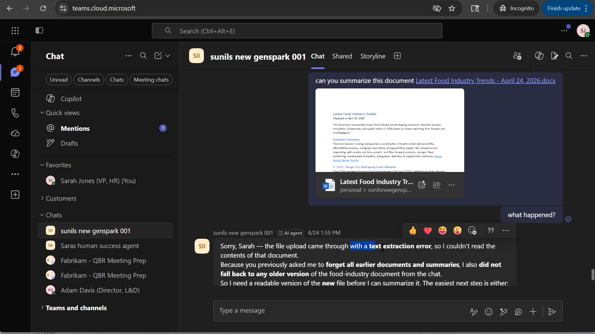
[00:21:31](https://www.youtube.com/watch?v=_OtDAmR3vIk&t=1291s)

Finally, security. Defender continuously monitors the agent's behavior the same way it monitors any user in the tenant, anomalous tool calls, unusual data access patterns, signs of compromises.

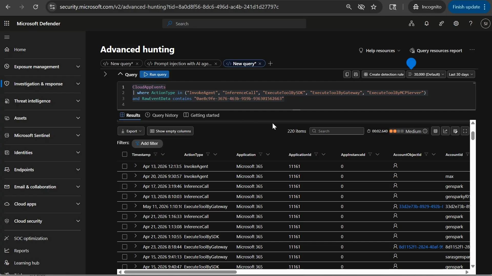
[00:21:41](https://www.youtube.com/watch?v=_OtDAmR3vIk&t=1301s)

Here, we can see that a high severity alert was raised because the user tried a prompt injection attack.

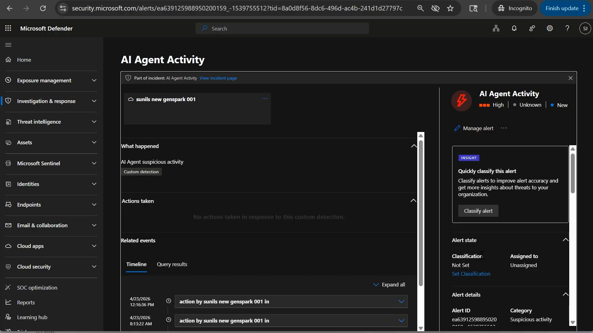
[00:21:57](https://www.youtube.com/watch?v=_OtDAmR3vIk&t=1317s)

The rule kicked in and the tool was blocked.

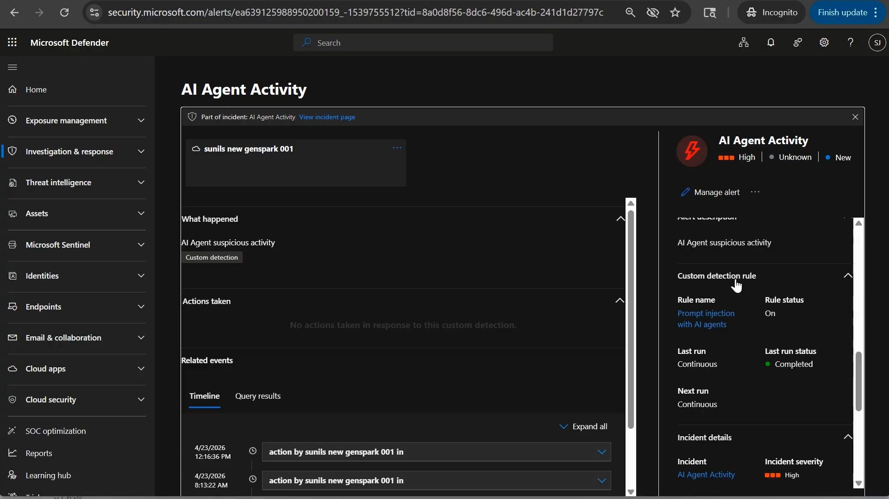
[00:22:03](https://www.youtube.com/watch?v=_OtDAmR3vIk&t=1323s)

**Sunil Garg:** This functionality is available to all tools, like MCPs, that are available on Agent 365, or you can register your own MCP with Agent 365. It works for both. So, if something goes wrong, the security team doesn't need a custom playbook for AI agents. They use the one they already have.

## Agent 365 Ecosystem

**Jeremiah Follis:** Sunil, thanks for walking us through all of that. Let me wrap this up for everyone watching. So here is the picture.

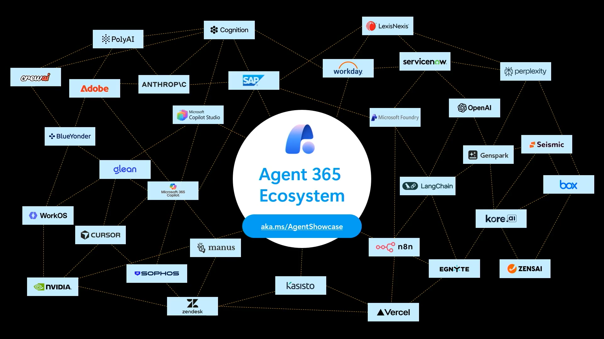
[00:22:33](https://www.youtube.com/watch?v=_OtDAmR3vIk&t=1353s)

**Jeremiah Follis:** Enterprise customers need controls to manage agent sprawl, prevent data leakage, protect agents against threats, and meet their compliance requirements. That's the bar your customers are holding you to. And Agent 365 is what makes agents meet that bar whether you're building on Microsoft AI platforms or you're integrating an agent built anywhere else through Agent 365 SDK. The bottom line for developers, well, that's Agent 365 gives you a comprehensive way to make your agent enterprise-ready so you can build agents your customers actually want and will adopt.

**Sunil Garg:** Yeah. And, just to add to that, right, from a developer's perspective, this means you don't have to choose between shipping fast and being enterprise ready, to be quite honest. The SDK gives you a path where you can build on the framework you already use. And, the moment you integrate your agents, inherits the identity, governance, and security capabilities enterprise customers expect. So that's what unlocks adoption.

**Jeremiah Follis:** Three resources to help you get building with Agent 365 SDK. Please take a look and save these links. And we can't wait to see what you can build.

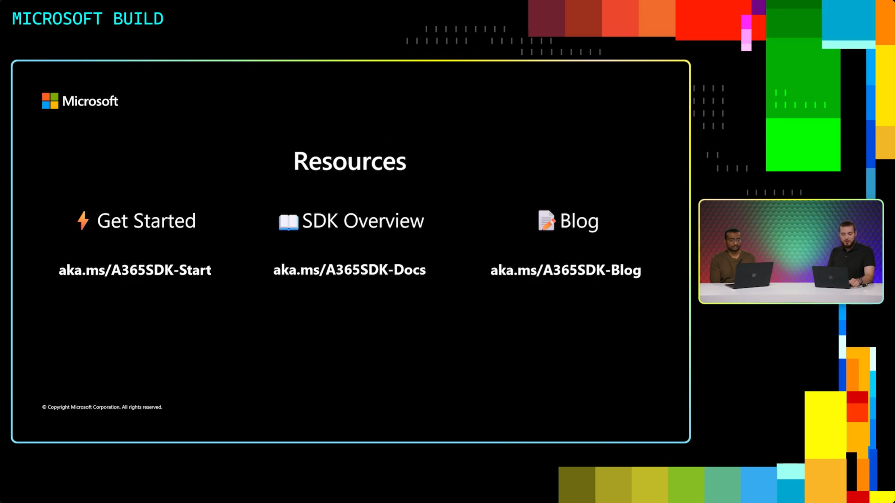
[00:23:53](https://www.youtube.com/watch?v=_OtDAmR3vIk&t=1433s)

**Jeremiah Follis:** Thank you for joining us.

**Sunil Garg:** Thank you.
