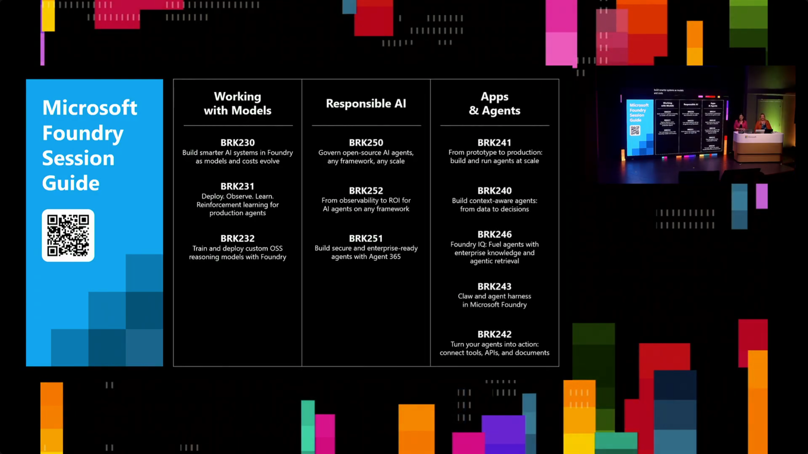
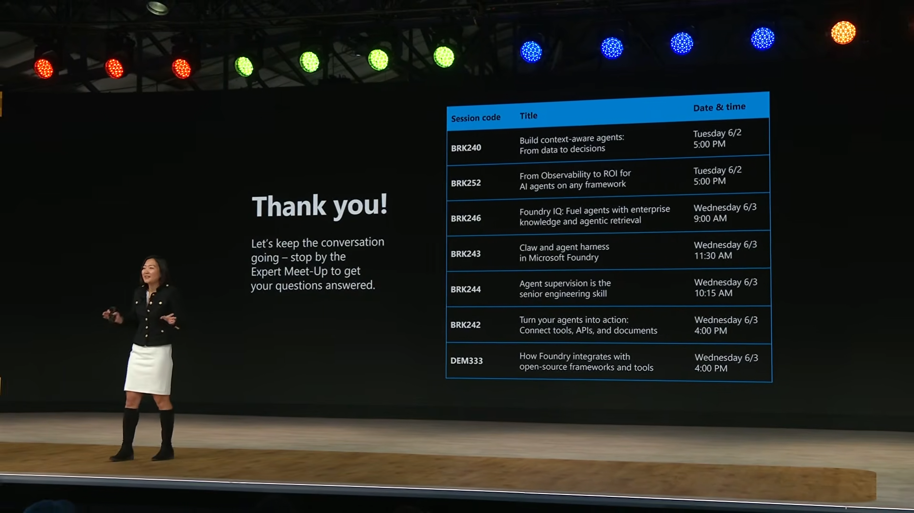

# Microsoft Build 2026 Session Notes

This repository collects notes, transcripts, screenshots, and summaries from Microsoft Build 2026 sessions.

## Sessions

| Session | Notes |
| --- | --- |
| Opening Keynote | [`opening-keynote/build_2026_opening_keynote.md`](opening-keynote/build_2026_opening_keynote.md) |
| BRK230 - Build smarter AI systems as models and costs evolve | [`BRK230-build-smarter-ai-systems-as-models-and-costs-evolve/BRK230_build_smarter_ai_systems_as_models_and_costs_evolve.md`](BRK230-build-smarter-ai-systems-as-models-and-costs-evolve/BRK230_build_smarter_ai_systems_as_models_and_costs_evolve.md) |
| BRK241 - From prototype to production: build and run agents at scale | [`BRK241-from-prototype-to-production-build-and-run-agents-at-scale/brk241_from_prototype_to_production_build_and_run_agents_at_scale.md`](BRK241-from-prototype-to-production-build-and-run-agents-at-scale/brk241_from_prototype_to_production_build_and_run_agents_at_scale.md) |
| BRK245 - Build the thing that builds the thing | [`BRK245-build-the-thing-that-builds-the-thing-by-peter-steinburger/peter-built-and-talked-about-summary.md`](BRK245-build-the-thing-that-builds-the-thing-by-peter-steinburger/peter-built-and-talked-about-summary.md) |

## Recommended sessions

### Yina recommended sessions

### Tina recommended sessions

