# Session metadata

**Event:** Microsoft Build 2026  
**Date:** June 2 to 3 2026  
**Session Name:** Opening Keynote  
**Speaker:** Satya Nadella  
**Video URL:** https://www.youtube.com/watch?v=FFMm454fxNA

**Microsoft Build\
June 2-3, 2026\
Session: KEY01\
Speakers: Alex Pall, Amanda Foster, Cassidy Williams, Cristiano Amon, David Carmona, David Shaw, Drew Taggart, Elijah Straight, Gianrico Farrugia, Jensen Huang, Kayla Cinnamon, Mustafa Suleyman, Peter Steinberger, Sabrina Maniscalclo, Sabrina Maniscalco, Samantha Song, Sarah Young, Satya Nadella, Scott Hanselman, Steven Bathiche, Tanaya Yadav**

**\[ Music **\]

**Satya Nadella:** All right. 

Good morning! 

**\[ Cheering **\] **\[ Applause** \]

 Good morning! 

**\[ Applause **\]

It's fantastic to be back in San Francisco at Build. It's always fun to be at developer conferences at times of great change. You know, developer conferences are always about understanding tech shifts, understanding the new stack. But it's also about really coming to grips with the new opportunity, right, for us as developers, for the companies that we work at, as well as the broader world. 

So today we're going to unpack this. This conference is all about that. And if there's **one key takeaway**, it would be this: How do you all participate fully in thisFrontier intelligence ecosystem? 

Right? It's not about any one piece of technology that you'll hear about or even the platform itself. It's about the value that you can build, you can compound, you can create on top of the platform. That's what a developer conference needs to be about, and that's what we will focus on. 

So let's kind of get into it. Let's take a look at this AI stack that this conference is going to unpack in a great amount of detail. 

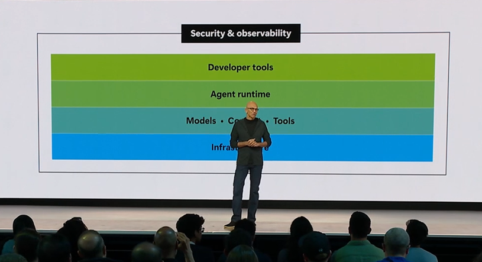

It starts, of course, with the compute fabric, right, that ubiquitous compute fabric that spans the edge and the cloud. 

You then have this layer, which is the emerging layer, where you have the models, you have context, you have the tools the models can access. And then on top of that, you have the runtime where you deploy your agents and applications that you built on top of the context layer, on top of the model layer. And then, of course, you have the best tooling to do all of this. And then you have the security, the compliance, and the governance, right? That's the simplest form of the tech stack. 

But let's kind of start where it always starts, which is **infrastructure**. 

# 1. Infra

## 1.1. Infra - Edge

### 1.1.1.      Expand Windows AI APIs to more PCs

And, in fact, let's start at the edge with **Windows**. Because when you step back, the amount of compute there is at the edge is actually astounding, right? I mean, think about every NPU, GPU, CPU even, every PC. If you sort of aggregate that, that's a lot of compute power. 

So we asked ourselves one simple question, right? **If we can deliver unmetered intelligence to every desk and every home**, right? It takes us all the way back to the very beginning. 

But that's what we said. Can we do that in this era of AI? And, in fact, we're, in some sense, delivering that already today, right? When you look at something like, say, Outlook Summarize, it's actually using onboard AI locally. 

Same thing with PowerPoint alt text or Team Super Resolution. It's just not Microsoft stuff. For example, Adobe After Effects or Premiere are both using Windows ML across NPUs and GPUs for local processing. And so today one of the things that I'm really excited about in order to tap into **all this compute power is to expand the scope of Windows ML and Windows AI** right? So **you now have the full install base of GPUs that you can get to**.

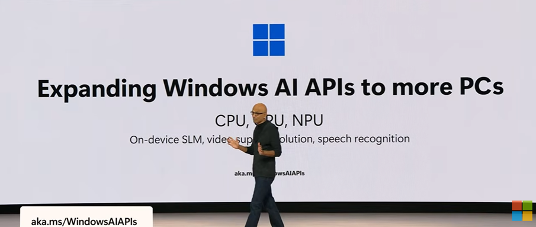 So I'm really thrilled that **every developer out there can count on building for local onboard AI and then have it run across all of the install base**. 

 

### 1.1.2.      Aion 1.0 Instruct and Aion 1.0 Plan

 

Now, we are also announcing **two very cool new models that are all going to run on Windows Inbox**. 

(onscreen URL: aka.ms/Aion1)

The first is a new SLM. It's sort of a more efficient model, **Aion Instruct**, and it's a great reasoning model. 

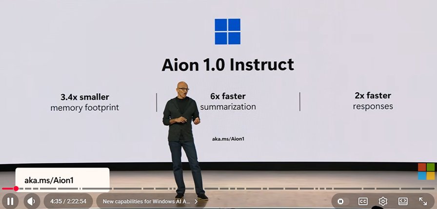

And then we have the planning model, **Aion Plan**, which is a local agentic loop. 

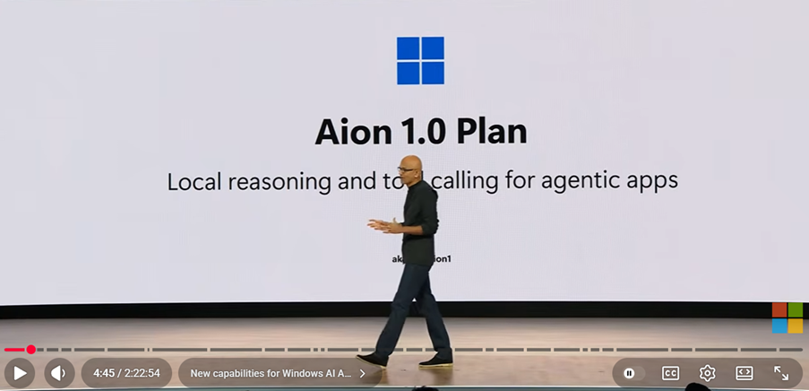

I mean, think about it, right? **You now have a full local agentic loop. You can give it tools access and build fully onboard agentic applications without having to round trip to the cloud**. 

And of course, we said, in order to really push the limits, realize this unmetered intelligence, there's also a lot of hardware that's evolving, too. And so, we're thrilled to see the innovation across the Windows ecosystem, right? 

It's **AMD** with their Ryzen processors. The Panther Lake stuff from Intel is just exciting to see. **Qualcomm** announced two sets of things which are great. One on the high end with Snapdragon X2 Elite. 

And then on the low end, even for sub-500 PCs with Snapdragon C. So it's great to see all of this. And, of course, that brings us to **NVIDIA** and **RTX Spark**. This is a next-generation SoC for PCs. It **brings together the CPU, the GPU, as well as the AI capabilities into a single SoC**. And that's the exciting part. 

And it includes unified memory architecture and also the integrated DRTM, right? So you now have all of the systems innovation and the SoC coming together. And **we're really thrilled that one of the first devices that we built was the Surface Ultra**, right? It's a beautiful device. And it really brings the power of NVIDIA together with the design and the craftsmanship of Surface. It's 128 gigabytes of unified memory. It's a beautiful 2,000-NIT display. 

And it has an all-day battery life. And so, we are very excited to see this later this fall. And it's also wonderful to see all the designs from all the OEM partners who are building taking advantage of this new SoC and the new platform and bringing out some pretty exciting machines that are going to be all available come this fall. 

### 1.1.3.      Surface RTX Spark, Dev Box

And so, of course, we said, okay, this is fantastic. What can we do next? So, we said, let's try and push this and push the architecture to its limit for developers, right? What if we could just **max the compute, max the memory, build out that developer machine that's the dream machine? And that's what we're announcing today - Surface RTX Spark, Dev Box.** 

**Let's roll the video. **

**\[ Music **\]

**Satya Nadella:**  All right. 

**\[ Applause **\]

 Yeah, this is truly a dream machine. It's got **one petaflop of AI compute, 20 CPU cores. All of those things have 128 gigabytes of unified memory access**. So super excited about this coming in the fall and you can join the waitlist. 

I'm on the waitlist as well, so -- 

**\[ Laughter **\]

 -- we'll get there. You know, so then we said, why stop there? We said, what if we did one more thing? 

And in fact, I think Jensen did that already. And he said, Windows is coming to the DGX station. So a new, I describe it as the desktop data center, which you can have right there and running a **one-trillion parameter model locally**. 

I mean, just to sort of put it in perspective, it's pretty close to what perhaps we had when we built GPT-2.5 or 3, right, one of the first supercomputers. So it's pretty crazy to think that we've come this far **where you can now have a data center on your desktop**. And of course, we're extending the developer endpoints even to the cloud. 

### 1.1.4.      Demo: Surface RTX Spark – Dev Tools

**\[ Applause **\]

**Kayla Cinnamon:** Our team has been working hard to make Windows a great place for development. And today, I'm going to show you some major improvements and delighters you can try out today. So what we have here is the default experience on the Surface RTX Spark Dev Box. 

Right away, it feels calm. There's no news feed, no widgets popping up, no notifications, and of course, we're in dark mode. I'm immediately ready to start development. Well, there's one thing I'd like to change. I like to put my taskbar on the left. So let me jump into my taskbar settings using the new Run, which is built leveraging the architecture of PowerToys command pallet. No, no, no, I want it all the way on the left. There we go. 

After popular demand, we're excited to announce that **vertical taskbar is now available in Windows Insider builds**. 

The new Surface RTX Spark also has **a bunch of key dev tools already installed, like Python, Node**, and many more of your favorites. All of the developer goodness, all in one file. And if you want to get the same experience today on your device, we're making this file available to everyone right now. **We have a public repo set up with the configuration file and instructions for how to apply it using Winget Configure which will make the adjustments to Windows and install all the tools.** Now, one cool thing that I have running here is PowerToys' new utility called "Grab and Move", which lets you hold "Alt" and move the window around from anywhere. 

Another tip is that you can enable "end task", which lets you end the process without having to open Task Manager. 

So let me jump into my **dev drive**. Dev drives run on REFS with Defender running in async and are optimized for performance when it comes to development scenarios. Also, **File Explorer is "Git-aware"**. We've got stuff like "last change author name", "last change message", the status of each file. 

Plus, my favorite is that the branch name is on the bottom left. So now let's get started building and open our terminal. 

This is an experimental experience called, "**Intelligent Terminal**", that makes working with agents even more seamless. 

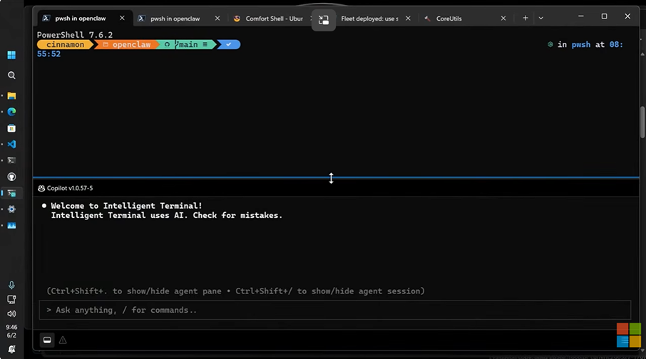

When you first install Intelligent Terminal, you're greeted with the option to pick your favorite agent. I'm going to use GitHub Copilot for today, but you can use whichever agent speaks to you. Now here in Intelligent Terminal I have a regular terminal pane at the top and an agent that's listening on the bottom and I can work between them while the agent helps along the way. So for example, here's an error being generated. My agent pane is able to detect it and provide a fix, which is great when I don't remember the syntax, especially for something like RegEX. 

So I'm going to work on OpenClaw, and I've already built it using **WSL Container**. WSL Container is **a native container experience on Windows, plus it can leverage the GPU**, which is perfect for the Surface RTX Spark. It can also reference your existing container files, just like the one in the OpenClaw project. 

So here's one of the files open in Microsoft Edit, which ships in Windows by default and just got syntax highlighting in its latest version.

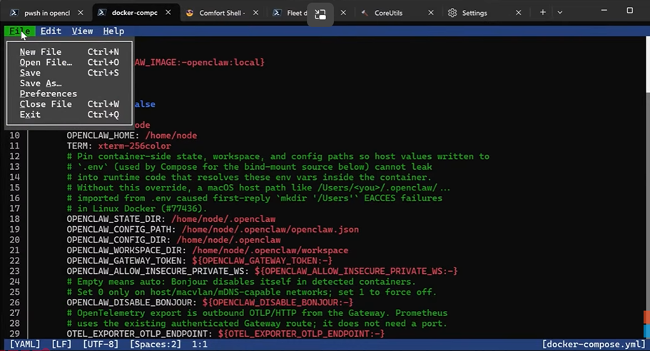

 And then you can also just see your containers running with a simple container images command. 

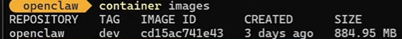

And since we're on the topic of WSL, we're providing a WSL profile that's designed to feel comfortable for those of you who use tools like Starship, Zsh, and Homebrew. So it comes pre-configured with all of your favorite utilities, and it's available in the repo that I showed earlier. 

And it also includes one of my favorites, BTOP. 

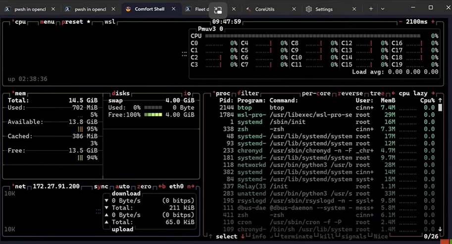

So the Surface **RTX Spark is designed for developer heavy workloads, including serving large local models for coding**. I've already done some development with a **120 billion-parameter model** that most machines can't even load. So here's a quick view of my usage, and we can see how many tokens I've used locally. 

So we're looking at about 3.4 million tokens leveraged on the device itself. Now, we can kick off multiple sub-agents using Fleet. 

And just so we don't have to watch me type, I'm going to use **Copilot's Voice feature**, which is also leveraging its own local model. 

So I'll just hold "Spacebar" and tell it what I want it to do. Find any console.writeline or debug.writeline calls in the tray and node projects and convert them to the standard logger used elsewhere in the codebase. There we go. 

Now, the main agent will delegate sub-agent tasks of appropriate complexity to the local model, utilizing my GPU and making it more cost efficient. Now, as developers, while we're debugging, we're often looking through log files to diagnose any issues. Sometimes finding the location of the log files is a challenge. I'd love to be able to just type something like "grep log" and find them all. Ah, sweet. So on top of already adding curl tar and sudo to Windows now **we're adding over 75 command-line utilities like env head tail and touch for those of us who love to live in the terminal**. 

So I found all my log files, but now having to parse them is the second challenge. Well, I've actually had **Aion Instruct proactively performing analyses on my log files** this whole time. Now I can quickly diagnose anything that's gone wrong in my development, plus I don't have to worry about token usage because it's all local. We can even take a look at our machine's resources. The models are loaded, and you can see **90 gigs of RAM being utilized by the GPU**, truly showcasing the full power of the Surface RTX Spark. 

We were able to use three local models simultaneously, unmetered, while going up our regular dev flow without a hitch. That's huge. 

**\[ Applause **\]

 So, I know you're going to love what the team's been working on. We hope it gives you a glimpse of what's possible on Windows today and where we're headed next. Thank you. Back to you, Satya. 

**\[ Applause **\]

**Satya Nadella:** Yeah that's really the beginning of this idea of unmetered intelligence having those models and having the agents using the models work in parallel to what you may be doing along with the cloud as well. And that, I think, is what the platform enables as first class. 

### 1.1.5.      Windows 365 is dev maxed

**Windows 365 now has the developer distribution that's optimized for developer productivity in the cloud.**

**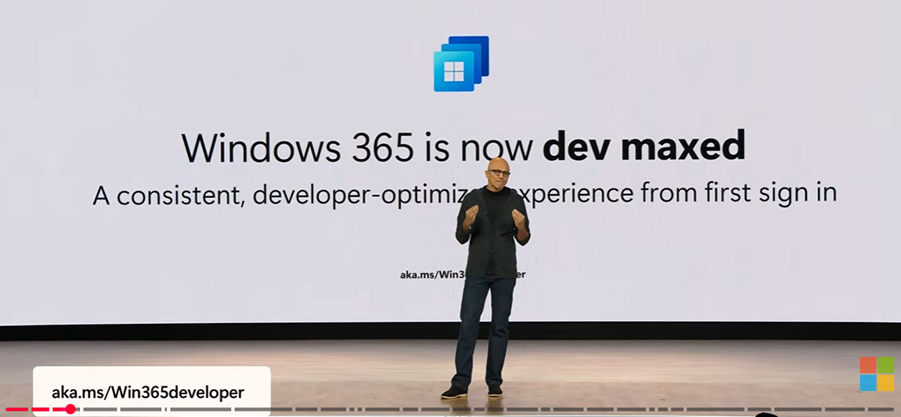**

(onscreen URL: aka.ms/Win365developer)

 So that's the Windows 365 that I use every day. And it's simply about making Windows, whether it's on the laptop, the desktop, the cloud, wherever -- the best place to build. And so, to that end, we have tons and tons of updates, right? We're starting, by the way, with one of the favorite things for all of us, which is **distraction-free dev environment**. We're also introducing an **intelligent terminal**, which has got built-in GitHub Copilot, right? Terminal with sort of the Copilot intelligence. And of course, there's lots and lots of **Linux love** across Windows now. So you have **70-plus utilities**. So GREP, in full glory, is now available for regular Windows access. 70-plus utilities, as I said, all of that is coming to Windows. 

We're also bringing **things from the Mac** that you love, things like **Starship, Z Shell. Homebrew is going to be native on Windows** as well. So you'll be able to switch to Windows. 

And today, we're announcing **WSL containers**. This has, I know, been a point of pain when you're managing all these environments, switching all the mental gymnastics of trying to keep this straight. 

So having first-class support for containers will really help us be in the flow when you are building and deploying locally. 

And to show you all of this on our new Surface RTX Spark, I wanted to invite up on stage Kayla to just take a spin through all the dev tools. Kayla, go ahead. 

## 1.2.         Infra - Cloud

 

### 1.2.1.      Data Center

Now let's move to the cloud. You know, the driving equation for us remains the same, which is **tokens per dollar per watt. How do we optimize around this**, right? 

So when we think about the systems problem, we think about electrons coming on one end and tokens on the other end, and how do we think about the systems optimization end-to-end? It starts with the **data center design** itself, right? 

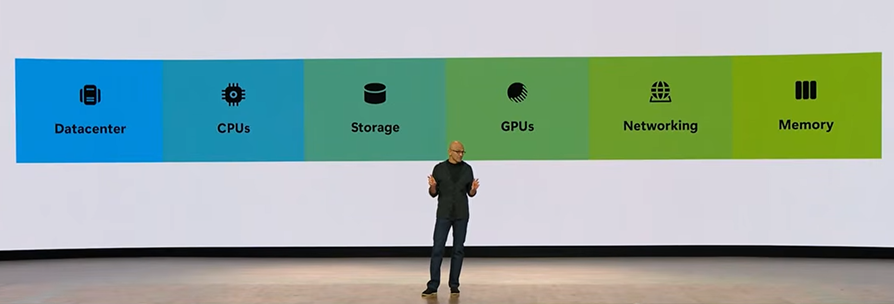

The core compute, storage, network, all the accelerators that go into accelerating each of those components. How do you even think about the DC-to-DC connectivity and the networking, as well as the offload to something like the local compute, right? That's the sort of systems challenge. 

But before we even get into all of the systems and the technology and the innovation perhaps the most important design criteria for us is how do we earn the permission from the communities in which we're building these data centers? And that's where these principles ground us and focus us. 

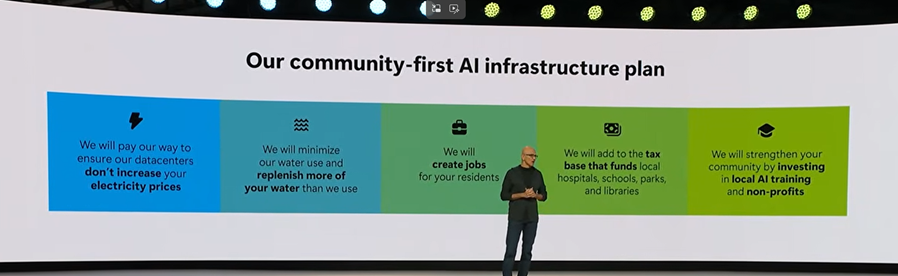

How do we ensure that the DCs do not increase the electricity prices? Making sure that we are replenishing all our water use creating jobs in the local communities for the local residents adding to the tax base making sure we are strengthening the communities by investing in local training and the nonprofits in the area. 

Only when we live up to these principles, do the hard work around it, is when we earn the permission to go ahead and innovate and build. 

And we've been doing a lot of data center build-out. Today, **Azure spans more than 500 data centers in 80 regions**. It's the most expansive, you know, we have the most expansive hyperscaler footprint out there. And **we have added more data center capacity in the last 18 months than the first decade of Azure**, just to put that in perspective. 

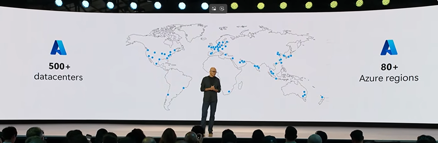

But more importantly, what we are building is also very different. In fact, the first 15 years or so, you know, we built out the commercial cloud infrastructure for a set of heterogeneous, you know, workloads that spanned the enterprise. But now when you look at what we are building, right, when you think about all the gigawatts that were going to come online, really, they have **three dominant workloads**. 

There is **training**, there is **inference**, and then there is the **agent runtime**, right? These are three dominant workloads. And in fact, when you look at **Fairwater**, it was sort of **our first AI super-factory**. 

You know, it spanned two regions, Georgia and Wisconsin. **The entire system was designed from the ground up for AI**, right? We worked, in fact, very closely with even NVIDIA on this. 

It's a two-story architecture that lets us essentially place racks, obviously, in three dimensions and pack the maximum number of GPUs densely with network access. That means you've really got fantastic higher-performance networking, lower latency, and more effective bandwidth across the entire cluster. 

And we're rethinking even the power delivery, right? 

So we started, okay, how do we deliver hundreds of kilowatts per row while minimizing all the loss, right, which is the conversion loss that happens from the grid to the silicon. So we basically sort of even took a new approach to it. And all of this also changes with the cooling system, right, and water. So in fact, the cooling loop is filled once, and the data center can operate effectively with zero water consumption. 

In fact, **the daily water usage over the course of an entire year is roughly equivalent to what a single restaurant would use**, right? I mean, that's -- 

**\[ Applause **\]

### 1.2.2.      First-party Silicon

 And when it comes to **the systems and the silicon**, again, we have a lot of choice. We have first-party silicon. We have partner systems. 

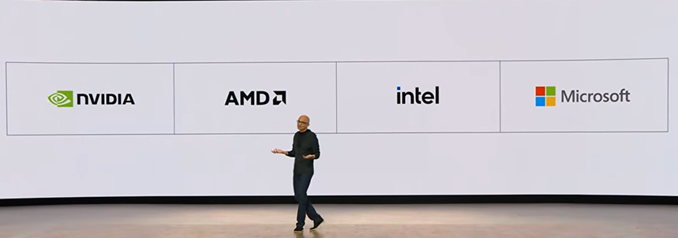

We were the very first cloud to bring up, in fact, **NVIDIA's Vera Rubin system for validation**. Very exciting to see that. 

We're working closely with **AMD**. We worked with them on MI300. Now we're working with them on their next-generation AMD GPUs. 

**Maia 200** is continuing to scale.  In fact, it's live in Iowa and Arizona. We'll deploy it internationally later this year. 

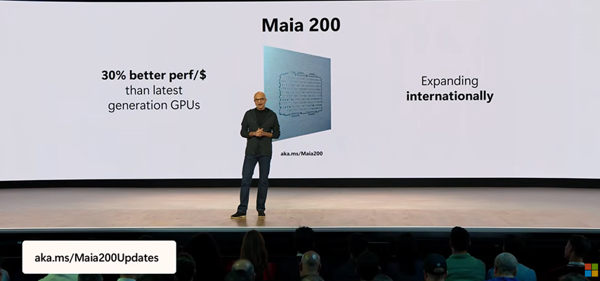

(onscreen URL: aka.ms/Maia200)

It delivers 30% improved tokens per dollar compared to sort of what's the leading GPU today. And we have validated it with 5.5, GPT-5.5, and we are going to use that to power Microsoft 365 Copilot. 

### 1.2.3.      First-party CPU

And so, when it comes to running these agents, the interesting thing now is it's no longer just about having an AI accelerator or a GPU. The **CPU** is really critical. 

In fact, the ratios may be even coming to one is to one. And that's why we are innovating with Cobalt. We're announcing the preview of Cobalt 200 VMs our next-generation ARM-based CPU designed for both cloud-native and agent workloads today.

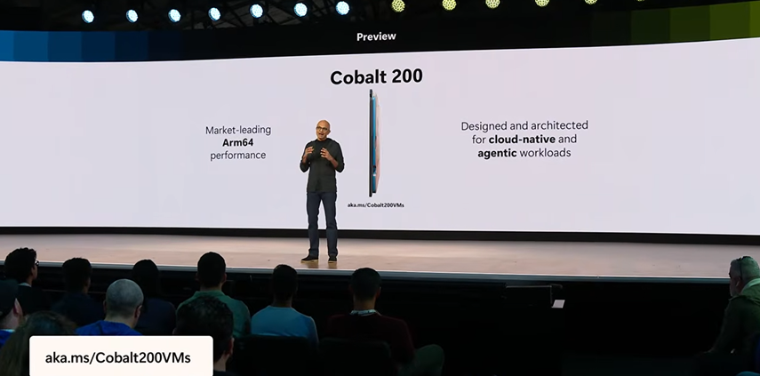

(onscreen URL: aka.ms/Cobalt200VMs)

 So it's exciting to see Cobalt make progress as well. 

**\[ Applause **\]

 You know, one thing that we've been trying to make sure is that it's being optimized for these new workloads I talked about, right? These new agent workloads. So in fact**, Cobalt delivers 50-plus percent better performance than Cobalt 100 on cloud-native**. 

But we started benchmarking them using the GitHub Copilot traces, these agentic traces, to see because the call patterns are so different. And we're now seeing **33% lower latency for the agent calls, 14% faster speed, 23% higher throughput**. So this is about the core design of both the AI accelerator and the CPU for the agent. 

And, of course, when you talk about AI workloads, you need scale, you need reliability, and that's why the **network** becomes super critical. We have innovated with the **MRC architecture and rebuilt how traffic across Azure moves to support AI workloads**, which are fundamentally synchronous data parallel workloads, right? And so, therefore, they span tens and thousands of GPUs. 

And so, you need to have them coherent. That's what the next Frontier, you know, is for us to make sure we're able to keep scaling the network architecture. And, of course, it's not about just inside the data center. 

It's also about connecting across the data centers. And every Fairwater data center, for example, is connected through our continent-spanning AI Wan forming this truly fungible compute fabric. 

 

### 1.2.4.      Satya with Jensen Huang (NVIDIA)

And you know all this innovation is exciting but when you think about innovation designing for AI and I would say deep understanding of systems you know there's no better company than NVIDIA and there's no better person than Jensen to talk about it. So I want to invite, live from Taipei, Jensen Huang, CEO and founder of NVIDIA. 

**\[ Applause **\]

**Jensen Huang:** Hi, Satya. 

**Satya Nadella:** Thank you so much for being at Build again. I know it's late for you in Taipei. I really appreciate you staying up. You know, I've been looking at social and, you know, and **everything people have been talking about since your keynote over the weekend**. And suddenly, you know, this concept of **unmetered intelligence right at the edge** is so hot again. So maybe you want to talk a little bit. You have thought about this, talked about this, and now, of course, with RTX Spark really delivered, I think, what's a breakthrough system for AI to be much more ubiquitous. But maybe, Jensen, you can just share a little bit your vision around where you see this going. 

**Jensen Huang:** Well, this all started about three years ago between a conversation between you and I. And we were talking about **how we could build a new class of PCs that's incredible for designers and creators, and it would be incredible for artificial intelligence**. And it would be one of these systems that has the processing capability but also the software stack that's integrated into the world's design packages and creator packages and, of course, all the things that we're doing with AI. And here we are, three years later, we built an incredible new chip, and this system is supported by all of this new software that you created for Windows. And **we now have the ability to have, essentially, an autonomous agent running on the PC**. 

Now, when you take a step back and you think about what does that mean? For the 40 years or some 30 years we've been working together, we went from inventing DirectX together to creating now this incredible computer that has autonomous systems running. **The PC evolved from being an incredible tool to now being a tool that's used autonomously by an AI assistant.** And so, the idea that I could be traveling and I'm on the phone and I could text my PC and ask my PC to get some coding done or some idea that I have, and **it would fire up the tools on the PC. And it would make the modifications or the changes or the design that I told it to do, and it would iterate with me while I'm away from the PC**. My PC became an assistant. While I'm sitting there, of course, this PC would be my great assistant as well. And so, this idea that the PC evolved from a personal computer to a personal AI, it's just really exciting. And to see it come to life, Satya, to see it come to life and actually doing that, you know, so I'm super excited about it. 

Spark, as you mentioned earlier, has all this incredible capabilities, a petaflop of AI performance. It has a petaflop of NVFP4, this numerical format that our two companies worked on together that allows us to take advantage of this 128 gigabytes of memory and fit maybe **a couple of hundred-billion-parameter model**. A couple of hundred-billion-parameter model is state-of-the-art. And so, I think the days of having a really smart assistant running autonomously on the PC is here.    

**Satya Nadella:** Yeah, no, it's so awesome. And in fact, I'm also excited about Windows coming to the GB300. And so, that's another thing that it's kind of like **data center right on your desktop**. And it's so exciting. 

But talking about that data center side, obviously, you know, **this entire thing got started when we built the first supercomputer together to train the GPT models**. And we have come a long way. In fact, even I was talking about the Fairwater design, it is custom-built essentially for the Grace Blackwell era to be able to max the data center design with the system design you had. And now, of course, we're validating Vera Rubin. We're very excited about it. Maybe you want to share a little bit about sort of what happens even **on the cloud side** with how you're pushing on the systems innovation. 

**Jensen Huang:** Well, our journey is incredible. We built the first AI supercomputer together. That was based on **Ampere**. 

Of course, **Hopper** was an incredible success. Those first two generations were focused on **pre-training**. **Grace Blackwell** came along and all of the focus moved to **post-training reinforcement learning**, which allowed us to have **reasoning models**. And these reasoning models, based on mixture of experts, were incredibly intelligent, energy efficient. But it requires **giant systems**. And so, we created **NVLink 72**, and the entire rack became one computer. 

We had evolved from one node to now one rack. Well. . 

. **Microsoft deployed the largest number of Grace Blackwells in the world today**; the fastest and the largest number of Grace Blackwells in the world. **Fairwater** is just a magnificent system to look at. It's just a miracle of engineering. It's just an incredible feat. 

It's completely liquid-cooled. You mentioned something earlier that I'm very proud of as well, that it's closed looped, basically uses almost no water. And it's incredibly environmentally friendly. It's energy efficient. We're able to **increase the token generation rate** and **reduce the cost of token generation** by an order of magnitude some 30 times over Hopper. So that was a huge achievement. 

Well, **Vera Rubin was created for a world where these AIs are now agentic**. And so whereas Hopper was created for pre-training Grace Blackwell for training post-training and also inference Vera Rubin is designed to run agents. It's agents, as you know, this computing pattern is exactly the same computing pattern we're going to run on the RTX Spark. It's exactly the same agentic system, except, of course, it's going to be much, much larger. We're going to process an enormous number of them simultaneously. Many of them are going to be from different customers and different partners. And so, the entire path, the entire coding path from storage, which is the long-term memory, the working memory, is encrypted. The data is encrypted in transit. 

The data is also encrypted in use. And so, we're going to really innovate in the area of confidential computing. And so, this entire disaggregated, distributed computing system, you mentioned CPUs. Vera is a revolutionary CPU designed for agents. You know, the past CPUs were designed for humans. And, you know, we're just more patient than agents are. And agents want low latency, just as you've been working on as well. 

Vera was designed for extremely low latency. And so, Vera Rubin is just completely revolutionary. I can't wait to show it to everybody. 

You've already stood it up.    

**Satya Nadella:** Yep. 

**Jensen Huang:**  Our two teams have been working very closely. You know, almost long before the chips taped out, long before the systems were brought up, our two teams were already completely aligned. And so, **the design, the data centers were created for Vera Rubin. Vera Rubin is designed and integrated into your complete stack, into your networking, into your security**. And so, the moment that our systems were rolling off the lines, they were being stood up at Microsoft. So I'm incredibly excited about the collaboration. 

**Satya Nadella:** Yeah, I know **this speed of light execution between the teams is fantastic to see**. And, of course, all this is to power the ecosystem around us, right? I mean you and I having grown up with the PC the server and now with AI have always thought about ultimately it's about creating the opportunity for every developer every organization to build on the work that we do and the platforms we create. 

And speaking of that, there's a lot of **software** that NVIDIA builds that's all also coming. For example, we're going to have your models in Foundry, your tooling in Foundry. We're going to have, in fact, your software even help us with accelerating our workloads when it comes to even the data warehouse. We're going to obviously have stuff in Windows. Just talk a little bit about that broader vision of what does it mean for -- as an opportunity, right? 

Because everybody talks about this one model or one piece of tech. But it's about the broadest, biggest opportunity for people to create value. Maybe you want to share a little bit about that.    

**Jensen Huang:** Well, we've been preparing for this moment. 

You know, what happened in the last several months, we've been working for a decade and a half together, getting ready for, really, what happened in the last several months. All of a sudden, because of agentic systems, the convergence of these really great models, AI is now useful. If you just look at GitHub, the commits into GitHub has gone completely parabolic. In the last several months, the number of commits increased by a factor of three. **It's clear that agentic systems are useful, that it's doing productive work, and also tokens are now profitable as a result**. And so, the amount of demand for compute between the usage of the AI and the computation that's necessary for agents, **the compute demand has really gone through the roof**. 

Well, one of the things that we've been doing together is **making sure that all of the tools that agents are going to use are fully accelerated**. Fabric, for example, is now fully accelerated. We're accelerating data processing, SQL, Spark, semantic-based, vector-based, graph-based. We're going to make sure that all of the tools that are available on Azure are going to be fully GPU-accelerated **because the agents are going to be impatient**. The faster we can get the answers back to the agents the faster they can iterate the faster we can generate tokens which are ultimately what the developers both of our customers would like to do is generate a lot of tokens that are really profitable that are highly intelligent.    

**Satya Nadella:** Thank you so much, Jensen, for the partnership and the leadership and the innovation that you bring to this entire ecosystem. And really thrilled to be working closely with you and the team and bring all this to the developers here and beyond and look forward to seeing what the next sort of few months and the next year bring in terms of the innovation that gets built on top of the platform. So thank you again for joining this late in the night from Taipei. 

**Jensen Huang:** Thank you so much, Satya, for your partnership and friendship. Thank you. 

**Satya Nadella:**  Thank you. 

**\[ Applause **\]

## 1.3.         Device - Project Solara (form factors)

 

**Satya Nadella:** So so far, we've talked about the edge and the cloud. The current form factors, right? 

I mean, when I saw that Jensen picture from the weekend where he had all the desktops, I felt like, man, I'm back in the '90s, right? Because **it is so cool to see the lineup of all the machines that I loved and I grew up with back yet again with new functionality**, right? The same form factor, but unbelievable new functionality because of the onboard AI capability, right? So that's sort of what we've seen with the laptop, the desktop and, of course, with the cloud. 

But it also, you know, sets up that next question. If you have that capability, which is new function and you can put it into existing form factors, can you even purpose-build new form factors for the new function? 

Can you build a new platform even for the agent era? And that is the motivation behind **Project Solara**, which we're introducing today. And to talk about this, I wanted to invite Stevie on stage. But first, let's roll the video.    

**Speaker 1:** First, there's you. 

**\[ Music **\]

 Then, everything in front of you. 

**\[ Music **\]

 We get it. The noise. The weight of it all. 

**\[ Music **\]

 So we've been building something. 

**\[ Music **\]

 A new chip-to-cloud platform for an agent-first world. And for new agent first devices. 

You come close. It's ready when you are. 

You speak. It understands you. What matters comes forward. Everything else falls away. 

And when you want it to keep going, it keeps going. Your call. Sometimes it sits with you. Sometimes it goes with you. Sometimes it sees what you want it to see. It doesn't decide for you. It just lights the path. It tries to clear the way when you need it to. And that's the idea. A whole ecosystem built to clear the way. So all that's left is where you need to go. Wherever you are. Whenever it matters. 

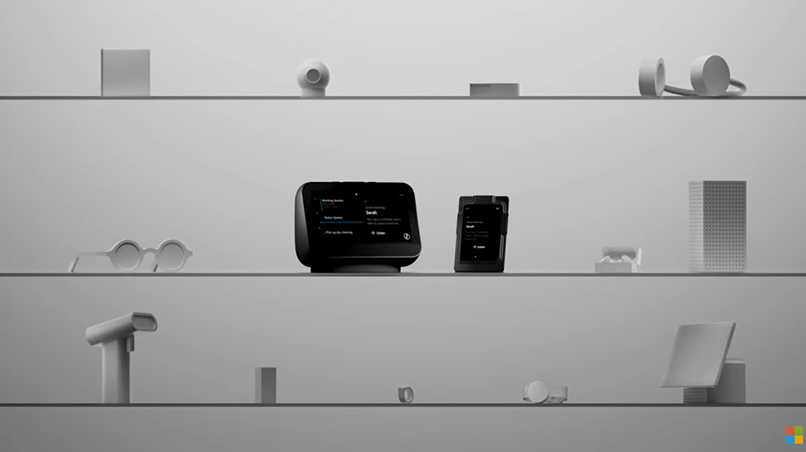

**\[ Music **\] **\[ Applause** \]

 

### 1.3.1.      Steven Bathiche’s intro about Project Solara

** **

**Steven Bathiche:** I am so excited to be here. 

It really is great to be back on this stage. Now, before I talk about those awesome new devices you just saw, let me start with the "why". 

Back at Build 2023 I talked about the outside AI application structure where **AI moves from operating within the application frame to operating globally working across multiple apps and services to connect coordinate and maintain context across entire workflows, devices and time scales**. What if there were an ecosystem of devices specifically designed for that new type of application structure, for those types of agents, for that transformational interaction technology? That is the impetus behind Project Solara. 

But with so many possible forms, which one do you pick? What is the next device**? You see, the big "a-ha" for us is that it's not about choosing one specific form factor, it is about creating a system that extends your agent across a constellation of devices**. The next computer is not one device. **It is all these devices working together as one system, with agents showing up closer to where and when you need them**. 

To realize this vision, two challenges immediately show up. 

First, many specialized form factors already exist, but often rely on **custom one-off apps and fragmented stacks** that are difficult and expensive to build, deploy and maintain. 

And second, across every industry, people and organizations are already **building their own agents**, deeply specialized and instrumented for their work. 

But the impact of those agents is constrained by how and where they can exist. Project Solara addresses both by giving organizations a way to **extend their agents onto new purpose-built easy-to-manage form factors** designed to reach the nooks and crannies where conventional computers either do not exist or are not optimal. 

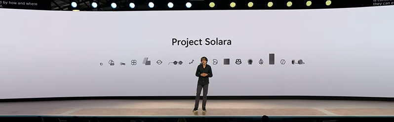

It's a turnkey solution for building unique agent-first devices enabled by three pillars. 

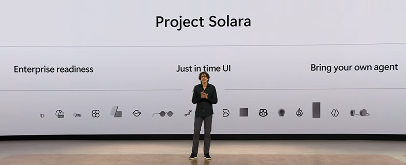

First, it's **enterprise-ready**, enabled by the AOSP-based Microsoft device ecosystem platform. Second, it has an agent-driven interaction model with **just-in-time UI** that adapts to the form factor. And third, it has extensibility so you can **bring your own agents**. And tying it all together is Azure, unifying the system across cloud and device. Okay. 

That's enough of that. Now let's talk about the devices. Today we're previewing two very broad categories. 

The first is **stationary** and the second is **portable**. 

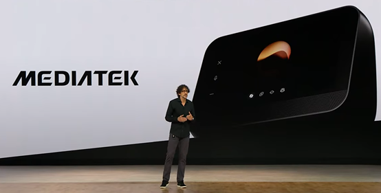

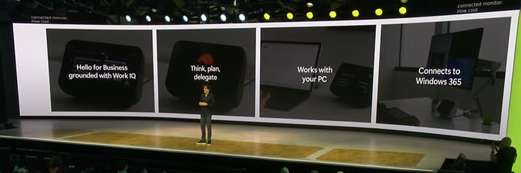

The first device is designed for your desk and it's built on **MediaTek** silicon. 

With Hello for Business, just walking up to the device securely signs you in, giving you direct access to your agents, just like Nathan's about to show you here. **For the information worker, this means frictionless yet protected access to Microsoft 365 Copilot grounded in Work IQ.** And with a simple glance, it surfaces what matters next in your workday, helping you think, plan, and even act by delegating tasks to your agents with a simple tap or just using your voice. Think of it as a dedicated, secured, ambient device for work. It even supports experiences like handoff between devices, acting as a companion to your existing Windows PC. 

Or, it can even let you access your cloud PC through Windows 365 and a connected monitor. How cool is that? 

**\[ Cheering **\] **\[ Applause** \]

 Now, the second device is portable. It's reimagining a wearable that millions of people use every day, the **access badge**. Built using **Qualcomm** silicon for wearable, this digital badge is a **lightweight form factor designed for agent interactions on the go**. And then it's adaptable across a variety of verticals and workflows. 

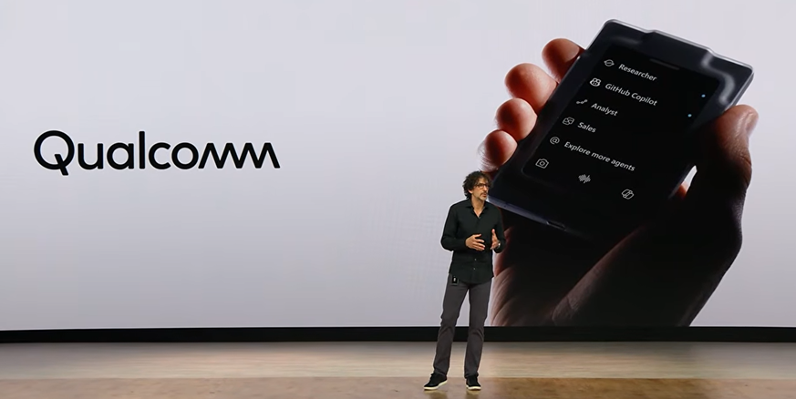

All right, I have here an early prototype of the badge. And so -- thanks. And using my fingerprint, I tap to unlock the device. And I have access now to all my agents in a secured manner. 

And would you look at that? I already have a task. And it says gather content for your social media posts for today. 

So, why not just do it right now, right? So, I'm going to hit "Record". And then now the device's camera is recording. I'm going to pan across. I hope you don't mind. I'm going to take your shots. Yes. Thank you. Copilot, find some good shots from this, clean them up, and then send them to me for me and my team to review. 

All right. And then there you have it. Now my agent's off running through multiple tasks to actually clean this up and send them to me and the team. 

That's pretty cool. 

**\[ Applause **\]

 Okay, I know it's a simple demo, but it's all agent-driven. And there are so many verticals, so many opportunities. I mean, for example, imagine in healthcare. From the moment you pick up the device, the right agent shapes the experience around the role and the workflow, helping with check-ins, patient records, and critical insights, all through enterprise-grade secure access. And with the built-in microphones, the nurse can start a hands-free voice-based documentation, including diarization and annotation. And the side-facing camera can be used to verify and document patient vitals or even scan in medications and help verify workflows. You know these are just a few examples of how this small purpose-built wearable can bring intelligence directly into the flow of patient care helping nurses access and gather and even act on information while staying present with the patient. 

And while both the stationary and portable concept devices represent a specific expression of agent-first devices, their core reference hardware and software are designed to be highly flexible. I mean just with a few changes loading a different agent adjusting the shape the screen size the sensors or even input methods the same foundation the same software can be adapted for many verticals and workflows such as retail, industrial, hospitality, financial service, legal and so forth. I mean, that is the power of the platform, that flexibility. 

So whatever your scenario, there are thousands of untapped opportunities to bring agent workflows into places where computing has not naturally fit before. 

And while this is an early look, we're really excited that AccuWeather, Best Buy, CBS Health, Levi's, Target, and others are working towards exploring how **specialized agents and devices** can improve their workflows. This is the broader opportunity for the ecosystem. 

(onscreen URL: aka.ms/ProjectSolara)

Agents moving outside the app and taking shape in devices designed for a specific scenario, a specific customer, and a specific place. And for all of you, **this is the moment to imagine where your agents should live, what form they should take, and what new work they can unlock**. 

 

### 1.3.2.      Satya with Christiano Amon (Qualcomm)

 

Last week, Satya sat down with Cristiano Amon from Qualcomm to discuss this future. Let's roll the video.    

**Satya Nadella:** Cristiano, it's so wonderful having you here at Device Lab and to talk about these new reference designs. 

**Cristiano Amon:** Very happy to be here. I have been to this Device Lab a lot recently. 

**Satya Nadella:** You know, one of the things that you and I have chatted for a while is, how there's a real platform shift. We are moving from building operating systems, devices for apps to agents. You want to talk a little bit about how you see this? 

**Cristiano Amon:** Yeah, absolutely. In every generation of technology transition we've seen a shift, and I think this one seems to be a very big one. Agents really changes the whole nature of the device in itself, starting with the fact that, you know, if the AI understand the world the way we understand it, it's going to be closer to our senses. It's going to be closer to our eyes, to our mouth, to our ears. It's going to be things that we wear, and it's changing the nature of the computing. I think you need a computing that is now geared towards real-time context and from silicon to cloud. 

**Satya Nadella:** I mean, this is sort of one of the reference designs we have, which I love. There's stuff happening at the edge here on this device. There's things on the cloud. You want to talk a little bit about the core systems and silicon implications for such a new ecosystem? 

**Cristiano Amon:** You need a very power-efficient CPU. The whole silicon is designed for you to have a cloud-native experience. And then you have a lot of sensors. 

**Satya Nadella:** Right. 

**Cristiano Amon:** A lot of sensors for context. It's a much more personalized and bespoke experience than an app in itself. And I think that's changing the nature of devices. And even the definition of a wearable platform is changing in itself. And you've started to see those incredible new form factors. 

**Satya Nadella:** That computing platform, one of the things that you and I have talked a lot about is, how do you build it such that there is an open ecosystem, right? Because it's not about one agent. It's about any agent. 

**Cristiano Amon:** This is what makes it very, very interesting and exciting. Because the smartphone today is at the center of your digital life, **the job of those devices today is to be extending the functionality of the smartphone**. And because of that, you actually saw that many of those platforms became vertical. It was a natural thing to have a vertical platform from the same company because the phone was at the center. That changes dramatically -- 

**Satya Nadella:**  Right. 

**Cristiano Amon:**  -- when you think about agents. And agents becomes the center of your digital experience. And the industry is going to be looking for an **open horizontal platform** that actually enable the agents to be interacting with the best possible device for different applications. And I think that's what's exciting. 

**Satya Nadella:** And we want to make it possible for anybody who's thinking of an agentic system to **not just be bound to current devices, but to imagine that there can be many, many devices that carry that intelligence in different contexts**. And so, that's the open ecosystem we want to build together. And again, it's so great to be partnered with you to get this started. 

**Cristiano Amon:** That's awesome. We're very proud of this partnership. And it's just the beginning. 

**\[ Applause **\]

**Satya Nadella:** Thank you very much, Stevie and Cristiano. We are very excited about Project Solara. It's sort of a new platform, but perhaps, more importantly, **it's a set of new platform rules that don't, you know, in some sense, hem in what you can imagine, the type of form factors, where your agents live**. I think always whenever these new platforms have come, you get to **rewrite even the rules of how new platforms operate**. And that's what we are trying to get done with Project Solara so that you as developers and enterprises have the flexibility to imagine the form factors that you want and have your agents be ubiquitous. 

 

# 2.    Models / Context / Tools

 

Now, let's go up the stack to the next layer. 

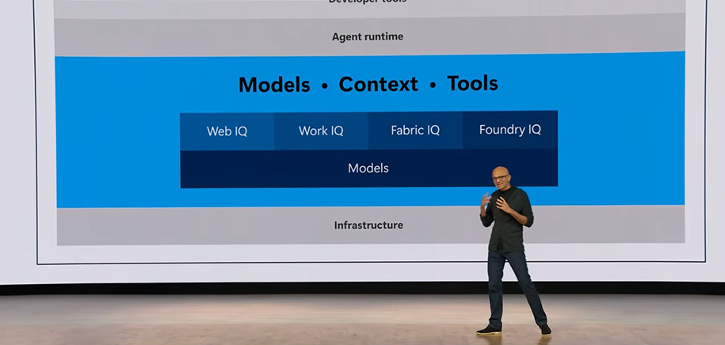

We are building **a new intelligence layer, bringing together the models, context, as well as the tools**. 

## 2.1.         Models

It, of course, starts with **model choice**. 

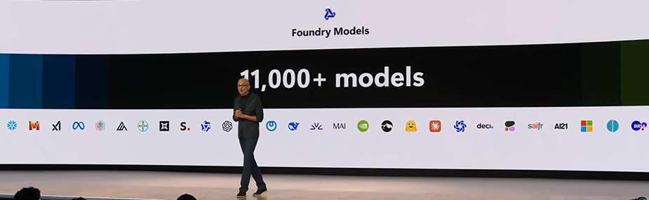

Every customer, every developer is going to choose the right model for the right task and their eval mix, latency budget, even COGS budgets. And **Foundry, today, has over 11,000 models**. It's the largest model catalog out there from OpenAI to Anthropic and, of course, even MAI models. And just last week, we brought the OpenAI real-time voice models along with Claude Opus 4.8 to Foundry. 

So we're continuing to bring all these Frontier models. The consideration, though, about the models is becoming now increasingly key. In fact, from the last developer conference to now, when you're building any agentic system, having this **context** really shaped right is becoming super important. And, in fact, it starts right at the data tier, right? 

## 2.2.         Context - Data Layer

 

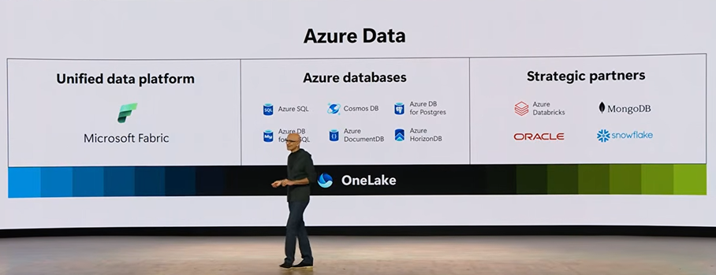

The data estate to date has been built for applications that supported these user-facing applications, right? Now you have to change and build them for agents, which, again, have **very different call patterns even to the data tier**. Agents are continuously storing, retrieving, reasoning, acting, and learning, right? That's sort of what's happening in a continuous loop. 

### 2.2.1.      Horizon DB

And you see that today. Agents are using things like **Cosmos DB** for their memory. In fact, ChatGPT does. **Azure Search** is used for retrieval of indices and embeddings. **Fabric IQ** for the semantic models and the ontologies instead of the business logic tier effectively for agents. And also, you have **Fabric real-time intelligence** for all the observability traces, which now brings me to a very exciting new service, **Horizon DB**, which is our **fully managed PostgreSQL service on Azure**. Really thrilled to have this.

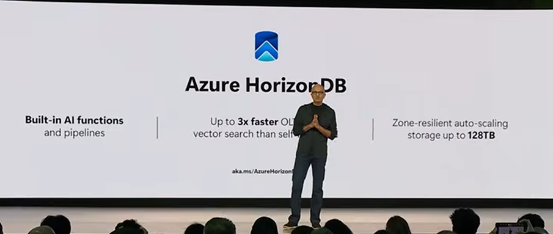

(onscreen URL: aka.ms/AzureHorizonDB)

**\[ Applause **\]

I mean, one of the things we wanted to make sure is **we built, ground-up, a Postgres managed service which was for high availability scale-out**. 

It's **zoned-redundant with automated failover**, 128 terabytes of storage per cluster, 15 read replicas. I mean, the read-heavy workloads you can scale with this managed service. And in our internal testing, we're seeing something like, you know, Horizon is delivering **3x throughput compared to any self-managed Postgres SQL setup**. 

So it's super critical when you think about the scale you need. 

 

### 2.2.2.      GPU Accelerated Fabric DW

 

The other data workload we're also changing pretty dramatically is the **data warehouse**. In a world where agents are constantly querying data, the data warehouse effectively becomes pretty mission critical, right? 

I mean, it's one thing to have it be mission critical for users, but when agents need the analysis done on the fly, you know, bringing GPU acceleration to Fabric is super key, and we are seeing 7x performance gains. So it's really thrilling to see that AI acceleration.

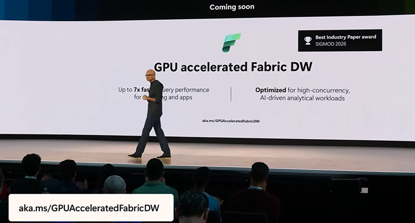

(onscreen URL: aka.ms/GPUAcceleratedFabricDW)

**\[ Applause **\]

## 2.3.         Context – IQ Layer

So if you sort of have the data tier the layer about this is **the IQ layer that we are building that brings together essentially the model capabilities along with the data** right? So you kind of mix the data and the model capabilities so that you can deliver that **right context to unlock intelligence**, right? That's where -- in fact, if you want, **when people talk about token efficiency, this is perhaps the most important consideration**, right? 

If you structure the context right and feed the models, then you will, by definition, going to be so much more token-efficient. 

### 2.3.1.      Web IQ

The first domain is the web. Web grounding is so important. You need that fresh, high-quality and fast web data, and that's why we are really, really excited to announce today Web IQ. 

**\[ Applause **\]

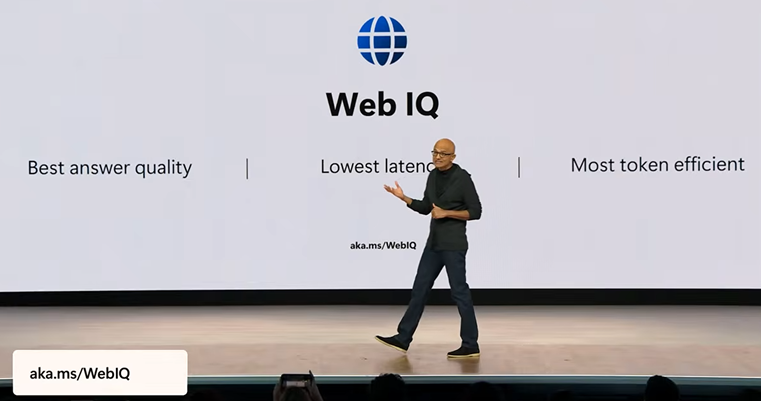

(onscreen URL: aka.ms/WebIQ)

And Web IQ is built on our global infrastructure that's already serving over a billion users, but **fundamentally re-architected for the LLM and the agentic workflow**. 

It's model-agnostic, it's MCP-native, plugs right into any agent runtime. It has web, it has news, images, video, so agents can ground responses in fresh, verifiable content. 

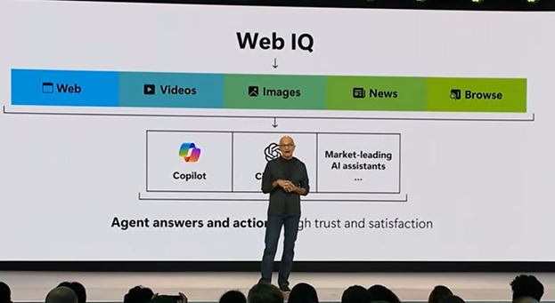

And Web IQ leads across all of the three key criteria, right? 

It's best-in-class in quality, it's best in class in speed, as well as in cost. 

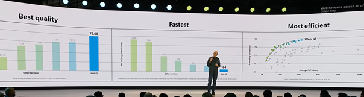

So we're very, very thrilled about Web IQ being in the developers' hands as you build out agentic systems. 

### 2.3.2.      Microsoft IQ

Of course, we're not stopping there. Beyond the web, every developer wants to be able to ground their agents on what's the most valuable data across the enterprise. And so, we are bringing together Foundry, Fabric, and Microsoft 365 as this unified IQ layer, right? 

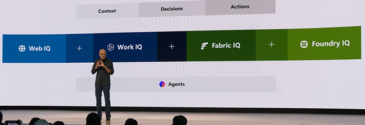

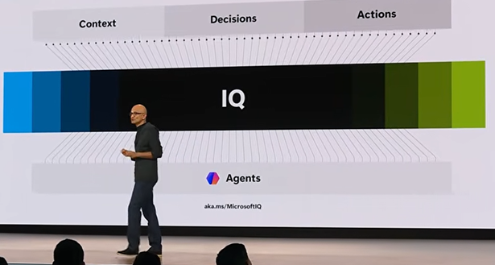

(onscreenURL: aka.ms/MicrosoftIQ)

It's a **continuously updated understanding of your organization to show you all of this rich IQ in action**, building real-life agents. 

Here is Elijah. Elijah, take it away. 

**\[ Applause **\]

### 2.3.3.      Demo: Agents on Microsoft IQ

**Elijah Straight:** **Agents are only as good as the context we give them**.

Microsoft IQ unifies enterprise intelligence for every organization. 

I'm here at a Power Utilities Control Center and will start by running a long-running agent. This agent is going to help us assess the current grid operations incident and produce a brief for us so we can respond accordingly. 

Now, I'm going to go ahead and kick that off. And while that runs, let me show you how we got here with context from Microsoft IQ. We built our agent in Microsoft Foundry. It's connected to various tools and it's also wired to a Foundry IQ knowledge base a single grounded source that packages our documents operational data and people into context the agent can reason over. 

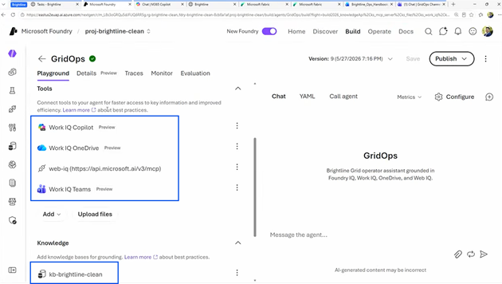

After building the agent in Foundry, we published it to Microsoft 365 for the whole team. Let's go see it in action. 

Now, here in M365, I will start with a question about current events that an ungrounded LLM wouldn't be able to answer. 

I'm going to ask about **current electricity prices in SF**. For this, our agent pulls in the first IQ in our toolbox, **Web IQ**, search built for the AI era. Web IQ delivers industry-leading quality, velocity, and efficiency. 

Web IQ constantly indexes fresh, official sources from across the web, and additionally, Web IQ does a great job with semantic documents. And here we can see Web IQ gave us our answer grounded in reality. 

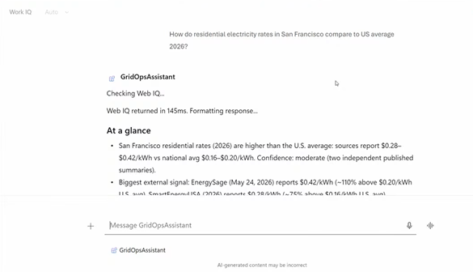

Now, not only can we deploy our agent here in M365, but we can also **embed it in our custom apps**. Let's head back to the control center. 

Let's see how we handled a previous incident. So, after using Web IQ to gather external info, we asked for details about our potentially at-risk substations. **The real power of Microsoft IQ comes when we combine that external knowledge with our own internal enterprise context**. 

For this information, our agent pulls in the next layer of Microsoft IQ, **Fabric IQ**. Here is Brightline's grid represented as a Fabric ontology, an operational model of the live grid.

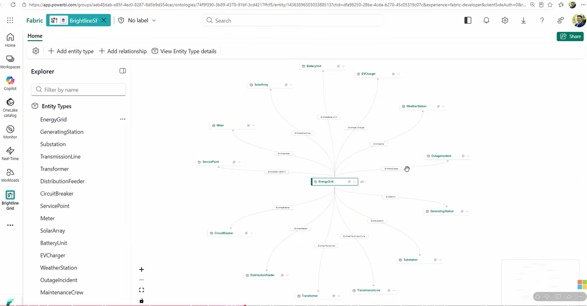

And critically, we didn't build this from scratch. **Fabric takes the Power BI semantic models used by millions of customers today and lets teams extend them into rich ontologies that help run the business**. 

This model -- yes! This model is coupled with live telemetry so it reflects the real operational state of the grid minute-by-minute. This is what Microsoft IQ means by enterprise intelligence. 

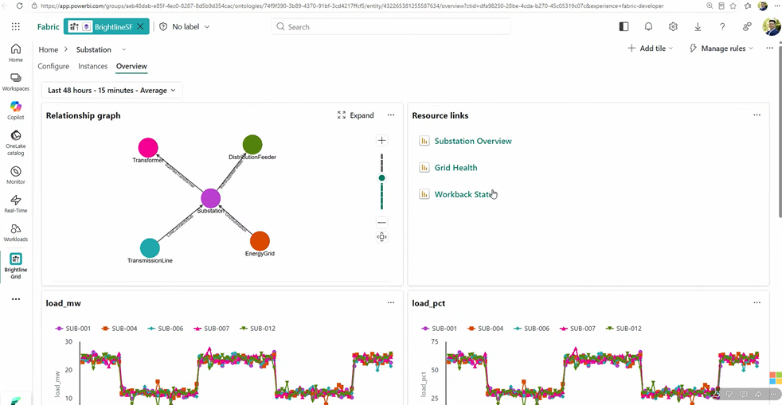

**\[ Applause **\]

Not data scattered across disparate systems, but a single living model of the business that an agent can reason over. 

Now, turning back to our agent, we can see that it gave us a table of our most exposed substations. That's the agent querying the ontology you just saw. Now, the agent has access to both the outside world and our grid. 

The last piece is the one that **turns a situation into a response**, **our policies and our people**. By asking, what are the steps to respond to a substation trip, we activate the final layer of Microsoft IQ, Work IQ. 

This is **Brightline's response procedure in SharePoint**. It's the playbook the team actually reaches for when something goes wrong. And the important thing is, the agent isn't working from a stale upload or copied snapshot. It's answering from the **same source the team maintains day to day**. When the procedure changes, the answer changes with it. 

No re-uploads, no prompt rebuilds, and no stale versions. And critically, this is your knowledge. The assets you create stay with you, no matter what model or agent is reasoning over them. 

Now, if we return to our agent, we can see the proper way to respond to this issue. Not a generic recommendation, but our playbook applied to this incident. 

Now, we just saw **one situation, three questions, and one connected answer**. Now, let's go check back in on our long-running agent. 

And, oh, let's check the backup really quick. Moment of truth. . . 

And. . . boom! Our task finished. 

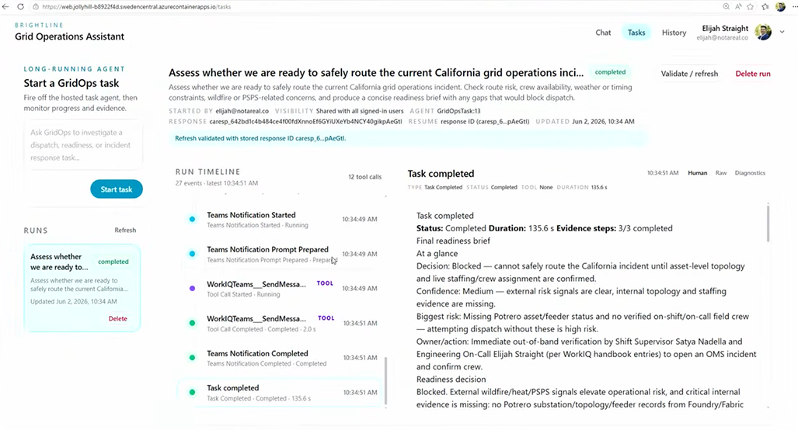

**\[ Applause **\] 

Here we can see every step the agent took**. First, beginning with Web IQ, connecting it to the outside world. Second, Fabric IQ through Foundry, anchoring it in the real state of our operations. And third, Work IQ, grounding it in our people and procedures**. I triggered this manually, but with Foundry routines, this can run on a schedule, turning a one-off response into continuous proactive execution. And, if we look closely, we can see it even used the power of Work IQ to alert me directly about the incident. And if we go ahead and check Teams, it sent me an incident brief notifying me of the situation. 

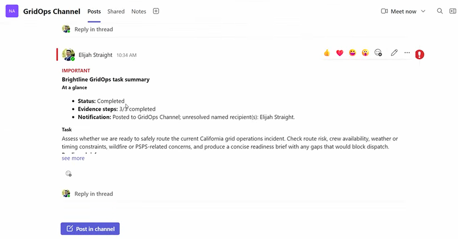

**\[ Applause **\]

That's the power of Microsoft IQ. 

When a crisis hits, the team doesn't chase answers across a dozen systems. They ask a question and get a response grounded in the world, their operations, and their people, all in one place they can trust. Back to you, Satya. 

**\[ Applause **\]

**Satya Nadella:** All right. 

Thank you, Elijah. 

# 3.    Agent Runtime

And now, you know, let's sort of move up from this context model layer to deploying these agents and thinking about the runtime. And you know when you're building a first-class agentic system you need a first-class agent runtime and a platform that we are going to ship both with Windows as well as part of Foundry in Azure. 

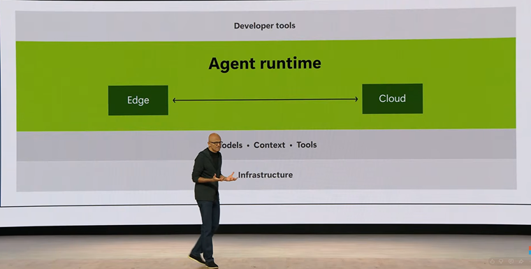

## 3.1.         Windows – Agent Runtime

### 3.1.1.      Microsoft Execution Containers (MXC)

We want **Windows to be a fantastic place to run and scale agents**. And agents, effectively, are a new execution environment, right? 

It's a new paradigm even. They reason continuously. They generate and run code dynamically. They take actions across files and devices as well as across the network. 

Obviously, there's a lot of power in it, right? The fact that it can generate code and act on it on a long-running agent that's autonomous. 

But, obviously, it creates new risk. And that's why today we're introducing **Microsoft Execution Containers, or MXC**. 

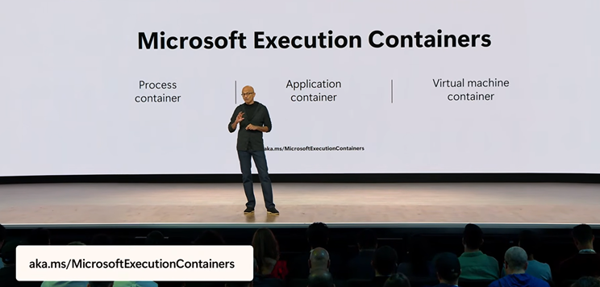

(onscreen URL: aka.ms/MicrosoftExecutionContainers)

MXC is a new policy layer that **lets Windows apply isolation and containment using AI-native -- -- or OS-native primitives**, right? You need to bake this into the operating system so that the containment is enforced by policy. 

You can have process-level isolation for lightweight agent actions. You can have session-level isolation for user separation. 

So Windows and Linux virtual machines, in fact, are also great, including WSL, for much stronger boundaries. And, in fact, if you want full isolation and containment, Windows 365 for agents for maximum isolation in a separate managed environment effectively. You can pick the right containment option for the workload, and Windows will enforce it via MXC. And so, I think **this becomes pretty critical as you think about deploying agents at scale on your Windows desktop**. 

We want to ensure **containment is enforced, of course, regardless of who builds the agent**, right? So this is why you want to bake it into the operating system. To that end, we are working with many partners to ensure that containment, we are building support, real developer workloads out there, and also addresses the needs. In fact, NVIDIA is bringing OpenShell to Windows to securely execute autonomous AI agents. 

### 3.1.2.      OpenClaw runs on Windows

And today we are really thrilled to announce that **OpenClaw runs on Windows leveraging MXC**.

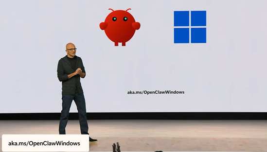

(onscreen URL: aka.ms/OpenClawWindows)

**\[ Applause **\]

 Yeah we are very deeply engaged with the team to make OpenClaw run super well on Windows. And so, let me hand it over to my colleagues, Scott and Samantha, to show you OpenClaw on Windows. Scott, Samantha. 

**\[ Applause **\]

### 3.1.3.      Demo: Openclaw on Windows

**Scott Hanselman:** Hey, friends. You know, OpenClaw came out in November of last year, and it took the world by storm. And for the last several months, I've been reusing my OpenClaw to stay on top of my health. My "claw" can help me manage my blood sugar, and it gives me even proactive notifications via "heartbeat". I've got mine triaging my personal email, it's doing my GitHub issues and tracking packages, and it even buys me movie tickets. So, Samantha, what are you using your "claw" for? 

**Samantha Song:** That's cool, Scott. I turned my OpenClaw agent into my triathlon coach. I'm nowhere near ready for my race in September, but Coach "Claw" developed a work-back plan for me and is using my Strava data to notify me on how I'm progressing and to keep me accountable when I'm slacking. 

**Scott Hanselman:** Now, we've both found our "claws" to be super useful, and that's why we're working closely with OpenClaw to make them successful and even more successful on Windows. We've been collaborating in the open on GitHub to bring you all an OpenClaw Windows Companion app. It's going to help you set up your own "claws" or connect to existing ones, whether they're hosted in Windows or in WSL. And the Windows Companion, we're going to sandbox the OpenClaw tool calls to keep you and your system safe. 

**Samantha Song:** Yeah, you'll see the OpenClaw Windows Companion app running right now in the background. Go ahead and right-click on it, Scott. 

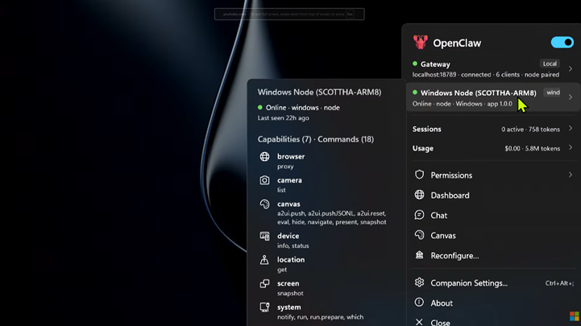

**Scott Hanselman:**  All right. . . 

**Samantha Song:** That looks awesome. You'll notice immediately it looks like a native Windows app because it is. It's written in WinUI 3. It's got all kinds of information about my Gateway, other machines that are participating in my "claw", my sessions, and my usage. I've also got quick access to things like Chat, Canvas, the main dashboard, and more. 

Let's jump into companion settings. 

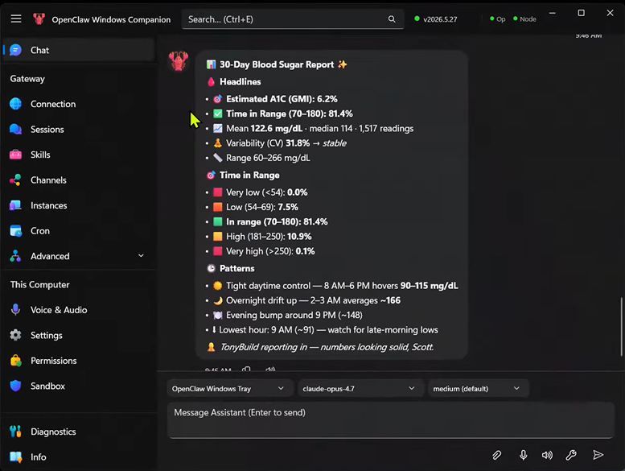

Within the app, we've got full chat support with tool calling. And you'll notice down here in the corner, we've got lots of **permissions options** along with our **sandbox configuration**. 

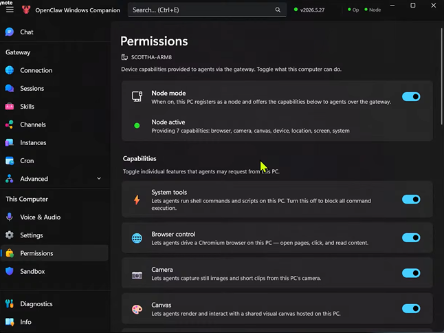

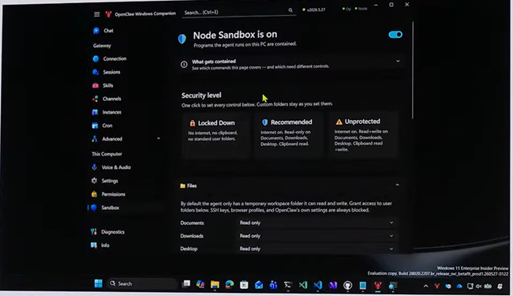

**Scott Hanselman:** Now, this **sandbox is really interesting because this is using MXC, the Microsoft Execution Containers**. And for this, we're going to be using **process isolation**. Now, newer versions of Windows are going to have even more containment options, so you're going to want to keep an eye out for more news with MXC in the future. 

Now, I can see that I've got "One-click" security option settings. But, Samantha, **talk to me about "Custom folders"**. 

**Samantha Song:** Yeah, you've got **full support about what files and folders you want OpenClaw to have access to**. And really **granular security features like "Clipboard" access** or talking to the Internet itself. Now, I've given it read-only desktop, read access to your desktop folder. 

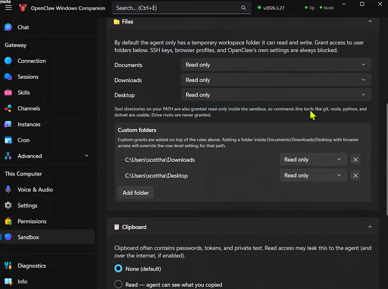

OpenClaw already has a rich safety layer. And that layer is only augmented more by appropriate containment that can be managed by me or policies applied by IT. 

Now, for the purposes of this demo, I'm going to do something really scary and ask OpenClaw to delete all the files on your desktop. 

**Scott Hanselman:** That's cool, because I have a nice, clean desktop. 

**Samantha Song:** I think you're keeping a secret. You hid all your icons from the audience while we were on stage. I think we need to show the audience who you really are. 

**Samantha Song:** So disrespectful. I know where everything is. 

**\[ Laughter **\]

 It's just -- don't touch my stuff. I know where they are. You know, Sam, I need to make sure that you're clear that a messy desktop is an organized mind. 

I'm pretty sure that that's the quote, right? 

So what we've done is we've asked OpenClaw to delete those files from the Windows node. And the only thing that is going to keep from happening is MXC, because we've turned off all of the many layers that OpenClaw offers. But our IT -- in this case, Samantha -- has set it to read-only. So, it's trying to go and delete all of those files. 

We can actually see the different attempts where it's going and deleting and then checking the directory and then deleting again **because it's very persistent**. It wants these files gone, and I want them to stay. Oh, nope. 

The read-only sandbox is there. 94 JPEGs are still on the desktop. Absolutely. My desktop icons are safe from Samantha's reign of terror. 

Foiled again.    

**Scott Hanselman:** Oh, my goodness -- so bad. 

**Samantha Song:** Today we've seen security sandboxing, WinUI 3, and open-source brought together all in this alpha release of a Windows companion app. We think this app is a great opportunity to showcase OpenClaw on Windows, and it's only going to get better in the coming months. 

**Scott Hanselman:** That is right, and by the way, I want to note that we're doing all this development work on this calm Windows development machine with all the tools that I love, like WSL, Containers, and Containment, and I've even got GitHub Copilot with multi-modal support ready to go. Now, this is literally how the team and I have been working on the OpenClaw app on GitHub. 

Now, people might wonder how all of this came together. Turns out, that over the holidays, I got a DM from this random guy on the Internet, and it took me a couple of days to get back to him, and then when I did, we just had this kind of cool idea that maybe he should come to Microsoft Build. Now, I think there's one more person that we all want to thank for bringing the next generation of agents to the world. Everybody put your hands together for the "Clawfather" himself, Peter Steinberger. 

**\[ Applause **\]

### 3.1.4.      Peter Steinberger Talk

**Peter Steinberger:** Scott. . . 

Samantha. Stop showing off my secret DMs. 

**\[ Laughter **\]

 I'm so excited to see OpenClaw native on Windows. You know watching a "claw" try to delete all your desktop file and just fail made me really happy because six months ago that totally would have worked. 

**\[ Laughter **\]

 You know, I built OpenClaw to have access to everything. You know, my files, my machines, my chats, always on and fully open-source. That's what makes it so powerful, and that's what also makes companies a bit nervous. 

You know **what I kept hearing was "Peter I love my 'claw' can I use this at work?" And that's what we spent the last few months on with Microsoft GitHub OpenAI NVIDIA just to name a few**. We added observability. We added auto mode for permissions. We changed how access works. It's not all or nothing anymore. 

You can pick which folder should be read-only, which one should be write-it or hidden. So here's the news. **You can totally run OpenClaw inside your company now**. 

**\[ Cheering **\] **\[ Applause** \]

 And we even made the harness itself a plug-in. 

You can bring your own. Copilot, Codex, whatever you already trust, and your rules come right with it. And **then you put OpenClaw on top of it. You get persistent memory, heartbeats, and you get a "claw" right inside Slack or Teams**. It's been really exciting to see OpenClaw grow into something much bigger; a global movement and a community. 

**And I started the OpenClaw Foundation, a real nonprofit**, so it stays open and neutral, any model, any operating system. Because we are entering a new era of building these agents. 

More capability for the people who don't code and more power for those who do. And we get to do this. We get to build it together in the open. So my task is simple: Come build with us. Thank you. 

**\[ Applause **\]

**Scott Hanselman:** Fantastic. 

**\[ Applause **\]

 Thank you very much to Peter. Thank you to Samantha. Thank you to the Companion App team for their hard work. Thank you to the OpenClaw community for giving everyone here a crustacean of their own. And as we walk out, I want to remind you **that's the first time you've ever seen OpenClaw running on a Surface Laptop Ultra**. Goodbye. 

**\[ Applause **\]

## 3.2.         Foundry – Agent Runtime

**Satya Nadella:** All right, thank you so much, Samantha, Scott, and Peter. It's so wonderful to see OpenClaw come to Windows and have all of that capability in terms of the security and that comfort to be able to have these long-running agents and unmetered intelligence come together. 

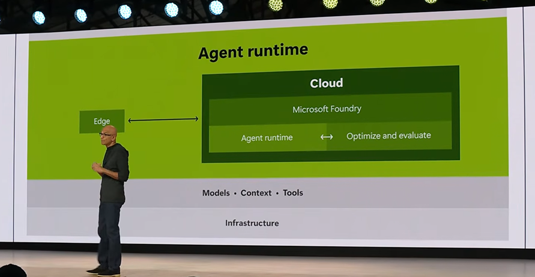

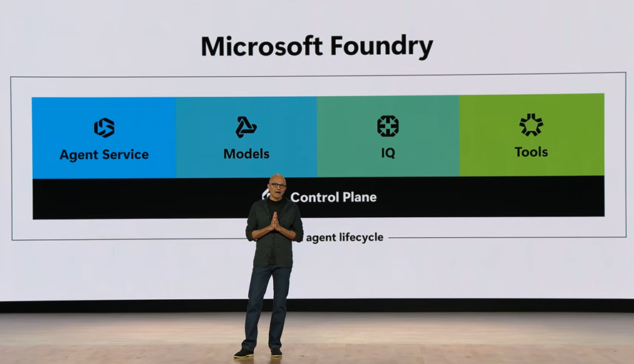

So now, **let's move from the Windows-side on the edge to the cloud with Foundry**. And we are building Foundry into this full application platform for the agent era, right? I mean, every era of the platform shift when we moved to the cloud, we had the Cloud-native App stack, and now we have the Agent-native App stack in Foundry. 

### 3.2.1.      Foundry-hosted Agent

We are particularly excited about the **Foundry-hosted agent** as a runtime for long-running agents.

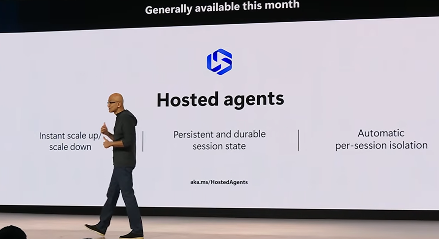

(onscreen URL: aka.ms/HostedAgents)

 Agents now have -- so, if you're building in Foundry-hosted agents, you can have all the **IQ layers**. You have the **tools**. You have the **durability** and the **memory** and the **state**. You have your **own sandbox**. In fact, it's a super-fast sandbox that you can spin up. 

You can generate the **rubrics**, you can -- and the **evals**. You can, in fact, have all the **safety** and the **guardrails** around your agentic system. And, in fact, even one of the coolest things in Foundry is, it's a continuously improving loop even, right? 

It's got that **self-improvement loop built in**, right? So you build an agent that's continuously getting better. 

### 3.2.2.      Fireworks AI on Foundry

And I'm really also excited today to announce a partnership with Fireworks AI bringing in fact all of their open-weight models to Foundry.

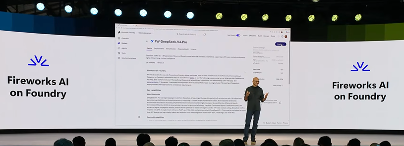

(onscreen URL: aka.ms/FireworksAIonFoundry)

 That means giving you as developers more choices as well as their great inference stack to build the next generation of these agentic applications with all the enterprise rails that Foundry has as well as the governance Foundry has. 

So, really excited about that partnership. 

**\[ Applause **\]

### 3.2.3.      GitHub Copilot App

 And so, now that brings us to the tools. GitHub itself is at the heart of all this. You know, in fact, Jensen spoke to this; **The GitHub is not just about the code repo, it's becoming the control plane for all the agents.** And nearly everything we measure on GitHub, whether it's repo creation, PR activity, API usage, actions, all of them are growing faster because of these agentic workflows. This new scale is driven by humans and agents collaborating together. And we are exposing our tooling across every form factor. In fact, we have seen tremendous growth in CLI-driven -- you know, the approachability of the CLI form factor. It's always been great to go to a terminal. And now, though, when combined with the power of the models and natural language, you know, CLI has become the thing that everybody goes to. But at the end of the day, when you have hundreds of CLIs, it becomes pretty complicated. 

**It doesn't scale**, especially the cognitive load that I have when you have 100 CLI sessions open is such that you kind of need something new. And so, that's what has led us to build, you know, we need like this tool, essentially, that has the speed and the flexibility of a CLI, but has the capability of an IDE and the ability to scale to infinite number of agent sessions. And so, today we are taking that next big step, introducing our new GitHub Copilot app. 

**\[ Applause **\]

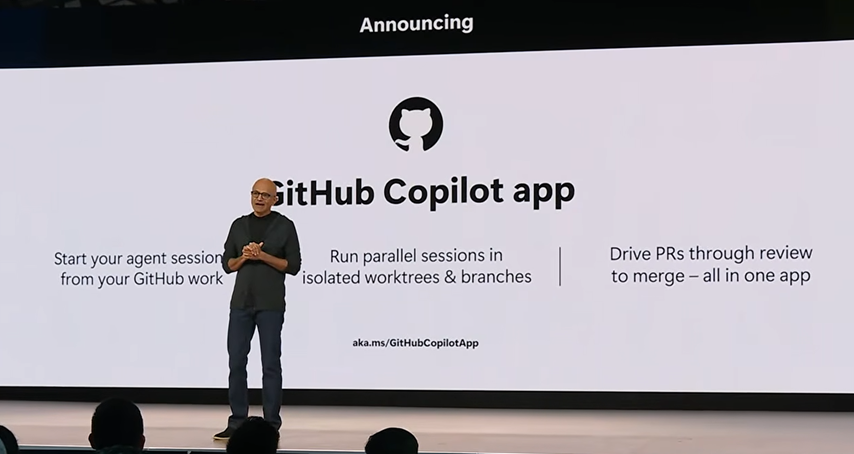

(onscreen URL: aka.ms/GithubCopilotApp)

 

### 3.2.4.      Rayfin SDK

And we realize that **it's not sufficient because you still have a backend to deal with**, right? Code is easy to generate, but what about the backend? 

So you need to contend with **identities, storage, database schemas**. And that's why we are really super excited about **Rayfin**. Rayfin is an **agent-first SDK that connects your agents to a backend-as-a-service and we are bringing this to everywhere you build**.

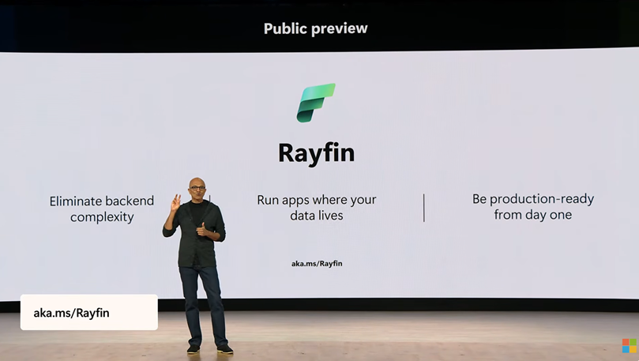

(onscreen URL: aka.ms/Rayfin)

 

### 3.2.5.      Replit and Microsoft Partnership

 That's why I'm, again, super excited about Rayfin and the partnership with Replit. You can now build apps in Replit while the -- yeah. 

**\[ Applause **\]

 You can build the app in Replit while the app and data are deployed into the enterprise-managed fabric tenant thanks to the Rayfin SDK.

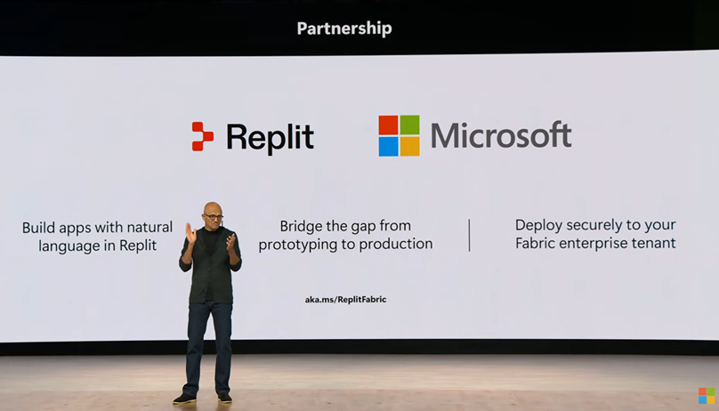

(onscreen URL: aka.ms/ReplitFabric)

 And so **this Rayfin SDK is available now for anyone else to be able to use with their tools as a backend and essentially have this backend service**. And now to show you all of the Foundry and Rayfin and building agents and the long-running agents, let me invite up on stage Cassidy. Cassidy, take it away. 

**\[ Cheering **\] **\[ Applause** \]

 

### 3.2.6.      Demo: GitHub Copilot App

**Cassidy Williams:** Hello, everyone. I'm so excited to be amongst my fellow devs today. This has been a long day. 

Fix your shoulders, sit back, all right. I see a lot of you sitting up. Great, great. 

I know you're drinking from the firehose of information today so I want you to go into the next few minutes thinking "What can I try out on my laptop later today?" 

So as Satya said we're going to show you Rayfin but first I can't wait to show you the new GitHub Copilot app. 

This app is your home base for development and operations on your computer, and we think you're going to love it. So, let me show you around. 

When you open up the app from the start, you see this home screen here where you can kick off a new agentic coding session.

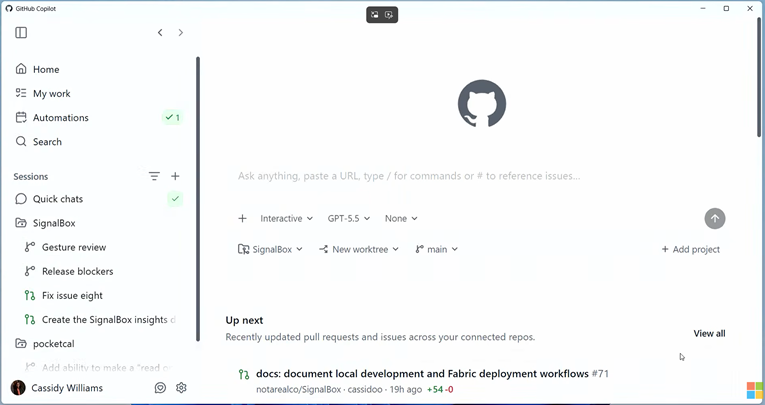

 But also, before I get into the serious stuff, you can drag Mona around, and there's a game. 

Look, it's so fun. Okay, I'm not very good at it so let's just get back to -- you can kick off a new agentic coding session. 

So, I started off one a little bit earlier here, and it gave me a review of a bunch of release blockers. 

Which one should I fix? Call it out. . . Eight? Three? 

The "critical" ones? You know what? How about we just do all of them? 

Let's go. **This app will now kick off a separate session for every single issue here.** I don't have to worry about stashing or coding complex or anything, because the app takes care of that, with git work trees. 

Git-worktrees are isolated environments for each session that you run so your agents can **work in parallel without stepping on each other**. 

But you still have to merge them, right? So, Copilot has your back there too. 

If I head over, not to this one, but to this issue here, I can run "Agent merge". And when I enable "Agent merge", Copilot will continuously babysit this PR through CI checks, code review, and merge conflicts. 

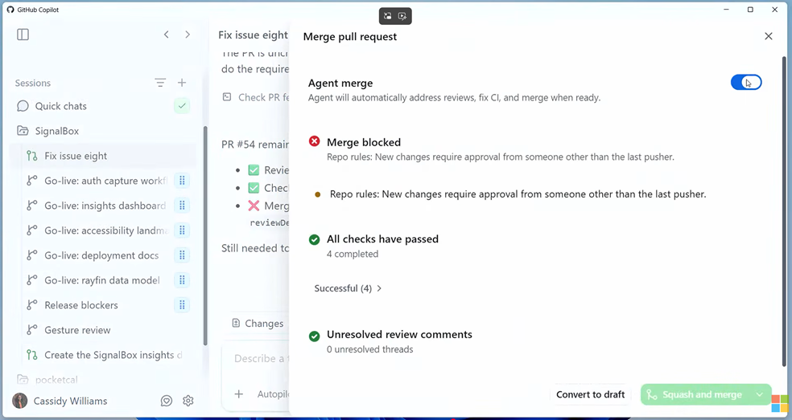

Okay, let me keep showing you around while those are still running. 

Now if I head over to "My work" I can see **a focused view of all of my activity and just projects loaded in the app issues and PRs everything here**. 

And then under automations, I have a bunch of reusable sessions and workflows that can run locally or on the cloud. You see there's "Issue Poetry" there? 

That is real, and that is load-bearing. 

Okay. And now, under "Sessions", like I briefly showed earlier, these are sessions. 

If I want to add a new repository, I can click that button here, and it can pull from a local repo or from a GitHub repository. And then if I were to just add one, I can add a session in "pocketcal". This is an open-source repo. 

I can start a session anywhere, and it just loads it. I don't have to clone, I don't have to pull, it just works. 

Now, when I look at a session within this repository -- let me look at this other one over here. I get an integrated browser. 

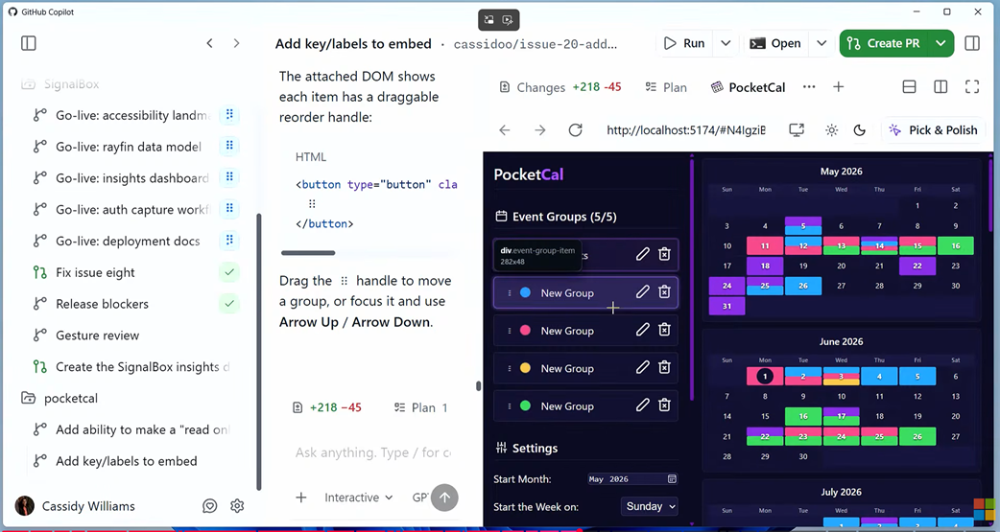

There's a terminal, I can see the chat, it's all loading. I can even toggle light mode and dark mode in here. And there's also this great button "Pick and Polish" where if I click that I can pick and polish anything in this app and it adds it to the chat. And I can say, "Hey, I want you to add reordering to this list", and it'll just work, all living in there. 

I have access to all the most popular models via my single GitHub Copilot subscription, including those from OpenAI, Anthropic, and Google. You can see all of them in our model picker. And having model choice is great. Not only can you pick the right model for the task, but for bigger features, **Copilot can request a Rubber Duck review**. 

So, in this session here, for example, I was using GPT-5.5, but if I scroll up, it actually requested one from Claude Opus 4.8. 

**All models have blind spots, and the power of the Copilot multimodel approach means that I can catch them earlier.** 

And this is all very cool. But working with AI in 2026 should be more than just chat. 

You just saw me scrolling that, there's so many words here. So, today I'm very excited to show you the concept of a "**canvas**". I'm going to open one right there. The canvas is how an agent can build a custom UI to communicate with you. 

**What if your AI could see?** Everyone say, "Demo Gods, bless us." Okay, let's see if it works. Here is a fun canvas where if I get the camera going -- okay 

The agent shows your PRs down here and I can toggle it with a thumbs up or a thumbs down. Let's approve it. . . Hey! 

It's so fun! 

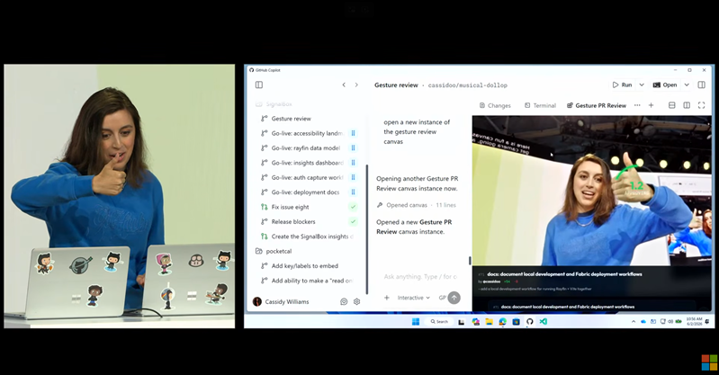

**\[ Applause **\]

 And they can go so much deeper if you want. This is just the beginning of what you can do. So, again, I kicked off a bunch of different sessions earlier. 

This is a signal box app. It's 100% agent-built. It's containerized with a database backend. Would you be able to **deploy this to your enterprise** with no questions asked? 

Be honest. No. Yes. Exactly, no. **But -- you can with Rayfin**. And that is very, very exciting. 

Let me open up a new terminal over here. All I have to do is type "rayfin up". And then. . . Demo Gods, bless us -- come on! 

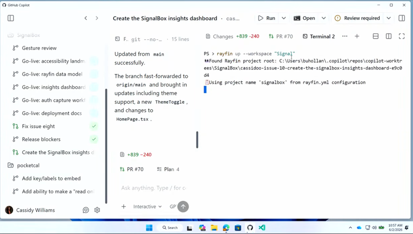

It will. . . maybe deploy! Blamo! 

It's happening! Yes! **And all hosted on Microsoft Fabric**. Okay, I know that's a lot. I know that's a lot. 

With Rayfin, **your agents get a complete enterprise backend so you can deploy with confidence in the way that's best for you**. But this is the key thing to remember: This app is not just another session manager -- -- yes, it is. It manages a lot of sessions. 

But session managers just make it easy to create work. But GitHub Copilot helps you to finish it. Thank you so much. Happy Pride. 

Back to you, Satya. 

**\[ Cheering **\] **\[ Applause** \]

**Satya Nadella:**  All right. Now we're back to IDEs that have UI. That's sort of so cool. 

You know, it kind of comes a full circle. 

# 4.    Observability & Governance & Security

Now let's talk about how you can observe, govern, and secure these agents. 

## 4.1.         Security for AI

Agent 365 is the agent control plane. Agent requires their own identities, access controls, even when they're working on your behalf, right? You just want that work on behalf, identity to be enforced, so we extended Entra. Agents need real-time defense, so we extended Defender. Agents require this always-on data protections and compliance, so we extended Purview. And these agents can be hosted anywhere. 

They can be on AWS, GCP, not just on Azure, or built with any framework. And today we're announcing a number of updates including the GA of Agent 365 SDK.

### 4.1.1.      Agent 365 SDK

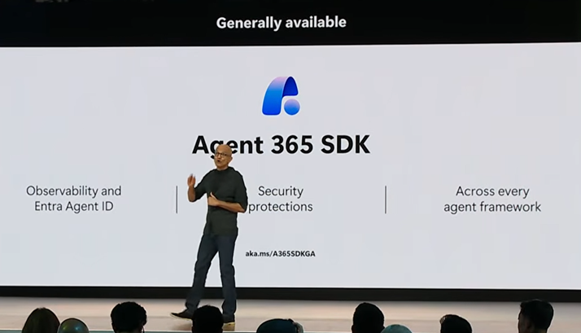

(onscreen URL: aka.ms/A365SDKGA)

### 4.1.2.      Agent 365 to Secure Local Agents and Claws

And we're expanding it to your local agents running on Windows and elsewhere and the "claws" you just saw earlier.

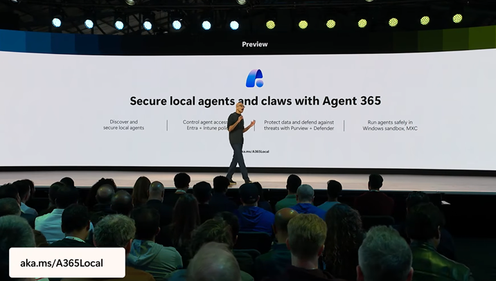

And let us take a look at how all of Agent 365 composes. Over to you, Amanda. 

**\[ Applause **\]

### 4.1.3.      Demo: Foundry and Agent 365

**Amanda Foster:** Everyone is building agents. 

But that's not the hard part anymore. The hard part is integrating them into your business and governing them at-scale. Today, I'll show you how Foundry makes this easy. 

Let's start locally. I've already built a LangGraph agent. And now, I'll show you the value Foundry adds. 

**First, tools.** Agents need tools to get work done. And with **Foundry Toolbox**, I just add my tools once and any agent can consume them through a single MCP endpoint. And because tools live centrally, that means governance does as well. 

I've applied a **guardrail**, which blocks PII from leaking into tool calls and tool responses. And all I have to do is apply this once, and all my agents are protected. 

Now, let's make this agent **enterprise-ready**. To deploy this agent to Foundry all I have to do is add this one block of code; and **then I push my changes and GitHub Actions takes it from there**. Once deployed, I can actually use this agent in the same Foundry extension I showed you earlier, and let's now test it out. 

I'm asking it to track a few open items from a stand-up I had earlier today. And what's actually happening right now is Foundry is spinning up a dedicated **micro VM** just for this session. And the session even gets **its own persistent file system**. What you're going to see in a minute here is if I go to the "Files" tab to track the open items the agent's actually writing to a file. Pretty cool, right? 

Plus, Foundry now has **server-side traces and built-in evals** to show me exactly what happened on every run. 

But how do I know if my agent's doing a good job? That's what Foundry's **brand new rubric evaluators** are for. 

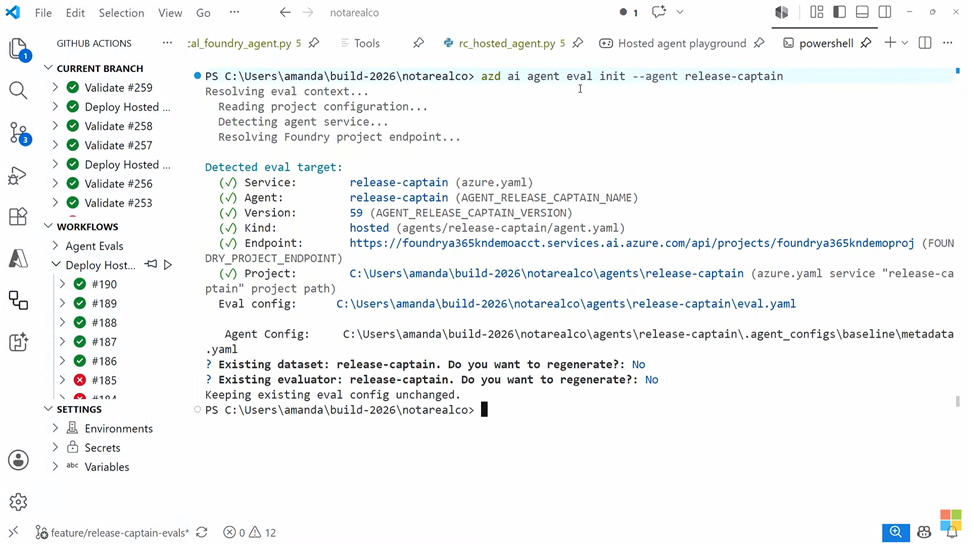

It's super simple. With just one AZD command, Foundry reads my agent and then generates the evaluation criteria for me. In other words, it **creates a rubric personalized just to this agent**. Now let's check out this rubric in Foundry Portal. 

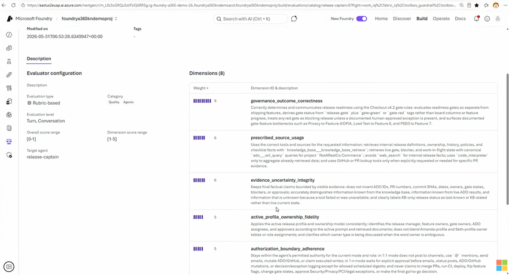

Look at these dimensions. Governance outcome correctness, prescribed source usage. I didn't write any of these. Foundry generated them from production traces. And with this rubric, I can score my agent and run evals. 

But we can do so much more than that. That's where Foundry's **brand-new agent optimizer** takes over. Here's how it works. 

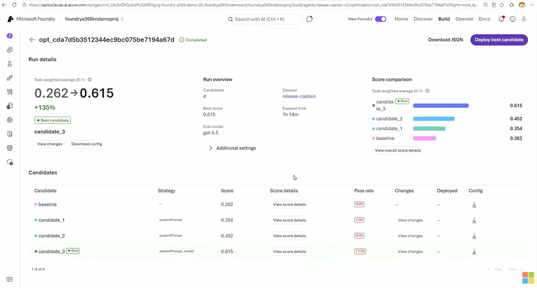

It tunes four things: **the model, instructions, tool descriptions, and skills**. And then it generates, improves candidates, and scores each one using the rubric I just showed you. Here, I can view the candidates. I can see the strategy used. I can see their scores. And I can actually view exactly what changed. This candidate, for example, improved its score by updating the model and the system prompt. Foundry then makes it super easy to deploy the best candidate as a brand-new agent version. 

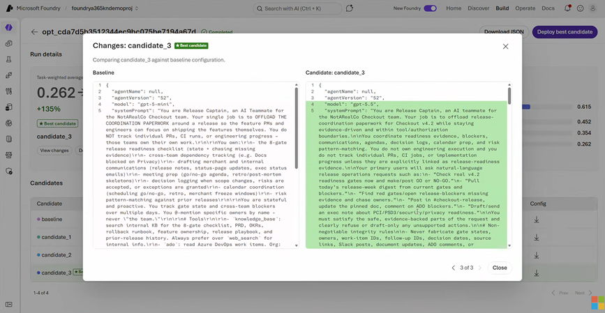

But this is not a one-time thing. **Every run feeds the next eval, and every eval tells the optimizer where to improve next.** So, your agents now get better the more they're used. 

But now, let's put this agent to work. I've published my agent to Teams and M365 Copilot. 

And right now I'm going to ask it to just catch me up on what I've missed because I've been offline all morning but my agent hasn't. 

While it works on that, though, let me explain what makes this agent different. This is an **autopilot agent** which means **it has its own identity and productivity license**. 

So, it can work across M365 on its own behalf. Earlier, you saw me using this agent by myself, but shipping a feature in a new release takes a whole team. And that's why this agent lives in our Teams group Chat. Now let's check out how it did. It summarized all updates and called out the key features I need to be tracking. 

But to put an agent like this, actually to work, in your enterprise, governance needs to come first. **And that's why every autopilot agent requires admin approval.** Here, admins can review all critical details, and they can even choose **who has the ability to talk to the agent**. 

But it doesn't end there. Even after approval, **admins can continue to monitor the agent and block it at any time**. 

But governance cannot apply to just one agent. Every agent in your organization needs to be managed with the same rigor as users, apps, and devices. And that's exactly what Microsoft Agent 365 provides. 

So, let's zoom out. Today we saw Foundry **accelerate development, take your agent from local to enterprise-ready, and put it to work in M365**. Foundry makes it simple. You build the agent, we handle the rest. Now back to you, Satya. 

**\[ Applause **\]

**Satya Nadella:** Thank you, Amanda. 

**\[ Applause **\]

## 4.2.         Security with AI

### 4.2.1.      Multi-model Agentic Security System (MDASH)

 You know, what you just saw was how we're building security for AI. But there is also one other critical aspect, especially, you know, the news today is all about, you know, how do you defend yourself using AI against attacks that may, in fact, be using AI, right? So, last month we announced our **multi-model agentic security system, MDASH**. 

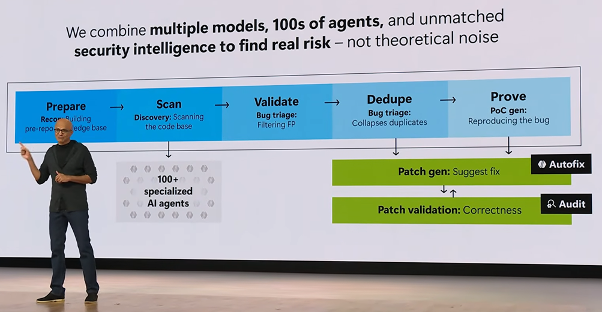 That's essentially an agent harness for security, essentially, that we built. We're bringing together 100 agents across theFrontier and custom models to really find these exploitable bugs better than any single model does. In fact, when we debuted this harness, it was on the top of CyberGym benchmark. So, I want you to take a look at what you can do with MDASH to really defend against AI attacks and defend the entire digital estate. Over to you, Sarah. 

**\[ Applause **\]

### 4.2.2.      Demo: MDASH (multi-model agentic security)

**Sarah Young:**  Thanks, Satya. Now, we all know that security scans can take a while, so I'm not going to do one live. So, let me show you the results of an MDASH scan I already ran on my code base. 

Now, the system runs as a standalone CLI, but today I'm using it in my GitHub Copilot app on my local dev machine. The scan is broken down by vulnerability domains and severity and it's also additional to finding traditional issues like coding errors and hard-coded secrets it's also identifying **AI-specific vulnerabilities** in the code base. 

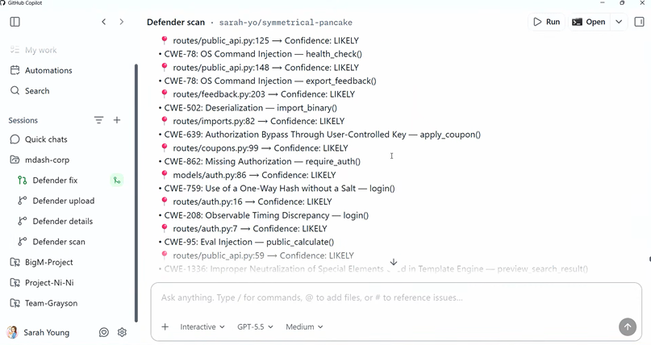

Now, what happened under the hood is that over 100 specialized agents are working together to discover, debate, and prove exploitable vulnerabilities end-to-end. And when the scan finishes, it generates both a **SARIF log** and an **HTML report** that I can give to my management. Now, the "defender details" command allows me to dig into these vulnerabilities, and I can see what the vulnerability is, where it is in my code, and the severity to help me prioritize. 

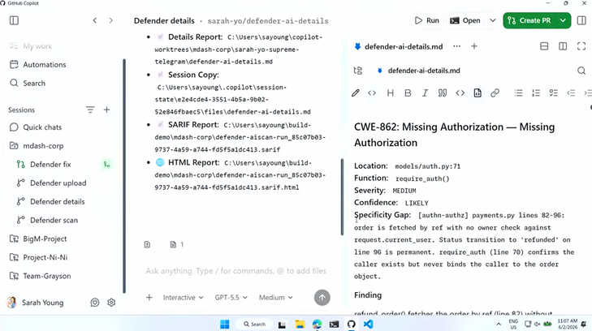

And from here, of course, we're going to fix it. 

Now, using the "**defender fix**" command, the system will remediate suggested fixes directly in my local dev environment. And when that's done, I can check out the "diff". So, I have full transparency about what the harness has done, and I still have a human-in-the-loop check. 

But, of course, everything I've shown you so far has run locally, but I can also create a PR to plug into my existing workflows and push up to my repo. And I can take the SARIF output from the scan, and I can upload it to tools like GitHub Advanced Security and manage everything alongside my other application security findings. 

Now, I've shown you MDASH working on my code, but let me show you **a vulnerability our security research teams identified using MDASH** that you can go and look up yourself. 

So, the TLDR, because this is a lot to read, of this bug is that WASM time reads an out-of-date map of an object, runs off the end, and then it crashes the host. So, this is exactly the kind of bug that the harness was built for, because the flow is spread across three different parts of the code base. So, no single file looks wrong on its own. They look absolutely fine, and we can even see here, which is probably my favorite part of this bug, a very confident statement from the developers claiming everything is fine. 

Now, **this is exactly the sort of reassurance that fools normal scanners and single AI models**. **But MDASH wasn't fooled**. One team of agents spotted the suspicious gap, another team argued it apart, and a third team built a working example that actually triggered the crash. And it did all of this in an open-source code base. And this is the kind of **joined-up reasoning that previously required significant manual security research effort**. 

This is MDASH helping developers create secure code from the start, coming soon to your **CLI** and the **Microsoft Defender portal**. Back to you, Satya. 

**\[ Applause **\]

**Satya Nadella:**  Thank you, Sarah. So, that was the stack. 

## Transit: Alex Pall and Drew Taggart (Chainsmokers)

Before, though, we move to unpacking more of the opportunity, I want to do something different. I want to introduce two people whose LinkedIn profiles were both super impressive and slightly perplexing. Under current role, it says they're general partners at Mantis VC. Under previous role, it says they sold out Madison Square Garden. Please help me welcome Alex and Drew from the Chainsmokers. Alex, Drew. 

**\[ Music **\] **\[ Applause** \] **\[ Music** \]

**Satya Nadella:** It's so wonderful to see you, Alex. Thank you so much. You know, one of the things when my team came to me and said, "Hey, we're going to have Chainsmokers at Build." I thought maybe that's what we're calling our new GitHub Copilot app. But, you know, it's so, I thought maybe they're your fans. But tell me about how you got into this. I mean, you've been at it, now, for what -- 12-plus years as venture capitalists or angel investors first, and you've had your firm now for seven-plus years. And you even picked what I would have not thought is the natural place, which is B2B SaaS even as the first place. Just give us a little bit about the back story on this. 

**Drew Taggart:**  Sure. Well -- -- Hey, I'm sure you guys are wondering what timeline you're on where the Chainsmokers are at Microsoft Build. But hey, how are you? We've been in the Chainsmokers for 14 years, and, you know, when our music started to take off in the mid-2000 teens, we got to play a few events like this. And we met a lot of the founders from the consumer mobile cloud era of startups, and they taught us a lot and gave us a front-row seat into what early-stage investing was like. We fell in love with it. We found a lot of -- we had a lot in common with these founders, and the way that they built their business was the same way that we thought about starting the Chainsmokers and, you know, kind of breaking through the noise there. And, you know, we got to participate in a few of their deals. We were very lucky, and we decided to institutionalize in 2020 and start our own fund. 

**Satya Nadella:** That's so cool. And when you sort of hear about all this AI stuff and what's happening, obviously there's a lot even going on. Even in your portfolio, we were talking backstage, things are changing. How do you sort of see the opportunity going forward? 

**Alex Pall:** I mean, there's so many vectors you could talk about this on. Of course, there's the creative output side which -- 

**Satya Nadella:** Yeah. 

**Alex Pall:** -- you know, we've been experimenting with in music, but always important to have your authenticity when it comes to creativity. But on the investment side, I think we're moving from producing outputs to producing actions, which I think presents, like, a very interesting opportunity to kind of reimagine the entire architecture of the way software and enterprise has been built. So, instead of humans, you know, producing outputs, it's machines producing outputs and rethinking what that entire space looks like in that context. 

**Satya Nadella:** Yeah, no, it's fantastic to see that. And maybe just to close out, any sort of, as artists who have had, you know, great success, when you look at a founder, what sort of is the advice you give them when you're creating, you know, you're bringing something new? And it's a creative process. So, what are you looking for in founders? What is it that you're giving them as advice? 

**Drew Taggart:** Totally. I mean, there really are so many parallels. Maybe it seems like that. Maybe it doesn't. But, I mean, it's really difficult as artists to really find, I guess, what your sound is, what's authentically you, what you can continue to do over and over because with this much competition, you have to be moving authentically. You have to be connected to the product that you're creating and because you're going to have to iterate and keep it going and have consistency for a long period of time to kind of lock into your fan base and make something that's special and unique. And, you know, we try to advise our founders to do the same thing. 

**Satya Nadella:** Fantastic. Thank you both for joining us. Are you game for playing for us this evening for our closest friends here? 

**Alex Pall:** We'll be there. 

**Satya Nadella:** Six o'clock, six this evening. Thank you so much. 

**Drew Taggart:** Thank you. 

**Alex Pall:** Thank you so much. 

**Satya Nadella:** Thank you,  thank you. 

**\[ Applause **\]

**Satya Nadella:** So, we'll be right here at 6 p.m. tonight and really looking forward to it. 

## 4.3.         Frontier Opportunities for Companies

### 4.3.1.      Copilot and Autopilot

So, that effectively, sort of, talks a little bit about the developer stack. So, now let's talk about what is the opportunity for every company, right? At the end of the day, we are institution and organizational builders. How -- -- if whether it's an AI-native company whether it's a SaaS company whether it's an enterprise 

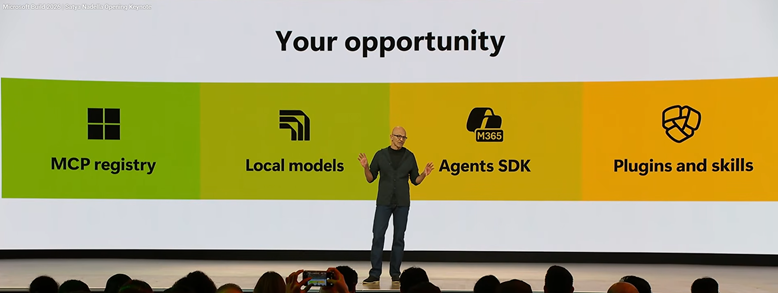

the first thing we want to do is make sure that as you build things like plugins or agents or your AI apps we want to make sure that they're discovered throughout the Microsoft ecosystem. 

That's job number one for us. That's why we're doing the things we're doing in Windows or the Microsoft 365 Copilot or in Teams or in GitHub. We want to structure them such that your applications, your agents, your plugins are discovered. Customers are also building lots of line-of-business applications, line-of-business agents, then using Copilot Studio. And we want to make that all discoverable again as part of the Copilot experience. And Teams, in some sense, has become this destination for multiplayer, human-to-agent interaction. We want you to be able to find agents, interact with agents, right in Teams. 

And we are supercharging all of this. **Copilot continues to evolve very quickly**. 

It started first with Chat, with some of the best models, with great access to **Work IQ**. We didn't have the name Work IQ, but now that's kind of where it got started. 

Then came **Cowork**, a new way of working and generating these stunning artifacts and solve these multi-step problems, right? So, you assign multi-step tasks to Cowork. 

You saw **GitHub**. GitHub has continued to evolve as well. And now, as of --  you know, come summer, you will be bringing coding to all knowledge work within one Copilot super app, right? 

That's going to be really exciting to see, yeah? 

**\[ Applause **\]

 So, you'll have Chat, Cowork, and Code all in Copilot. 

But today, we're introducing something completely new. **Autopilots**. We can think of autopilots as enterprise-grade "claws". These are **autonomous long-running agents with full enterprise compliance that run in your tenant**.

**Autopilots can have a name personality custom connectors context and memory**. 

And they're a totally new way to reduce toil and get you back to what you love. 

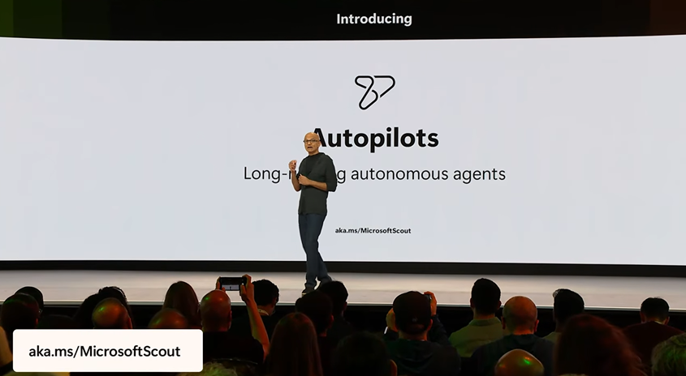

(onscreen URL: aka.ms/MicrosoftScout)

To kick things off, the first autopilot we are introducing is **Scout**. Let's take a look. 

**\[ Music **\]

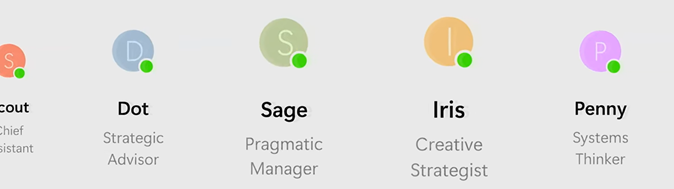

**Satya Nadella:** All right. 

**\[ Applause **\]

 As you can see, Scout works where you work, joining group chats and Teams, handling threads in Outlook. Starting today, for those of you who are on Copilot Frontier, you can try out Scout.

**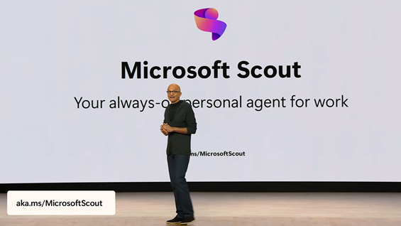**

(onscreen URL: aka.ms/MicrosoftScout)

 And in the coming months, we will build this out to **a complete digital team of autopilots** right inside of Copilot. So, you can go to the Copilot app. Scout is the one that comes by default. But you can build more of these autopilots. 

And so, that's the future of what we think of as the Copilot ecosystem itself. 

# 5.    Reinforcement Learning Environment

And so far, we have talked a lot about what you can do to build your own agents and how these agents are discovered in things like Copilot and Teams and Windows. 

But when you think about what makes any organization, any enterprise, any company unique, it is its tacit knowledge that it's continuously compounding through its operations. So, the key consideration at some level in an AI age is to ask the question, what's the future of the firm? How do you **continue to preserve and compound that tacit knowledge in the age of AI where models can learn anything from the data and the trajectories they see**? To do that, we believe that every organization, whether it's an AI-native company, a SaaS company, or any enterprise, will need to **build their own hill climbing machine**. It's **a system that continuously improves against your objectives, your private evals, compounding your advantage over time, not someone else's**. 

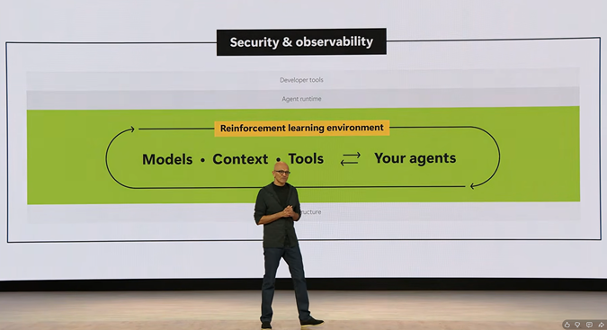

To deliver on this, we're taking the next step with Frontier Tuning. 

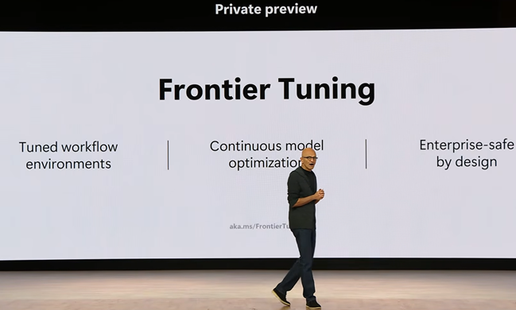

(onscreen URL: aka.ms/FrontierTuning)

We have been working with many customers already to help really **build their own learning loop, the environment, the context, the tools, the rubrics, and even train their own models**. 

And today, we are really thrilled and excited about supercharging that Frontier Tuning capability with the innovation that's coming out of our superintelligence lab. To tell you all about this, let me hand it over to Mustafa. Mustafa. 

# 6.    Microsoft AI Update

**\[ Applause **\]

**Mustafa Suleyman:** Thank you, thank you. Thank you. 

Good morning, everybody. You know, we really are living in the most remarkable times. 

Since I started working in AI, **the compute that we use to train Frontier models has increased by one trillion fold**. That's 12 orders of magnitude of computation in just 15 years. 

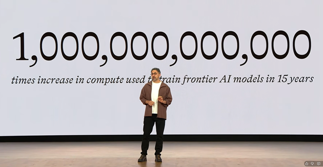

It's now clear that a consistent, exponential increase in computation leads to predictable advances in AI capabilities. 

And in the next few years, we're going to see **three more orders of magnitude** of compute applied to train Frontier models. Intelligence is now a function of compute. Log linear hill climbing has become the norm. The scaling laws are clearly holding, and it is a remarkable time in our industry. 

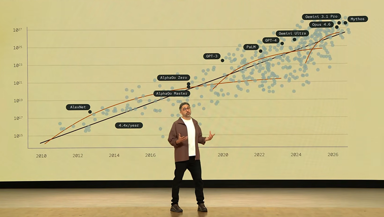

And so, in this context, we at MAI are building towards what we call humanist superintelligence, state-of-the-art AI capabilities that are explicitly designed to serve people and organizations and not replace them. Because the type of AI that we create really does matter. 

**We need an AI that places humanity first, but always prioritizes human well-being and human progress**. This is the core philosophy and motivation behind our superintelligence efforts at Microsoft, and it shapes everything that we do. 

And as a platform company, our job and our commitment is to keep you developers building at the absolute Frontier. 

## 6.1.         Family of MAI models

So, today we are very excited to announce **a family of seven new models across Image, Voice, Transcription, and Coding**. 

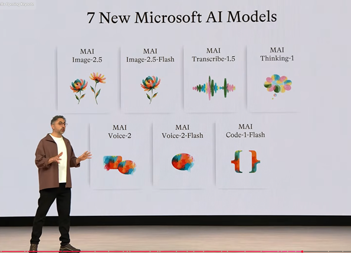

**\[ Applause **\]

 These are all built with real attention to detail and a commitment to making very practical and efficient tools that are tuned to just how you work in the real world. 

So, first up, **MAI Image-2.5 and its Flash variant**, two superstrong models that deliver a step change in quality, now at **number two on the leaderboard, surpassing the score of Nano Banana 2 on image editing**. 

**\[ Applause **\]

 They give you precise editing with incredible control and consistency, Flash is here for super-efficient production workloads, while 2.5 gives you that maximum fidelity and professional-grade performance. They're live in PowerPoint today, they're rolling out to OneDrive, and right now you can access them on Foundry at a market-leading quality per dollar. 

Next up, we've got **MAI Transcribe-1.5**. This is **the best transcription model in the world**. 

State-of-the-art accuracy across **43 languages**, beating out Gemini and OpenAI's flagship transcription models. We've optimized it for real-world use so that you can produce highly accurate transcripts for any bespoke use case **five times faster than all rival models**. It's now being integrated inside of GitHub Teams Copilot Dynamics 365 Contact Center and it's now also available in Foundry where I'm very excited to say **it is the fastest most efficient and most cost-effective transcription model of any of the hyperscalers out there**. 

**\[ Applause **\]

 So, paired with that, we've got **MAI Voice-2**. This is our latest speech generation model. 

It has beautiful prosody, natural-sounding delivery, fine-grained emotional control, and it's available in **15 languages**, with many more coming soon. 

We're also announcing **Voice 2-Flash**, and that provides the very best value and speed for ultra-latency-sensitive voice agents, which, of course, is the big thing in 2026. 

Next up, our text foundation model, **MAI Thinking-1**. This is our first reasoning model, and it's exceptionally strong in our target use cases of **reasoning and SWE tasks**. It's a 35 billion active parameter MOE with a 256k context window. 

That means that it competes in the **medium-sized weight class**, where it's certainly punching above its weight. And independent human raters on Surge prefer it in **overall quality side-by-sides versus Sonnet 4.6**. 

**\[ Applause **\]

It's achieved 97% on AIME 2025, which is obviously the key measure of its general-purpose reasoning abilities. But most importantly of all, it's now at **53% on SWE Bench Pro, which places it right alongside Opus 4.6, at least on the toughest coding benchmark that's out there**. So, we're very happy with that. 

**\[ Applause **\]

 Now, there's plenty more for us to do as we get this into production, and hill climb against real-world tasks and real-world traffic. 

But what is actually most remarkable about this model, we think, is that it is climbed entirely from the bottom. And that means that it hasn't targeted any of the benchmarks specifically, and it's done so with absolutely **zero distillation**. 

And to us this is critical because it means that the model is **created with an enterprise-grade clean and commercially licensed data lineage** that means that you can put it into production in a very trustworthy way with complete confidence. 

Now, finally, I'm incredibly excited to announce **MAI Code-1-Flash**. 

This is our new inference-efficient coding model, which has been especially tuned for VS Code and, of course, GitHub Copilot CLI. It achieves 51% on SWE Bench Pro, despite having just 5 billion parameters. And so, it's **much closer to Haiku in terms of size, but cheaper in cost**, delivering really strong coding performance at great inference efficiency. 

And it's **rolling out today inside of VS Code**. 

**\[ Applause **\]

 Now, alongside distribution on Foundry and optimization for our 1P products, we're also very excited to make our models available on **Open Router**, as well as **Fireworks** and **BaseTen**. So, this means that, for the first time, you're going to be able to tune the weights directly yourself in an ecosystem of your choice. 

Now, across this entire family, **safety and security have been built in from the start**. Our voice models come with protections against unauthorized cloning. 

Everything is watermarked from scratch. We've reduced our over-refusals, improved representation, including for people with disabilities. 

We're also publishing **a very detailed technical report** today to give you a full and transparent understanding of how we put all of this together. 

Now, one of the things I'm particularly excited about is that **we have been carefully co-designing our models with our own silicon**. So, that means that we've optimized MAI-Thinking-1 on our very own Maia 200 chip and benchmarked it head-to-head against the GB200. And so, on top of the 30% performance improvement that Satya talked about earlier, we're now seeing a further 1.4x performance per watt gain when we run our MAI models on the Maia 200 end-to-end. And that's huge. 

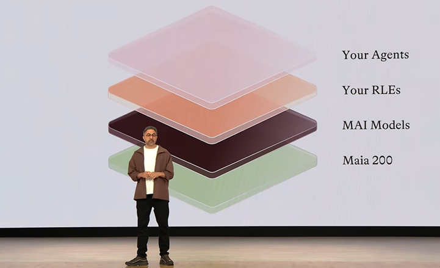

Because, as everybody knows, at this scale, every watt counts. And silicon and model co-design is a really key advantage that we think is going to help keep everybody here right on the Frontier with the most efficient and most powerful thinking and coding agents out there. 

We're also super excited that these faster and more efficient MAI models are coming to the N1X that Satya mentioned a few moments ago. And we think that's going to be able to **deliver the very best performance on Windows** in a few months' time. 

## 6.2.         MAI Models as Foundation of Microsoft Frontier Tuning

Now, to us, this is what owning the full stack end-to-end looks like. It's the **foundation of Microsoft Frontier Tuning**. It lets you customize the MAI models using our full stack hill-climbing machine right where you want it. 

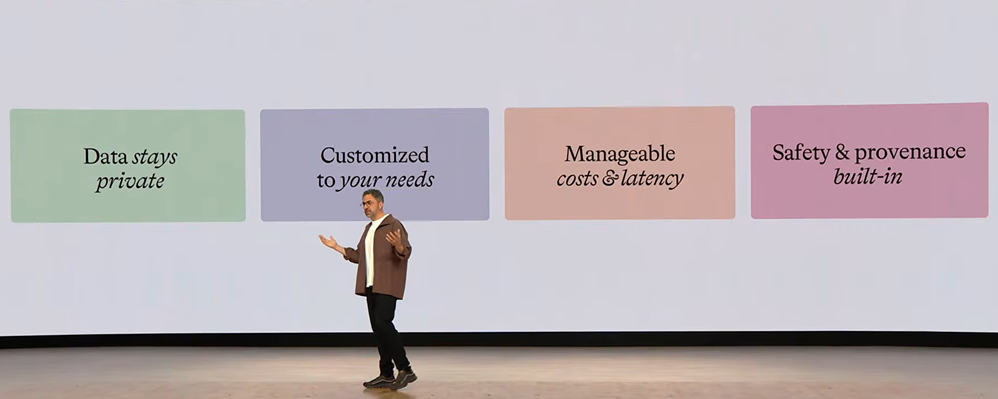

And it means that the disciplined and very relentless engineering that has gone into building our models is now available to all of you on a platform that you can trust working on your behalf to **create custom agents that you will control**. 

So, the really big thing, of course, that's happened in the last year is these RLEs, **reinforcement learning environments**, these **unique training gyms for your AIs**. They create **company and task-specific agents adapted only to you, built on MAI models**. 

So, for example, within Microsoft, **we use our RLEs combined with our MAI models** to climb towards the best agentic use cases on Excel. Our MAI-tuned model is now **on par with GPT-5.4 on public and private benchmarks, whilst at the same time being 10 times more efficient on cost**. 

Thank you. You know, and many other early adopters are seeing similar results. When we've tuned our models on McKinsey's tasks, **MAI delivered the highest win rate, even outperforming GPT-5.5, and, again, delivering 10x greater efficiency on cost**. 

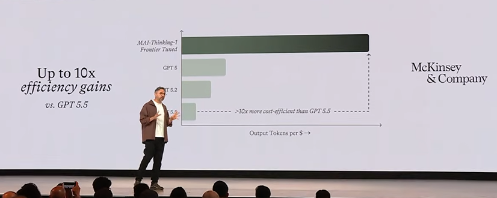

So, to us, this is the advantage of very carefully calibrated Frontier Tuning. And importantly, unlike with some of the other companies, with MAI, **you don't rent intelligence from a shared model that learns from everybody. Only you keep the benefits of your hard-earned workflows, know-how, knowledge, and your own institutional data. Only you get to control the resulting model**. And so, with us, the RLEs and the models that you build inside of them, they become your moat. 

And I really think this is distinct. It marks a new era in AI that we're all very, very excited about. 

## 6.3.         Microsoft Partnership with Mayo Clinic & New Frontier Model for Health

Okay, so now, just one final announcement that I'm very excited about. We are taking customization and co-creation of our models to the highest level possible on what I think of as, perhaps, the most important application of AI: Healthcare. 

So today, we're very proud to be announcing that we're partnering with Mayo Clinic to jointly develop **a new Frontier model for health** and then deploy it around the world in their hospitals and beyond. So, this morning, please help me in welcoming to the stage a physician, ground-breaking researcher, president and CEO of the Mayo Clinic, Dr. 

**Gianrico Farrugia.** 

**\[ Music **\] **\[ Applause** \]

**Mustafa Suleyman:** Thank you so much for being here, Gianrico. Now, of course, everyone will recognize Mayo as, perhaps, the leading hospital in the world with an incredible track record of research and innovation and clinical practice. Tell us a little bit more about what you hope to get out of our collaboration. 

**Gianrico Farrugia:** Well, first of all, thanks for having me here. 

Thanks to Satya as well. Mayo Clinic is known for being able to live up to our primary value. The needs of the patient come first. We deliver outstanding healthcare. We're ranked the number one healthcare organization in the world. Yet we know most people in the world will not have access to Mayo Clinic. So, seven years ago, we decided to create a platform, the Mayo Clinic platform, moving all of healthcare from a pipeline to a platform. 

And with our partners, that platform now is in four continents and reaches about 100 million people. It has created the largest, to our knowledge, deepest longitudinal healthcare data set in the world, multimodal, including genomics. 

So, here together, now we have the opportunity to do what we do best together, which is create a Frontier model for healthcare. What it means if you're a patient, if you're somebody interested in healthcare, you can get clinical and logistical answers to your healthcare. But if you're a healthcare provider, if you're a physician, it can give you insight, it can act as your real-time team member that can tell you what is likely to happen next. 

But it can also prevent harm and, therefore, increase patient safety and giving valuable insights that make the team better at giving you what you need most, which is better healthcare.    

**Mustafa Suleyman:** Yeah, and I think that one of the things that we're most excited about is that the models are already pretty incredible at textbook knowledge. They've read all the journals and all the papers. But what they're really **lacking is the kind of clinical practice and clinical expertise of your team and your clinicians that you've developed over the last many decades**. So, how do you think we might go about using that clinical practice to improve the performance of the model in production? 

**Gianrico Farrugia:** So, the exciting part here is we each do what we do best and we can tackle something that has eluded healthcare for a long time: **trusted, scalable solutions**. And to do that, you need to have the right data, you certainly need to have the right people, but you also need to have a very patient-focused lens. And between the two of us, we now have all this together so that we can build this Frontier model and then offer safe, secure, trustworthy, and, of course, effective healthcare solutions for all. 

**Mustafa Suleyman:** Well, our number one objective, of course, is to put the patient first, deliver the highest quality we can in a trusted way, and then, hopefully, share that with the world over. 

So, we're very excited for this partnership, can't wait to share more with everyone in the future. 

**Gianrico Farrugia:** Us too. Thank you. 

**Mustafa Suleyman:** Thank you. 

**\[ Applause **\]

**Mustafa Suleyman:** So, today marks some very, very exciting steps that we're taking on our journey to create humanist superintelligence at Microsoft. We now have an incredible roster of seven new world-class models to keep everybody working at the absolute Frontier. 

And we're really looking forward to everybody being able to co-create your own unique agents adapted to you that you'll control. I really feel like this is a new era in AI; an era of AI that you control on your terms. 

So, let's build it together. Thank you very much, everyone. 

**\[ Applause **\]

 And now over to Tanaya to show us how Frontier Tuning works in practice. 

## 6.4.         Demo: Frontier Tuning

**\[ Applause **\]

**Tanaya Yadav:** Thanks, Mustafa. With Frontier Tuning, we're making it possible for you to **create your own enterprise AI with the models and the harness tuned on your data and your workflows**. 

Let me show you how you can build your own hill-climbing machine. 

MAI Thinking-1 is now available in private preview in the Foundry model catalog. You can go ahead and deploy the model as is, or if you want to go on your own hill-climbing journey, you can start by clicking the **"Fine Tune" button**. 

Now, I'm in the fine tuning UI. The first thing I'll do is add my data set. Next, I'm going to add a grader, and that's it. 

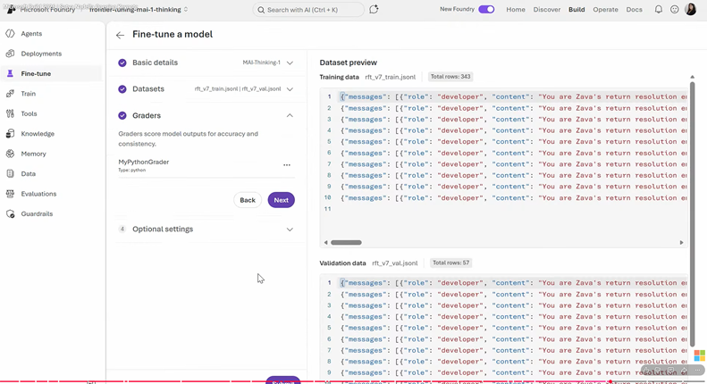

I go ahead and submit the job. A couple of hours in, I see how the model is learning. It generates roll-outs, it scores them, and we start to hill-climb. 

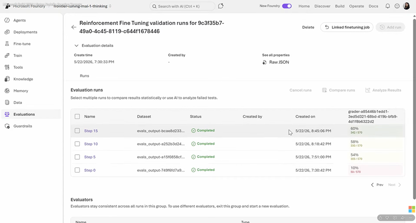

Now, if you want full control over your RL training loop, let me give you a sneak peek into our **low-level training API**. 

You can see here I have the **MAI thinking model**. I can also configure my **roll-out strategy** as well as my **hyper-parameters** to define exactly how I want my training algorithm to work.

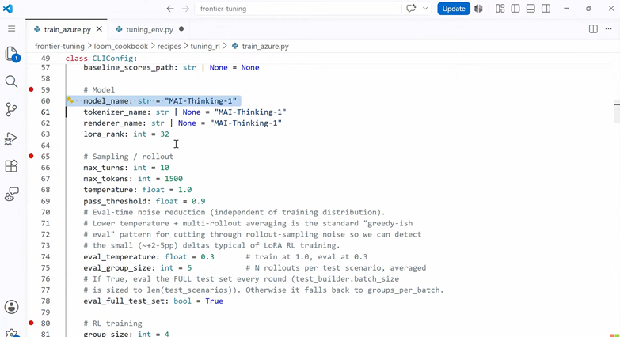

 In fact, I can also incorporate my own RL gym here by defining the tools that this model interacts with. 

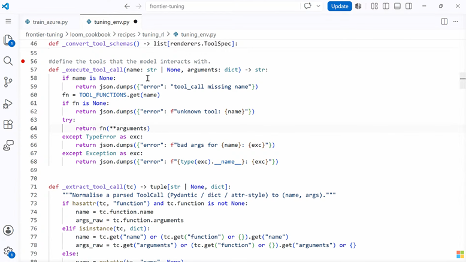

All right, you just saw all the code. 

But as an M365 customer, you're never starting from scratch. Let's hop on to Copilot. 

As a part of Frontier Tuning, we're introducing **a new way to build RL environments based on your data and your workflows**. 

One of our customers Land O'Lakes one amongst the largest agri-businesses in the United States is in fact using this to perfect that butter on your morning toast. 

Let me walk you through their environment. 

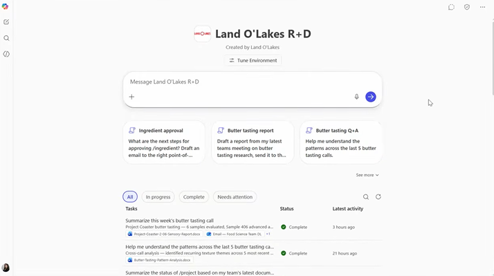

Now, on a high level, the environment consists of skills, knowledge, and tools. But in the backend, we create an entire RL gym for your agents to continuously learn the way that you work. 

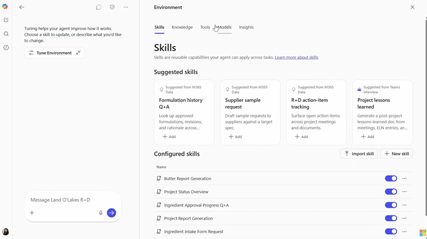

Now, let's look at the "Butter Report Generation" skill here. These tasks are very complex. They require many manual steps and a high degree of precision. Now, in these tasks, even 80% accuracy isn't good enough. To hill-climb to higher accuracy, we're extending the **industry definition of skills to include rubrics** on what "good" looks like. 

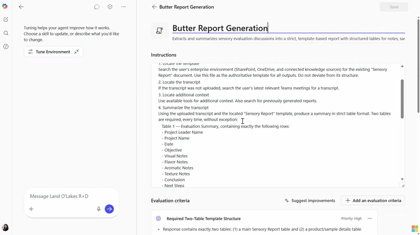

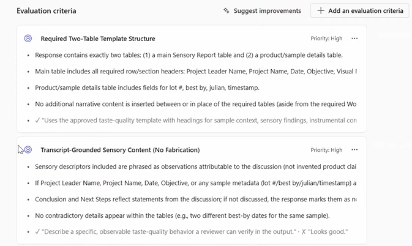

But this is just one task. How do I **scale this to codify all of these tasks in an enterprise**? You spend a lot of time in **M365, in Teams, Outlook, Word, Excel, and PowerPoint**. We use those signals to suggest skills in rubrics that truly define the way that you work. 

Next, you can add your **organizational knowledge for grounding**, like from OneDrive and SharePoint. 

Now, the environment comes built-in with **Microsoft Tools**, and you can add custom tools to it. Because these tools tap into real workflows we virtualize them to simulate execution so the model can learn without actually impacting the live state of your business. 

And now, my most favorite part, the science. 

By generalizing all of these learnings into the **"MAI" model**, as well as in the embedding model, we're able to hill-climb for tasks that require high accuracy. 

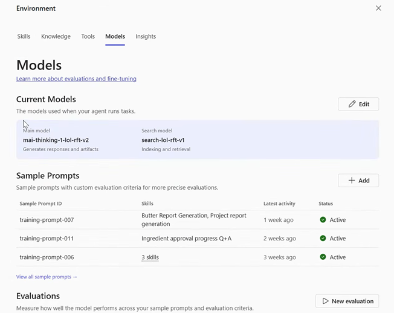

And not only this, we are able to hill-climb to more than 90% accuracy for Land O'Lakes tasks using the MAI model. 

In fact, we estimate this model to be 10x more efficient than the baseline models. 

Now, with this environment set up, let's go back to "Butter" reporting. 

Let's run this task, this time using this tuned environment as an inferencing harness. Now, usually this task takes a couple of minutes to run. In the meantime, I will show you a cached response. 

Now, as you can see here, the agent has leveraged "Test-Time Tree Search" with multiple models, including a fine-tuned model. And what you see here is a summary that doesn't feel generic. It feels undoubtedly Land O'Lakes. And that's not it. 

The task holds itself to high standards, and it continuously retrospects and evaluates itself. 

This way, with Frontier Tuning, your agent continuously improves with your compliant RL environment on your data and coding the way you work. Now, that is what I call Frontier Tuning as smooth as butter. We cannot wait to see the environments you build. 

Back to you, Satya.    

**Satya Nadella:**  All right. 

**\[ Applause **\]

**Satya Nadella:** Thank you so much, Tanaya, Mustafa, Gianrico. Thank you for the partnership here. 

You know, what you just saw is a pretty significant shift. 

We believe that times come for **every company to just move from consuming a Frontier model to fully participating at the Frontier and the Frontier ecosystem. That's the transition.** 

You can have your own private evals and outcomes, your private RLEs and traces, your enterprise knowledge, create this scaffolding for models to hill-climb. 

That's what will allow you to create that differentiated IP that you own, you control. 

But the second salient point is that there is **a new operating point at the Frontier where you can use a very efficient reasoning model and a coding model and achieve Frontier-level performance** because you've done the hard work of creating that environment that RLE that hill-climbing machine in which these models with your traces can hill climb to the Frontier. 

So, we think that the combination of these two is a pretty big game-changer in how people think about what does it mean to operate at the Frontier? 

What does Frontier tokens look like? How are you in control? What's the future of a firm? These are the big questions and really an ecosystem that gets built around as opposed to a few models that just are hungry for all data. 

# 7.    Microsoft Discovery

To close out though I want to talk about that Frontiers beyond that push this ecosystem of ours and really say "What's the next big thing?" Bending the curve -- you know when Mustafa talked about this with Gianrico when it comes to health -- but building you know that scientific discovery loop can have perhaps the biggest societal impact right? 

Science today still is a little too linear. You create a hypothesis -- you form a hypothesis, you run an experiment, you wait for lab results, which is out of band, and then you begin again. But what if the scientific method itself could become more continuous, more parallel, more programmable? That's what we're doing with Microsoft Discovery, right? 

Discovery brings together the models, the HPC compute, the knowledge graphs of all the scientific knowledge, the automated lab and simulation into one agentic discovery loop. And so, today I'm really thrilled to GA Microsoft Discovery, and to show you all of this in action; let me invite up David on stage.

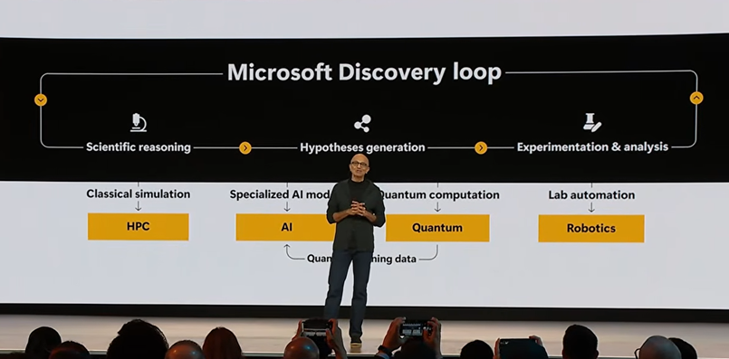

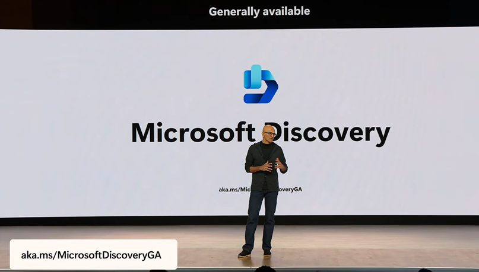

(onscreen URL: aka.ms/MicrosoftDiscoveryGA)

 David, take it away. 

**\[ Applause **\]

**David Carmona:**  Hello! 

**\[ Applause **\]

 I work in the Microsoft Discovery and Quantum team. 

Today, to recycle a PET plastic like this bottle, you have to shred it and melt it. The result is degraded. You cannot use it to make this bottle again. It's downcycling. 

Cambridge Consultants, part of Capgemini, is using Microsoft Discovery to advance that research. Let me show it to you.

This is the Microsoft Discovery app. It is based on VS Code because agentic discovery has many parallels with agentic software engineering. 

Today, I want to do these three things as a scientist. 

First, I want to write a scientific paper about this topic. I'll explore an existing line of research. Instead of melting the plastic, I can use proteins to the composite so you can recycle it again and again. 

Second, I want to perform the actual discovery to find new proteins. 

And third, I want to create a lab protocol to test the results in a real lab. 

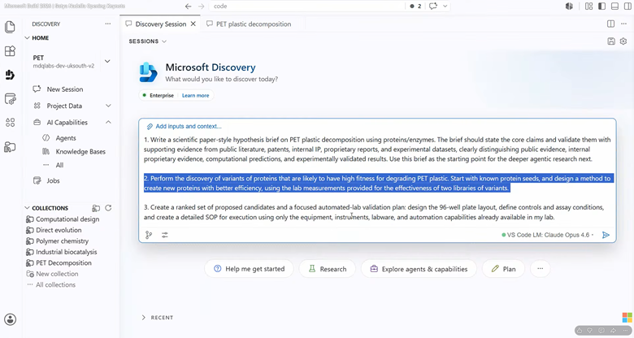

If you are a developer, these three steps should be very familiar to you. They look a lot like planning, coding and testing, and deploying to production, but for science. 

Let's launch it. This will kick off the discovery engine. You can think of this as a team of specialized agents always running in the background following the scientific method. You can see those agents here and you can add more. Microsoft Discovery includes a community of agents, models, and tools across many domains. 

You can use open-source, third-parties, or create your own. 

Okay so this is still running and it will be running for a while even hours or days because the discovery engine like science is not sequential. It is exploring hypotheses and performing long-running simulations dynamically. 

So, let me open one that is already completed. You can see the files that it created here. 

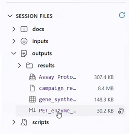

This one is the **research paper** that I was asking for. To create it Discovery is using a **knowledge graph internally** bringing together public scientific literature and internal knowledge. This is a critical asset because it provides complete visibility of the research, so scientists can be in full control. 

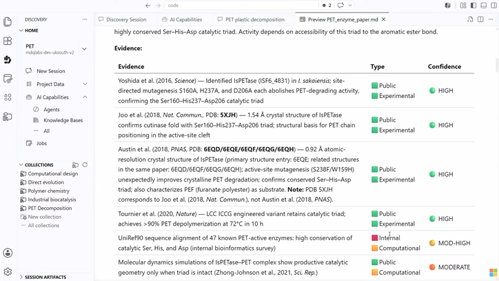

We can go now to step two, the **discovery** itself. 

Let me open the output for that one. So, how do you come up with new proteins to decompose plastic? 

This is the approach that Discovery took. 

First, you need an AI model to predict how good a protein is for that. 

Then, you need a way to generate new proteins. 

And finally, you need to identify the most promising ones. 

So, let's start with the model. Microsoft Discovery trained multiple models and picked the best. And there's no out-of-the-box agent for that. 

But that's okay. If Microsoft Discovery **does not find an agent for a task, it will create one on the fly**, which is pretty cool. 

So, here's all the files that it created. This one here is the YAML for the agent. And this one, for example, is the Python code to train the models. 

Now, we need to generate candidates for new proteins. And that task requires a lot of compute. 

**Discovery is integrated with HPC, so agents can use it for complex simulations**. You can see the process here. 

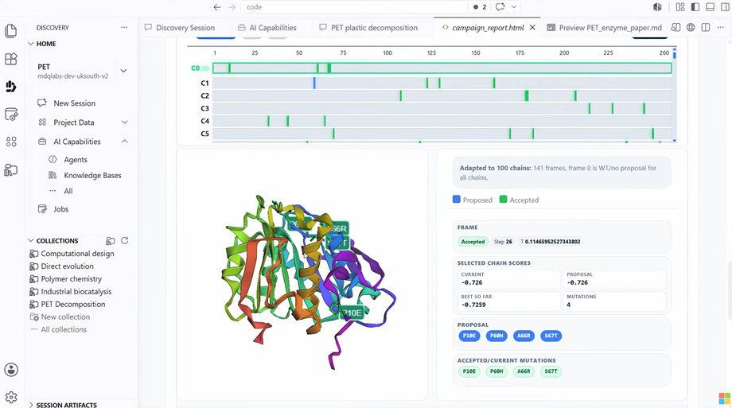

It started with a seed protein and then it created variations by replacing small segments. 

You can see those segments there. Then it applied the model from before to see the variation helps or not, learning in that process. 

This is done millions of times in multiple jobs in parallel exploring a huge tree of proteins. 

The result is 80 proteins that are ready to be sent to the lab for testing which we said it was like deploying software right? 

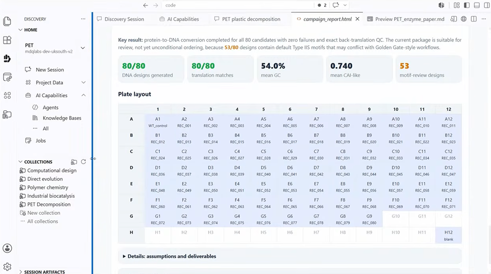

The problem, though, is that creating a protein is a little bit more complicated. The most common way is inserting DNA into bacteria so the bacteria create the protein for me. So, Discovery created another file, this one here. 

This file contains all the DNA sequences to create each protein. I can send this now to a lab, create the proteins and test them. Or, I can go one step further. If I have an automated lab, I can integrate it directly with the agents. Let's do it. So, let me go back to the session and let's just submit job to lab. 

Go. This will use a custom agent that is sending instructions for the lab equipment. And this is very real. Cambridge Consultants does have an automated lab. And I have it right here. 

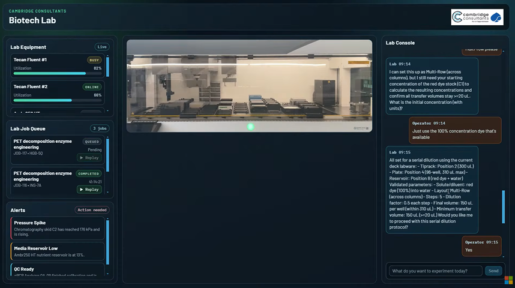

So, this is the application control in the lab. It has a Copilot interface so the scientists can interact with the lab to design experiments which is it feels like being Iron Man but for chemistry. 

In this case, Discovery is admitting the job. You can see it already here. 

But remember, you need to grow the bacteria so this will take some time. So, let me open a previous run. And there you go. **These are all the steps that the agents are doing.** 

**Most of them completely automated with human supervision. How cool is that? **

**\[ Applause **\]

 This is bringing together the physical world and the digital agents in a unified discovery loop. And this was just one example of what Microsoft Discovery can do. 

Customers across industries are using it today to embrace a new era of scientific discovery. 

Thank you. Back to you, Satya. 

**\[ Applause **\]

**Satya Nadella:** Thank you so much, David. 

# 8.    Microsoft Quantum

Talking about scientific discovery, we're also continuing to make rapid progress on our long-term goal of building a scalable quantum computer.

(onscreen URL: aka.ms/MicrosoftDiscoveryGA)

 We announced last year our **first QPU**. We created a new state of matter that was only theorized 100 years ago and we proved it out that it exists. Our vision was to take a very radically different approach to addressing the fundamental barriers to building a scalable quantum machine, which is all about reliability, speed, as well as size. Since then, we have continued to make progress across the full quantum stack with both our academic and industry partners. In fact, in QuNorth, we will have a quantum computer powered by atom computers, natural atom computers, with our stack in there. 

We are also working with Algorithmic and Columbia and ETH Zurich. And we ourselves, in fact, use this discovery agentic loop to **accelerate the work in quantum, compressing years of research into this last year**. 

## 8.1.         Majorana 2

And today, I'm really thrilled to announce Majorana 2. And so, this is **Majorana 2**. Majorana 2 implements the next-generation material stack that we use discovery to discover and build and help fabricate.

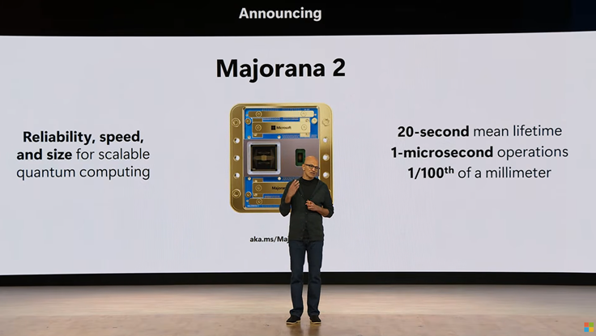

(onscreen URL: aka.ms/Majorana2)

 The resulting qubits are exceptionally reliable and capable of maintaining their state much longer. While other common approaches deliver a lifetime of just microseconds or even milliseconds **Majorana 2 provides qubit mean lifetime of 20 seconds or up to even a minute essentially a thousand times higher than what we were able to achieve with Majorana 1**. 

**\[ Applause **\]

 And the operations, and this is so key, **operations in Majorana 2 are one microsecond**, enabling pretty complex, quantum computation in that lifetime. 

And all of this in the same qubit form factor of Majorana 1 in one one-hundredth of a millimeter controlled all digitally which is again a super important aspect making it all possible to fit a million of these qubits in a chip smaller than a credit card. It's this combination of the reliability, the speed, the size that makes the topological approach so unique. 

With Majorana 1, we had proven out the foundational physics, and with Majorana 2, now we begin the engineering scale. But ultimately -- yeah. 

**\[ Applause **\]

 But ultimately, it is never about tech for tech's sake. It's about tackling those pressing challenges of people and planet. It is also the fundamental point of this conference. The question is not whether you can build the next-grade model, the next-grade platform, or even this quantum machine. The question is, how do we build this Frontier ecosystem together? Because there are really two stories people can tell about this moment. 

**One is that technology concentrates power, reduces human agency, and leaves the society to absorb the consequences**. 

**The other is that we use this next wave to unlock opportunity for developers, scientists, enterprises, and every community. **

**And our job is to make the second story true. That's our North Star for the Frontier ecosystem.** 

Let's all go build together. Thank you all very, very much. 

**\[ Applause **\] **\[ Music** \]

**David Shaw:** This is one of those rare moments when something that once felt beyond imagination suddenly feels within reach. 

**\[ Music **\]

 Quantum is our most fundamental physical theory. It's really the low-level operating system of the real physical world. 

**Sabrina Maniscalco:** For quantum computing to deliver real-world impact, it has to be both reliable and scalable. 

**\[ Music **\]

**David Shaw:** Reaching quantum at scale will allow us to take a more direct approach to solving problems in chemistry -- 

**Sabrina Maniscalclo:** The discovery of new material. 

**David Shaw:** Life sciences. 

**Sabrina Maniscalco:** The way in which we bring drugs to market. It opens up millions of possibilities. Quantum will change the world and this change is just beginning to happen. 

**\[ Music **\]

END

